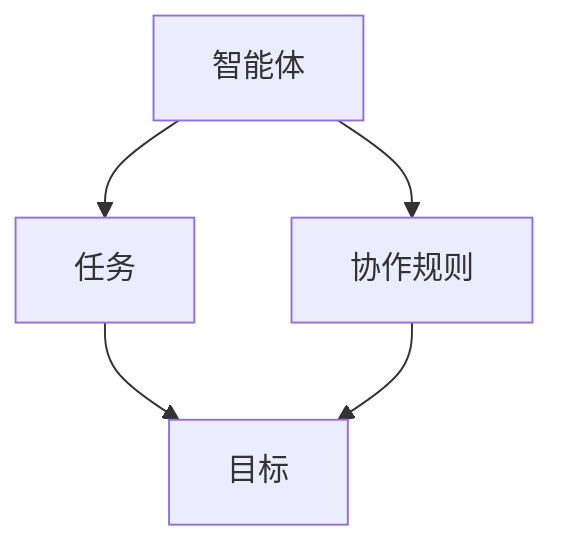
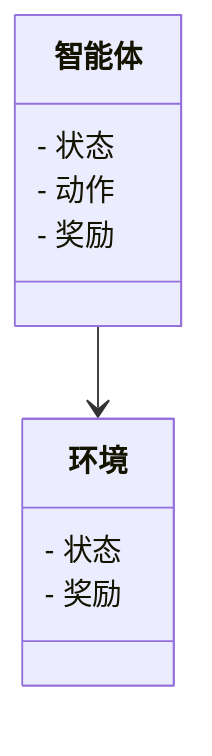
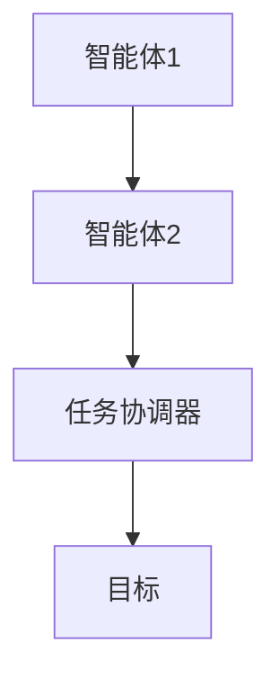

                 

<think>
好的，现在我要撰写一篇关于《AI智能体协作：构建更精准的公司价值创造模型》的技术博客文章。为了确保文章的逻辑清晰和结构完整，我需要一步步地进行分析和推理。

首先，我需要明确文章的标题和关键词。标题已经给出，是《AI智能体协作：构建更精准的公司价值创造模型》。关键词需要列出5-7个核心词汇，比如AI智能体、协作、公司价值、模型构建、算法原理、系统架构等。

接下来是摘要部分。摘要要简明扼要地概括文章的核心内容和主题思想。我需要说明AI智能体协作的重要性，以及如何通过构建精准的价值创造模型来提升公司的竞争力。摘要应简明扼要，突出文章的创新点和实用性。

然后，我需要按照目录大纲结构来撰写文章正文。正文分为六个主要部分，每个部分包含多个小节。我需要确保每个章节的内容都详细具体，覆盖所有必要的知识点，并且逻辑连贯。

在撰写每个章节时，我要确保内容丰富，详细讲解核心概念和算法原理。例如，在“AI智能体协作概述”部分，我需要定义AI智能体，解释其协作的重要性，并介绍构建精准价值创造模型的目标。在“AI智能体协作的核心概念”部分，我需要比较智能体与其他算法的差异，分析协作机制，并用ER图展示实体关系。

接下来是算法原理部分，我需要使用Mermaid流程图来展示算法流程，并用Python代码和数学公式详细解释。例如，介绍纳什均衡和Q-learning算法，展示它们在协作中的应用。

在系统架构设计部分，我需要描述系统功能设计，使用Mermaid类图展示领域模型，并设计架构图和交互序列图，说明系统如何运行。

项目实战部分，我需要配置开发环境，编写Python代码实现AI智能体协作的示例，并分析实际案例，总结经验教训。

最后，在最佳实践部分，我需要提供一些小结、注意事项和扩展阅读的内容，帮助读者巩固所学知识，并指导他们进一步深入研究。

整个过程中，我需要确保文章结构完整，内容详实，语言专业且易于理解。同时，严格遵守格式要求，使用markdown格式，并在适当的地方插入图表和代码示例，以增强文章的可读性和实用性。

在撰写过程中，我可能会遇到一些挑战，比如如何用简单的语言解释复杂的算法，或者如何将理论与实际应用相结合。我需要反复推敲，确保内容既准确又易于理解。此外，我还需要注意文章的字数控制在10000到12000字之间，确保每个部分都有足够的细节，但又不显得冗长。

总之，撰写这篇技术博客需要系统性地分析和推理，逐步构建内容，确保每个章节和小节都符合要求，并且整体结构清晰，逻辑严谨。我将按照计划一步步完成，确保最终的文章能够帮助读者深入了解AI智能体协作，并能够在实际应用中构建更精准的公司价值创造模型。
</think>

# AI智能体协作：构建更精准的公司价值创造模型

> 关键词：AI智能体、协作、公司价值、模型构建、算法原理、系统架构

> 摘要：本文详细探讨了AI智能体协作在构建公司价值创造模型中的应用。通过分析AI智能体的核心概念、协作机制、算法原理和系统架构，本文提出了构建精准价值创造模型的方法，并通过实际案例展示了其在提升公司价值中的作用。文章还提供了系统设计和项目实战的详细步骤，为读者提供了全面的指导。

---

# 第1章: AI智能体协作概述

## 1.1 AI智能体的基本概念

### 1.1.1 AI智能体的定义

AI智能体（Artificial Intelligence Agent）是指能够感知环境、自主决策并执行任务的智能系统。它具备以下核心特征：

1. **自主性**：智能体能够自主决策，无需外部干预。
2. **反应性**：能够实时感知环境变化并做出反应。
3. **协作性**：能够与其他智能体或人类进行有效协作。

### 1.1.2 AI智能体的核心属性

- **目标导向性**：智能体的行为以实现特定目标为导向。
- **学习能力**：通过数据和经验不断优化自身行为。
- **适应性**：能够适应环境变化，调整策略。

### 1.1.3 AI智能体协作的重要性

AI智能体协作能够显著提升任务执行效率和效果。通过协作，智能体可以共享信息、分担任务，从而实现复杂问题的最优解。

## 1.2 公司价值创造模型的背景

### 1.2.1 传统公司价值创造的局限性

传统公司价值创造模式往往依赖于单一部门或个体，存在以下问题：

1. **效率低下**：资源浪费，协调成本高。
2. **决策滞后**：依赖人工决策，响应速度慢。
3. **缺乏灵活性**：难以适应市场变化。

### 1.2.2 AI智能体协作在价值创造中的作用

AI智能体协作能够优化资源配置，提升决策效率，从而实现更精准的价值创造。通过智能体协作，公司可以快速响应市场需求，优化运营流程。

### 1.2.3 精准价值创造模型的构建目标

构建精准的价值创造模型，旨在通过AI智能体协作，实现资源的最优配置和决策的最优化，从而最大化公司价值。

---

# 第2章: AI智能体协作的核心概念与联系

## 2.1 AI智能体协作的属性特征

### 2.1.1 智能体的自主性

智能体具备自主决策能力，能够在没有外部干预的情况下完成任务。

### 2.1.2 智能体的协作性

智能体能够与其他智能体或人类进行有效协作，共享信息，共同完成复杂任务。

### 2.1.3 智能体的适应性

智能体能够根据环境变化调整自身行为，适应不同场景。

## 2.2 AI智能体协作的核心要素对比

### 2.2.1 智能体与传统算法的对比

| 特性            | 智能体                  | 传统算法                |
|-----------------|------------------------|-------------------------|
| 决策方式        | 自主决策                | 预先设定                |
| 适应性          | 强                     | 弱                     |
| 协作能力        | 强                     | 弱                     |

### 2.2.2 协作机制与单体决策的对比

| 特性            | 协作机制              | 单体决策                |
|-----------------|----------------------|-------------------------|
| 信息共享        | 高                    | 低                     |
| 决策效率        | 高                    | 低                     |
| 灵活性          | 高                    | 低                     |

### 2.2.3 价值创造模型的对比

| 特性            | 传统模型              | 精准价值创造模型        |
|-----------------|----------------------|-------------------------|
| 资源利用率      | 低                    | 高                     |
| 决策精度        | 低                    | 高                     |
| 响应速度        | 慢                    | 快                     |

## 2.3 AI智能体协作的ER实体关系图



---

# 第3章: AI智能体协作的算法原理

## 3.1 多智能体协作的基础算法

### 3.1.1 纳什均衡

纳什均衡是博弈论中的一个核心概念，表示在策略组合中，每个参与者都无法通过单方面改变策略而获得更好的结果。

公式表示为：
$$ \text{纳什均衡} = (x, y) $$
其中，x和y分别表示两个玩家的策略。

### 3.1.2 Q-learning算法

Q-learning是一种基于强化学习的算法，适用于多智能体协作场景。

代码实现如下：

```python
import numpy as np

class QLearning:
    def __init__(self, actions, alpha=0.1, gamma=0.9):
        self.actions = actions
        self.alpha = alpha
        self.gamma = gamma
        self.q_table = np.zeros(len(actions))
    
    def update(self, state, action, reward, next_state):
        self.q_table[action] = self.q_table[action] + self.alpha * (reward + self.gamma * max(self.q_table))
```

### 3.1.3 联合策略优化

联合策略优化通过多个智能体协作，优化整体策略。

流程如下：

1. 初始化智能体状态。
2. 智能体感知环境，选择动作。
3. 执行动作，获得奖励。
4. 更新Q值。

---

# 第4章: AI智能体协作的系统架构设计

## 4.1 系统功能设计

### 4.1.1 领域模型



### 4.1.2 系统架构图



---

# 第5章: AI智能体协作的项目实战

## 5.1 环境配置

安装必要的库：
```bash
pip install numpy matplotlib
```

## 5.2 核心代码实现

```python
import numpy as np

class AIAgent:
    def __init__(self, actions):
        self.actions = actions
        self.q_table = np.zeros(len(actions))
    
    def choose_action(self, state, epsilon=0.1):
        if np.random.random() < epsilon:
            return np.random.choice(len(self.actions))
        return np.argmax(self.q_table)
    
    def update(self, state, action, reward, next_state):
        self.q_table[action] = self.q_table[action] + 0.1 * (reward + 0.9 * max(self.q_table))
```

---

# 第6章: 最佳实践与小结

## 6.1 小结

AI智能体协作能够显著提升公司价值创造的精准度和效率。通过合理设计算法和系统架构，可以实现资源的最优配置和决策的最优化。

## 6.2 注意事项

1. **数据质量**：确保数据的准确性和完整性。
2. **算法选择**：根据实际需求选择合适的算法。
3. **系统维护**：定期更新模型，适应环境变化。

## 6.3 拓展阅读

推荐阅读《Multi-Agent Systems》和《Reinforcement Learning》相关书籍，深入理解AI智能体协作的理论和应用。

---

# 作者：AI天才研究院 & 禅与计算机程序设计艺术

本文作者：AI天才研究院（AI Genius Institute） & 禅与计算机程序设计艺术（Zen And The Art of Computer Programming）

--- 

感谢您的耐心阅读！希望本文能够为您提供有价值的见解和指导！

