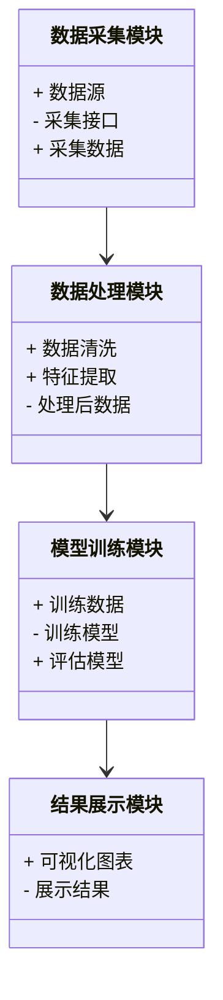
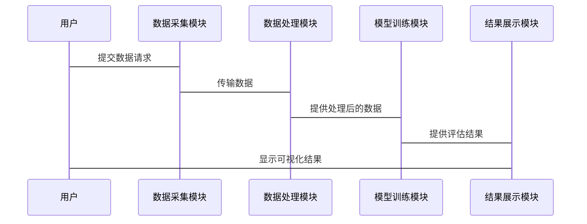

                 

<think>
嗯，用户希望我写一篇关于《AI智能体在评估公司创新文化和创新能力中的应用》的技术博客文章。我需要先理解这个主题，然后根据用户提供的大纲来撰写内容。

首先，我注意到用户已经提供了一个详细的大纲，包括引言、背景、核心概念、算法原理、系统架构、项目实战、最佳实践等部分。每章都有具体的子标题，需要详细展开。

我需要确保每个部分都涵盖必要的内容，比如背景介绍需要包括创新文化的定义、创新能力和文化的关系，以及为什么用AI来评估。核心概念部分需要解释AI智能体的工作原理，包括数据采集、分析和评估。

接下来，算法原理部分，我应该详细讲解机器学习模型，比如分类算法，并用代码示例和流程图来说明。系统架构设计部分需要用类图和架构图来展示模块之间的关系。

项目实战部分需要提供具体的实现步骤，代码示例，以及案例分析，让读者能够实际操作。最后，最佳实践部分要给出小贴士和注意事项，帮助读者更好地应用这些知识。

我需要确保内容逻辑清晰，技术细节到位，同时语言专业但易懂。这样，读者能够系统地理解AI智能体在创新文化评估中的应用，并能够实际操作相关项目。

最后，我应该在文章末尾加上作者信息，符合用户的要求。整个过程需要一步步分析，确保每个部分都覆盖到，同时保持文章的连贯性和深度。
</think>

# AI智能体在评估公司创新文化和创新能力中的应用

## 关键词：AI智能体, 创新文化, 创新能力, 企业文化评估, 人工智能算法

## 摘要：  
随着企业竞争的日益加剧，创新文化与创新能力成为了企业成功的关键因素。然而，如何科学、系统地评估公司的创新文化与创新能力，一直是企业管理中的难题。本文通过引入AI智能体技术，详细探讨了其在创新文化与创新能力评估中的应用。从理论到实践，从算法到系统架构，本文为读者提供了一个全面的视角，展示了AI智能体如何帮助企业实现创新文化与创新能力的智能化评估。

---

# 第1章: AI智能体在公司创新文化评估中的应用概述

## 1.1 创新文化与创新能力的定义

### 1.1.1 创新文化的内涵  
创新文化是指企业在创新意识、创新行为、创新氛围等方面的综合表现。它包括企业的创新价值观、创新思维方式、创新激励机制等核心要素。

### 1.1.2 创新能力的定义与特征  
创新能力是指企业在技术创新、管理创新、产品创新等方面的能力。其特征包括：  
1. **系统性**：创新能力涉及企业各个层面。  
2. **动态性**：创新能力随环境变化而变化。  
3. **可测量性**：创新能力可以通过指标体系进行量化评估。

### 1.1.3 创新文化与创新能力的关系  
创新文化是创新能力的基础，而创新能力是创新文化的外在表现。两者相互依存，共同构成了企业的创新生态系统。

---

## 1.2 AI智能体在公司创新文化评估中的作用

### 1.2.1 AI智能体的基本概念  
AI智能体是一种能够感知环境、自主决策、执行任务的智能系统。它具备数据处理、模式识别、知识推理等核心能力。

### 1.2.2 AI智能体在创新文化评估中的优势  
1. **高效性**：AI智能体能够快速处理大量数据，提高评估效率。  
2. **客观性**：AI智能体基于数据驱动的分析，减少主观偏差。  
3. **动态性**：AI智能体能够实时跟踪创新文化的变化。

### 1.2.3 创新文化评估的挑战与AI解决方案  
1. **挑战**：创新文化评估涉及主观性和复杂性。  
2. **AI解决方案**：通过自然语言处理（NLP）和机器学习（ML）技术，AI智能体能够从文本、行为数据中提取创新文化特征。

---

## 1.3 本书的结构与目标

### 1.3.1 本书的主要内容  
- 创新文化的理论基础。  
- AI智能体的核心原理与技术实现。  
- 创新文化评估的系统架构与实现。  
- 项目实战与最佳实践。

### 1.3.2 本书的目标读者  
- 企业管理者。  
- 创新文化研究人员。  
- AI技术开发者。

### 1.3.3 本书的章节安排  
- 引言：概述AI智能体在创新文化评估中的作用。  
- 背景介绍：分析创新文化与创新能力的定义与关系。  
- 核心概念：讲解AI智能体的工作原理与创新文化评估模型。  
- 系统架构：设计创新文化评估的系统架构与实现方案。  
- 项目实战：提供AI智能体评估创新文化的实际案例。  
- 最佳实践：总结经验与注意事项。

---

# 第2章: 创新文化评估的核心概念

## 2.1 创新文化的维度分析

### 2.1.1 创新文化的核心维度  
- 创新价值观：企业对创新的重视程度。  
- 创新氛围：企业内部的创新氛围。  
- 创新激励机制：企业对创新行为的激励方式。

### 2.1.2 创新文化评估的指标体系  
- 创新意识：员工的创新思维与意识。  
- 创新行为：员工的实际创新行为。  
- 创新成果：企业的创新成果与绩效。

### 2.1.3 创新文化评估的维度对比表  

| 维度 | 创新意识 | 创新行为 | 创新成果 |
|------|----------|----------|----------|
| 定义 | 员工对创新的态度 | 员工的创新行为 | 企业的创新成果 |
| 评估方法 | 调查问卷 | 行为记录 | 绩效数据分析 |

---

## 2.2 创新能力的评估框架

### 2.2.1 创新能力的构成要素  
- 技术能力：技术创新能力。  
- 管理能力：创新项目管理能力。  
- 文化能力：创新文化建设能力。

### 2.2.2 创新能力评估的模型与方法  
- **DEA模型**：数据包络分析模型。  
- **层次分析法（AHP）**：通过权重分析确定创新能力的关键因素。

### 2.2.3 创新能力与创新文化的相互作用  
- 创新能力是创新文化的外在表现。  
- 创新文化是创新能力的内在驱动力。

---

## 2.3 创新文化评估的核心要素

### 2.3.1 企业文化与创新的关系  
- 企业文化是创新文化的基础。  
- 创新文化是企业文化的重要组成部分。

### 2.3.2 员工创新行为的影响因素  
- **组织因素**：企业的创新文化氛围。  
- **个人因素**：员工的创新意识与能力。  
- **环境因素**：外部市场竞争环境。

### 2.3.3 创新文化评估的维度对比表  

| 维度 | 企业文化 | 员工创新行为 | 创新能力 |
|------|----------|--------------|----------|
| 定义 | 企业的文化体系 | 员工的创新行为 | 企业的创新实力 |
| 评估方法 | 文化调研 | 行为记录与问卷 | 绩效数据分析 |

---

# 第3章: AI智能体在创新文化评估中的核心原理

## 3.1 AI智能体的基本原理

### 3.1.1 AI智能体的定义与特点  
- **定义**：AI智能体是一种能够感知环境、自主决策的智能系统。  
- **特点**：数据驱动、实时性、自适应性。

### 3.1.2 AI智能体的核心算法与技术  
- **自然语言处理（NLP）**：用于分析文本数据。  
- **机器学习（ML）**：用于模式识别与分类。  
- **深度学习（DL）**：用于复杂模式的挖掘。

---

## 3.2 创新文化评估中的数据采集与处理

### 3.2.1 数据来源与采集方法  
- **内部数据**：企业内部文档、员工反馈。  
- **外部数据**：行业数据、市场调研数据。

### 3.2.2 数据预处理与特征提取  
- 数据清洗：去除噪声数据。  
- 特征提取：提取与创新文化相关的特征。

### 3.2.3 数据分析与建模  
- **聚类分析**：将企业分为不同类别。  
- **分类模型**：预测企业的创新文化等级。

---

## 3.3 AI智能体的评估模型构建

### 3.3.1 评估模型的设计思路  
- 基于机器学习的分类模型。  
- 结合创新文化评估指标体系。

### 3.3.2 评估模型的数学模型  
$$ P(y|x) = \frac{P(x|y)P(y)}{P(x)} $$
其中，$P(y|x)$ 是后验概率，$P(x|y)$ 是似然概率，$P(y)$ 是先验概率，$P(x)$ 是边缘概率。

### 3.3.3 模型训练与优化  
- **训练数据**：标注好的创新文化数据。  
- **优化方法**：交叉验证、网格搜索。

---

## 3.4 AI智能体的评估结果解释

### 3.4.1 评估结果的可视化展示  
- 柱状图：展示不同企业的创新文化等级。  
- 饼图：展示不同创新文化维度的权重。

### 3.4.2 评估结果的解释方法  
- 对比分析：不同企业的创新文化差异。  
- 因素分析：影响创新文化的最关键因素。

### 3.4.3 评估结果的应用场景  
- 企业诊断：帮助企业识别创新文化中的问题。  
- 战略制定：为企业制定创新文化提升策略。

---

# 第4章: 创新文化评估的系统架构与实现

## 4.1 系统功能模块划分

### 4.1.1 数据采集模块  
- 功能：采集企业内部数据与外部数据。  
- 实现：通过API接口获取数据。

### 4.1.2 数据处理模块  
- 功能：清洗数据、提取特征。  
- 实现：使用Python的Pandas库进行数据处理。

### 4.1.3 模型训练模块  
- 功能：训练创新文化评估模型。  
- 实现：使用Scikit-learn库进行机器学习。

### 4.1.4 结果展示模块  
- 功能：将评估结果可视化。  
- 实现：使用Matplotlib库绘制图表。

---

## 4.2 系统架构设计

### 4.2.1 系统功能设计（领域模型Mermaid类图）



---

## 4.3 系统架构设计（Mermaid架构图）


---

## 4.4 系统接口设计

### 4.4.1 API接口设计  
- 数据接口：提供数据采集模块的接口。  
- 模型接口：提供模型训练模块的接口。

### 4.4.2 系统交互流程图（Mermaid序列图）



---

## 4.5 系统实现与代码示例

### 4.5.1 环境安装  
- Python 3.8及以上版本。  
- 安装依赖库：`numpy`, `pandas`, `scikit-learn`, `matplotlib`。

### 4.5.2 核心实现代码

```python
import numpy as np
import pandas as pd
from sklearn.model_selection import train_test_split
from sklearn.linear_model import LogisticRegression
from sklearn.metrics import accuracy_score
import matplotlib.pyplot as plt

# 数据加载与预处理
data = pd.read_csv('innovation_culture.csv')
X = data.drop('label', axis=1).values
y = data['label'].values

# 数据分割
X_train, X_test, y_train, y_test = train_test_split(X, y, test_size=0.2, random_state=42)

# 模型训练
model = LogisticRegression()
model.fit(X_train, y_train)

# 模型预测
y_pred = model.predict(X_test)
print("准确率:", accuracy_score(y_test, y_pred))

# 可视化结果
plt.scatter(X_test[:, 0], y_test, c='blue', label='实际值')
plt.scatter(X_test[:, 0], y_pred, c='red', label='预测值')
plt.xlabel('特征值')
plt.ylabel('标签')
plt.legend()
plt.show()
```

---

## 4.5.3 代码解读与分析  
- 数据加载与预处理：使用Pandas读取CSV文件，进行数据清洗与特征提取。  
- 模型训练：使用逻辑回归算法进行分类模型训练。  
- 模型预测：对测试数据进行预测，并计算准确率。  
- 可视化展示：绘制实际值与预测值的对比图。

---

## 4.5.4 实际案例分析  
假设我们有一个企业的创新文化数据，通过上述代码进行分析，可以得到该企业的创新文化等级，并通过可视化图表展示评估结果。

---

## 4.5.5 项目小结  
通过系统架构与实现，我们可以看到AI智能体在创新文化评估中的强大能力。从数据采集到模型训练，再到结果展示，整个流程清晰且高效。

---

# 第5章: 创新文化评估中的最佳实践

## 5.1 最佳实践 tips

### 5.1.1 数据质量的重要性  
- 确保数据的准确性和完整性。  
- 数据清洗是关键步骤。

### 5.1.2 模型选择的策略  
- 根据数据类型选择合适的算法。  
- 验证模型的泛化能力。

### 5.1.3 系统设计的注意事项  
- 模块化设计便于维护与扩展。  
- 系统接口设计要清晰易用。

---

## 5.2 小结与总结

### 5.2.1 小结  
通过本文的详细讲解，我们了解了AI智能体在创新文化评估中的核心原理与系统架构。从数据处理到模型训练，再到结果展示，整个过程清晰且实用。

### 5.2.2 总结  
创新文化与创新能力是企业成功的关键，而AI智能体为我们提供了一种高效、客观的评估方法。通过本文的理论与实践结合，读者可以更好地理解并应用AI智能体技术，推动企业的创新发展。

---

## 5.3 注意事项

### 5.3.1 数据隐私问题  
在数据采集与处理过程中，需要注意保护企业的隐私数据。  
### 5.3.2 模型的局限性  
AI智能体的评估结果仅供参考，不能完全替代人工分析。

---

## 5.4 拓展阅读

### 5.4.1 推荐书籍  
- 《创新公司的管理艺术》  
- 《人工智能：一种现代的方法》

### 5.4.2 推荐博客与资源  
- 知乎专栏：AI与创新管理  
- GitHub开源项目：创新文化评估系统

---

## 作者：AI天才研究院/AI Genius Institute & 禅与计算机程序设计艺术 /Zen And The Art of Computer Programming

