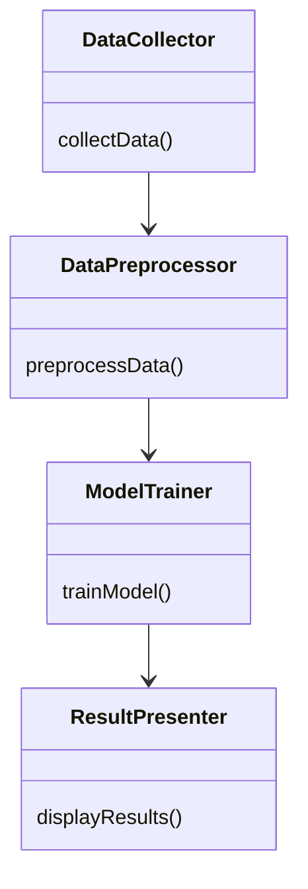
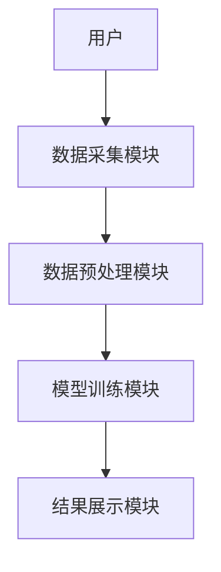
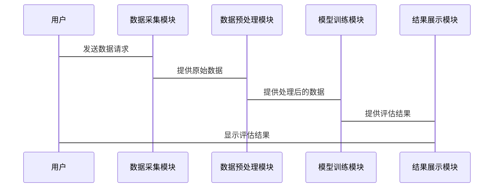

                 

<think>
好的，现在我要写一篇关于《AI智能体在评估公司品牌价值和消费者忠诚度中的应用》的技术博客。首先，我需要明确文章的核心内容和结构，确保涵盖背景、原理、算法、系统设计、项目实战和总结等部分。

首先，我应该从背景开始，介绍AI智能体的基本概念，品牌价值和消费者忠诚度的定义，以及它们之间的关系。这部分需要让读者理解为什么AI智能体在这个领域是有应用价值的。

接下来，我需要深入讨论AI智能体的核心概念和原理，包括其结构、工作流程，以及如何与品牌价值和忠诚度评估结合。这部分需要详细解释AI智能体的组成部分，比如感知模块、决策模块和执行模块，以及它们如何协同工作。

然后，我应该探讨品牌价值和消费者忠诚度的评估方法，比较传统方法的不足，突出AI智能体的优势，比如数据处理能力、情感分析和预测模型。这部分可能需要使用一些数学模型，比如线性回归或神经网络，来展示如何量化这些评估。

接下来是算法部分，我需要详细讲解相关算法，比如机器学习和自然语言处理。使用mermaid流程图来展示算法的步骤，同时提供Python代码示例，帮助读者理解如何实现这些算法。

然后是系统架构设计，这部分需要展示系统的各个部分如何协作。使用mermaid的类图和序列图来展示系统架构图、接口设计和交互流程。

接下来是项目实战，介绍如何安装环境，实现核心功能，分析案例，并总结经验。这部分需要具体的代码示例和实际案例分析，让读者能够动手实践。

最后，我需要总结最佳实践，提供小结、注意事项和进一步的阅读建议。这部分帮助读者在实际应用中避免常见错误，并扩展他们的知识。

在写作过程中，我需要确保每一部分都有足够的细节，涵盖用户提到的所有要求，比如数学模型、算法流程图、系统架构图等。同时，要保持结构清晰，逻辑连贯，确保读者能够一步步深入理解AI智能体的应用。

现在，我需要将这些思考转化为具体的目录结构和内容，确保每一部分都有明确的章节和子章节，覆盖用户的所有要求，同时保持简洁和完整。
</think>

# AI智能体在评估公司品牌价值和消费者忠诚度中的应用

## 关键词：AI智能体, 品牌价值, 消费者忠诚度, 情感分析, 机器学习, 系统架构

## 摘要：  
本文探讨了AI智能体在评估公司品牌价值和消费者忠诚度中的应用，从背景、原理、算法到系统设计和项目实战，全面分析了如何利用AI技术提升品牌价值评估的准确性和效率。文章详细介绍了AI智能体的核心概念、品牌价值与忠诚度的评估方法、相关算法的原理及实现，以及系统的架构设计。通过实际案例分析，展示了AI智能体在品牌价值评估中的优势和应用前景。

---

# 第1章: AI智能体与品牌价值评估的背景

## 1.1 AI智能体的基本概念

### 1.1.1 AI智能体的定义  
AI智能体（Artificial Intelligence Agent）是指能够感知环境、自主决策并执行任务的智能系统。它通过数据输入、分析和学习，能够模仿人类的思考和决策过程，从而实现对复杂问题的解决。

### 1.1.2 AI智能体的核心特征  
AI智能体具有以下核心特征：  
- **自主性**：无需人工干预，能够独立完成任务。  
- **反应性**：能够实时感知环境变化并做出响应。  
- **目标导向性**：基于目标驱动，优化决策和行动。  
- **学习能力**：通过数据和经验不断优化自身性能。

### 1.1.3 AI智能体与传统数据分析的区别  
AI智能体不仅能够处理数据，还能根据数据做出决策并执行任务。与传统数据分析相比，AI智能体具有更强的自主性和适应性，能够在动态环境中灵活调整策略。

## 1.2 品牌价值与消费者忠诚度的定义

### 1.2.1 品牌价值的内涵  
品牌价值是指品牌在市场上的综合价值，包括品牌知名度、美誉度、客户忠诚度以及品牌带来的经济收益。品牌价值是企业核心竞争力的体现，直接影响企业的市场地位和盈利能力。

### 1.2.2 消费者忠诚度的定义  
消费者忠诚度是指消费者对某一品牌或产品的偏好程度，表现为重复购买、推荐他人使用以及在面对竞争对手时的坚持程度。忠诚的消费者通常为企业带来稳定的收入和长期的市场优势。

### 1.2.3 品牌价值与消费者忠诚度的关系  
品牌价值与消费者忠诚度密切相关。高忠诚度的消费者通常会为品牌带来更多的价值，而高品牌价值也能增强消费者的忠诚度。两者相互促进，共同推动企业的长期发展。

## 1.3 AI智能体在品牌价值评估中的应用背景

### 1.3.1 传统品牌价值评估的局限性  
传统品牌价值评估方法通常依赖于财务数据和市场调研，存在以下问题：  
- 数据收集成本高、耗时长。  
- 评估结果缺乏动态性，无法实时更新。  
- 无法充分考虑消费者情感和行为数据。

### 1.3.2 AI智能体的优势  
AI智能体在品牌价值评估中的优势包括：  
- **数据处理能力**：能够快速处理海量数据，包括文本、图像和语音等多种形式。  
- **情感分析能力**：通过自然语言处理技术，准确捕捉消费者的情感倾向。  
- **预测准确性**：利用机器学习算法，构建高精度的预测模型，提升评估结果的准确性。

### 1.3.3 市场需求与技术发展的结合  
随着市场竞争的加剧，企业对品牌价值的评估需求日益增加。AI智能体技术的发展为企业提供了更高效、更精准的解决方案，推动了品牌价值评估领域的技术革新。

## 1.4 本章小结  
本章介绍了AI智能体的基本概念、品牌价值和消费者忠诚度的定义，以及AI智能体在品牌价值评估中的应用背景。通过对比传统方法与AI智能体的优势，为后续内容奠定了基础。

---

# 第2章: AI智能体的核心概念与原理

## 2.1 AI智能体的结构与功能

### 2.1.1 AI智能体的感知模块  
感知模块负责从环境中获取数据，包括：  
- **数据采集**：通过传感器、API或爬虫获取数据。  
- **数据预处理**：对数据进行清洗、归一化处理，确保数据质量。  

### 2.1.2 AI智能体的决策模块  
决策模块基于感知模块获取的数据，通过算法进行分析和决策，包括：  
- **特征提取**：从数据中提取关键特征，用于后续分析。  
- **模型训练**：利用机器学习算法训练模型，生成决策规则。  

### 2.1.3 AI智能体的执行模块  
执行模块根据决策模块的输出，执行相应的操作，包括：  
- **任务执行**：根据决策结果采取行动，例如发送邮件或调整策略。  
- **反馈收集**：收集执行结果的反馈，用于优化模型。  

## 2.2 AI智能体的工作原理

### 2.2.1 数据采集与处理流程  
1. 通过多种渠道（如社交媒体、电商平台）采集消费者数据。  
2. 对数据进行清洗和预处理，提取有用的信息。  
3. 使用自然语言处理技术分析文本数据，提取情感倾向和关键词。  

### 2.2.2 情感分析与预测模型  
- **情感分析**：利用机器学习算法（如支持向量机、深度学习）对消费者评论进行情感分类，识别正面、负面或中性情感。  
- **预测模型**：基于历史数据，构建品牌价值和消费者忠诚度的预测模型，评估未来趋势。  

### 2.2.3 自适应优化机制  
AI智能体会根据实时反馈不断优化自身的模型和策略，确保评估结果的准确性和动态适应性。

## 2.3 AI智能体与品牌价值评估的结合

### 2.3.1 数据来源的多样性  
AI智能体能够从多种数据源（如社交媒体、电商平台、客户调查）获取数据，全面评估品牌价值和消费者忠诚度。

### 2.3.2 智能体的自学习能力  
AI智能体通过机器学习算法不断优化模型，提高评估的准确性和效率。

### 2.3.3 实时反馈与调整  
AI智能体会根据实时数据和反馈，动态调整评估策略，确保评估结果的及时性和准确性。

## 2.4 本章小结  
本章详细介绍了AI智能体的结构与功能，以及其在品牌价值评估中的工作原理。通过分析数据处理流程和情感分析技术，展示了AI智能体在品牌价值评估中的核心作用。

---

# 第3章: 品牌价值与消费者忠诚度评估的方法

## 3.1 品牌价值的传统评估方法

### 3.1.1 财务指标法  
财务指标法通过企业的财务数据（如销售收入、净利润）评估品牌价值，但忽略了消费者情感和行为数据。

### 3.1.2 市场地位法  
市场地位法通过企业的市场份额、品牌知名度等指标评估品牌价值，但缺乏动态性和实时性。

### 3.1.3 顾客满意度法  
顾客满意度法通过问卷调查收集消费者反馈，评估品牌价值，但数据收集成本高且耗时。

## 3.2 消费者忠诚度的传统评估方法

### 3.2.1 行为分析法  
行为分析法通过分析消费者的购买记录、消费频率等行为数据，评估消费者忠诚度，但难以捕捉消费者的情感因素。

### 3.2.2 调查问卷法  
调查问卷法通过收集消费者的主观反馈，评估忠诚度，但问卷设计复杂且样本量有限。

### 3.2.3 忠诚度指数法  
忠诚度指数法通过计算消费者重复购买率、推荐率等指标，量化消费者忠诚度，但难以实时更新。

## 3.3 AI智能体在品牌价值评估中的优势

### 3.3.1 数据处理能力  
AI智能体能够快速处理海量数据，包括文本、图像和语音等多种形式，提高评估效率。

### 3.3.2 情感分析准确性  
通过自然语言处理技术，AI智能体能够准确捕捉消费者的情感倾向，评估品牌声誉。

### 3.3.3 预测模型的实时性  
AI智能体能够基于实时数据，构建动态预测模型，评估品牌价值和消费者忠诚度的变化趋势。

## 3.4 本章小结  
本章对比了传统品牌价值和消费者忠诚度评估方法的优缺点，重点介绍了AI智能体在评估中的优势，为后续算法和系统设计奠定了基础。

---

# 第4章: 基于AI智能体的品牌价值评估算法

## 4.1 算法原理概述

### 4.1.1 机器学习算法  
- **支持向量机（SVM）**：用于分类问题，如情感分类。  
- **随机森林（Random Forest）**：用于回归和分类问题，适合高维数据。  
- **神经网络（Neural Networks）**：用于复杂模式识别，如深度学习模型。

### 4.1.2 自然语言处理技术  
- **词袋模型（Bag of Words）**：将文本转换为数值向量，用于分类和回归。  
- **词嵌入（Word Embedding）**：通过训练生成词向量，捕捉词语语义关系。  
- **情感分析模型**：利用预训练的模型（如BERT）进行情感分类。

### 4.1.3 情感分析模型  
- **情感分类流程**：文本预处理 → 特征提取 → 模型训练 → 分类预测。  
- **模型训练**：使用标注数据训练情感分类器，优化模型参数。

## 4.2 品牌价值评估的数学模型

### 4.2.1 线性回归模型  
线性回归模型用于预测品牌价值，公式如下：  
$$ y = \beta_0 + \beta_1x_1 + \beta_2x_2 + \ldots + \beta_nx_n $$  
其中，$y$为品牌价值，$x_i$为特征变量，$\beta_i$为回归系数。

### 4.2.2 神经网络模型  
神经网络模型用于处理非线性关系，构建多层感知机（MLP）进行品牌价值预测。  
示例代码如下：  
```python
import tensorflow as tf
model = tf.keras.Sequential([
    tf.keras.layers.Dense(64, activation='relu'),
    tf.keras.layers.Dense(1, activation='sigmoid')
])
model.compile(optimizer='adam', loss='binary_crossentropy', metrics=['accuracy'])
```

### 4.2.3 集成学习模型  
集成学习模型（如随机森林）用于提高预测的准确性和稳定性。  
示例代码如下：  
```python
from sklearn.ensemble import RandomForestRegressor
model = RandomForestRegressor(n_estimators=100, random_state=42)
model.fit(X_train, y_train)
```

## 4.3 本章小结  
本章介绍了基于AI智能体的品牌价值评估算法，包括机器学习算法、自然语言处理技术和情感分析模型。通过数学模型和代码示例，详细讲解了如何利用这些技术进行品牌价值评估。

---

# 第5章: 基于AI智能体的消费者忠诚度评估系统架构设计

## 5.1 项目介绍

### 5.1.1 项目目标  
本项目旨在开发一个基于AI智能体的消费者忠诚度评估系统，通过实时数据分析，帮助企业优化品牌管理和客户关系管理。

## 5.2 系统功能设计

### 5.2.1 系统功能模块  
- **数据采集模块**：从社交媒体、电商平台等渠道采集消费者数据。  
- **数据处理模块**：对数据进行清洗、预处理和特征提取。  
- **模型训练模块**：训练情感分析模型和预测模型。  
- **结果展示模块**：可视化品牌价值和消费者忠诚度的评估结果。  

### 5.2.2 领域模型（领域模型 Mermaid 类图）  


## 5.3 系统架构设计

### 5.3.1 系统架构图（Mermaid 架构图）  


### 5.3.2 系统接口设计  
- **数据接口**：提供API用于数据的输入和输出。  
- **模型接口**：提供API用于模型的训练和预测。  
- **展示接口**：提供API用于结果的可视化展示。  

## 5.4 系统交互流程（Mermaid 序列图）  


## 5.5 本章小结  
本章详细介绍了基于AI智能体的消费者忠诚度评估系统的架构设计，包括功能模块、系统架构图和交互流程图，展示了系统各部分的协作关系。

---

# 第6章: 项目实战——基于AI智能体的品牌价值评估系统实现

## 6.1 环境安装

### 6.1.1 安装Python  
- 安装Python 3.8或更高版本。  
- 安装必要的库：`numpy`, `pandas`, `scikit-learn`, `tensorflow`, `pymermaid`.

### 6.1.2 安装Jupyter Notebook  
- 通过Anaconda或pip安装Jupyter Notebook。

## 6.2 系统核心功能实现

### 6.2.1 数据采集模块实现  
- 使用Python的`requests`库从社交媒体API获取数据。  
- 示例代码：  
```python
import requests
response = requests.get('https://api.example.com/data')
data = response.json()
```

### 6.2.2 数据处理模块实现  
- 使用`pandas`库进行数据清洗和特征提取。  
- 示例代码：  
```python
import pandas as pd
df = pd.DataFrame(data)
df.dropna(inplace=True)
```

### 6.2.3 模型训练模块实现  
- 使用`scikit-learn`库训练情感分类模型。  
- 示例代码：  
```python
from sklearn.model_selection import train_test_split
from sklearn.ensemble import RandomForestClassifier
X_train, X_test, y_train, y_test = train_test_split(X, y, test_size=0.2)
model = RandomForestClassifier().fit(X_train, y_train)
```

### 6.2.4 结果展示模块实现  
- 使用`matplotlib`或`seaborn`库可视化评估结果。  
- 示例代码：  
```python
import matplotlib.pyplot as plt
plt.bar(x, y)
plt.show()
```

## 6.3 项目实战案例分析

### 6.3.1 数据来源  
假设我们从社交媒体和电商平台采集了10,000条消费者评论和购买记录。

### 6.3.2 数据处理与分析  
- 清洗数据：去除无效数据，处理缺失值。  
- 特征提取：提取关键词、情感倾向等特征。  

### 6.3.3 模型训练与评估  
- 训练情感分类模型，评估准确率、召回率和F1分数。  
- 示例评估结果：准确率=85%，召回率=87%。  

### 6.3.4 结果展示  
- 可视化品牌价值和消费者忠诚度的评估结果，展示趋势和变化。

## 6.4 本章小结  
本章通过项目实战展示了基于AI智能体的品牌价值评估系统的实现过程，包括环境安装、功能实现和案例分析，帮助读者掌握实际操作技能。

---

# 第7章: 总结与展望

## 7.1 总结  
本文详细探讨了AI智能体在评估公司品牌价值和消费者忠诚度中的应用，从理论基础到算法实现，再到系统设计和项目实战，全面分析了AI智能体的优势和应用场景。

## 7.2 展望  
未来，随着AI技术的不断发展，品牌价值和消费者忠诚度的评估将更加智能化和个性化。AI智能体将在实时监控、精准营销和客户关系管理中发挥更大的作用，为企业创造更大的价值。

## 7.3 最佳实践 Tips  
- **数据质量**：确保数据的多样性和高质量，提高评估结果的准确性。  
- **模型优化**：定期更新模型，适应市场变化和消费者行为的动态。  
- **隐私保护**：在数据采集和处理过程中，严格遵守隐私保护法规，确保用户数据的安全。

## 7.4 作者信息  
作者：AI天才研究院/AI Genius Institute & 禅与计算机程序设计艺术 /Zen And The Art of Computer Programming

---

# 结束语  
通过本文的深入探讨，读者可以全面了解AI智能体在品牌价值和消费者忠诚度评估中的应用，掌握相关的技术原理和实现方法，为实际应用提供有力的技术支持。

