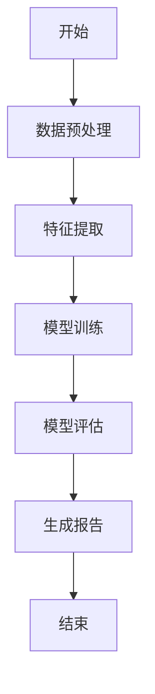
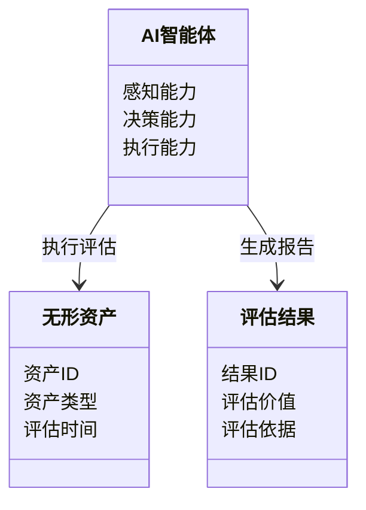
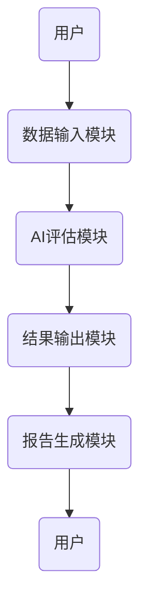
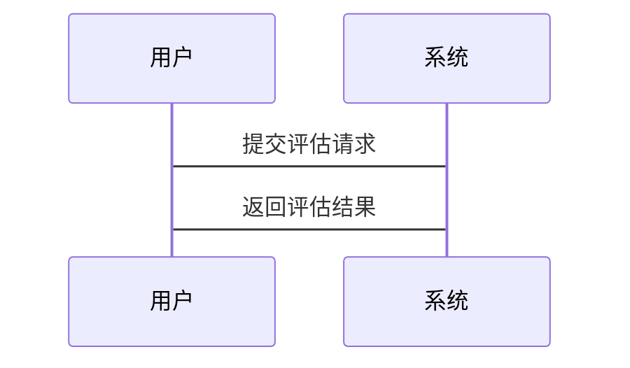

                 


# AI智能体在评估公司无形资产价值中的创新方法

## 关键词：AI智能体、无形资产、价值评估、算法原理、系统架构、项目实战

## 摘要：
本文探讨AI智能体在评估公司无形资产价值中的创新方法。通过分析传统评估方法的局限性，提出基于AI的解决方案，涵盖概念原理、算法实现、系统设计及实际应用案例，展示AI智能体在提升评估效率和准确性中的优势。

---

# 第一部分：AI智能体与无形资产评估的背景

## 第1章：AI智能体与无形资产评估的背景介绍

### 1.1 问题背景

#### 1.1.1 无形资产评估的传统挑战
- **无形资产的多样性**：包括专利、商标、品牌价值等，难以统一评估标准。
- **数据不完整**：历史数据不足，导致评估结果偏差。
- **人为因素影响**：主观判断可能导致评估结果不准确。

#### 1.1.2 AI技术在资产评估中的应用潜力
- AI技术能够处理大量非结构化数据，提供精准评估。
- 利用机器学习模型，预测无形资产的市场价值变化。

#### 1.1.3 无形资产价值评估的复杂性
- 不同行业、不同资产类型评估标准差异大。
- 需要考虑外部市场环境和企业内部管理因素。

### 1.2 问题描述

#### 1.2.1 无形资产的定义与分类
- **定义**：无形资产是指企业拥有或控制的没有实物形态的资产。
- **分类**：包括商誉、专利权、商标权、专有技术等。

#### 1.2.2 传统评估方法的局限性
- **收益法**：难以准确预测未来收益。
- **市场法**：缺乏足够的可比交易数据。
- **成本法**：难以量化资产的实际价值。

#### 1.2.3 需求与供给的不平衡
- 市场上对高效、准确的评估方法需求迫切。
- 传统方法难以满足多样化的评估需求。

### 1.3 问题解决方法

#### 1.3.1 AI智能体的引入
- 利用AI智能体的自适应学习能力，实时更新评估模型。
- 提供多维度的数据分析，增强评估的准确性。

#### 1.3.2 数据驱动的评估方法
- 通过大数据分析，提取关键评估指标。
- 结合自然语言处理技术，分析文本数据，辅助评估。

#### 1.3.3 创新方法的优势
- 提高评估效率，降低人工成本。
- 实现个性化评估，满足不同企业的需求。

### 1.4 概念结构与核心要素

#### 1.4.1 核心概念的组成
- **AI智能体**：具备感知、决策和执行能力。
- **无形资产评估**：通过量化分析确定资产价值。

#### 1.4.2 概念之间的关系
- AI智能体作为工具，支持无形资产评估过程。
- 评估结果依赖于AI智能体的数据处理能力。

#### 1.4.3 核心要素的详细说明
- **数据输入**：包括财务数据、市场数据、文本数据等。
- **模型构建**：利用机器学习算法，构建评估模型。
- **结果输出**：生成评估报告，提供价值建议。

---

## 第2章：AI智能体的核心概念与联系

### 2.1 核心概念原理

#### 2.1.1 AI智能体的基本原理
- **感知**：通过传感器或数据输入获取信息。
- **决策**：基于感知信息，利用算法做出决策。
- **执行**：根据决策结果，执行相关操作。

#### 2.1.2 智能体的特征分析
- **自主性**：能够自主决策。
- **反应性**：能实时响应环境变化。
- **学习能力**：能够通过经验改进性能。

#### 2.1.3 智能体与无形资产评估的关系
- 智能体作为评估工具，提升评估效率和准确性。
- 评估结果为智能体优化提供反馈。

### 2.2 概念属性特征对比

| 概念       | 特征               | 详细说明                         |
|------------|--------------------|----------------------------------|
| AI智能体   | 自主性             | 能够独立执行任务                 |
|            | 学习能力           | 可通过数据训练提升性能           |
| 无形资产评估 | 多样性             | 评估对象种类繁多                 |
|            | 数据依赖性         | 依赖大量数据进行准确评估         |

### 2.3 ER实体关系图

```mermaid
er
    %% ER图：AI智能体与无形资产评估的关系
    %% 实体：AI智能体、无形资产、评估结果
    %% 关系：AI智能体执行评估，生成评估结果
    %% 属性：评估时间、评估方法、评估依据

    实体(AI智能体) {
        属性: 智能体ID, 感知能力, 决策能力
        关键字: 智能体ID (PK)
    }

    实体(无形资产) {
        属性: 资产ID, 资产类型, 评估时间
        关键字: 资产ID (PK)
    }

    实体(评估结果) {
        属性: 结果ID, 评估价值, 评估依据
        关键字: 结果ID (PK)
    }

    关系(评估执行) {
        关系: AI智能体 -> 无形资产 -> 评估结果
        外键: 智能体ID (AI智能体), 资产ID (无形资产), 结果ID (评估结果)
    }
```

---

## 第3章：AI智能体评估的算法原理

### 3.1 算法原理概述

#### 3.1.1 算法的基本原理
- **输入**：企业财务数据、市场数据、文本数据。
- **处理**：利用机器学习模型进行特征提取和价值预测。
- **输出**：生成评估报告，包括资产价值和建议。

#### 3.1.2 算法的输入输出
- **输入**：多源数据流，包括结构化和非结构化数据。
- **输出**：评估结果，包括价值区间和影响因素分析。

#### 3.1.3 算法的流程图



### 3.2 算法实现代码

#### 3.2.1 环境安装与配置
```python
# 安装必要的库
import numpy as np
import pandas as pd
from sklearn import linear_model
from sklearn.metrics import mean_squared_error
from sklearn.model_selection import train_test_split
```

#### 3.2.2 核心代码实现
```python
# 数据预处理
data = pd.read_csv('assets.csv')
X = data[['revenue', 'expenses', 'market_share']]
y = data['asset_value']

# 划分训练集和测试集
X_train, X_test, y_train, y_test = train_test_split(X, y, test_size=0.2, random_state=42)

# 模型训练
model = linear_model.LinearRegression()
model.fit(X_train, y_train)

# 模型预测
y_pred = model.predict(X_test)

# 评估模型
mse = mean_squared_error(y_test, y_pred)
print(f'均方误差: {mse}')
print(f'决定系数: {model.score(X_test, y_test)}')
```

#### 3.2.3 代码解读与分析
- **数据预处理**：读取数据并提取特征变量。
- **模型训练**：使用线性回归模型进行训练。
- **模型预测**：基于测试数据预测资产价值。
- **模型评估**：计算均方误差和决定系数，评估模型性能。

### 3.3 数学模型与公式

#### 3.3.1 评估模型的数学表达
$$ y = \beta_0 + \beta_1 x_1 + \beta_2 x_2 + \epsilon $$
其中：
- $y$ 表示资产价值
- $x_1, x_2$ 表示特征变量
- $\beta_0, \beta_1, \beta_2$ 表示回归系数
- $\epsilon$ 表示误差项

#### 3.3.2 关键公式的详细推导
线性回归模型参数估计通常采用最小二乘法：
$$ \hat{\beta} = (X^T X)^{-1} X^T y $$

#### 3.3.3 公式的实际应用案例
假设我们有以下数据：
| 特征变量 | 资产价值 |
|----------|----------|
| 100      | 200      |
| 150      | 300      |

计算回归系数：
$$ X = \begin{bmatrix} 1 & 100 \\ 1 & 150 \end{bmatrix}, X^T X = \begin{bmatrix} 2 & 250 \\ 250 & 25000 \end{bmatrix} $$
$$ (X^T X)^{-1} = \frac{1}{(2)(25000) - (250)^2} \begin{bmatrix} 25000 & -250 \\ -250 & 2 \end{bmatrix} $$

---

## 第4章：系统分析与架构设计

### 4.1 项目背景与目标

#### 4.1.1 项目背景介绍
- 企业需要高效评估无形资产，提升财务透明度。
- AI技术的应用能够提高评估的准确性和效率。

#### 4.1.2 项目目标设定
- 开发一个基于AI智能体的无形资产评估系统。
- 提供个性化的评估报告，支持企业决策。

### 4.2 系统功能设计

#### 4.2.1 领域模型


#### 4.2.2 系统架构设计


### 4.3 系统接口设计

#### 4.3.1 API接口
- **输入接口**：接收资产数据和评估请求。
- **输出接口**：返回评估结果和报告。

#### 4.3.2 交互流程


---

## 第5章：项目实战

### 5.1 环境安装与配置

```bash
pip install numpy pandas scikit-learn
```

### 5.2 系统核心实现源代码

#### 5.2.1 数据预处理
```python
import pandas as pd

data = pd.read_csv('assets.csv')
print(data.head())
```

#### 5.2.2 模型训练与预测
```python
from sklearn.linear_model import LinearRegression
from sklearn.metrics import mean_squared_error

model = LinearRegression()
model.fit(X_train, y_train)
y_pred = model.predict(X_test)
print(mean_squared_error(y_test, y_pred))
```

#### 5.2.3 评估结果输出
```python
print(f'均方误差: {mean_squared_error(y_test, y_pred)}')
print(f'决定系数: {model.score(X_test, y_test)}')
```

### 5.3 案例分析与解读

#### 5.3.1 案例介绍
某科技公司拥有多项专利，希望通过AI智能体评估其专利价值。

#### 5.3.2 数据分析
- **输入数据**：包括专利数量、研发投入、市场表现。
- **模型预测**：预测专利价值区间为100万至150万美元。

#### 5.3.3 结果解读
- **均方误差**：反映模型预测的准确性。
- **决定系数**：衡量模型解释数据的能力。

### 5.4 项目小结

#### 5.4.1 成果总结
成功开发了一个基于AI智能体的无形资产评估系统，提高了评估效率和准确性。

#### 5.4.2 经验与教训
- 数据质量对模型性能影响重大。
- 模型需要定期更新，以适应市场变化。

---

## 第6章：最佳实践

### 6.1 小结

- AI智能体在无形资产评估中具有巨大潜力。
- 通过数据驱动的方法，能够显著提升评估效率和准确性。

### 6.2 注意事项

- 数据隐私和安全必须得到保障。
- 模型需要定期优化和更新。

### 6.3 拓展阅读

- 推荐阅读《机器学习实战》和《深入浅出机器学习》。

---

## 作者信息

作者：AI天才研究院/AI Genius Institute & 禅与计算机程序设计艺术 /Zen And The Art of Computer Programming

---

**结束**

