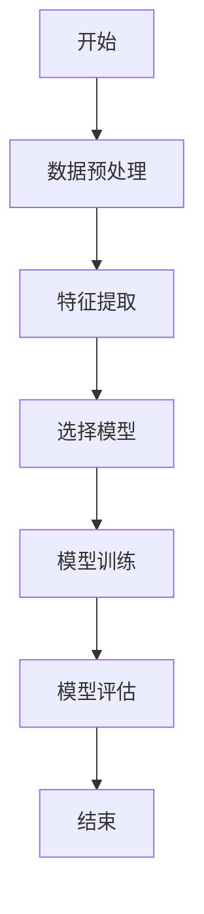

                 


# AI智能体在评估公司知识产权价值中的作用

> 关键词：AI智能体, 知识产权评估, 机器学习, 数据分析, 知识产权价值

> 摘要：本文探讨了AI智能体在评估公司知识产权价值中的作用。通过分析知识产权的核心要素，结合机器学习算法和系统架构设计，详细阐述了AI智能体如何提升知识产权评估的效率和准确性。文章还提供了实际案例和最佳实践，帮助读者更好地理解和应用相关技术。

---

## 第一部分: 知识产权评估的背景与概述

### 第1章: 知识产权的基本概念与重要性

#### 1.1 知识产权的定义与分类

- **1.1.1 知识产权的基本概念**
  - 知识产权是法律保护的智力成果，包括专利、商标、版权等。
  - 知识产权是企业的重要资产，能够带来经济价值。

- **1.1.2 知识产权的主要类型**
  - 专利：保护发明的独占权。
  - 商标：保护品牌标识的独占权。
  - 版权：保护文学、艺术和科学作品的创作者权益。

- **1.1.3 知识产权在企业中的价值体现**
  - 专利可以转化为市场竞争力。
  - 商标是品牌价值的重要组成部分。
  - 版权保护企业创新能力。

#### 1.2 AI智能体的基本概念

- **1.2.1 AI智能体的定义**
  - AI智能体是一种能够感知环境、自主决策并执行任务的智能系统。
  - 具备学习、推理和自适应能力。

- **1.2.2 AI智能体的核心特征**
  - 数据驱动：依赖大量数据进行训练和推理。
  - 自动化：能够自主完成任务，减少人工干预。
  - 智能决策：基于数据和模型进行决策。

- **1.2.3 AI智能体与传统评估方法的区别**
  - 传统方法依赖人工分析，效率低且容易出错。
  - AI智能体能够快速处理大量数据，提高评估效率和准确性。

#### 1.3 知识产权评估的背景与挑战

- **1.3.1 知识产权评估的重要性**
  - 知识产权是企业核心资产，评估其价值有助于优化资源配置。
  - 正确评估知识产权价值，有助于企业决策和融资。

- **1.3.2 传统知识产权评估方法的局限性**
  - 人工评估耗时且成本高。
  - 评估结果受主观因素影响，准确性不足。

- **1.3.3 AI智能体在知识产权评估中的作用**
  - 提高评估效率，降低评估成本。
  - 减少人为错误，提升评估准确性。

### 第2章: AI智能体在知识产权评估中的应用前景

#### 2.1 知识产权评估的主要应用场景

- **2.1.1 专利评估**
  - 评估专利的市场价值和潜在收益。
  - 分析专利的法律风险和竞争优势。

- **2.1.2 商标评估**
  - 评估商标的市场影响力和品牌价值。
  - 分析商标的法律风险和保护状态。

- **2.1.3 版权评估**
  - 评估版权的市场价值和使用范围。
  - 分析版权的法律保护和侵权风险。

#### 2.2 AI智能体在知识产权评估中的优势

- **2.2.1 数据处理能力**
  - 能够快速处理大量知识产权数据。
  - 通过数据分析发现隐藏的关联和趋势。

- **2.2.2 自动化评估能力**
  - AI智能体能够自动化完成知识产权评估的各个环节。
  - 从数据收集、特征提取到价值评估，实现全自动化。

- **2.2.3 高效性和准确性**
  - 提高评估效率，降低人工成本。
  - 减少人为错误，提升评估结果的准确性。

#### 2.3 知识产权评估的未来发展趋势

- **2.3.1 技术进步对知识产权评估的影响**
  - AI技术的不断进步将推动知识产权评估的自动化和智能化。
  - 大数据分析和机器学习算法的应用将提升评估的深度和广度。

- **2.3.2 AI智能体在知识产权评估中的未来发展方向**
  - 更加智能化的评估系统，实现从数据到价值的全自动转化。
  - 结合区块链技术，提升知识产权评估的透明度和可信度。

---

## 第二部分: 知识产权评估的核心概念与联系

### 第3章: 知识产权评估的核心要素

#### 3.1 知识产权评估的核心要素

- **3.1.1 评估对象**
  - 知识产权的类型（专利、商标、版权等）。
  - 知识产权的法律状态（是否有效、是否被侵权等）。

- **3.1.2 评估指标**
  - 知识产权的市场价值。
  - 知识产权的法律风险。
  - 知识产权的经济贡献。

- **3.1.3 评估方法**
  - 市场法：通过市场交易数据进行评估。
  - 收益法：预测未来收益，折现计算现值。
  - 成本法：估算开发成本，评估其价值。

#### 3.2 AI智能体在知识产权评估中的核心概念

- **3.2.1 数据驱动的评估**
  - 通过大量知识产权数据，训练机器学习模型进行评估。
  - 数据来源包括专利数据库、商标数据库、版权登记数据等。

- **3.2.2 特征提取与模型训练**
  - 从知识产权数据中提取关键特征，如技术领域、发明人、申请时间等。
  - 使用机器学习算法（如随机森林、支持向量机）进行模型训练。

- **3.2.3 模型评估与优化**
  - 使用交叉验证等方法评估模型性能。
  - 根据实际需求优化模型参数，提升评估准确性。

#### 3.3 知识产权评估的核心要素对比

| **核心要素** | **传统评估方法** | **AI智能体评估方法** |
|--------------|------------------|-----------------------|
| 数据来源     | 线下调研、人工分析 | 大数据爬取、自动分析  |
| 评估效率     | 低               | 高                   |
| 评估准确性     | 易受主观影响     | 高，基于数据驱动     |

---

## 第三部分: 算法原理与系统架构设计

### 第4章: 算法原理

#### 4.1 知识产权评估的算法选择

- **4.1.1 机器学习算法的选择**
  - 根据数据类型和评估目标选择合适的算法。
  - 常用算法：线性回归、支持向量机、随机森林等。

- **4.1.2 算法的优缺点分析**
  - 线性回归：简单易用，但适合线性关系。
  - 支持向量机：适合高维数据，但需要参数调优。
  - 随机森林：适合特征较多的情况，但计算成本较高。

#### 4.2 算法实现的流程



#### 4.3 算法的数学模型

- **线性回归模型**
  - 模型公式：$$ y = \beta_0 + \beta_1 x_1 + \beta_2 x_2 + ... + \beta_n x_n $$
  - 损失函数：$$ L = \sum_{i=1}^{m} (y_i - \hat{y}_i)^2 $$
  - 优化方法：最小二乘法。

- **支持向量机模型**
  - 模型公式：$$ y = sign(\sum_{i=1}^{n} \alpha_i y_i x_i \cdot x) + b $$
  - 核函数：$$ K(x_i, x_j) = (x_i \cdot x_j + 1)^2 $$

#### 4.4 算法实现的Python代码

```python
import pandas as pd
from sklearn.model_selection import train_test_split
from sklearn.ensemble import RandomForestRegressor
from sklearn.metrics import mean_squared_error

# 数据预处理
data = pd.read_csv('ip_data.csv')
X = data.drop('value', axis=1)
y = data['value']

# 特征提取
X_train, X_test, y_train, y_test = train_test_split(X, y, test_size=0.2)

# 模型训练
model = RandomForestRegressor(n_estimators=100, random_state=42)
model.fit(X_train, y_train)

# 模型评估
y_pred = model.predict(X_test)
mse = mean_squared_error(y_test, y_pred)
print(f'均方误差：{mse}')
```

---

## 第四部分: 系统架构设计

### 第5章: 系统架构设计

#### 5.1 系统功能设计

- **功能模块**
  - 数据采集模块：从知识产权数据库中获取数据。
  - 特征提取模块：提取关键特征并进行数据清洗。
  - 模型训练模块：训练机器学习模型。
  - 评估结果展示模块：将评估结果以可视化形式展示。

- **系统架构图**


#### 5.2 系统交互设计

- **用户界面**
  - 数据输入界面：上传知识产权数据。
  - 评估结果界面：展示评估结果和分析报告。

- **系统接口设计**
  - API接口：提供数据接口供其他系统调用。
  - RESTful API：支持JSON格式的数据交互。

---

## 第五部分: 项目实战与最佳实践

### 第6章: 项目实战

#### 6.1 环境安装

- **安装Python和必要的库**
  ```bash
  pip install pandas numpy scikit-learn
  ```

#### 6.2 核心代码实现

```python
import pandas as pd
from sklearn.ensemble import RandomForestRegressor
from sklearn.metrics import mean_squared_error

# 数据加载
data = pd.read_csv('ip_data.csv')

# 数据预处理
data.dropna(inplace=True)
data['value'] = data['value'].astype(float)

# 特征选择
features = data.columns[:-1]
target = data.columns[-1]

# 数据分割
X = data[features]
y = data[target]
X_train, X_test, y_train, y_test = train_test_split(X, y, test_size=0.2)

# 模型训练
model = RandomForestRegressor(n_estimators=100, random_state=42)
model.fit(X_train, y_train)

# 模型评估
y_pred = model.predict(X_test)
mse = mean_squared_error(y_test, y_pred)
print(f'均方误差：{mse}')
```

#### 6.3 实际案例分析

- **案例背景**
  - 某科技公司拥有多项专利，需要评估其市场价值。

- **案例分析**
  - 数据采集：从专利数据库获取专利信息。
  - 特征提取：包括专利技术领域、发明人数量、申请时间等。
  - 模型训练：使用随机森林模型进行训练。
  - 评估结果：预测专利的市场价值，提供优化建议。

#### 6.4 最佳实践

- **小结**
  - AI智能体能够显著提高知识产权评估的效率和准确性。
  - 通过数据驱动的方法，实现知识产权价值的科学评估。

- **注意事项**
  - 数据质量直接影响评估结果，需确保数据的完整性和准确性。
  - 模型选择需根据实际需求和数据特点进行调整。

- **拓展阅读**
  - 推荐阅读《机器学习实战》和《知识产权管理》。

---

## 作者

作者：AI天才研究院/AI Genius Institute & 禅与计算机程序设计艺术/Zen And The Art of Computer Programming

---

**总结**：本文系统地探讨了AI智能体在评估公司知识产权价值中的作用，从背景介绍到算法实现，再到系统设计和项目实战，全面展示了AI技术在知识产权评估中的应用。通过实际案例分析和最佳实践，为读者提供了丰富的参考和启示。

