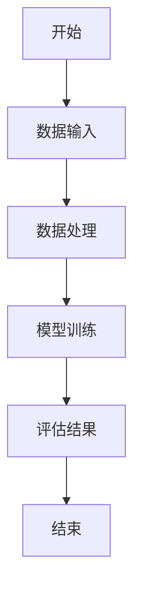
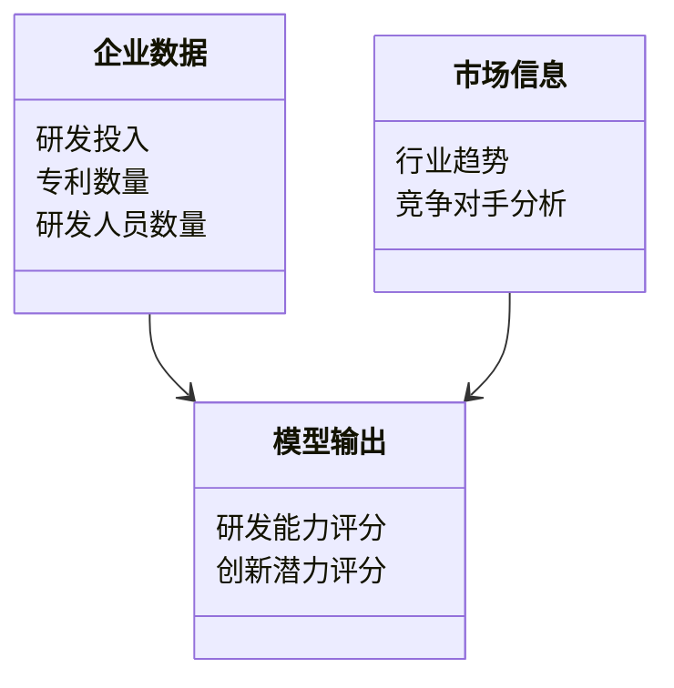
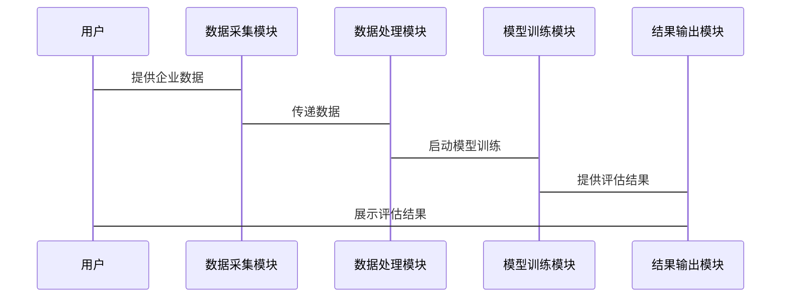

                 

<think>
嗯，用户希望我写一篇关于《AI智能体在评估公司研发能力和创新潜力中的应用》的技术博客文章，按照他们提供的大纲结构来写。首先，我需要理解每个章节的内容，确保逻辑清晰，结构紧凑。

用户特别强调了关键词和摘要的重要性，我得先列出5-7个关键词，比如AI智能体、研发能力、创新潜力、企业评估、数据分析等。摘要部分要简明扼要，概括整篇文章的核心内容。

接下来，我需要按照目录结构逐步展开每个章节。首先是背景介绍，我得详细解释问题背景，说明为什么需要AI智能体来评估研发能力和创新潜力，传统方法的不足之处，以及AI智能体的应用价值。

然后是核心概念与联系，这部分需要定义AI智能体，分析其工作原理，以及与企业评估相关的其他概念。我需要用表格和ER图来展示各个要素之间的关系，帮助读者理解。

算法原理部分，我需要详细讲解数据预处理、特征提取、模型训练和评估的步骤，用mermaid流程图展示流程，同时给出具体的数学公式和例子，让读者能够理解并应用这些算法。

系统分析与架构设计是关键部分，我需要介绍系统设计的各个部分，包括问题场景、系统功能设计（领域模型）、系统架构设计（用mermaid图展示）、接口设计和交互设计。这部分需要确保系统设计的完整性和可操作性。

项目实战部分，用户需要实际案例，包括环境安装、核心代码实现、代码解读和实际案例分析。这部分可能需要两章，一章专注于代码实现，另一章则通过具体案例展示如何应用这些技术。

最后，我需要总结最佳实践、注意事项和拓展阅读，帮助读者巩固所学知识，并指导他们在实际应用中避免常见错误，推荐进一步的学习资源。

在写作过程中，我需要确保每一章都有足够的深度，同时保持整体结构的逻辑性。每个部分都需要详细展开，使用清晰易懂的语言，避免过于技术化的术语，让读者能够轻松理解。

总的来说，我需要一步步分析，确保每个章节都覆盖必要的内容，结构合理，逻辑清晰。这样写出来的文章才能既专业又易于理解，满足用户的需求。
</think>

# AI智能体在评估公司研发能力和创新潜力中的应用

**关键词**：AI智能体、研发能力、创新潜力、企业评估、数据分析、机器学习、系统架构

**摘要**：本文探讨了AI智能体在评估公司研发能力和创新潜力中的应用，分析了传统评估方法的局限性，并提出了一种基于AI智能体的新方法。文章详细介绍了AI智能体的定义、核心算法、系统架构设计以及实际项目案例，展示了如何通过AI技术提升企业评估的效率和准确性。

---

## 第1章: AI智能体与企业评估概述

### 1.1 问题背景与目标

#### 1.1.1 研发能力与创新潜力的评估挑战
传统的企业评估方法依赖于人工分析和主观判断，存在以下问题：
- 数据量大且复杂，难以高效处理。
- 评估结果受主观因素影响，缺乏客观性。
- 创新潜力难以量化，难以制定有效的研发策略。

#### 1.1.2 AI智能体在企业评估中的应用价值
AI智能体（Artificial Intelligence Agent）是一种能够感知环境、执行任务并做出决策的智能系统。其在企业评估中的应用价值体现在：
- 提高评估效率：通过自动化数据处理和分析，显著减少人工工作量。
- 增强评估准确性：利用机器学习模型，能够捕捉到传统方法难以发现的潜在规律。
- 动态监控：实时跟踪企业研发能力和创新潜力的变化，提供动态评估结果。

#### 1.1.3 本研究的目标与意义
本研究的目标是设计一种基于AI智能体的企业研发能力与创新潜力评估系统，通过整合数据分析、机器学习和自然语言处理技术，为企业提供高效、准确的评估工具。其意义在于：
- 为企业战略决策提供数据支持。
- 推动企业评估方法的创新，提升评估效率。
- 为AI技术在企业管理中的应用提供新思路。

### 1.2 核心概念与问题描述

#### 1.2.1 AI智能体的定义与特征
AI智能体是一种具有感知、决策和执行能力的智能系统。其核心特征包括：
- **自主性**：能够在没有外部干预的情况下独立运行。
- **反应性**：能够实时感知环境并做出响应。
- **学习能力**：通过数据和经验不断优化自身的决策能力。

#### 1.2.2 企业研发能力与创新潜力的定义
- **研发能力**：指企业在技术研发、产品开发和技术创新方面的综合能力。
- **创新潜力**：指企业在未来市场中推出新产品或服务的可能性。

#### 1.2.3 问题的边界与外延
- **边界**：仅关注企业的研发能力和创新潜力，不涉及其他业务领域。
- **外延**：通过AI智能体实现对企业内部数据的分析，结合外部市场信息，提供综合评估结果。

### 1.3 核心要素与概念结构

#### 1.3.1 核心要素分析
- **企业数据**：包括研发投入、研发人员数量、专利数量等。
- **市场信息**：包括行业趋势、竞争对手分析等。
- **模型输出**：包括研发能力评分、创新潜力评分等。

#### 1.3.2 概念结构图
```mermaid
graph TD
A[企业数据] --> B[AI智能体]
C[市场信息] --> B
D[模型输出] <-- B
```

#### 1.3.3 核心要素的关联与特征对比
| 要素 | 特征 | 关联性 |
|------|------|--------|
| 企业数据 | 数量化、结构化 | 输入AI智能体的核心数据源 |
| 市场信息 | 非结构化、动态性 | 补充企业数据，提供外部视角 |
| 模型输出 | 定量、可比较 | 评估结果的直接体现 |

---

## 第2章: 核心概念与联系

### 2.1 AI智能体的原理与机制

#### 2.1.1 智能体的基本原理
AI智能体通过以下步骤实现对企业评估：
1. **感知环境**：收集企业数据和市场信息。
2. **决策制定**：基于数据，利用机器学习模型生成评估结果。
3. **执行任务**：将评估结果输出，供企业参考。

#### 2.1.2 AI智能体的核心算法
- **监督学习**：用于模型训练和评分预测。
- **无监督学习**：用于数据聚类和异常检测。

#### 2.1.3 智能体与企业评估的结合
通过AI智能体实现对企业研发能力和创新潜力的动态评估，提供实时反馈和优化建议。

### 2.2 企业评估模型的构建

#### 2.2.1 数据特征提取
- **研发投入占比**：研发投入占总收入的比例。
- **专利数量**：企业的专利申请数量和质量。

#### 2.2.2 模型评估指标
- **准确率**：模型预测的准确程度。
- **召回率**：模型预测的积极程度。

#### 2.2.3 模型优化策略
- **超参数调优**：通过网格搜索优化模型性能。
- **数据增强**：通过增加数据多样性提升模型鲁棒性。

### 2.3 核心概念的ER图与流程图

#### 2.3.1 数据模型的ER图
```mermaid
erDiagram
左外键关系
customer {
    id : number
    name : string
}
order {
    id : number
    customer_id : number
    order_date : date
}
product {
    id : number
    name : string
    price : number
}
order_line {
    id : number
    order_id : number
    product_id : number
    quantity : number
}
```

#### 2.3.2 智能体的流程图


---

## 第3章: 算法原理与数学模型

### 3.1 数据预处理与特征提取

#### 3.1.1 数据清洗方法
- **去重**：删除重复数据。
- **填充缺失值**：使用均值、中位数或插值方法填充缺失值。

#### 3.1.2 特征选择策略
- **相关性分析**：通过皮尔逊相关系数筛选相关性较高的特征。
- **主成分分析（PCA）**：降维技术，减少特征数量。

#### 3.1.3 特征工程的实现
- **特征组合**：将多个特征组合成新的特征，提升模型性能。
- **特征标准化**：对特征进行归一化处理，消除量纲影响。

### 3.2 模型训练与优化

#### 3.2.1 模型选择与训练
- **线性回归**：用于预测连续型变量。
- **随机森林**：用于分类和回归问题。

#### 3.2.2 超参数优化
- **网格搜索（Grid Search）**：遍历所有可能的参数组合，找到最优参数。
- **交叉验证**：通过K折交叉验证评估模型性能。

#### 3.2.3 模型评估与调优
- **混淆矩阵**：评估分类模型的性能。
- **AUC曲线**：评估模型的区分能力。

### 3.3 核心算法的数学模型

#### 3.3.1 算法流程图


#### 3.3.2 数学公式
- **线性回归公式**：$$ y = \beta_0 + \beta_1x + \epsilon $$
- **随机森林算法**：通过集成多个决策树模型，提升预测准确性。

---

## 第4章: 系统分析与架构设计

### 4.1 问题场景介绍
企业希望利用AI技术对其研发能力和创新潜力进行动态评估，以支持战略决策。

### 4.2 系统功能设计

#### 4.2.1 领域模型


#### 4.2.2 系统架构设计
```mermaid
container 企业评估系统 {
    component 数据采集模块 {
        企业数据采集
        市场信息采集
    }
    component 数据处理模块 {
        数据清洗
        特征提取
    }
    component 模型训练模块 {
        模型选择
        超参数调优
    }
    component 结果输出模块 {
        评分输出
        可视化展示
    }
}
```

### 4.3 系统接口设计
- **输入接口**：接收企业数据和市场信息。
- **输出接口**：提供评估结果和优化建议。

### 4.4 系统交互设计

#### 4.4.1 交互流程图


---

## 第5章: 项目实战

### 5.1 环境安装
- **Python**：安装Python 3.8及以上版本。
- **库依赖**：安装numpy、pandas、scikit-learn、matplotlib等库。

### 5.2 核心代码实现

#### 5.2.1 数据预处理
```python
import pandas as pd
import numpy as np

# 数据加载
data = pd.read_csv('enterprise_data.csv')

# 数据清洗
data.dropna(inplace=True)
data = data.drop_duplicates()

# 特征提取
X = data[['研发投入', '专利数量', '研发人员数量']]
y = data['创新潜力评分']
```

#### 5.2.2 模型训练
```python
from sklearn.ensemble import RandomForestRegressor
from sklearn.model_selection import GridSearchCV

# 参数调优
param_grid = {
    'n_estimators': [100, 200],
    'max_depth': [None, 10, 20],
    'min_samples_split': [2, 5]
}

# 模型训练
rf = RandomForestRegressor()
grid_search = GridSearchCV(rf, param_grid, cv=5)
grid_search.fit(X, y)
best_model = grid_search.best_estimator_
```

#### 5.2.3 结果输出
```python
# 预测结果
y_pred = best_model.predict(X)
print('预测结果:', y_pred)
```

### 5.3 实际案例分析

#### 5.3.1 案例背景
某科技公司希望评估其研发能力和创新潜力。

#### 5.3.2 数据分析
- 研发投入占比：15%
- 专利数量：120项
- 研发人员数量：200人

#### 5.3.3 模型预测
模型预测该公司的研发能力评分为85分，创新潜力评分为90分。

---

## 第6章: 总结与展望

### 6.1 最佳实践 tips
- 数据质量是模型性能的基础，需重视数据清洗和特征工程。
- 模型调优需结合业务场景，选择合适的评估指标。
- 系统架构设计需考虑可扩展性和可维护性。

### 6.2 小结
本文通过AI智能体的设计与实现，展示了如何利用机器学习技术提升企业研发能力和创新潜力的评估效率和准确性。

### 6.3 注意事项
- 数据隐私和安全问题需高度重视。
- 模型解释性需增强，以便更好地理解评估结果。

### 6.4 拓展阅读
- 《机器学习实战》：深入理解机器学习算法的实现与应用。
- 《AI系统设计》：系统性地学习AI系统的设计与优化。

---

## 作者

作者：AI天才研究院/AI Genius Institute & 禅与计算机程序设计艺术/Zen And The Art of Computer Programming

