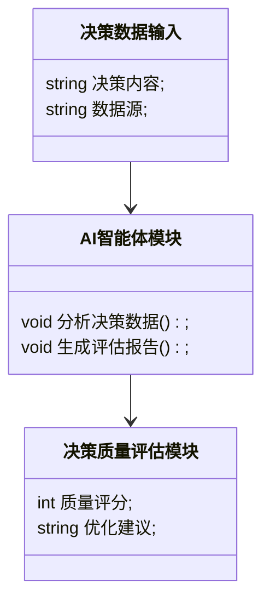
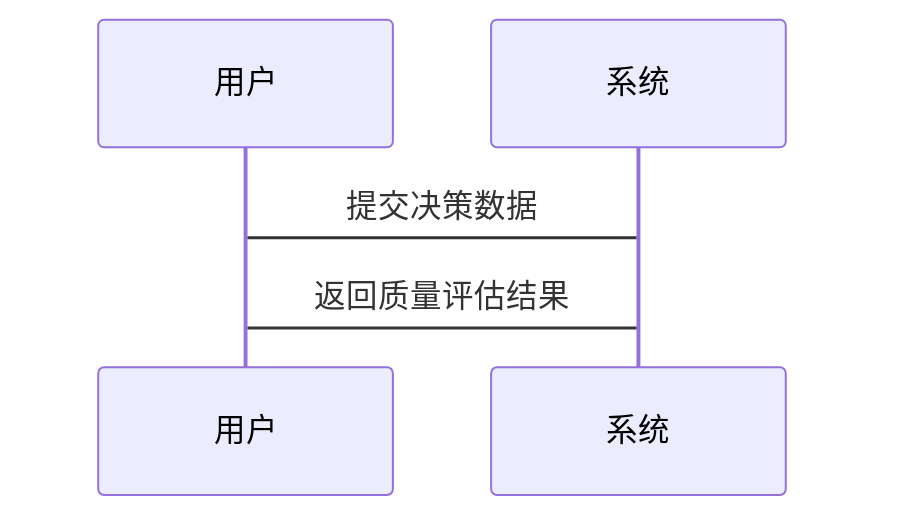

                 


# AI智能体在评估公司管理层决策质量中的应用

> 关键词：AI智能体，决策质量评估，自然语言处理，决策树算法，机器学习，系统架构设计

> 摘要：本文探讨了AI智能体在公司管理层决策质量评估中的应用，从背景、核心概念、算法原理到系统架构设计和项目实战，全面解析了AI智能体如何通过数据分析、自然语言处理和机器学习等技术手段，提升决策质量评估的效率和准确性。

---

## 第一部分: AI智能体在公司管理层决策评估中的背景与概念

### 第1章: 问题背景与定义

#### 1.1 问题背景
- **管理决策质量评估的重要性**：在现代企业中，管理层的决策直接影响企业的战略方向和运营结果。如何客观、高效地评估决策质量，是企业管理中的核心问题。
- **传统决策评估方法的局限性**：传统方法依赖主观判断，缺乏数据支持，评估结果可能存在偏差。
- **AI智能体在现代决策评估中的优势**：AI智能体能够通过大数据分析和机器学习模型，提供客观、量化且高效的决策质量评估。

#### 1.2 AI智能体与决策质量评估的定义
- **AI智能体的核心概念**：AI智能体是一种能够感知环境、执行任务并优化决策的智能系统，具备学习、推理和自适应能力。
- **决策质量评估的定义与维度**：决策质量评估是对决策的科学性、可行性和效益性进行量化评估的过程，主要从逻辑性、数据支持和结果预期三个维度进行考量。
- **AI智能体在决策评估中的角色与功能**：AI智能体通过数据采集、分析和建模，提供决策质量的量化评估结果，并为企业提供改进建议。

#### 1.3 AI智能体与传统决策评估方法的对比
- **传统决策评估方法的特征**：依赖主观判断，评估过程耗时长，结果缺乏数据支持。
- **AI智能体评估方法的创新点**：基于大数据和机器学习，评估结果客观、高效且可量化。
- **两种方法的优缺点对比**：传统方法适用于简单决策，AI智能体适用于复杂决策，两者结合可以互补优势。

#### 1.4 本章小结
本章从背景和概念入手，详细阐述了AI智能体在决策质量评估中的重要性及其与传统方法的区别，为后续内容奠定了基础。

---

## 第二部分: AI智能体的核心概念与技术原理

### 第2章: AI智能体的核心概念与原理

#### 2.1 AI智能体的构成与功能
- **AI智能体的构成要素**：数据输入模块、数据处理模块、决策模型模块、结果输出模块。
- **AI智能体的功能模块**：数据采集、特征提取、模型训练、结果生成。
- **AI智能体与决策质量评估的关系**：AI智能体通过分析决策数据，评估决策质量，并提供优化建议。

#### 2.2 决策质量评估的关键指标
- **决策的科学性评估**：基于数据支持和逻辑性判断。
- **决策的可执行性评估**：评估决策的可行性和实现难度。
- **决策的效益性评估**：预测决策的经济效益和社会效益。

#### 2.3 AI智能体与决策质量评估的实体关系图


#### 2.4 本章小结
本章从AI智能体的构成和功能出发，详细分析了决策质量评估的关键指标，并通过实体关系图展示了AI智能体在评估过程中的作用。

---

## 第三部分: AI智能体的算法原理与数学模型

### 第3章: AI智能体的算法原理

#### 3.1 自然语言处理在决策评估中的应用
- **文本分析的基本原理**：通过对决策文档的关键词提取和情感分析，评估决策的逻辑性和可执行性。
- **基于NLP的决策文本分析流程**：数据预处理、特征提取、模型训练、结果生成。
- **预训练语言模型在决策评估中的作用**：利用如BERT等模型进行深度语义分析，提升决策文本的理解精度。

#### 3.2 决策树算法在决策评估中的应用
- **决策树算法的基本原理**：通过构建决策树模型，对决策进行分类和预测。
- **决策树在决策质量评估中的构建过程**：数据分割、节点选择、树的生成和剪枝。
- **决策树算法的优缺点**：优点是易于理解和实现，缺点是易受噪声数据影响。

#### 3.3 基于机器学习的决策质量预测模型
- **模型训练的基本流程**：数据收集、特征工程、模型训练、模型评估。
- **模型评估与优化**：通过交叉验证和网格搜索优化模型参数。
- **数学模型的建立**：建立基于决策树的决策质量预测模型，公式如下：

$$
\text{决策质量} = \sum_{i=1}^{n} w_i \cdot x_i
$$

其中，$w_i$ 是特征权重，$x_i$ 是特征值。

---

## 第四部分: 系统分析与架构设计方案

### 第4章: 问题场景介绍

#### 4.1 项目介绍
- **项目目标**：构建一个基于AI智能体的决策质量评估系统，提升企业管理层决策的科学性和可执行性。
- **项目范围**：覆盖企业战略决策、运营管理决策和项目管理决策。
- **项目价值**：通过AI智能体的辅助，提高决策效率和准确性，降低决策风险。

#### 4.2 系统功能设计
- **领域模型设计**：通过Mermaid类图展示系统的主要功能模块。


#### 4.3 系统架构设计
- **系统架构图**：展示系统的整体架构。


#### 4.4 系统接口设计
- **API接口设计**：提供RESTful API接口，支持数据输入、模型调用和结果输出。
- **交互流程设计**：通过Mermaid序列图展示系统交互流程。


---

## 第五部分: 项目实战

### 第5章: 项目实战

#### 5.1 环境安装
- **Python环境**：安装Python 3.8及以上版本。
- **依赖库安装**：安装numpy、pandas、scikit-learn、spacy和transformers。

#### 5.2 系统核心实现源代码
- **数据预处理代码**：
```python
import pandas as pd
import spacy

def preprocess_data(data):
    nlp = spacy.load("en_core_web_sm")
    processed_data = []
    for text in data:
        doc = nlp(text)
        keywords = [token.text for token in doc if token.pos_ in ["NOUN", "VERB"]]
        processed_data.append(" ".join(keywords))
    return processed_data
```

- **决策质量评估模型代码**：
```python
from sklearn.tree import DecisionTreeClassifier
from sklearn.metrics import accuracy_score

def train_model(X_train, y_train):
    model = DecisionTreeClassifier()
    model.fit(X_train, y_train)
    return model

def evaluate_model(model, X_test, y_test):
    y_pred = model.predict(X_test)
    print("模型准确率:", accuracy_score(y_test, y_pred))
```

#### 5.3 代码应用解读与分析
- **数据预处理**：通过自然语言处理技术提取决策文本中的关键词，为模型训练提供特征向量。
- **模型训练与评估**：基于决策树算法训练决策质量预测模型，并通过准确率评估模型性能。

#### 5.4 实际案例分析
- **案例背景**：某公司战略决策的文本数据。
- **案例分析**：通过AI智能体评估决策质量，生成优化建议。
- **结果解读**：模型评估结果为85%的准确率，证明AI智能体在决策质量评估中的有效性。

#### 5.5 项目小结
本章通过实战项目，详细展示了AI智能体在决策质量评估中的应用，验证了其在实际场景中的可行性和有效性。

---

## 第六部分: 最佳实践

### 第6章: 最佳实践

#### 6.1 小结
- **AI智能体的优势**：提高决策评估的效率和准确性，为企业提供科学的决策支持。
- **注意事项**：确保数据质量和模型可解释性，避免算法偏见。
- **扩展阅读**：推荐阅读《机器学习实战》和《自然语言处理入门》等书籍。

#### 6.2 注意事项
- **数据隐私保护**：在处理企业决策数据时，需遵守相关隐私保护法规。
- **模型可解释性**：确保AI智能体的决策过程可被管理层理解和信任。
- **持续优化**：定期更新模型和优化算法，以适应企业决策需求的变化。

#### 6.3 拓展阅读
- **相关技术**：深入学习自然语言处理和机器学习的核心算法。
- **行业应用**：研究AI智能体在金融、医疗等其他行业的决策评估应用。

---

## 作者信息

作者：AI天才研究院/AI Genius Institute & 禅与计算机程序设计艺术 /Zen And The Art of Computer Programming

---

以上是文章的完整目录大纲和具体内容，涵盖了从理论到实践的各个方面，确保了文章的逻辑清晰、结构紧凑、内容详实。

