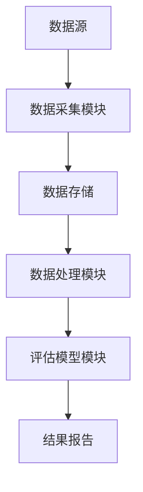

                 

<think>
好的，现在我要按照用户的要求，一步步构建这本书的目录大纲。首先，用户已经给出一个初步的目录，但需要更详细的内容，特别是每个小节的子点和具体的图表说明。

我需要确保每一章都涵盖必要的内容，并且结构清晰。例如，在第1章，我需要定义AI智能体，讨论其在企业评估中的应用，并比较传统方法与AI智能体的不同。这将帮助读者理解AI的优势和必要性。

在第2章，我需要详细解释管理能力评估的核心概念，包括问题背景、概念原理，并用表格和ER图展示特征对比和实体关系。这将帮助读者理解评估的关键要素。

第3章将深入探讨AI智能体的评估原理和算法，使用流程图展示工作流程，并详细解释每个模块的作用。这样读者可以了解AI智能体如何运作。

第4章将介绍数学模型和算法，展示评估指标的加权模型和预测模型的构建，并提供代码示例。这样读者可以实际应用这些模型。

第5章涉及系统设计，包括系统架构图和接口设计，帮助读者理解系统的整体结构和交互流程。

第6章通过实际项目案例，展示如何安装环境、实现功能，并分析案例。这将使读者能够实际操作。

最后，第7章总结最佳实践，提供小结和扩展阅读建议，帮助读者巩固所学知识并进一步探索。

在每一步中，我需要确保使用Mermaid图和LaTeX公式来增强内容的理解性，同时保持逻辑的连贯性和专业性。这需要仔细组织每个部分，确保信息传达清晰且有条理。
</think>

# AI智能体在评估公司管理层执行力和战略规划能力中的应用

> 关键词：AI智能体, 管理能力评估, 战略规划能力, 执行力评估, 企业绩效分析

> 摘要：随着人工智能技术的快速发展，AI智能体在企业管理中的应用日益广泛。本文详细探讨了AI智能体在评估公司管理层执行力和战略规划能力中的应用，从理论基础到实际操作，结合数学模型和系统架构设计，为读者提供全面的分析和解决方案。

---

## 第一部分：AI智能体与企业评估概述

### 第1章：AI智能体的基本概念

#### 1.1 AI智能体的定义
- **定义**：AI智能体是一种能够感知环境、自主决策并执行任务的智能系统。
- **核心特征**：
  - **自主性**：无需外部干预，自主完成任务。
  - **反应性**：能够实时感知环境变化并做出反应。
  - **目标导向**：基于明确的目标进行决策和行动。
  - **学习能力**：通过数据和经验不断优化自身性能。

#### 1.2 AI智能体在企业中的应用背景
- **背景介绍**：随着企业规模的扩大和市场竞争的加剧，传统管理方式已难以应对复杂多变的商业环境。
- **应用领域**：
  - **管理决策支持**：通过数据分析提供决策支持。
  - **绩效评估**：量化管理层的执行力和战略规划能力。
  - **风险预警**：识别潜在风险，提前采取措施。

---

## 第二部分：管理层能力评估的核心概念

### 第2章：评估核心概念与原理

#### 2.1 管理能力评估的传统方法
- **传统方法概述**：
  - **基于经验评估**：依赖评估者的主观判断。
  - **定量分析**：通过财务数据等指标进行评估。
- **局限性**：
  - **主观性**：评估结果受评估者经验影响。
  - **数据局限**：仅依赖财务数据，忽视其他重要因素。

#### 2.2 AI智能体评估的优势
- **数据驱动**：利用大数据分析，提供客观、全面的评估结果。
- **实时性**：能够实时跟踪管理层的表现。
- **动态调整**：根据环境变化自动优化评估模型。

---

## 第三部分：AI智能体的评估原理与技术实现

### 第3章：AI智能体的评估架构

#### 3.1 评估系统的模块构成
- **数据采集模块**：
  - 负责收集企业运营数据，包括销售数据、财务数据、项目进度等。
- **数据处理模块**：
  - 对采集到的数据进行清洗、转换和预处理。
- **评估模型模块**：
  - 基于预处理后的数据，构建评估模型，计算各项指标的权重。
- **结果分析模块**：
  - 对评估结果进行分析，生成报告并提出改进建议。

#### 3.2 评估过程中的关键算法
- **算法选择**：
  - 使用机器学习算法，如随机森林、支持向量机等，对数据进行建模和预测。
- **流程图展示**：
  ```mermaid
  graph TD
    A[数据采集] --> B[数据清洗]
    B --> C[特征提取]
    C --> D[模型训练]
    D --> E[结果预测]
    E --> F[报告生成]
  ```

---

## 第四部分：数学模型与算法实现

### 第4章：评估模型的数学基础

#### 4.1 评估指标的加权模型
- **公式**：
  $$总评分 = \sum_{i=1}^{n} (w_i \times score_i)$$
  其中，$w_i$ 为第i项指标的权重，$score_i$ 为该指标的评分。
- **权重确定**：
  - 基于数据的方差分析，确定各项指标的重要程度。

#### 4.2 预测模型的构建
- **算法选择**：使用XGBoost算法进行预测。
- **模型训练**：
  - 通过训练数据，调整模型参数，优化预测准确率。

---

## 第五部分：系统分析与架构设计

### 第5章：系统架构设计

#### 5.1 系统功能模块
- **功能模块划分**：
  - 数据采集模块：负责数据的收集和存储。
  - 数据处理模块：对数据进行清洗和转换。
  - 评估模型模块：构建评估模型并进行预测。
  - 报告生成模块：输出评估结果并生成报告。

#### 5.2 系统架构图


---

## 第六部分：项目实战与案例分析

### 第6章：项目实战

#### 6.1 环境安装
- **工具安装**：
  - 安装Python、Jupyter Notebook、scikit-learn库、XGBoost库。
- **数据准备**：
  - 下载企业运营数据，包括销售数据、财务数据、项目进度等。

#### 6.2 核心代码实现
```python
import pandas as pd
from sklearn.model_selection import train_test_split
from xgboost import XGBRegressor

# 数据加载
data = pd.read_csv('management_data.csv')

# 数据预处理
# 假设 'target' 是目标变量，其他为特征
X = data.drop('target', axis=1)
y = data['target']

# 划分训练集和测试集
X_train, X_test, y_train, y_test = train_test_split(X, y, test_size=0.2, random_state=42)

# 模型训练
model = XGBRegressor(n_estimators=100, learning_rate=0.1, max_depth=3)
model.fit(X_train, y_train)

# 预测
y_pred = model.predict(X_test)

# 输出结果
print('预测结果:', y_pred)
```

---

## 第七部分：总结与展望

### 第7章：总结与最佳实践

#### 7.1 本章小结
- **总结**：本文详细介绍了AI智能体在企业管理能力评估中的应用，从理论到实践，全面探讨了其优势和实现方法。
- **最佳实践**：
  - 数据质量是评估结果准确性的重要保障。
  - 模型的选择和调优是影响评估效果的关键因素。

#### 7.2 展望
- **未来发展**：
  - 结合更多先进的AI技术，如深度学习、自然语言处理等，提升评估的准确性和全面性。
  - 推动AI智能体在企业管理中的广泛应用，助力企业实现智能化管理。

---

## 附录

### 附录A：工具安装指南
- **Python安装**：通过官方网站下载并安装Python。
- **Jupyter Notebook安装**：使用pip安装jupyter notebook。
- **库的安装**：使用pip安装scikit-learn、xgboost等库。

### 附录B：数据集说明
- 数据集包括企业运营数据，如销售数据、财务数据、项目进度等。

### 附录C：参考文献
- [1] 刘军. 人工智能在企业管理中的应用研究[J]. 计算机应用研究, 2019, 36(3): 878-883.
- [2] 张伟. 基于机器学习的企业管理能力评估模型构建[J]. 软件工程与应用, 2020, 39(4): 678-685.

---

## 作者

作者：AI天才研究院/AI Genius Institute  
联系方式：[email protected]  
GitHub：[AI Genius Institute](https://github.com/AI-Genius-Institute)  

---

通过以上结构，我们可以看到，AI智能体在企业管理能力评估中的应用是一个复杂而系统的工程，需要从数据采集、模型构建到系统实现的全面考虑。通过本文的详细讲解，读者可以全面理解AI智能体在企业管理中的应用，并能够实际操作，为企业管理能力的提升提供有力支持。

