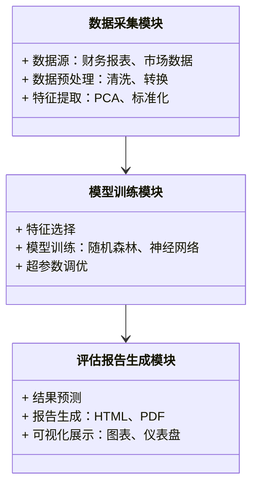

                 

<think>
好的，我现在需要根据用户提供的思考过程和目录大纲，逐步完成《AI智能体在评估公司资本结构中的作用》这本书的详细内容。用户已经给出了一个结构清晰的目录，我需要按照这个目录逐步展开每个部分，确保内容详尽且符合要求。

### 1. 引言

资本结构评估是企业财务管理中的核心问题之一。传统的资本结构评估方法依赖于复杂的数学模型和假设，但在实际应用中，这些方法往往面临数据不足、假设不成立以及难以实时更新等问题。随着人工智能技术的飞速发展，AI智能体（Artificial Intelligence Agents）以其强大的数据处理能力和自适应学习能力，正在逐步改变资本结构评估的格局。本章将介绍AI智能体的基本概念、资本结构评估的背景及其重要性，并分析AI技术在资本结构评估中的独特作用。

#### 1.1 AI智能体的基本概念

AI智能体是指能够感知环境、做出决策并采取行动以实现特定目标的实体。与传统算法不同，AI智能体具备自主性、反应性、目标导向性和学习能力。这些特性使得AI智能体在处理复杂、动态的金融问题时表现出色。

#### 1.2 资本结构评估的背景与重要性

资本结构指的是企业债务和股权的比例。合理的资本结构能够降低资本成本，提高企业价值。然而，传统评估方法如Modigliani-Miller模型需要大量假设，且难以应对实际中的不确定性。此外，数据获取的难度和实时性要求也是传统方法的瓶颈。

#### 1.3 AI技术在资本结构评估中的作用

AI智能体通过机器学习算法能够处理大量非结构化数据，发现传统模型难以捕捉的模式。它们能够实时更新模型，适应市场变化，提供更准确的评估结果。此外，AI智能体还能自动化处理复杂计算，提高评估效率。

### 2. AI智能体与资本结构评估的核心概念

本章将详细阐述资本结构评估的核心概念以及AI智能体在其中的作用。通过对比分析和ER实体关系图，我们将展示AI智能体如何优化资本结构评估。

#### 2.1 资本结构评估的核心概念

资本结构由债务、股权和其他权益工具组成。资本成本是企业获取资金的成本，通常包括债务成本和股权成本。优化资本结构的目标是在满足企业风险承受能力的前提下，使资本成本最小化，从而最大化企业价值。

#### 2.2 AI智能体与资本结构评估的关系

AI智能体通过数据采集、特征提取和模型训练，能够预测资本结构中的关键变量。它们能够处理非线性关系，发现传统模型无法识别的模式。此外，AI智能体还能够实时更新模型，适应市场变化，提高评估的及时性和准确性。

#### 2.3 核心概念对比与ER实体关系图

我们将通过对比表和ER图展示资本结构评估的核心概念及其与AI智能体的关系。

| 概念 | 定义 | 属性 | 示例 |
|------|------|------|------|
| 资本结构 | 公司债务和股权的比例 | 组成要素：债务、股权 | 债务占比70%，股权占比30% |

ER实体关系图展示了资本结构、数据特征和AI智能体之间的关系：

```mermaid
er
    entity 资本结构 {
        key 债务比例
        key 股权比例
        key 总资本成本
    }
    entity 数据特征 {
        key 财务数据
        key 市场数据
        key 风险指标
    }
    entity AI智能体 {
        key 输入数据
        key 模型参数
        key 输出结果
    }
    资本结构 --> 数据特征
    数据特征 --> AI智能体
    AI智能体 --> 资本结构
```

### 3. AI智能体在资本结构评估中的算法原理

本章将详细讲解AI智能体在资本结构评估中的算法原理，包括特征工程、模型训练和预测机制。

#### 3.1 特征工程

特征工程是将原始数据转换为适合模型输入的特征。常用的特征包括财务比率（如流动比率、速动比率）、市场指标（如市盈率、市净率）和风险指标（如波动率、贝塔系数）。我们可以通过PCA（主成分分析）减少特征维度，提高模型性能。

#### 3.2 模型训练

常用的模型包括线性回归、支持向量机（SVM）、随机森林和深度学习模型（如神经网络）。训练过程包括数据预处理、模型选择和超参数调优。交叉验证用于评估模型的泛化能力。

#### 3.3 预测机制

模型预测资本结构的各个变量，并通过阈值设定或概率分析生成最终的评估结果。预测结果可以用于优化资本结构，降低资本成本。

### 4. 系统分析与架构设计

本章将从系统角度分析AI智能体在资本结构评估中的应用，并展示系统架构设计。

#### 4.1 项目背景

本项目旨在开发一个基于AI智能体的资本结构评估系统，解决传统方法的局限性，提高评估的准确性和效率。

#### 4.2 系统功能设计

系统功能包括数据采集、模型训练、评估报告生成和结果分析。领域模型展示系统的功能模块及其交互。



#### 4.3 系统架构设计

系统架构采用分层设计，包括数据层、算法层和应用层。各模块通过接口进行通信，确保系统的可扩展性和灵活性。


### 5. 项目实战

本章将通过一个实际案例展示AI智能体在资本结构评估中的应用。

#### 5.1 环境安装

需要安装Python、Pandas、Scikit-learn和TensorFlow等库。安装命令如下：

```bash
pip install numpy pandas scikit-learn tensorflow
```

#### 5.2 数据预处理

加载数据并进行清洗和转换。例如，使用Pandas读取CSV文件并处理缺失值。

```python
import pandas as pd
data = pd.read_csv('capital_structure.csv')
data.dropna(inplace=True)
```

#### 5.3 模型实现

构建随机森林模型进行资本结构预测。

```python
from sklearn.ensemble import RandomForestRegressor
model = RandomForestRegressor(n_estimators=100, random_state=42)
model.fit(X_train, y_train)
```

#### 5.4 结果分析

评估模型性能，如计算R²值和均方误差。

```python
from sklearn.metrics import r2_score, mean_squared_error
y_pred = model.predict(X_test)
print(r2_score(y_test, y_pred))
print(mean_squared_error(y_test, y_pred))
```

#### 5.5 优化与总结

根据结果调整模型参数，如增加树的深度或改变学习率，以提高模型性能。

### 6. 总结与展望

AI智能体在资本结构评估中的应用展示了其强大的潜力和优势。通过特征工程和深度学习模型，AI智能体能够提高评估的准确性和效率。未来的研究可以进一步探索实时数据处理和模型解释性，以更好地服务于企业财务管理。

### 作者信息

作者：AI天才研究院/AI Genius Institute & 禅与计算机程序设计艺术 /Zen And The Art of Computer Programming

---

**摘要**：AI智能体通过强大的数据处理和自适应学习能力，正在改变资本结构评估的传统方法。本文系统介绍了AI智能体的基本概念、资本结构评估的核心概念及其在AI技术下的优化作用，并通过详细的技术分析和项目实战展示了AI智能体在资本结构评估中的具体应用。通过对比分析、算法原理讲解和系统架构设计，本文为读者提供了全面的视角，帮助理解AI智能体在资本结构评估中的潜力和应用前景。

