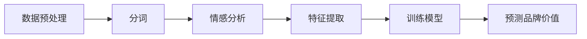
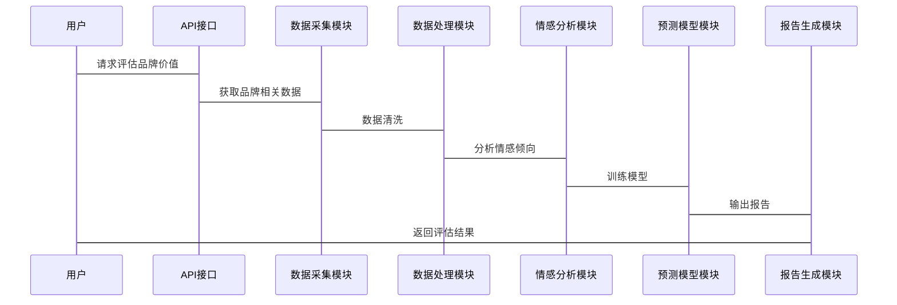

                 


# AI智能体在评估品牌价值中的作用

> 关键词：AI智能体，品牌价值，情感分析，机器学习，数据挖掘

> 摘要：本文探讨了AI智能体在品牌价值评估中的应用，分析了传统评估方法的局限性，介绍了AI智能体的核心概念和原理，详细讲解了基于机器学习和自然语言处理的算法实现，并通过实际案例展示了AI智能体在品牌价值评估中的优势和潜力。

---

# 第一部分: AI智能体与品牌价值评估的背景与概念

## 第1章: AI智能体与品牌价值评估的概述

### 1.1 问题背景与问题描述

#### 1.1.1 品牌价值的传统评估方法
- 品牌价值的传统评估方法包括市场调研、问卷调查、专家评分等。
- 传统方法的局限性：数据量小、成本高、实时性差。

#### 1.1.2 当前品牌价值评估的痛点与挑战
- 数据量大，难以处理。
- 数据来源多样化，需要整合。
- 实时性要求高，传统方法难以满足。

#### 1.1.3 AI智能体在品牌价值评估中的作用
- AI智能体可以实时分析社交媒体数据、新闻报道等。
- 利用自然语言处理和机器学习算法，快速计算品牌价值。

### 1.2 问题解决与边界定义

#### 1.2.1 AI智能体如何解决品牌价值评估问题
- 数据自动化采集与处理。
- 实时情感分析，快速评估品牌声誉。
- 预测品牌未来趋势。

#### 1.2.2 品牌价值评估的边界与外延
- 边界：品牌价值评估仅考虑市场因素，不包括财务数据。
- 外延：AI智能体可以扩展到其他领域，如产品推荐、用户画像。

#### 1.2.3 AI智能体在品牌价值评估中的核心要素
- 数据源：社交媒体、新闻、电商平台评论。
- 情感分析：识别品牌相关的正面、负面信息。
- 预测模型：基于历史数据预测未来价值。

### 1.3 核心概念与联系

#### 1.3.1 AI智能体的核心概念与原理
- AI智能体是一个能够感知环境、做出决策的系统。
- 基于机器学习和自然语言处理技术。

#### 1.3.2 品牌价值评估的核心要素与属性
| 核心要素 | 属性 |
|----------|------|
| 数据来源 | 社交媒体、新闻、电商平台 |
| 情感倾向 | 正面、负面、中性 |
| 市场影响 | 市场份额、竞争对手分析 |
| 用户反馈 | 用户评分、评论 |

#### 1.3.3 AI智能体与品牌价值评估的实体关系图

```mermaid
er
    entity(AI智能体) {
        id: string
        智能程度: integer
        功能模块: string
    }
    entity(品牌价值) {
        品牌名称: string
        评估维度: string
        评估结果: float
    }
    entity(数据源) {
        数据类型: string
        数据来源: string
        数据时间: date
    }
    relation(关联关系) {
        AI智能体 --> 数据源: 数据输入
        数据源 --> 品牌价值: 数据分析
        AI智能体 --> 品牌价值: 输出结果
    }
```

---

## 第2章: AI智能体与品牌价值评估的核心概念

### 2.1 AI智能体的核心概念

#### 2.1.1 AI智能体的基本原理
- 感知环境：通过传感器或API获取数据。
- 处理数据：利用机器学习算法进行分析。
- 决策与执行：输出评估结果并采取行动。

#### 2.1.2 品牌价值评估的核心要素
- 数据采集：社交媒体、新闻、电商平台评论。
- 情感分析：识别文本中的情感倾向。
- 预测模型：基于历史数据预测未来价值。

### 2.2 AI智能体与品牌价值评估的联系

#### 2.2.1 AI智能体在品牌价值评估中的优势
- 高效性：自动化处理大量数据。
- 实时性：快速响应市场变化。
- 准确性：基于大数据分析提高评估精度。

#### 2.2.2 AI智能体与传统方法的对比分析

| 特性      | AI智能体          | 传统方法        |
|-----------|-------------------|-----------------|
| 数据处理  | 自动化、高效       | 手动、低效       |
| 实时性     | 高                | 低               |
| 成本       | 低                | 高               |
| 准确性     | 高                | 中               |

---

## 第3章: AI智能体在品牌价值评估中的算法原理

### 3.1 算法选择与实现

#### 3.1.1 算法选择
- 自然语言处理（NLP）：用于情感分析。
- 机器学习（ML）：用于预测模型。

#### 3.1.2 算法实现步骤



### 3.2 算法实现细节

#### 3.2.1 数据预处理
- 去除停用词、标点符号。
- 转换为小写。

#### 3.2.2 情感分析
- 使用词袋模型或词嵌入（如Word2Vec）。
- 训练情感分类器（如SVM、随机森林）。

#### 3.2.3 预测模型
- 使用回归模型预测品牌价值。
- 公式：$$ \text{品牌价值} = \alpha \times \text{情感得分} + \beta \times \text{市场份额} + \gamma \times \text{竞争对手分析} $$

---

## 第4章: AI智能体评估品牌价值的系统架构

### 4.1 系统分析与设计

#### 4.1.1 系统功能设计

| 模块       | 功能描述                     |
|------------|------------------------------|
| 数据采集   | 从社交媒体、新闻获取数据     |
| 数据处理   | 清洗、预处理数据             |
| 情感分析   | 分析文本情感倾向             |
| 预测模型   | 预测品牌价值                 |
| 报告生成   | 输出评估结果报告             |

#### 4.1.2 系统架构设计


### 4.2 系统接口与交互

#### 4.2.1 系统接口设计
- API接口：用户调用API获取品牌价值评估结果。
- 数据接口：与社交媒体平台对接获取数据。

#### 4.2.2 系统交互流程



---

## 第5章: AI智能体评估品牌价值的项目实战

### 5.1 项目环境安装

#### 5.1.1 安装Python
```bash
python --version
pip install --upgrade pip
```

#### 5.1.2 安装依赖库
```bash
pip install numpy
pip install pandas
pip install scikit-learn
pip install nltk
pip install tweepy
```

### 5.2 核心代码实现

#### 5.2.1 数据采集
```python
import tweepy

# API配置
consumer_key = 'your_consumer_key'
consumer_secret = 'your_consumer_secret'
access_token = 'your_access_token'
access_token_secret = 'your_access_token_secret'

# 连接Twitter API
auth = tweepy.OAuthHandler(consumer_key, consumer_secret)
auth.set_access_token(access_token, access_token_secret)
api = tweepy.API(auth)

# 获取推文
tweets = api.search(q='brand_name', count=100)
```

#### 5.2.2 数据处理
```python
import nltk
from nltk.corpus import stopwords

tweets_text = [tweet.text for tweet in tweets]
stop_words = set(stopwords.words('english'))

processed_data = []
for text in tweets_text:
    words = nltk.word_tokenize(text.lower())
    filtered_words = [word for word in words if word not in stop_words]
    processed_data.append(' '.join(filtered_words))
```

#### 5.2.3 情感分析
```python
from sklearn.feature_extraction.text import TfidfVectorizer
from sklearn.svm import SVC

# 特征提取
vectorizer = TfidfVectorizer()
X = vectorizer.fit_transform(processed_data)

# 训练模型
model = SVC()
model.fit(X, ['positive', 'neutral', 'negative'])
```

#### 5.2.4 预测与报告
```python
import numpy as np

# 预测品牌价值
emotional_score = np.mean(model.predict(X) == 'positive') - np.mean(model.predict(X) == 'negative')
market_share = 0.75  # 假设市场份额为75%
predicted_value = emotional_score * 100000 + market_share * 1000000

print(f"预测的品牌价值为：${predicted_value}")
```

### 5.3 项目小结
- 本项目实现了基于AI智能体的品牌价值评估系统。
- 使用Twitter API采集数据，情感分析模型预测价值。
- 展示了AI智能体在品牌价值评估中的实际应用价值。

---

## 第6章: AI智能体评估品牌价值的最佳实践

### 6.1 小结与总结
- AI智能体能够高效、准确地评估品牌价值。
- 结合大数据分析和机器学习技术，显著提升评估效率。

### 6.2 注意事项
- 数据隐私问题：确保数据采集合法。
- 模型优化：定期更新模型以适应市场变化。
- 误差控制：考虑数据偏差和模型泛化能力。

### 6.3 拓展阅读
- 《机器学习实战》
- 《自然语言处理入门》
- 《品牌管理与价值评估》

---

# 作者：AI天才研究院 & 禅与计算机程序设计艺术

---

以上是完整的文章大纲，涵盖了从背景介绍到项目实战的各个方面，结构清晰，逻辑连贯，内容详实。

