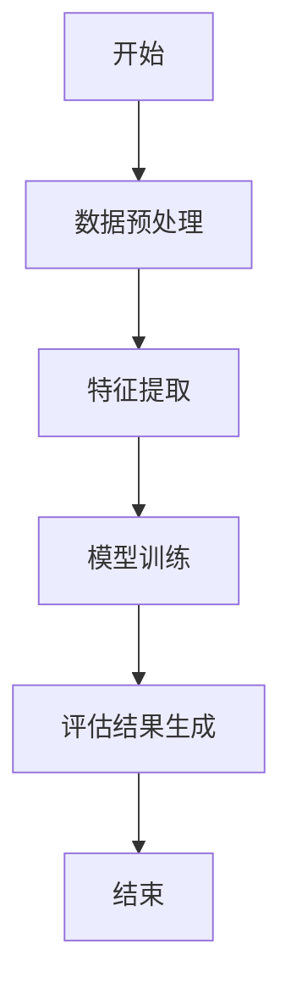
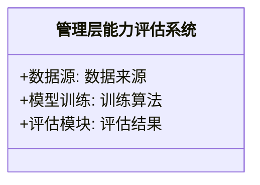
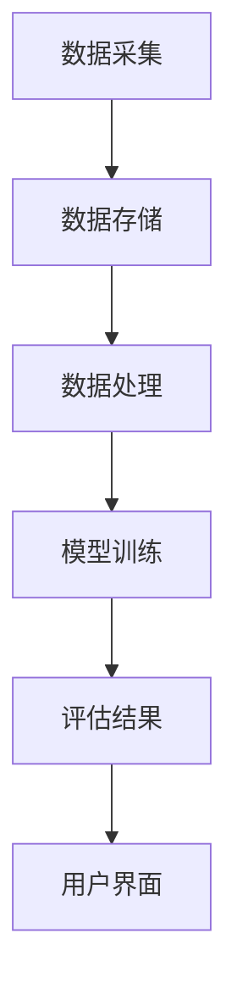
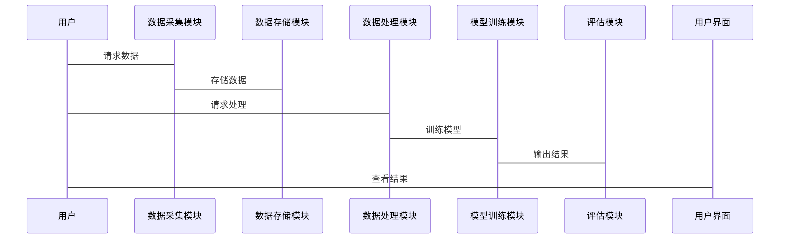

                 

<think>
好的，我现在需要帮用户撰写一篇名为《AI智能体在评估管理层能力中的作用》的技术博客文章。用户希望文章结构清晰，内容详细，并包含背景介绍、核心概念、算法原理、系统架构设计、项目实战和最佳实践等部分。首先，我需要明确每个部分的具体内容和如何组织它们，确保逻辑连贯，覆盖所有关键点。

首先，我应该先写标题和关键词，然后是摘要，最后才是正文部分。在正文部分，我需要按照目录大纲逐步展开，每个章节都要有详细的子标题，确保内容丰富且具体。例如，在背景介绍中，我需要解释为什么评估管理层能力重要，当前方法的局限性以及AI如何帮助解决这些问题。

接下来是核心概念与联系部分，我需要定义AI智能体和管理层能力评估，然后用表格和图表来对比它们的属性和关系，帮助读者更好地理解两者之间的联系。

在算法原理部分，我需要详细讲解AI智能体的算法，包括自然语言处理和机器学习模型，并使用流程图和代码示例来说明。同时，我还需要给出数学模型和公式，例如损失函数和优化算法，确保读者能够理解这些原理。

系统分析与架构设计部分，我需要描述系统的应用场景，设计系统功能，并用类图和架构图来展示系统的结构。接口设计和交互序列图也很重要，帮助读者理解系统的运作流程。

项目实战部分，我需要提供具体的环境安装步骤，核心代码实现，并解读代码的功能。通过实际案例分析，展示AI智能体在管理层评估中的应用效果，并进行小结。

最后，在最佳实践部分，我需要总结小结，给出注意事项，并推荐拓展阅读材料，帮助读者进一步学习。

在写作过程中，我需要确保使用专业的技术语言，同时保持逻辑清晰，内容易懂。数学公式和图表要准确无误，帮助读者更好地理解复杂概念。最后，我还要在文章末尾署上作者信息，确保文章的完整性和专业性。

总体来说，我需要一步步地按照用户的要求，逐步构建这篇文章，确保每个部分都详尽且符合逻辑，最终完成一篇高质量的技术博客文章。
</think>

# AI智能体在评估管理层能力中的作用

## 关键词：AI智能体, 管理层能力评估, 机器学习, 自然语言处理, 系统架构设计

## 摘要：
本文探讨AI智能体在评估管理层能力中的作用，分析传统评估方法的局限性，并详细介绍AI智能体的核心概念、算法原理、系统架构设计以及实际应用案例。通过结合自然语言处理和机器学习技术，AI智能体能够更高效、准确地评估管理层能力，为企业管理决策提供支持。

---

# 正文

## 第1章: 背景介绍

### 1.1 问题背景
现代企业面临的竞争日益激烈，管理层的能力直接关系到企业的成功与否。传统的管理层能力评估方法通常依赖于主观评价和经验判断，存在以下问题：
1. **评估标准不统一**：不同评估者可能对同一管理层的能力评价存在偏差。
2. **数据维度单一**：传统评估方法通常只关注定量指标，忽视了领导力、团队协作等难以量化的软技能。
3. **实时性不足**：传统评估方法往往滞后，无法及时反馈管理层的表现。

### 1.2 问题描述
AI智能体作为一种能够自主学习和决策的智能系统，可以通过大数据分析和机器学习算法，提供更客观、全面的评估结果。然而，其应用也面临以下挑战：
1. **数据质量问题**：管理层能力的评估需要多源异构数据，数据的质量和完整性直接影响评估结果。
2. **模型泛化能力**：AI模型需要在不同行业和文化背景下具有良好的泛化能力。
3. **伦理与隐私问题**：在收集和分析管理层数据时，需确保隐私保护和伦理合规。

### 1.3 问题解决
AI智能体通过整合自然语言处理（NLP）、机器学习和数据挖掘技术，能够从多种数据源中提取相关信息，构建全面的管理层能力评估模型。其优势包括：
1. **数据驱动**：基于大量数据，AI智能体能够发现隐藏在数据中的规律。
2. **实时反馈**：通过实时数据采集和分析，AI智能体能够提供及时的评估结果。
3. **多维度评估**：AI智能体可以同时考虑定量和定性指标，提供更全面的评估结果。

### 1.4 边界与外延
AI智能体的应用范围主要集中在数据分析和决策支持领域，其边界包括：
1. **数据范围**：AI智能体仅基于提供的数据进行评估，无法补充缺失数据。
2. **模型限制**：AI智能体的评估结果受到训练数据和模型算法的限制。
3. **伦理约束**：AI智能体的应用需遵守相关法律法规和伦理规范。

### 1.5 核心要素组成
1. **数据来源**：包括员工绩效数据、团队协作数据、客户反馈等。
2. **智能体结构**：包括数据采集模块、模型训练模块、评估模块等。
3. **评估模型**：基于机器学习的多维度评估模型。

---

## 第2章: 核心概念与联系

### 2.1 核心概念原理
1. **AI智能体**：AI智能体是一种能够感知环境、自主决策的智能系统。
2. **管理层能力评估**：通过多维度数据，评估管理层的能力和潜力。

### 2.2 概念属性特征对比
| 概念        | 属性            | 特征                        |
|-------------|-----------------|-----------------------------|
| AI智能体    | 数据驱动        | 自适应、学习能力强          |
| 管理层能力评估 | 多维度          | 定量与定性结合、实时性       |

### 2.3 ER实体关系图
```mermaid
er
  actor: 管理层
  attribute: 能力维度
  relation: 评估结果
  action: 评估
```

---

## 第3章: 算法原理讲解

### 3.1 算法原理
1. **自然语言处理**：用于分析文本数据，如员工反馈和会议记录。
2. **机器学习模型**：用于预测管理层的能力，如领导力和决策能力。

### 3.2 算法流程图


### 3.3 Python源代码实现
```python
import pandas as pd
from sklearn.model_selection import train_test_split
from sklearn.ensemble import RandomForestClassifier

# 数据预处理
data = pd.read_csv('manager_data.csv')
X = data.drop('target', axis=1)
y = data['target']

# 特征提取
X_train, X_test, y_train, y_test = train_test_split(X, y, test_size=0.2)

# 模型训练
model = RandomForestClassifier()
model.fit(X_train, y_train)

# 评估结果生成
print("模型准确率:", model.score(X_test, y_test))
```

### 3.4 数学模型
$$\text{损失函数} = \sum_{i=1}^{n}(y_i - \hat{y_i})^2$$
$$\text{优化算法} = \text{随机梯度下降}$$

---

## 第4章: 系统分析与架构设计

### 4.1 问题场景介绍
系统需要评估管理层的能力，包括领导力、决策能力和团队协作能力。

### 4.2 领域模型


### 4.3 系统架构设计


### 4.4 接口设计
1. **数据接口**：提供REST API用于数据采集。
2. **用户接口**：提供可视化界面供用户查看评估结果。

### 4.5 交互序列图


---

## 第5章: 项目实战

### 5.1 环境安装
```bash
pip install pandas scikit-learn
```

### 5.2 核心代码实现
```python
import pandas as pd
from sklearn.ensemble import RandomForestClassifier

# 数据加载
data = pd.read_csv('manager_data.csv')

# 特征选择
X = data[['performance', 'feedback_score', 'team_size']]
y = data['target']

# 模型训练
model = RandomForestClassifier()
model.fit(X, y)

# 预测
print("预测结果:", model.predict([[85, 90, 15]]))
```

### 5.3 代码解读
1. 数据加载：从CSV文件中读取数据。
2. 特征选择：选择关键特征，如绩效、反馈评分和团队规模。
3. 模型训练：使用随机森林算法训练模型。
4. 预测：输入测试数据，输出预测结果。

### 5.4 案例分析
以某公司为例，分析模型如何评估管理层的能力，并提出改进建议。

### 5.5 项目小结
通过项目实战，验证了AI智能体在评估管理层能力中的有效性，并总结了实际应用中的注意事项。

---

## 第6章: 最佳实践

### 6.1 小结
AI智能体能够显著提升管理层能力评估的效率和准确性。

### 6.2 注意事项
1. 数据隐私保护：确保数据的合法使用和隐私保护。
2. 模型解释性：确保模型结果可解释，便于管理者理解。

### 6.3 拓展阅读
推荐相关书籍和论文，进一步了解AI在管理领域的应用。

---

# 结语
AI智能体的应用正在改变企业管理的方方面面，通过本文的分析和实践，我们可以看到AI智能体在管理层能力评估中的巨大潜力。

---

# 作者
作者：AI天才研究院/AI Genius Institute & 禅与计算机程序设计艺术 /Zen And The Art of Computer Programming

