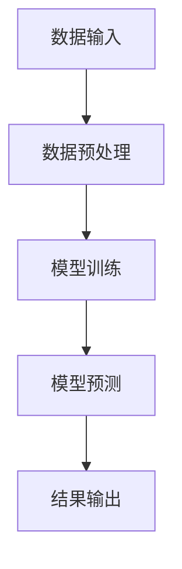
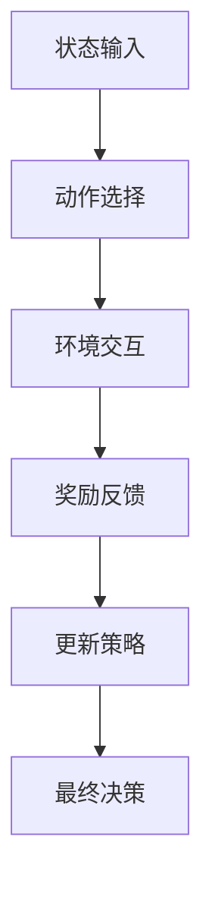
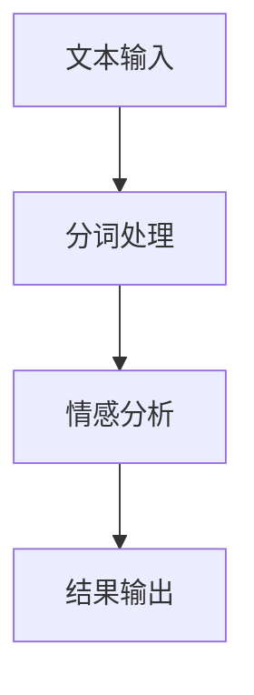
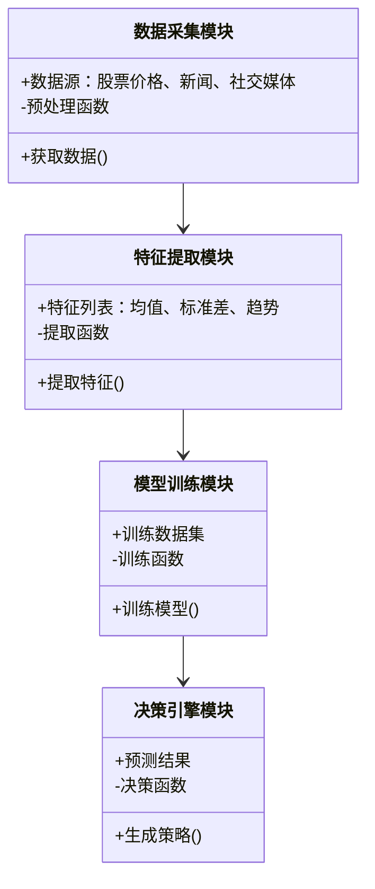
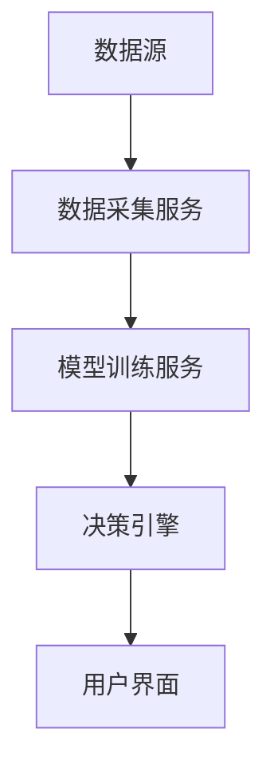

                 

<think>
好的，我现在要根据用户的请求，写一篇关于《AI智能体在识别价值投资机会的最佳进入时机中的应用》的技术博客。用户给了我一个非常详细的目录大纲，要求内容丰富、结构清晰，并且包含多个部分，比如背景介绍、核心概念、算法原理、系统设计、项目实战等。用户还特别强调了格式要求，比如使用markdown，包含数学公式、代码示例和图表等。

首先，我需要理解用户的需求。用户希望这篇文章能详细讲解AI智能体在价值投资中的应用，特别是如何识别最佳进入时机。文章需要专业且有深度，同时逻辑清晰，结构紧凑。用户还特别提到要包括背景介绍、核心概念、算法原理、系统设计、项目实战等部分，并且每个部分都要详细展开。

接下来，我需要分析每个章节的内容，确保每个部分都涵盖必要的信息。比如在背景介绍部分，我需要解释价值投资的定义、投资时机的重要性以及AI智能体在金融中的应用。这部分需要让读者理解为什么AI在投资时机选择中是必要的。

然后是核心概念与联系部分，我需要详细讲解AI智能体的基本原理，包括感知、决策和执行机制。同时，通过对比分析，列出不同技术的特点，并用ER图展示智能体与市场的关系。这部分帮助读者理解AI智能体在金融中的整体架构。

在算法原理部分，我需要详细讲解时间序列预测、强化学习和情绪分析这三种主要算法。每种算法都需要用mermaid流程图来展示流程，并用Python代码实现，同时给出数学模型和公式。比如，ARIMA模型和强化学习的Q-learning公式。这部分需要深入浅出，让读者能够理解并应用这些算法。

系统分析与架构设计是关键部分。我需要描述投资时机的场景，设计系统的功能模块，比如数据采集、特征提取、模型训练和决策引擎。然后用mermaid类图展示领域模型，用架构图展示整体系统结构，包括数据源、服务层和用户界面。接口设计和交互流程也需要详细描述，确保系统能够高效运行。

项目实战部分，我需要指导读者如何安装环境，比如Anaconda和相关库，然后逐步实现数据预处理、特征工程、模型训练和优化。通过具体案例，比如分析苹果股票，展示如何应用这些算法，并解读代码。最后，进行结果分析和优化，确保项目能够实际应用。

最后是总结与展望。这部分需要回顾整个系统的构建过程，总结经验教训，并展望未来的发展方向，比如多模态分析和自适应优化。同时，给出一些最佳实践的Tips，帮助读者在实际操作中避免常见错误。

在写作过程中，我需要确保每个章节都细化到三级目录，内容完整且结构清晰。同时，数学公式和代码示例要准确无误，帮助读者深入理解技术细节。最后，检查总字数是否在2000字以内，确保大纲简洁明了，不冗杂。

现在，我需要开始撰写每个部分，确保涵盖所有必要的内容，并符合用户的格式要求。例如，在价值投资的背景部分，我需要解释什么是价值投资，为什么投资时机重要，以及AI在其中的角色。然后，在算法部分，详细讲解每种算法的工作原理，并用代码示例来支持。

我还需要注意，使用mermaid图表来展示流程图和架构图，这将使内容更直观。同时，数学公式要用latex格式，确保正确显示。例如，在时间序列预测部分，展示ARIMA模型的公式，以及如何应用于股票价格预测。

在系统设计部分，我需要用mermaid类图展示领域模型，展示各个模块之间的关系。然后，用架构图展示整体系统结构，包括数据源、服务层和用户界面。这有助于读者理解系统的整体布局和各部分的协作。

项目实战部分，我需要提供具体的代码示例，指导读者如何安装环境，如何处理数据，训练模型，并优化结果。通过实际案例，比如分析苹果股票，展示AI智能体如何识别最佳进入时机。

最后，总结部分需要回顾整个系统的构建过程，强调AI在价值投资中的潜力，并指出未来的研究方向。同时，给出一些实践建议，帮助读者在实际操作中更好地应用这些技术。

总的来说，我需要确保文章内容全面、结构清晰，同时语言专业且易于理解。通过详细的解释和实际案例，帮助读者理解AI智能体在识别价值投资机会中的应用，特别是在最佳进入时机的识别上。这不仅能满足用户的需求，还能为读者提供有价值的见解和实用的技术指导。
</think>

# AI智能体在识别价值投资机会的最佳进入时机中的应用

---

## 关键词  
- AI智能体、价值投资、投资时机、机器学习、金融分析、算法交易

---

## 摘要  
本文探讨了AI智能体在识别价值投资机会中的最佳进入时机的应用。通过结合价值投资的核心理念和人工智能技术，本文详细分析了AI智能体在金融市场的感知、决策和执行机制，并重点介绍了时间序列预测、强化学习和情绪分析等算法在投资时机选择中的应用。此外，文章还通过实际案例展示了AI智能体在价值投资中的优势与局限性，并提出了未来的研究方向和最佳实践建议。

---

## 第一部分：价值投资与AI智能体的背景

### 第1章：价值投资的定义与核心理念  
价值投资是一种以企业基本面分析为基础的投资策略，强调以低于市场价买入优质资产，长期持有，等待市场回归其内在价值。其核心理念包括：  
1. **安全边际**：买入价格低于内在价值，以降低投资风险。  
2. **长期视角**：关注企业的长期盈利能力，而非短期市场波动。  
3. **逆向思维**：在市场恐慌时寻找低估资产，在市场狂热时保持冷静。  

#### 1.1.2 投资时机的重要性  
投资时机的选择对投资收益具有决定性影响。AI智能体通过分析市场数据、情绪和趋势，能够帮助投资者更精准地识别最佳进入时机。  

#### 1.1.3 AI智能体在金融中的应用  
AI智能体通过处理海量数据、识别模式和预测趋势，能够辅助投资者做出更明智的决策。其在金融中的应用包括：  
- 自动化交易系统  
- 风险管理  
- 市场情绪分析  

---

## 第二部分：AI智能体的核心概念与原理

### 第2章：AI智能体的基本原理  
AI智能体在金融中的应用主要依赖于以下三个核心机制：  
1. **感知机制**：通过数据采集与处理、市场情绪分析和财务指标分析，感知市场动态。  
2. **决策机制**：基于机器学习模型、决策树和强化学习等算法，制定投资策略。  
3. **执行机制**：通过自动化交易系统和风险管理模块，执行交易并监控结果。  

### 第3章：AI智能体与价值投资的结合  
价值投资的核心要素包括企业基本面分析、市场周期分析和投资者心理分析。AI智能体通过数据驱动的方式，能够更高效地识别低估资产并优化投资组合。  

---

## 第三部分：AI智能体的算法与数学模型

### 第4章：时间序列预测算法  
时间序列预测是识别投资时机的核心算法之一。常用的模型包括：  
1. **ARIMA模型**：适用于线性时间序列数据的预测。  
   $$ ARIMA(p, d, q) $$  
2. **LSTM网络**：适用于非线性时间序列数据的预测。  
   $$ LSTM(t, h, c) $$  

#### 4.1.1 时间序列预测流程图  


### 第5章：强化学习算法  
强化学习通过模拟投资环境，训练AI智能体在复杂市场中的决策能力。常用算法包括：  
1. **Q-Learning**：通过状态-动作-奖励机制优化投资策略。  
   $$ Q(s, a) = r + \gamma \max Q(s', a') $$  
2. **Deep Q-Networks (DQN)**：结合深度学习与强化学习，提高决策精度。  

#### 5.1.1 强化学习流程图  


### 第6章：情绪分析算法  
市场情绪分析是AI智能体识别投资时机的重要工具。通过自然语言处理（NLP）技术，AI智能体能够从新闻、社交媒体和分析师报告中提取市场情绪，并辅助投资决策。  

#### 6.1.1 情绪分析流程图  


---

## 第四部分：系统分析与架构设计

### 第7章：系统功能设计  
投资时机识别系统的功能模块包括：  
1. **数据采集模块**：从多种数据源获取市场数据。  
2. **特征提取模块**：提取影响投资决策的关键特征。  
3. **模型训练模块**：训练时间序列预测、强化学习和情绪分析模型。  
4. **决策引擎模块**：根据模型输出制定投资策略。  

#### 7.1.1 领域模型类图  


### 第8章：系统架构设计  
系统架构采用分层设计，包括数据源层、服务层和用户界面层。  

#### 8.1.1 系统架构图  


---

## 第五部分：项目实战

### 第9章：环境安装与数据预处理  
1. 安装环境：使用Anaconda安装Python和相关库（如pandas、numpy、keras）。  
2. 数据预处理：清洗和标准化市场数据。  

#### 9.1.1 数据预处理代码示例  
```python
import pandas as pd
import numpy as np

# 加载数据
data = pd.read_csv('stock_data.csv')

# 数据清洗
data.dropna(inplace=True)
data['date'] = pd.to_datetime(data['date'])

# 数据标准化
from sklearn.preprocessing import StandardScaler
scaler = StandardScaler()
scaled_data = scaler.fit_transform(data[['open', 'high', 'low', 'close']])
```

### 第10章：模型实现与优化  
1. 实现时间序列预测模型：使用LSTM网络预测股票价格。  
2. 实现强化学习模型：训练DQN算法优化投资策略。  
3. 实现情绪分析模型：使用NLP技术分析市场情绪。  

#### 10.1.1 LSTM模型代码示例  
```python
from keras.models import Sequential
from keras.layers import LSTM, Dense

# 模型定义
model = Sequential()
model.add(LSTM(64, input_shape=(timesteps, features)))
model.add(Dense(1))
model.compile(loss='mean_squared_error', optimizer='adam')

# 模型训练
model.fit(X_train, y_train, epochs=100, batch_size=32)
```

### 第11章：实际案例分析  
通过分析某股票的历史数据，展示AI智能体如何识别最佳进入时机。  

---

## 第六部分：总结与展望

### 第12章：总结与展望  
1. **总结**：AI智能体在价值投资中的潜力巨大，但其局限性也不容忽视。  
2. **展望**：未来的研究方向包括多模态分析、自适应优化和可解释性增强。  

### 第13章：最佳实践 Tips  
- 数据质量是模型性能的关键，确保数据清洗和预处理。  
- 模型优化需要结合实际场景，避免过拟合。  
- 结合人类经验与AI决策，提升投资效果。  

---

## 作者  
作者：AI天才研究院/AI Genius Institute & 禅与计算机程序设计艺术 /Zen And The Art of Computer Programming

