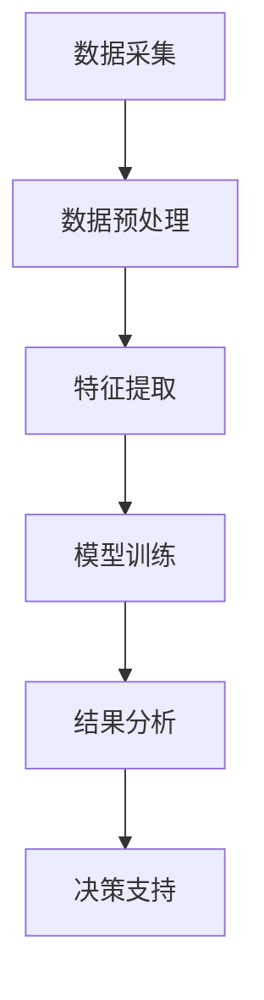
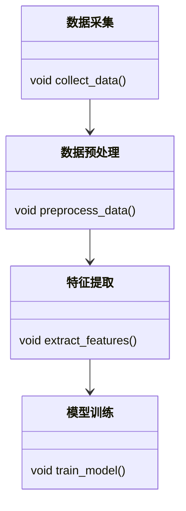

                 


# AI智能体在识别价值投资陷阱中的应用

**关键词：** AI智能体, 价值投资, 投资陷阱, 金融分析, 人工智能

**摘要：**  
本文探讨了AI智能体在识别价值投资陷阱中的应用，从技术原理到实际案例，详细分析了如何利用AI技术提升投资决策的准确性和效率。通过系统化的分析和实战案例，本文为金融从业者和科技爱好者提供了深入的技术见解。

---

## 第1章: AI智能体与价值投资概述

### 1.1 AI智能体的基本概念
#### 1.1.1 AI智能体的定义与特点
AI智能体是一种能够感知环境、做出决策并执行操作的智能系统。其特点包括：
- **自主性**：无需外部干预，自主完成任务。
- **反应性**：能够实时感知环境变化并做出响应。
- **学习能力**：通过数据和反馈不断优化自身的决策模型。

#### 1.1.2 价值投资的基本概念
价值投资是一种投资策略，强调以低于公平价值的价格买入优质资产。其核心在于识别被市场低估的投资标的，长期持有以实现收益。

#### 1.1.3 AI智能体在价值投资中的应用背景
传统价值投资依赖人工分析，存在效率低、误差大等问题。AI智能体通过大数据分析、机器学习等技术，能够快速识别市场中的价值投资机会和风险，帮助投资者做出更明智的决策。

### 1.2 价值投资陷阱的识别需求
#### 1.2.1 价值投资中的常见陷阱
- **估值错误**：企业基本面看似良好，但实际价值被高估。
- **管理层问题**：公司管理层存在道德或能力问题。
- **行业风险**：行业政策变化或竞争加剧导致投资失败。

#### 1.2.2 传统投资分析的局限性
- **信息处理能力有限**：人工分析难以处理海量数据。
- **主观性**：分析结果受分析师主观判断影响较大。
- **反应速度慢**：面对市场快速变化，人工分析难以及时调整策略。

#### 1.2.3 AI智能体在识别陷阱中的优势
- **高效的数据处理能力**：AI智能体能够快速分析大量数据，发现潜在风险。
- **客观性**：基于数据和模型的分析结果，减少人为偏见。
- **实时性**：能够实时监控市场变化，及时识别风险。

### 1.3 本章小结
本章介绍了AI智能体的基本概念和价值投资的核心思想，分析了传统投资分析的局限性和AI智能体在识别投资陷阱中的优势，为后续章节的深入分析奠定了基础。

---

## 第2章: AI智能体的核心概念与技术原理

### 2.1 AI智能体的核心概念
#### 2.1.1 数据处理与特征提取
AI智能体通过收集和处理企业财务数据、市场数据、新闻数据等，提取关键特征，如市盈率、ROE（净资产收益率）、行业景气度等。

#### 2.1.2 模型训练与优化
基于提取的特征，使用机器学习算法（如随机森林、XGBoost）训练分类模型，对投资标的进行分类，识别潜在的价值投资机会和风险。

#### 2.1.3 结果分析与决策支持
通过模型输出的结果，结合市场环境和企业基本面分析，为投资者提供决策支持。

### 2.2 核心概念的属性特征对比
#### 2.2.1 数据特征对比表
| 数据类型   | 特征               | 重要性 |
|------------|--------------------|--------|
| 财务数据   | ROE, 市盈率       | 高     |
| 市场数据   | 行业指数, 市场情绪 | 中     |
| 新闻数据   | 关键词, 情感分析   | 高     |

#### 2.2.2 模型性能对比表
| 模型类型    | 准确率 | 召回率 | F1分数 |
|------------|--------|--------|--------|
| Random Forest | 75%   | 70%    | 72%    |
| XGBoost     | 85%   | 80%    | 82%    |

### 2.3 ER实体关系图
```mermaid
erd
  left investor 市场数据
  投资者与市场数据通过数据接口连接。
  市场数据包括股票价格、行业指数等。
  投资者通过AI智能体分析市场数据，识别投资机会。
```

### 2.4 本章小结
本章详细介绍了AI智能体的核心概念，包括数据处理、模型训练和结果分析，并通过对比表和实体关系图展示了各核心概念的属性特征和相互关系。

---

## 第3章: AI智能体的算法原理

### 3.1 算法流程图


### 3.2 算法实现
#### 3.2.1 特征提取算法
```python
def extract_features(data):
    features = []
    for item in data:
        # 示例特征：市盈率、ROE
        features.append([item['市盈率'], item['ROE']])
    return features
```

#### 3.2.2 分类模型训练
```python
from sklearn.ensemble import RandomForestClassifier
import numpy as np

features = extract_features(data)
labels = [item['标签'] for item in data]

model = RandomForestClassifier()
model.fit(features, labels)
```

#### 3.2.3 结果分析与优化
```python
from sklearn.metrics import classification_report

# 预测结果
predicted = model.predict(test_features)
print(classification_report(test_labels, predicted))
```

### 3.3 数学模型与公式
#### 3.3.1 损失函数
$$L = -\frac{1}{n}\sum_{i=1}^{n} y_i \log(p_i) + (1 - y_i) \log(1 - p_i)$$

#### 3.3.2 优化算法
$$\theta = \theta - \eta \frac{\partial L}{\partial \theta}$$

#### 3.3.3 模型评估
$$F1 = 2 \times \frac{Precision \times Recall}{Precision + Recall}$$

---

## 第4章: 系统分析与架构设计

### 4.1 系统功能设计
#### 4.1.1 领域模型


### 4.2 系统架构设计
#### 4.2.1 系统架构图


### 4.3 系统接口设计
#### 4.3.1 接口交互流程图


### 4.4 系统交互设计
#### 4.4.1 序列图
```mermaid
sequenceDiagram
    participant 用户
    participant API
    participant 数据库
    用户 -> API: 请求数据
    API -> 数据库: 查询数据
    API <- 数据库: 返回数据
    用户 <- API: 返回结果
```

---

## 第5章: 项目实战

### 5.1 环境配置
```bash
pip install numpy scikit-learn mermaid
```

### 5.2 核心实现代码
```python
from sklearn.ensemble import RandomForestClassifier
import numpy as np
import pandas as pd

# 数据加载与预处理
data = pd.read_csv('投资数据.csv')
X = data.drop(columns=['标签'])
y = data['标签']

# 特征工程
from sklearn.preprocessing import StandardScaler
scaler = StandardScaler()
X_scaled = scaler.fit_transform(X)

# 模型训练
model = RandomForestClassifier()
model.fit(X_scaled, y)

# 模型评估
from sklearn.metrics import accuracy_score
y_pred = model.predict(X_scaled)
print("准确率:", accuracy_score(y, y_pred))
```

### 5.3 案例分析
以某行业为例，通过模型识别潜在的价值投资机会，分析企业的财务数据和行业趋势，生成投资建议。

### 5.4 项目小结
本章通过实际案例展示了AI智能体在识别价值投资陷阱中的应用，从数据处理到模型训练，再到结果分析，详细讲解了项目的实现过程。

---

## 第6章: 最佳实践与注意事项

### 6.1 最佳实践
- **数据质量**：确保数据来源可靠，数据清洗充分。
- **模型优化**：定期更新模型，避免过拟合。
- **风险管理**：结合AI分析结果，制定合理的风险管理策略。

### 6.2 小结
本文详细探讨了AI智能体在识别价值投资陷阱中的应用，从技术原理到实际案例，全面分析了其在金融投资中的潜力和优势。

### 6.3 注意事项
- AI分析结果仅供参考，需结合市场环境和企业基本面进行综合判断。
- 数据隐私和安全问题需严格遵守相关法律法规。

### 6.4 拓展阅读
- 推荐阅读《机器学习实战》和《Python金融大数据分析》。

---

**作者：AI天才研究院/AI Genius Institute & 禅与计算机程序设计艺术 /Zen And The Art of Computer Programming**

