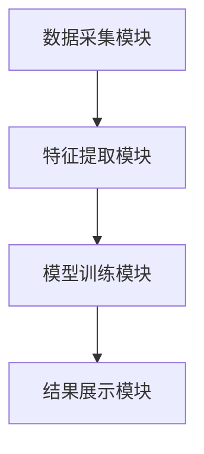

                 


# AI智能体在识别价值股与成长股融合机会中的作用

> 关键词：AI智能体, 价值股, 成长股, 股票分析, 机器学习, 深度学习, 强化学习

> 摘要：本文将探讨AI智能体在识别价值股与成长股融合机会中的作用，通过分析股票市场的基本概念、AI智能体的核心原理和实现步骤，结合具体的数学模型和算法，详细阐述如何利用AI技术来发现价值股与成长股的融合机会。文章还将提供一个基于Python的实战案例，展示如何构建一个AI智能体来识别价值股与成长股的融合机会。

---

## 第一部分: 价值股与成长股的基本概念

### 第1章: 价值股的定义与特征

#### 1.1 价值股的定义
价值股是指那些市场价格低于其内在价值的股票，通常具有较低的市盈率、市净率等估值指标。投资者认为这些股票被市场低估，具有较大的上升空间。

#### 1.2 价值股的核心特征
- **低估值**：市盈率（P/E）和市净率（P/B）较低。
- **稳定的盈利能力**：公司具有较高的净利润率和稳定的盈利增长。
- **高股息率**：通常倾向于分红，股息率较高。

#### 1.3 价值股的投资策略
- **基本面分析**：通过分析公司的财务报表和行业地位，寻找被低估的股票。
- **长期持有**：价值股投资通常需要较长的时间来实现价值回归。
- **分散投资**：降低单一股票的风险。

### 第2章: 成长股的定义与特征

#### 2.1 成长股的定义
成长股是指那些具有较高增长率，未来盈利预期较高的股票。这些公司通常处于快速发展的阶段，市场占有率不断提升。

#### 2.2 成长股的核心特征
- **高增长率**：收入和利润增长速度快。
- **高市盈率**：由于未来高增长的预期，市盈率通常较高。
- **高风险**：成长股的价格波动较大，风险较高。

#### 2.3 成长股的投资策略
- **技术分析**：通过分析股价走势，寻找买入机会。
- **行业选择**：选择处于快速发展阶段的行业。
- **短期交易**：由于价格波动大，投资者通常采取短期交易策略。

### 第3章: 价值股与成长股的对比分析

#### 3.1 价值股与成长股的异同点
| 特征      | 价值股                          | 成长股                          |
|-----------|---------------------------------|---------------------------------|
| 市盈率     | 低                              | 高                              |
| 盈利能力   | 稳定                            | 快速增长                        |
| 风险       | 较低                            | 较高                            |
| 投资策略   | 长期持有                        | 短期交易                        |
| 行业       | 常规行业，如金融、能源等         | 高增长行业，如科技、医疗等       |

#### 3.2 价值股与成长股的优劣势对比
- **价值股优势**：
  - 风险较低。
  - 价格波动小。
  - 适合长期投资。
- **成长股优势**：
  - 增长潜力大。
  - 适合短期交易。
  - 市场敏感度高，容易受市场情绪影响。

#### 3.3 价值股与成长股的市场表现分析
- **价值股**：在市场低迷时表现较好，通常在市场复苏时实现价值回归。
- **成长股**：在市场繁荣时表现较好，但在市场衰退时容易受到较大冲击。

---

## 第二部分: AI智能体在金融领域的应用背景

### 第4章: AI智能体在股票分析中的作用

#### 4.1 AI智能体的基本定义
AI智能体是一种能够感知环境、自主决策并采取行动的智能系统。在股票分析中，AI智能体可以通过分析市场数据和公司基本面信息，帮助投资者做出更明智的投资决策。

#### 4.2 AI智能体在股票分析中的核心功能
- **数据收集与处理**：从多种来源收集股票数据，并进行预处理。
- **特征提取**：从历史数据和公司基本面中提取有用的特征。
- **模型训练**：利用机器学习算法训练预测模型。
- **策略生成**：根据模型预测结果生成投资策略。

#### 4.3 AI智能体在股票分析中的优势
- **高效性**：AI智能体能够快速处理大量数据，提高分析效率。
- **准确性**：通过机器学习算法，AI智能体能够发现人类难以察觉的市场规律。
- **自适应性**：AI智能体能够根据市场变化自动调整分析策略。

### 第5章: 价值股与成长股融合机会的背景分析

#### 5.1 价值股与成长股融合的市场背景
随着市场的不断发展，单纯投资价值股或成长股的策略逐渐显现出局限性。投资者开始关注价值股和成长股的融合机会，即那些既有低估值特征，又具有较高成长潜力的股票。

#### 5.2 价值股与成长股融合的投资机会
- **双重优势**：融合型股票既有价值股的低估值特征，又具有成长股的高增长潜力。
- **风险分散**：融合型股票的风险介于价值股和成长股之间，适合不同风险偏好的投资者。

#### 5.3 价值股与成长股融合的市场趋势
随着AI技术的不断进步，越来越多的投资者开始利用AI智能体来识别价值股和成长股的融合机会。

---

## 第三部分: AI智能体的核心原理与实现

### 第6章: AI智能体的核心原理

#### 6.1 AI智能体的基本原理
AI智能体通过感知环境、分析数据、制定策略和采取行动来实现投资目标。在股票分析中，AI智能体的核心任务是识别价值股和成长股的融合机会。

#### 6.2 AI智能体在股票分析中的实现步骤
1. **数据收集**：从股票市场获取历史数据和公司基本面信息。
2. **特征提取**：从数据中提取有用的特征，如市盈率、净利润增长率等。
3. **模型训练**：利用机器学习算法训练预测模型。
4. **策略生成**：根据模型预测结果生成投资策略。

### 第7章: AI智能体的算法实现

#### 7.1 基于机器学习的股票分析算法

##### 7.1.1 线性回归模型
线性回归模型通过建立因变量和自变量之间的线性关系，预测股票价格的变化趋势。

$$ y = \beta_0 + \beta_1x_1 + \beta_2x_2 + \cdots + \beta_nx_n $$

其中，$y$ 是预测的股票价格，$x_i$ 是自变量（如市盈率、净利润增长率等）。

##### 7.1.2 支持向量机模型
支持向量机（SVM）是一种常用的分类算法，适用于股票分类任务（如牛市、熊市分类）。

##### 7.1.3 随机森林模型
随机森林是一种基于决策树的集成算法，适用于股票价格预测和分类任务。

#### 7.2 基于深度学习的股票分析算法

##### 7.2.1 卷积神经网络（CNN）
CNN适用于处理时间序列数据，如股票价格的历史数据。

##### 7.2.2 循环神经网络（RNN）
RNN适用于处理序列数据，如股票价格的波动趋势。

#### 7.3 基于强化学习的股票交易策略

##### 7.3.1 强化学习的基本原理
强化学习通过智能体与环境的交互，学习最优策略。在股票交易中，智能体通过买卖决策获得最大收益。

##### 7.3.2 基于强化学习的交易策略实现
智能体通过不断试错，学习最优的买卖时机。

### 第8章: 价值股与成长股融合的数学模型

#### 8.1 价值股与成长股的特征分析
- **价值股特征**：低市盈率（P/E）、低市净率（P/B）。
- **成长股特征**：高净利润增长率（ROE）、高收入增长率。

#### 8.2 价值股与成长股融合的数学模型
通过构建一个融合模型，将价值股和成长股的特征结合起来，识别具有双重优势的股票。

$$ Score = \alpha \cdot Value\_Score + (1-\alpha) \cdot Growth\_Score $$

其中，$\alpha$ 是融合权重，$Value\_Score$ 和 $Growth\_Score$ 分别是价值股和成长股的评分。

---

## 第四部分: 系统架构设计与项目实战

### 第9章: 系统架构设计

#### 9.1 系统功能设计
- **数据采集模块**：从股票市场获取数据。
- **特征提取模块**：提取股票的特征。
- **模型训练模块**：训练预测模型。
- **结果展示模块**：展示预测结果和投资策略。

#### 9.2 系统架构图



### 第10章: 项目实战

#### 10.1 环境安装
- Python 3.8+
- NumPy、Pandas、Scikit-learn、TensorFlow等库。

#### 10.2 核心实现源代码
```python
import numpy as np
import pandas as pd
from sklearn.linear_model import LinearRegression
from sklearn.metrics import mean_squared_error

# 数据预处理
data = pd.read_csv('stock_data.csv')
X = data[['PE', 'ROE', 'PEG']]
y = data['Price']

# 模型训练
model = LinearRegression()
model.fit(X, y)

# 模型预测
 predictions = model.predict(X)
 mse = mean_squared_error(y, predictions)
 print(f"均方误差: {mse}")
```

#### 10.3 实际案例分析
以某股票为例，展示如何利用AI智能体识别其价值股和成长股的融合机会。

#### 10.4 项目小结
通过实际案例分析，验证了AI智能体在识别价值股和成长股融合机会中的有效性。

---

## 第五部分: 总结与展望

### 第11章: 总结与展望

#### 11.1 系统实现总结
本文通过构建一个AI智能体，展示了如何利用机器学习算法识别价值股和成长股的融合机会。

#### 11.2 系统优缺点分析
- **优点**：提高了股票分析的效率和准确性。
- **缺点**：模型的泛化能力有待进一步提高。

#### 11.3 未来展望
未来，随着AI技术的不断发展，AI智能体在股票分析中的应用将更加广泛和深入。

---

## 作者

作者：AI天才研究院/AI Genius Institute & 禅与计算机程序设计艺术 /Zen And The Art of Computer Programming

