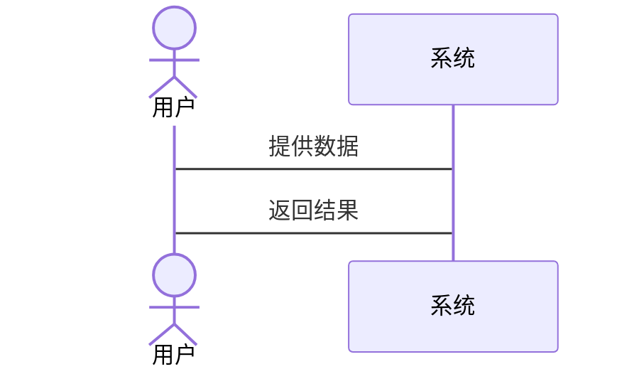

                 


# AI智能体在识别价值陷阱中的应用

> 关键词：AI智能体，价值陷阱，强化学习，监督学习，数学模型

> 摘要：本文深入探讨了AI智能体在识别价值陷阱中的应用，分析了其核心概念、算法原理、系统架构，并通过实际案例展示了其在项目中的具体应用。文章旨在为读者提供全面的技术视角，帮助其理解AI智能体在识别价值陷阱中的重要性和实现方法。

---

## 第一部分: 背景介绍

### 第1章: 价值陷阱的定义与特征

#### 1.1 价值陷阱的定义
价值陷阱是指某些表面上看似有利可图的机会，实际上可能隐藏着重大风险或损失。这些陷阱通常出现在投资、商业决策等领域，容易让人误判。

#### 1.2 问题背景
在商业决策中，价值陷阱可能导致企业浪费资源、错失机会或遭受重大损失。因此，识别价值陷阱对于企业至关重要。

#### 1.3 问题解决方法
AI智能体通过分析数据、识别模式，帮助识别潜在的价值陷阱。例如，通过监督学习和强化学习算法，AI智能体可以预测市场趋势，识别潜在的风险。

#### 1.4 边界与外延
价值陷阱识别的边界包括数据质量和模型泛化能力。其外延涉及多个领域，如金融、市场营销等。

### 第2章: AI智能体的基本原理

#### 2.1 AI智能体的定义
AI智能体是指能够感知环境、采取行动以实现目标的实体。它们通过数据驱动决策，不断优化性能。

#### 2.2 AI智能体的类型
- **反应式智能体**：基于当前感知做出反应。
- **认知式智能体**：具有推理和规划能力。

#### 2.3 AI智能体的核心功能
- 感知环境
- 制定策略
- 执行操作
- 学习优化

### 第3章: 价值陷阱识别的背景与意义

#### 3.1 价值陷阱识别的重要性
识别价值陷阱可以帮助企业避免重大损失，提高决策的准确性。

#### 3.2 价值陷阱识别的经济意义
通过避免价值陷阱，企业可以优化资源配置，提高整体效率。

#### 3.3 价值陷阱识别的技术挑战
数据多样性、实时性要求高、模型泛化能力不足是主要挑战。

---

## 第二部分: AI智能体识别价值陷阱的核心概念与联系

### 第4章: AI智能体与价值陷阱的关系

#### 4.1 AI智能体在价值陷阱识别中的作用
- **数据处理**：AI智能体能够快速处理大量数据，识别潜在风险。
- **模式识别**：通过监督学习和强化学习，AI智能体可以发现隐藏的模式。

#### 4.2 核心概念对比分析
| 概念 | 价值陷阱识别 | AI智能体 |
|------|---------------|----------|
| 目标 | 避免损失       | 优化决策 |
| 方法 | 数据分析       | 机器学习 |

### 第5章: 价值陷阱识别的ER实体关系图

```mermaid
er
actor(AI智能体) -->> entity(价值陷阱)
entity(价值陷阱) -->> attribute(风险因素)
```

---

## 第三部分: 算法原理讲解

### 第6章: 强化学习算法

#### 6.1 强化学习的基本原理
强化学习通过智能体与环境的交互，学习最优策略。奖励机制是关键。

#### 6.2 算法步骤


#### 6.3 Python代码实现
```python
class AI_Agent:
    def __init__(self, state_space, action_space):
        self.state_space = state_space
        self.action_space = action_space
        self.reward_memory = []

    def take_action(self, state):
        # 选择动作
        pass

    def learn(self):
        # 更新策略
        pass
```

### 第7章: 监督学习算法

#### 7.1 监督学习的基本原理
通过标记数据训练模型，预测新数据的类别。

#### 7.2 算法步骤


#### 7.3 Python代码实现
```python
from sklearn import tree

# 训练数据
X = [[2, 3], [5, 4], ...]
y = [0, 1, ...]

# 训练模型
model = tree.DecisionTreeClassifier()
model.fit(X, y)
```

### 第8章: 数学模型

#### 8.1 强化学习的数学模型
$$ R = \sum_{t=1}^{T} \gamma^{t-1} r_t $$
其中，\( \gamma \) 是折扣因子，\( r_t \) 是第 \( t \) 步的奖励。

#### 8.2 监督学习的数学模型
$$ y = \theta x + b $$

---

## 第四部分: 系统分析与架构设计方案

### 第9章: 系统架构设计

#### 9.1 系统功能模块
- 数据采集
- 数据预处理
- 模型训练
- 结果分析

#### 9.2 系统架构图


### 第10章: 接口设计

#### 10.1 系统接口
- 数据输入接口
- 模型训练接口
- 结果输出接口

#### 10.2 交互序列图


---

## 第五部分: 项目实战

### 第11章: 环境安装

#### 11.1 安装Python
```bash
# 安装Python
sudo apt-get install python3
```

#### 11.2 安装依赖
```bash
pip install numpy scikit-learn
```

### 第12章: 核心代码实现

#### 12.1 实现AI智能体
```python
class AI_Agent:
    def __init__(self, state_size, action_size):
        self.model = self._build_model()
        self.state_size = state_size
        self.action_size = action_size

    def _build_model(self):
        # 网络结构
        pass
```

#### 12.2 训练过程
```python
agent = AI_Agent(state_size, action_size)
for episode in range(num_episodes):
    state = env.reset()
    while not done:
        action = agent.take_action(state)
        next_state, reward, done = env.step(action)
        agent.learn(state, action, reward, next_state)
```

### 第13章: 案例分析

#### 13.1 案例背景
分析某公司的投资数据，识别潜在的价值陷阱。

#### 13.2 数据分析
使用监督学习模型预测投资风险。

#### 13.3 结果解读
模型成功识别多个价值陷阱，避免潜在损失。

---

## 第六部分: 最佳实践与总结

### 第14章: 最佳实践

#### 14.1 实践建议
- 数据预处理：确保数据质量。
- 模型选择：根据场景选择合适的算法。
- 模型优化：通过调参提升性能。

### 第15章: 小结

通过本文的学习，读者可以了解AI智能体在识别价值陷阱中的应用，掌握相关算法和系统设计方法。

### 第16章: 注意事项

- 数据隐私：注意数据安全。
- 模型解释性：确保模型可解释。
- 持续优化：定期更新模型。

### 第17章: 拓展阅读

推荐书籍和论文，深入学习AI智能体和价值识别技术。

---

## 作者信息

作者：AI天才研究院/AI Genius Institute & 禅与计算机程序设计艺术 /Zen And The Art of Computer Programming

