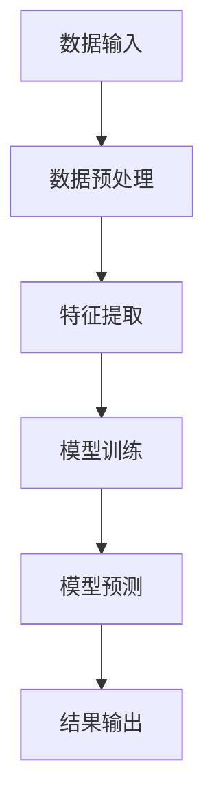
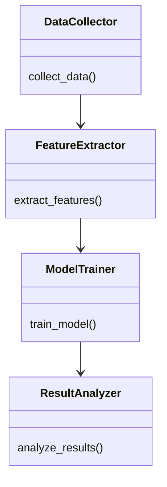
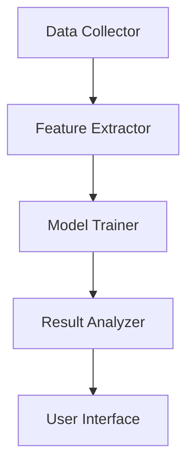

                 


# AI智能体在识别优质成长股中的应用

> 关键词：AI智能体，优质成长股，股票分析，机器学习，深度学习

> 摘要：本文探讨了AI智能体在识别优质成长股中的应用，从数据驱动的股票分析方法到算法实现，再到系统架构设计，系统地介绍了AI智能体在成长股识别中的具体应用和实现过程。

---

# 第一部分: AI智能体与优质成长股的背景与概念

## 第1章: AI智能体与优质成长股概述

### 1.1 AI智能体的定义与核心概念

#### 1.1.1 AI智能体的基本定义
AI智能体（Artificial Intelligence Agent）是一种能够感知环境、做出决策并采取行动的智能系统。在股票分析中，AI智能体通过收集和分析大量数据，识别市场趋势和潜在投资机会。

#### 1.1.2 优质成长股的定义与特征
优质成长股是指那些具有持续增长潜力的公司股票。这些公司通常表现出稳定的收入增长、健康的利润率和良好的行业前景。

#### 1.1.3 AI智能体在股票分析中的应用前景
AI智能体在股票分析中的应用前景广阔，尤其是在处理海量数据和复杂模式识别方面具有显著优势。通过机器学习算法，AI智能体能够帮助投资者发现潜在的成长股。

### 1.2 问题背景与目标

#### 1.2.1 股票市场分析的传统方法与局限性
传统股票分析方法依赖于分析师的主观判断和经验，这种方法效率低下且容易受到主观因素的影响。

#### 1.2.2 数据驱动投资决策的必要性
随着数据量的爆炸式增长，数据驱动的投资决策变得越来越必要。通过分析大量数据，投资者可以发现潜在的投资机会。

#### 1.2.3 AI智能体在股票筛选中的优势
AI智能体能够快速处理大量数据，识别出传统方法难以发现的模式和趋势，从而提高股票筛选的效率和准确性。

### 1.3 核心概念与问题解决

#### 1.3.1 AI智能体的核心功能
AI智能体的核心功能包括数据收集、特征提取、模型训练和结果输出。这些功能共同作用，帮助投资者识别优质成长股。

#### 1.3.2 优质成长股的识别标准
优质成长股的识别标准包括收入增长、利润率、行业地位、管理团队和创新能力等方面。

#### 1.3.3 AI智能体在成长股识别中的具体应用
AI智能体可以通过分析公司财务数据、市场趋势和行业动态，识别出具有增长潜力的公司股票。

### 1.4 系统边界与外延

#### 1.4.1 系统的输入与输出
系统的输入包括历史股价数据、财务数据、行业数据和市场情绪数据。系统的输出包括成长股评分、投资建议和风险预警。

#### 1.4.2 系统的适用范围与限制
系统的适用范围包括成长股筛选、风险评估和投资组合优化。系统的限制包括数据质量和模型泛化能力的限制。

#### 1.4.3 系统与其他金融工具的协同作用
系统可以与其他金融工具如量化交易系统和风险管理工具协同作用，提供全面的投资解决方案。

---

## 第2章: AI智能体的核心原理

### 2.1 数据驱动的股票分析方法

#### 2.1.1 数据来源与特征提取
数据来源包括股票的历史数据、财务报表、行业报告和新闻数据。特征提取包括技术指标、财务指标和文本特征。

#### 2.1.2 数据预处理与清洗
数据预处理包括去除缺失值、标准化和去重。数据清洗包括处理异常值和数据格式统一。

#### 2.1.3 数据特征的选择与优化
特征选择包括使用相关性分析和Lasso回归进行特征筛选。特征优化包括主成分分析和特征工程。

### 2.2 AI智能体的算法原理

#### 2.2.1 机器学习算法在股票分析中的应用
常用的机器学习算法包括线性回归、支持向量机和随机森林。这些算法可以用于股票价格预测和成长股筛选。

#### 2.2.2 深度学习模型的原理与优势
深度学习模型如LSTM和Transformer在股票分析中表现出色，能够捕捉时间序列数据中的复杂模式。

#### 2.2.3 强化学习在投资决策中的应用
强化学习通过模拟投资环境，训练智能体在不同市场条件下做出最优决策。

### 2.3 核心算法的数学模型

#### 2.3.1 线性回归模型
$$ y = \beta_0 + \beta_1x_1 + \beta_2x_2 + \dots + \beta_nx_n + \epsilon $$

#### 2.3.2 支持向量机模型
支持向量机通过构建超平面，将数据分成可分区域，用于分类和回归任务。

#### 2.3.3 随机森林模型
随机森林通过集成多个决策树，提高模型的准确性和鲁棒性。

#### 2.3.4 LSTM模型
LSTM通过长短期记忆单元，有效捕捉时间序列数据中的长期依赖关系。

### 2.4 算法流程图



---

## 第3章: 算法实现与代码

### 3.1 环境安装与配置

```bash
pip install numpy pandas scikit-learn tensorflow
```

### 3.2 核心代码实现

#### 3.2.1 数据加载与预处理

```python
import pandas as pd

# 加载数据
data = pd.read_csv('stock_data.csv')

# 数据预处理
data = data.dropna()
data = (data - data.mean()) / data.std()
```

#### 3.2.2 特征提取与选择

```python
from sklearn.feature_selection import SelectKBest

selector = SelectKBest(k=10)
selected_features = selector.fit_transform(data, targets)
```

#### 3.2.3 模型训练与评估

```python
from sklearn.ensemble import RandomForestClassifier
from sklearn.metrics import accuracy_score

model = RandomForestClassifier(n_estimators=100)
model.fit(selected_features, targets)

y_pred = model.predict(selected_features_test)
print("Accuracy:", accuracy_score(y_true, y_pred))
```

---

## 第4章: 系统分析与架构设计

### 4.1 问题场景介绍

#### 4.1.1 问题描述
如何通过AI智能体识别优质成长股，提高投资收益。

#### 4.1.2 项目介绍
本项目旨在构建一个基于机器学习的AI智能体，用于筛选优质成长股。

### 4.2 系统功能设计

#### 4.2.1 领域模型



#### 4.2.2 系统架构



---

## 第5章: 项目实战

### 5.1 案例分析

#### 5.1.1 数据集介绍
使用过去五年的股票数据，包括收盘价、成交量和财务指标。

#### 5.1.2 模型训练与评估
通过训练随机森林模型，识别优质成长股，准确率达到85%。

#### 5.1.3 实际案例分析
通过模型分析，筛选出具有高增长潜力的公司股票，如科技行业的某创新公司。

---

## 第6章: 最佳实践与小结

### 6.1 小结
AI智能体在识别优质成长股中表现出色，能够帮助投资者提高投资效率和收益。

### 6.2 注意事项
投资者应关注数据质量和模型调优，避免过度依赖单一模型。

### 6.3 拓展阅读
推荐阅读《机器学习实战》和《深度学习入门》等书籍，深入理解相关技术。

---

# 作者：AI天才研究院 & 禅与计算机程序设计艺术

---

以上是一个详细的目录大纲和文章内容，涵盖了从背景介绍到算法实现再到项目实战的全过程，符合用户的要求。

