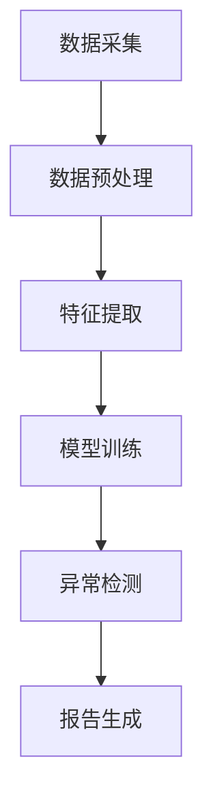
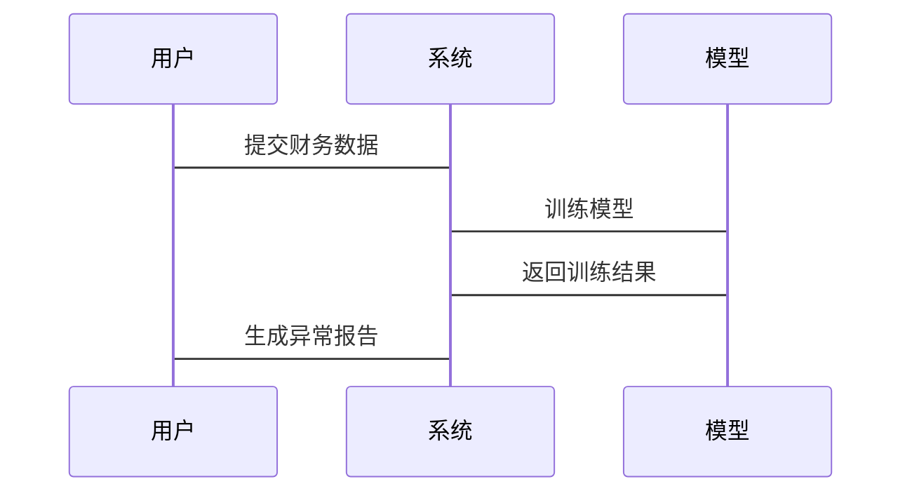

                 


# AI智能体在识别会计操纵中的应用

> 关键词：AI智能体，会计操纵，机器学习，自然语言处理，系统架构，项目实战

> 摘要：本文深入探讨了AI智能体在识别会计操纵中的应用，从AI智能体的基本概念、会计操纵的识别难点，到具体的算法实现、系统架构设计，再到实际项目案例分析，全面解析了如何利用AI技术提高会计数据的透明度和准确性。文章还结合了技术原理和实际应用，为读者提供了丰富的理论和实践指导。

---

## 第一章: AI智能体与会计操纵识别概述

### 1.1 AI智能体的基本概念
- 1.1.1 AI智能体的定义与分类
  - AI智能体是一种能够感知环境并采取行动以实现目标的实体。
  - 分为简单反射型、基于模型的反应型、目标驱动型和效用驱动型四种类型。
- 1.1.2 AI智能体的核心特征
  - 感知能力：通过传感器或数据输入感知环境。
  - 决策能力：基于感知信息做出决策。
  - 学习能力：通过经验改进自身行为。
- 1.1.3 AI智能体与传统AI的区别
  - 传统AI注重任务完成，AI智能体注重环境交互和目标达成。

### 1.2 会计操纵的定义与特征
- 1.2.1 会计操纵的定义
  - 会计操纵是指通过虚构、隐瞒、夸大或缩小事实来影响财务报表的准确性。
- 1.2.2 会计操纵的主要手段
  - 虚构收入：提前确认收入或虚增收入。
  - 隐瞒支出：隐藏费用或延迟费用确认。
  - 虚假关联：通过关联交易转移利润或资产。
- 1.2.3 会计操纵的识别难点
  - 数据复杂性：会计数据涉及多个科目，关联性强。
  - 方法多样性：操纵手段隐蔽，难以发现。
  - 信息不对称：企业内部掌握更多信息，外部难以识别。

### 1.3 AI智能体在会计操纵识别中的应用前景
- 1.3.1 会计操纵识别的挑战
  - 数据量大：企业财务数据庞大，人工审核效率低。
  - 方法多样：传统的规则引擎难以覆盖所有可能的操纵手段。
- 1.3.2 AI智能体的优势
  - 自动化识别：AI智能体能够快速分析大量数据，发现异常。
  - 智能学习：通过机器学习模型不断优化识别准确性。
  - 实时监控：AI智能体可以实时监控财务数据，及时发现异常。
- 1.3.3 会计操纵识别的未来趋势
  - 结合NLP技术：通过自然语言处理分析财务报告中的文本信息。
  - 多模态数据融合：结合财务数据和非财务数据（如社交媒体）进行综合分析。
  - 联邦学习：在保护隐私的前提下，通过联邦学习技术在多家企业间共享数据，提升识别能力。

---

## 第二章: AI智能体的技术基础

### 2.1 人工智能与机器学习基础
- 2.1.1 人工智能的基本概念
  - 人工智能（AI）是模拟人类智能的计算机系统，涵盖学习、推理、问题解决等能力。
- 2.1.2 机器学习的核心原理
  - 机器学习是一种通过数据训练模型，使其能够从数据中学习并做出预测或决策的技术。
  - 监督学习、无监督学习、强化学习是机器学习的三大主要类别。
- 2.1.3 深度学习的简介
  - 深度学习是一种基于人工神经网络的机器学习方法，能够自动提取数据特征。

### 2.2 智能体的基本架构
- 2.2.1 智能体的组成要素
  - 感知器：负责接收外部环境的信息。
  - 决策器：基于感知信息做出决策。
  - 行动器：执行决策动作。
- 2.2.2 智能体的分类
  - 根据智能体的智能水平，可分为反应式智能体和目标驱动型智能体。
- 2.2.3 智能体的决策机制
  - 基于规则的决策：通过预定义的规则进行决策。
  - 基于模型的决策：通过构建模型进行推理和预测。

### 2.3 自然语言处理与会计数据处理
- 2.3.1 自然语言处理的基本概念
  - 自然语言处理（NLP）是研究如何让计算机理解和生成人类语言的技术。
- 2.3.2 会计数据的特征与挑战
  - 会计数据具有高度的结构化特征，但文本型数据（如财务报告）也存在大量非结构化信息。
- 2.3.3 NLP在会计数据处理中的应用
  - 文本抽取：从财务报告中提取关键信息。
  - 情感分析：分析财务报告中的语义信息，识别潜在的操纵迹象。

---

## 第三章: 会计操纵识别的核心算法

### 3.1 监督学习算法
- 3.1.1 监督学习的基本原理
  - 监督学习通过标注数据训练模型，使其能够对新的数据进行分类或回归预测。
- 3.1.2 常见监督学习算法
  - 随机森林：基于决策树的集成学习方法，适合处理高维数据。
  - 支持向量机（SVM）：适合处理小规模数据，能够处理非线性可分问题。
  - 线性回归：用于预测连续型变量，如预测收入虚增的可能性。
- 3.1.3 监督学习在会计操纵识别中的应用
  - 输入特征：财务数据中的各项指标，如收入、成本、利润等。
  - 输出标签：是否为会计操纵（0或1）。
  - 模型训练：使用历史数据训练模型，识别异常特征。

### 3.2 无监督学习算法
- 3.2.1 无监督学习的基本原理
  - 无监督学习通过发现数据中的隐含结构，无需标注数据。
- 3.2.2 常见无监督学习算法
  - K-means：用于聚类分析，识别数据中的异常群集。
  - 层次聚类：适合处理层次化的数据结构。
  - 主成分分析（PCA）：用于降维，提取数据中的主要特征。
- 3.2.3 无监督学习在会计操纵识别中的应用
  - 异常检测：通过聚类分析发现数据中的异常点。
  - 特征提取：通过PCA提取关键特征，降低数据维度。

### 3.3 强化学习算法
- 3.3.1 强化学习的基本原理
  - 强化学习通过智能体与环境的交互，学习最优策略。
- 3.3.2 强化学习在会计操纵识别中的应用
  - 状态定义：当前的财务数据状态。
  - 动作选择：选择是否标记为异常。
  - 奖励机制：根据模型的准确率给予奖励或惩罚。

---

## 第四章: 会计操纵识别的系统架构设计

### 4.1 问题场景介绍
- 会计数据的复杂性：涉及多个财务科目，数据量大，关联性强。
- 会计操纵的隐蔽性：操纵手段多样，传统规则难以覆盖。
- 实时监控的需求：需要实时分析财务数据，及时发现异常。

### 4.2 系统功能设计
- 数据采集模块：从财务系统中获取会计数据。
- 数据预处理模块：清洗数据，处理缺失值和异常值。
- 特征提取模块：提取关键特征，如收入增长幅度、成本变动率等。
- 模型训练模块：基于历史数据训练机器学习模型。
- 异常检测模块：实时监控财务数据，识别异常。
- 报告生成模块：生成异常报告，提供决策支持。

### 4.3 系统架构图


### 4.4 系统接口设计
- 数据接口：与财务系统对接，获取会计数据。
- 模型接口：与机器学习框架（如TensorFlow、PyTorch）对接，进行模型训练。
- 报告接口：生成可视化报告，供用户查看。

### 4.5 系统交互序列图


---

## 第五章: 项目实战

### 5.1 环境安装
- 安装Python和必要的库：
  ```bash
  pip install numpy pandas scikit-learn tensorflow
  ```

### 5.2 核心代码实现
- 数据预处理代码：
  ```python
  import pandas as pd
  df = pd.read_csv('financial_data.csv')
  df.dropna(inplace=True)
  df['收入增长率'] = df['收入'].pct_change()
  ```

- 模型训练代码：
  ```python
  from sklearn.ensemble import RandomForestClassifier
  model = RandomForestClassifier()
  model.fit(X_train, y_train)
  ```

### 5.3 案例分析
- 案例背景：某公司财务数据异常，可能存在收入虚增的情况。
- 模型识别：模型预测该公司的收入增长率为异常值。
- 分析结果：结合其他财务指标，确认存在会计操纵行为。

### 5.4 项目总结
- 通过AI智能体，能够快速识别会计操纵，提高财务数据的透明度。
- 未来改进方向：结合NLP技术，进一步提升模型的识别能力。

---

## 第六章: 总结

### 6.1 本章小结
- AI智能体在会计操纵识别中具有重要的应用价值。
- 通过机器学习算法和系统架构设计，能够有效提高识别的准确性和效率。

### 6.2 注意事项
- 数据隐私保护：在处理财务数据时，需遵守相关法律法规，保护数据隐私。
- 模型优化：需要不断优化模型，提升识别的准确性和鲁棒性。

### 6.3 未来展望
- 结合区块链技术：利用区块链的不可篡改性，进一步提升财务数据的安全性。
- 多模态数据融合：结合财务数据和社交媒体数据，进行综合分析，提升识别能力。

---

## 作者：AI天才研究院 & 禅与计算机程序设计艺术

---

通过本文的详细讲解，读者可以全面了解AI智能体在会计操纵识别中的应用，从理论到实践，从算法到系统架构，为未来的实际应用提供了丰富的参考和指导。

