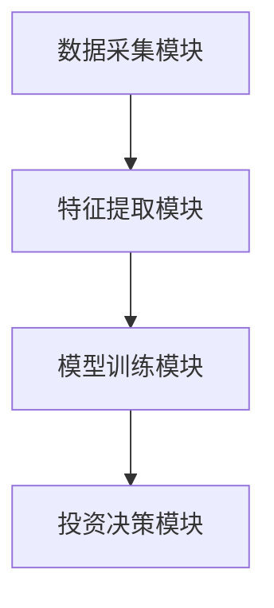

                 


---

# AI智能体在识别周期性行业投资机会中的应用

---

> **关键词**：AI智能体、周期性行业、投资机会、时间序列分析、强化学习、系统架构、金融投资  
> **摘要**：本文深入探讨了AI智能体在识别周期性行业投资机会中的应用，从周期性行业的特点、AI智能体的基本概念到具体算法原理、系统架构设计，再到项目实战和最佳实践，为读者提供了全面的理论与实践指导。通过结合时间序列分析、强化学习等技术，本文展示了如何利用AI智能体在周期性行业中发现投资机会，并通过实际案例分析验证了其有效性。

---

# 第一部分: AI智能体与周期性行业投资机会概述

## 第1章: 周期性行业的特点与投资机会

### 1.1 周期性行业的定义与特点

#### 1.1.1 周期性行业的定义

周期性行业是指其需求与经济周期密切相关的行业，这些行业的业绩表现往往随着经济波动而起伏。周期性行业的典型特征包括需求弹性高、供给弹性大、价格波动显著等。例如，钢铁、能源、汽车制造等行业都属于周期性行业。

#### 1.1.2 周期性行业的波动规律

周期性行业的波动通常遵循一定的周期性模式，包括繁荣期、衰退期、底部期和复苏期。这些波动规律可以通过历史数据分析和统计建模来识别，为投资机会的挖掘提供依据。

#### 1.1.3 周期性行业的主要类型

周期性行业可以分为强周期性和弱周期性行业。强周期性行业（如能源、材料）的需求受经济波动影响较大，而弱周期性行业（如消费必需品、公用事业）的需求相对稳定。本文主要关注强周期性行业在投资机会识别中的应用。

---

### 1.2 投资机会的识别与挑战

#### 1.2.1 投资机会的定义与分类

投资机会是指在特定市场环境下，某种资产或行业的价格波动中能够带来超额收益的可能性。周期性行业的投资机会通常集中在行业周期的底部向上阶段。

#### 1.2.2 周期性行业投资的挑战与风险

周期性行业的投资风险较高，主要体现在市场波动剧烈、行业周期性变化不可预测、政策环境变化等。此外，传统的人工分析方法难以捕捉复杂市场环境下的投资机会。

#### 1.2.3 AI技术在投资机会识别中的作用

AI技术通过大数据分析、模式识别和预测模型，能够帮助投资者更准确地识别周期性行业的投资机会，优化投资决策。

---

## 第2章: AI智能体的基本概念与应用

### 2.1 AI智能体的定义与特点

#### 2.1.1 AI智能体的定义

AI智能体（Artificial Intelligence Agent）是指在环境中能够感知并自主行动以实现目标的智能实体。它具备自主性、反应性、目标导向性和社会性等核心特点。

#### 2.1.2 AI智能体的核心特点

- **自主性**：能够在没有外部干预的情况下自主运行。
- **反应性**：能够实时感知环境并做出反应。
- **目标导向性**：基于目标进行决策和行动。
- **社会性**：能够与其他智能体或人类进行交互。

#### 2.1.3 AI智能体与传统算法的区别

AI智能体不仅仅是一种算法，它是一个具备感知和行动能力的实体，能够根据环境反馈动态调整策略。

---

### 2.2 AI智能体在金融领域的应用

#### 2.2.1 金融领域的AI智能体应用现状

AI智能体已经在金融领域得到了广泛应用，包括股票交易、风险评估、投资组合优化等。

#### 2.2.2 AI智能体在投资决策中的作用

AI智能体能够通过大数据分析和预测模型，帮助投资者识别投资机会、优化投资组合并实时调整投资策略。

#### 2.2.3 AI智能体与周期性行业投资的结合

通过分析周期性行业的历史数据和市场动态，AI智能体能够帮助投资者识别行业周期性变化中的投资机会。

---

## 第3章: AI智能体在周期性行业投资中的应用前景

### 3.1 周期性行业投资机会的识别需求

#### 3.1.1 投资机会识别的需求分析

周期性行业的投资机会识别需要结合历史数据分析、市场动态监测和未来趋势预测。

#### 3.1.2 AI技术在投资机会识别中的优势

AI技术具备高效的数据处理能力、强大的模式识别能力和精准的预测能力，能够显著提高投资机会识别的效率和准确性。

#### 3.1.3 周期性行业投资机会识别的边界与外延

周期性行业投资机会识别的边界包括市场数据的可获得性、模型的预测精度以及政策环境的变化等。

---

### 3.2 AI智能体在周期性行业投资中的核心要素

#### 3.2.1 数据采集与处理

周期性行业的数据采集需要涵盖市场数据、行业数据、宏观经济数据等多个维度。

#### 3.2.2 模型构建与优化

通过构建时间序列分析模型和强化学习模型，优化AI智能体的投资决策能力。

#### 3.2.3 投资决策与执行

AI智能体通过分析数据和模型预测，生成投资决策并执行交易。

---

# 第二部分: AI智能体的核心概念与原理

## 第4章: AI智能体的核心概念与原理

### 4.1 AI智能体的核心概念

#### 4.1.1 智能体的基本结构

AI智能体通常由感知模块、决策模块和行动模块组成。感知模块负责收集环境信息，决策模块基于信息制定策略，行动模块执行决策。

#### 4.1.2 智能体的行为机制

智能体的行为机制包括感知、决策、行动和反馈四个阶段，形成一个闭环系统。

#### 4.1.3 智能体的决策模型

智能体的决策模型基于历史数据和实时数据，结合预测模型生成最优决策。

---

### 4.2 AI智能体与周期性行业投资的结合

#### 4.2.1 智能体在投资决策中的角色

AI智能体作为投资决策的辅助工具，能够帮助投资者识别周期性行业的投资机会。

#### 4.2.2 智能体在周期性行业分析中的应用

通过分析周期性行业的历史数据和市场动态，智能体能够预测行业趋势并识别投资机会。

#### 4.2.3 智能体与投资机会识别的关联

智能体通过实时数据分析和预测模型，能够动态调整投资策略，捕捉周期性行业中的投资机会。

---

## 第5章: 周期性行业投资机会识别的核心算法

### 5.1 时间序列分析算法

#### 5.1.1 时间序列分析的基本原理

时间序列分析是一种通过分析历史数据来预测未来趋势的方法。其核心假设是未来趋势与历史数据密切相关。

#### 5.1.2 常用的时间序列分析方法

- **ARIMA模型**：自回归积分滑动平均模型，适用于线性时间序列数据。
- **GARCH模型**：广义自回归条件异方差模型，适用于金融时间序列数据。
- **LSTM模型**：长短期记忆网络，适用于复杂非线性时间序列数据。

#### 5.1.3 时间序列分析在周期性行业中的应用

通过时间序列分析，可以预测周期性行业的价格波动和市场趋势，为投资决策提供依据。

---

### 5.2 强化学习算法

#### 5.2.1 强化学习的基本原理

强化学习是一种通过试错学习来优化决策的算法。智能体通过与环境交互，逐步学习最优策略。

#### 5.2.2 强化学习在投资决策中的应用

通过强化学习，智能体能够根据市场反馈动态调整投资策略，优化投资组合。

#### 5.2.3 强化学习在周期性行业中的应用

强化学习可以应用于周期性行业的投资机会识别，帮助智能体在复杂市场环境中做出最优决策。

---

## 第6章: AI智能体在周期性行业投资中的算法实现

### 6.1 时间序列分析的算法实现

#### 6.1.1 LSTM模型的实现

```python
import keras
from keras.layers import LSTM, Dense
from keras.models import Sequential

# 定义LSTM模型
model = Sequential()
model.add(LSTM(units=50, input_shape=(timesteps, features)))
model.add(Dense(1))
model.compile(loss='mean_squared_error', optimizer='adam')
```

#### 6.1.2 LSTM模型的训练

通过历史数据训练LSTM模型，提取周期性行业的价格波动特征。

#### 6.1.3 LSTM模型的预测

利用训练好的LSTM模型，预测周期性行业的未来价格走势。

---

### 6.2 强化学习的算法实现

#### 6.2.1 强化学习环境的定义

定义周期性行业的市场环境，包括价格、交易量等状态变量。

#### 6.2.2 强化学习策略的实现

通过Q-learning算法或策略梯度算法，优化投资策略。

#### 6.2.3 强化学习的训练与测试

通过模拟市场环境，训练智能体的投资策略，并进行实际测试。

---

## 第7章: 系统架构设计与实现

### 7.1 系统架构设计

#### 7.1.1 系统功能模块设计

周期性行业投资机会识别系统包括数据采集模块、特征提取模块、模型训练模块和投资决策模块。

#### 7.1.2 系统架构设计



#### 7.1.3 系统接口设计

定义系统各模块之间的接口，确保数据流和控制流的顺畅。

---

### 7.2 系统实现

#### 7.2.1 数据采集模块

通过API接口采集周期性行业的市场数据。

#### 7.2.2 特征提取模块

对采集到的数据进行特征提取，生成可用于模型训练的特征向量。

#### 7.2.3 模型训练模块

通过训练时间序列分析模型和强化学习模型，生成投资决策策略。

#### 7.2.4 投资决策模块

根据模型预测结果，生成投资决策并执行交易。

---

## 第8章: 项目实战与案例分析

### 8.1 项目实战

#### 8.1.1 环境安装与配置

安装必要的开发工具和库，包括Python、TensorFlow、Keras等。

#### 8.1.2 核心代码实现

实现周期性行业投资机会识别系统的核心功能模块。

#### 8.1.3 系统测试与优化

通过实际数据测试系统性能，并进行优化调整。

---

### 8.2 案例分析

#### 8.2.1 案例背景

选择一个典型的周期性行业（如能源行业）进行投资机会识别。

#### 8.2.2 数据分析与建模

通过历史数据分析和模型训练，识别投资机会。

#### 8.2.3 投资决策与结果分析

根据模型预测结果，做出投资决策并分析实际收益。

---

## 第9章: 最佳实践与小结

### 9.1 最佳实践

#### 9.1.1 数据质量的重要性

确保数据的完整性和准确性，是模型预测的关键。

#### 9.1.2 模型优化的技巧

通过交叉验证和超参数调优，提高模型的预测精度。

#### 9.1.3 系统架构的优化

通过模块化设计和并行计算，提高系统的运行效率。

---

### 9.2 小结

本文详细介绍了AI智能体在识别周期性行业投资机会中的应用，从理论基础到算法实现，再到系统设计和项目实战，为读者提供了全面的指导。

---

### 9.3 注意事项

在实际应用中，需要注意市场环境的复杂性和模型的局限性，避免过度依赖模型预测。

---

### 9.4 拓展阅读

建议读者进一步阅读相关领域的最新研究成果，如强化学习在金融领域的应用、时间序列分析的高级方法等。

---

**作者：AI天才研究院/AI Genius Institute & 禅与计算机程序设计艺术 /Zen And The Art of Computer Programming**

---

这篇文章涵盖了AI智能体在识别周期性行业投资机会中的核心概念、算法实现和系统设计，同时结合了实际案例分析和最佳实践，为读者提供了全面的理论与实践指导。

