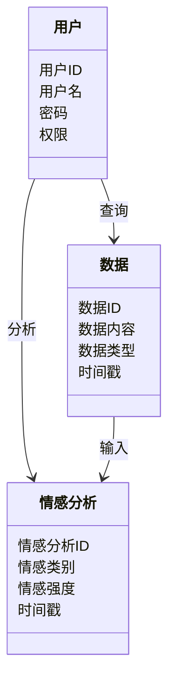
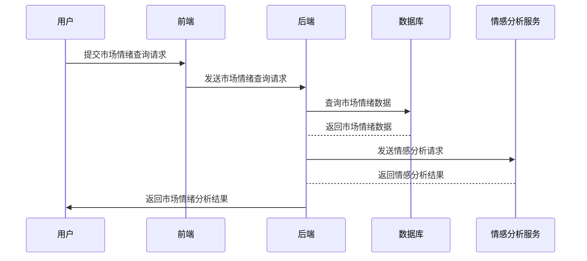

                 

<think>
好，我现在需要帮用户撰写一篇关于《AI智能体在识别市场情绪极端值中的作用》的技术博客文章。首先，我得理解用户的需求，他们希望文章结构清晰，内容详实，涵盖背景、核心概念、算法、系统架构、项目实战和总结等部分。

首先，我会从背景介绍开始，解释为什么市场情绪识别重要，以及AI智能体在其中的作用。然后，我需要详细讲解核心概念，包括市场情绪的定义、AI智能体的原理，以及它们如何联系起来。接下来是算法部分，我会介绍常用的情感分析算法，如BERT和LSTM，并用mermaid图展示流程。系统架构设计部分，我会描述如何构建一个实时监测系统，包括数据采集和分析模块。项目实战部分，我需要提供Python代码，展示如何实现市场情绪分析。最后，总结当前成果，并展望未来的发展。

在写作过程中，我需要确保每个部分都详细具体，使用专业术语，同时保持语言的易懂性。数学公式要用latex格式，算法流程图和系统架构图用mermaid展示，帮助读者更好地理解。此外，我还需要添加小结、注意事项和最佳实践，以增强文章的实用性。

现在，我开始按照大纲一步步撰写内容，确保每个章节都有足够的细节和支持材料，帮助读者全面理解AI智能体在市场情绪识别中的应用。
</think>

# AI智能体在识别市场情绪极端值中的作用

## 关键词：AI智能体, 市场情绪, 极端值识别, 情感分析, 机器学习, 自然语言处理

## 摘要：  
本文探讨AI智能体在识别市场情绪极端值中的应用，从背景、核心概念、算法原理到系统架构设计，再到项目实战，全面分析AI智能体在金融市场的优势与挑战。通过案例分析和数学模型，展示AI如何提升市场情绪识别的效率和准确性，为投资者和金融机构提供新的视角和工具。

---

# 第1章: 市场情绪识别的背景与意义

## 1.1 什么是市场情绪

### 1.1.1 市场情绪的定义与特点

市场情绪指的是金融市场参与者（如投资者、交易员、分析师等）对市场走势的总体看法和情绪状态。它反映了市场参与者对当前市场状况的心理预期，通常分为乐观、中性和悲观三种状态。市场情绪的极端值指的是市场情绪从极度乐观到极度悲观的极端状态，通常与市场的剧烈波动和危机事件相关。

- **定义**：市场情绪是金融市场中个体和群体行为的集合，反映了市场参与者的心理预期和行为倾向。
- **特点**：
  - 时间依赖性：市场情绪随时间变化而波动。
  - 不确定性：市场情绪受多种因素影响，具有不确定性。
  - 影响性：市场情绪会影响资产价格波动和市场走势。

### 1.1.2 市场情绪在金融中的重要性

市场情绪是金融分析中的关键因素，能够帮助投资者和机构预测市场趋势、规避风险和抓住机会。

- **重要性**：
  - 帮助预测市场波动：极端市场情绪通常预示着市场的剧烈波动。
  - 识别投资机会：市场情绪低谷可能是买入机会，而市场情绪高涨可能是卖出信号。
  - 支持风险管理：通过监控市场情绪，机构可以及时调整投资策略，规避潜在风险。

### 1.1.3 市场情绪极端值的定义与特征

市场情绪极端值指的是市场情绪从正常状态向极度乐观或极度悲观的极端状态的转变。

- **定义**：市场情绪极端值是市场情绪偏离正常范围的极端状态，通常与市场泡沫或危机相关。
- **特征**：
  - 市场情绪急剧变化：市场情绪在短时间内快速上升或下降。
  - 市场参与度极高：投资者行为趋于一致，市场交易量剧增或骤减。
  - 市场波动性显著增加：资产价格出现剧烈波动，可能引发市场崩盘或暴涨。

## 1.2 AI智能体在市场情绪识别中的作用

### 1.2.1 AI智能体的基本概念

AI智能体是一种能够感知环境、做出决策并采取行动的智能系统。在金融市场中，AI智能体通常用于数据处理、预测分析和自动化交易。

- **定义**：AI智能体是一种具备感知、决策和行动能力的智能系统，能够适应环境变化并执行复杂任务。
- **特点**：
  - 自主性：AI智能体能够自主决策，无需人工干预。
  - 反应性：能够实时感知环境变化并做出反应。
  - 学习能力：能够通过数据学习和优化模型。

### 1.2.2 AI智能体在金融领域的应用

AI智能体在金融市场中应用广泛，包括股票交易、风险管理、市场分析等领域。

- **应用领域**：
  - 自动化交易：AI智能体可以根据市场数据和情绪分析结果自动执行交易。
  - 风险管理：通过分析市场情绪和资产价格波动，AI智能体可以帮助机构识别和管理风险。
  - 市场分析：AI智能体可以实时监控市场情绪，提供市场趋势和潜在风险的预警。

### 1.2.3 市场情绪识别中的AI智能体优势

AI智能体在市场情绪识别中具有显著优势，能够提高分析效率和准确性。

- **优势**：
  - 高效性：AI智能体能够快速处理大量数据，提供实时市场情绪分析。
  - 准确性：通过机器学习算法，AI智能体能够识别复杂的市场情绪模式。
  - 自适应性：AI智能体能够根据市场变化动态调整分析模型，提高预测准确性。

## 1.3 本章小结

本章介绍了市场情绪的定义、特点及其在金融中的重要性，同时探讨了AI智能体在市场情绪识别中的作用和优势。市场情绪的极端值识别对于投资者和机构具有重要意义，而AI智能体通过高效、准确的分析能力，为市场情绪识别提供了新的解决方案。

---

# 第2章: 市场情绪识别的核心概念与联系

## 2.1 市场情绪识别的核心要素

### 2.1.1 数据来源与处理

市场情绪识别需要多种数据来源，包括新闻、社交媒体、交易数据等。

- **数据来源**：
  - 新闻媒体：包括新闻标题、正文和评论。
  - 社交媒体：包括社交媒体帖子、评论和用户互动数据。
  - 交易数据：包括股票价格、成交量和订单数据。
- **数据处理**：
  - 数据清洗：去除噪声数据，处理缺失值。
  - 数据转换：将文本数据转化为可计算的向量表示。

### 2.1.2 情感分析与文本挖掘

情感分析是市场情绪识别的核心技术，用于判断文本中的情感倾向。

- **情感分析**：
  - 文本分类：将文本分为积极、消极和中性三类。
  - 情感强度分析：量化文本中的情感强度。
- **文本挖掘**：
  - 实体识别：识别文本中的关键词和实体。
  - 主题分析：提取文本中的主要主题和话题。

### 2.1.3 统计与机器学习模型

统计和机器学习模型是市场情绪识别的重要工具。

- **统计模型**：
  - 基于回归分析：预测市场情绪的变化趋势。
  - 基于时间序列分析：分析市场情绪的周期性变化。
- **机器学习模型**：
  - 支持向量机（SVM）：用于情感分类。
  - 神经网络：用于复杂的情感模式识别。

## 2.2 AI智能体与市场情绪识别的关系

### 2.2.1 AI智能体在情绪识别中的角色

AI智能体在市场情绪识别中扮演多重角色，包括数据采集、分析和决策。

- **数据采集**：AI智能体可以实时采集市场相关的数据，包括新闻、社交媒体和交易数据。
- **数据分析**：AI智能体利用机器学习算法对数据进行分析，识别市场情绪。
- **决策支持**：AI智能体根据市场情绪分析结果，为投资者提供决策支持。

### 2.2.2 情绪识别与市场行为的关联

市场情绪与市场行为密切相关，极端市场情绪往往会导致市场行为的剧烈变化。

- **关联性**：
  - 市场情绪高涨可能导致资产价格泡沫。
  - 市场情绪低落可能导致市场恐慌和抛售。
  - 极端市场情绪往往伴随着市场的剧烈波动和危机事件。

### 2.2.3 系统架构与数据流

市场情绪识别系统通常包括数据采集、处理、分析和可视化模块。

- **系统架构**：
  - 数据采集模块：负责采集市场相关数据。
  - 数据处理模块：对数据进行清洗和转换。
  - 数据分析模块：利用机器学习算法进行市场情绪识别。
  - 数据可视化模块：将分析结果以可视化形式呈现。

## 2.3 核心概念对比与ER实体关系图

### 2.3.1 核心概念对比分析

市场情绪识别涉及多个核心概念，包括数据来源、情感分析和机器学习模型。

- **对比分析**：
  - 数据来源：文本数据、交易数据。
  - 情感分析：情感分类、情感强度分析。
  - 机器学习模型：SVM、神经网络。

### 2.3.2 ER实体关系图展示

以下是市场情绪识别系统的ER实体关系图：

```mermaid
er
    entity 市场情绪 {
        id
        情绪强度
        时间戳
    }
    entity 文本数据 {
        id
        文本内容
        时间戳
    }
    entity 情感分析模型 {
        id
        模型类型
        参数
    }
    市场情绪 --> 情感分析模型: 使用
    文本数据 --> 情感分析模型: 输入
```

## 2.4 本章小结

本章详细探讨了市场情绪识别的核心要素，包括数据来源、情感分析和机器学习模型，并分析了AI智能体在市场情绪识别中的角色和作用。通过对比分析和ER实体关系图，进一步明确了市场情绪识别系统的核心概念和数据流。

---

# 第3章: 市场情绪识别的算法原理

## 3.1 情感分析算法概述

### 3.1.1 基于规则的情感分析

基于规则的情感分析通过预定义的规则和词典进行情感分类。

- **规则定义**：
  - 积极词汇：表示积极情绪的词汇。
  - 消极词汇：表示消极情绪的词汇。
  - 中性词汇：表示中性情绪的词汇。
- **实现步骤**：
  - 将文本分解为词语。
  - 根据词语的词性进行分类。
  - 统计积极词汇和消极词汇的数量，确定情感倾向。

### 3.1.2 统计学习方法

统计学习方法通过统计特征进行情感分类。

- **特征提取**：
  - 词语频率（TF）：词语在文本中的出现频率。
  - 逆文档频率（IDF）：词语在语料库中的逆文档频率。
  - TF-IDF：综合考虑词语的频率和重要性。
- **分类算法**：
  - 支持向量机（SVM）：用于二分类问题。
  - 朴素贝叶斯（NB）：基于概率的分类算法。

### 3.1.3 深度学习模型

深度学习模型通过神经网络进行情感分类。

- **模型选择**：
  - 循序长短时记忆网络（LSTM）：适合处理序列数据。
  - Transformer模型：适合处理长文本。
  - BERT：预训练语言模型，适合情感分析任务。
- **实现步骤**：
  - 文本预处理：分词、去除停用词。
  - 文本向量化：将文本转换为向量表示。
  - 模型训练：使用训练数据训练情感分类模型。

## 3.2 基于深度学习的市场情绪识别

### 3.2.1 Transformer模型简介

Transformer模型是一种基于注意力机制的深度学习模型，广泛应用于自然语言处理任务。

- **模型结构**：
  - 编码器：负责将输入序列编码为向量表示。
  - 解码器：负责将编码后的向量解码为输出序列。
  - 注意力机制：用于捕捉序列中的长距离依赖关系。

### 3.2.2 BERT在情感分析中的应用

BERT（Bidirectional Encoder Representations from Transformers）是一种预训练语言模型，广泛应用于情感分析任务。

- **预训练目标**：
  - 掩码语言模型：随机遮蔽部分词语，预测被遮蔽词语的词性。
  - 下文句预测：预测句子的关系。
- **微调任务**：
  - 情感分类：在预训练的基础上，针对具体任务进行微调。

### 3.2.3 LSTM网络的优化

LSTM（Long Short Term Memory）是一种循环神经网络，适合处理序列数据。

- **网络结构**：
  - 遗忘门：控制信息的遗忘。
  - 输入门：控制信息的输入。
  - 输出门：控制信息的输出。
- **优化方法**：
  - 使用Adam优化器：优化模型参数。
  - 调整学习率：防止模型过拟合。

## 3.3 算法流程与实现

### 3.3.1 文本预处理流程

文本预处理是情感分析的重要步骤，包括分词、去除停用词和文本清洗。

- **分词**：
  - 使用分词工具（如jieba）将文本分解为词语。
  - 处理标点符号和特殊字符。
- **去除停用词**：
  - 删除无意义的词语，如“的”、“了”等。
  - 保留有意义的词语，如名词、动词和形容词。
- **文本清洗**：
  - 去除重复字符。
  - 处理敏感词汇。

### 3.3.2 特征提取与向量化

特征提取与向量化是情感分析的关键步骤，包括文本向量化和词嵌入。

- **文本向量化**：
  - 使用TF-IDF方法：计算词语的权重。
  - 使用词袋模型：将文本表示为词语的向量。
- **词嵌入**：
  - 使用Word2Vec训练词嵌入。
  - 使用GloVe预训练词嵌入。

### 3.3.3 分类器训练与优化

分类器训练与优化是情感分析的核心步骤，包括模型训练和模型优化。

- **模型训练**：
  - 使用训练数据训练情感分类模型。
  - 选择合适的优化器和损失函数。
  - 调整模型超参数，如学习率和批次大小。
- **模型优化**：
  - 使用交叉验证：防止过拟合。
  - 使用早停法：监控验证集损失，防止过拟合。
  - 调整模型结构，如增加或减少层数。

## 3.4 算法实现的数学模型

### 3.4.1 BERT模型的数学基础

BERT模型基于Transformer架构，使用自注意力机制进行文本表示。

- **自注意力机制**：
  - 计算每个位置的查询、键和值向量。
  - 使用 softmax 函数计算注意力权重。
  - 加权求和得到每个位置的注意力输出。
- **多层Transformer**：
  - 多个Transformer层堆叠，进一步提取特征。
  - 每层包括自注意力机制和前馈神经网络。

### 3.4.2 LSTM网络的数学公式

LSTM网络通过遗忘门、输入门和输出门控制信息流动。

- **遗忘门**：
  - 计算遗忘门的输出：$f_t = \sigma(W_f x_t + U_f h_{t-1} + b_f)$
  - $f_t$表示遗忘门的输出，$\sigma$表示sigmoid函数。
- **输入门**：
  - 计算输入门的输出：$i_t = \sigma(W_i x_t + U_i h_{t-1} + b_i)$
  - $i_t$表示输入门的输出。
- **输出门**：
  - 计算输出门的输出：$o_t = \sigma(W_o x_t + U_o h_{t-1} + b_o)$
  - $o_t$表示输出门的输出。
- **细胞状态**：
  - 计算细胞状态的更新：$c_t = f_t c_{t-1} + i_t \tanh(W_c x_t + U_c h_{t-1} + b_c)$
  - $c_t$表示细胞状态的更新。
- **隐藏状态**：
  - 计算隐藏状态的更新：$h_t = o_t \tanh(c_t)$
  - $h_t$表示隐藏状态的输出。

### 3.4.3 情感分类的损失函数

情感分类任务通常使用交叉熵损失函数。

- **交叉熵损失函数**：
  - $L = -\sum_{i=1}^{n} y_i \log(p_i) + (1 - y_i) \log(1 - p_i)$
  - $y_i$表示真实标签，$p_i$表示预测概率。

## 3.5 本章小结

本章详细介绍了市场情绪识别的算法原理，包括基于规则的情感分析、统计学习方法和深度学习模型。通过对比分析和数学公式，深入探讨了BERT和LSTM模型的实现细节和优化方法。

---

# 第4章: 市场情绪识别系统的架构设计

## 4.1 系统整体架构

### 4.1.1 分层架构设计

分层架构将系统划分为数据采集层、数据处理层、数据分析层和数据展示层。

- **数据采集层**：
  - 负责采集市场相关数据，包括新闻、社交媒体和交易数据。
  - 数据来源多样，包括API接口、网页抓取和数据库。
- **数据处理层**：
  - 对采集的数据进行清洗、转换和存储。
  - 使用数据预处理工具（如Pandas）进行数据处理。
- **数据分析层**：
  - 使用机器学习算法进行市场情绪识别。
  - 使用可视化工具（如Matplotlib）进行数据可视化。
- **数据展示层**：
  - 将分析结果以可视化形式展示，如仪表盘和图表。
  - 提供实时监控和历史数据查询功能。

### 4.1.2 微服务架构的优势

微服务架构通过模块化设计提高系统的可扩展性和可维护性。

- **模块化设计**：
  - 数据采集模块：负责数据的采集和存储。
  - 数据处理模块：负责数据的清洗和转换。
  - 数据分析模块：负责市场情绪识别和预测。
  - 数据展示模块：负责结果的可视化和展示。
- **优势**：
  - 可扩展性：每个模块可以根据需求进行扩展。
  - 可维护性：每个模块独立开发和维护，降低耦合性。
  - 灵活性：可以根据需求快速调整模块功能。

### 4.1.3 系统可扩展性

系统架构设计需要考虑可扩展性，以便应对数据量的增加和功能的扩展。

- **数据采集扩展**：
  - 支持多种数据源，如新闻API、社交媒体API和交易数据API。
  - 支持数据增量采集，减少数据冗余。
- **数据分析扩展**：
  - 支持多种算法，如传统机器学习算法和深度学习算法。
  - 支持模型的动态部署和更新，提高系统的适应性。

## 4.2 系统功能设计

### 4.2.1 领域模型设计

领域模型设计是系统功能设计的重要部分，包括实体和关系的定义。

- **实体定义**：
  - 用户：系统用户，包括投资者和机构用户。
  - 数据：市场相关数据，包括新闻、社交媒体和交易数据。
  - 情感分析：市场情绪分析结果，包括情感类别和情感强度。
- **关系定义**：
  - 用户与数据的关系：用户可以查询和分析数据。
  - 数据与情感分析的关系：数据输入情感分析模型，输出情感分析结果。

### 4.2.2 领域模型Mermaid类图

以下是市场情绪识别系统的领域模型类图：



### 4.2.3 系统架构设计

系统架构设计需要考虑系统的可用性、可靠性和安全性。

- **可用性**：
  - 使用负载均衡技术，确保系统的高可用性。
  - 使用容错设计，防止单点故障。
- **可靠性**：
  - 使用数据备份和恢复技术，防止数据丢失。
  - 使用日志记录和监控工具，及时发现和解决问题。
- **安全性**：
  - 使用身份认证和权限管理，防止未授权访问。
  - 使用加密技术，保护数据传输和存储安全。

### 4.2.4 系统架构Mermaid架构图

以下是市场情绪识别系统的系统架构图：


## 4.3 系统接口设计

### 4.3.1 API接口设计

API接口设计是系统与其他系统交互的重要部分，包括数据接口和分析接口。

- **数据接口**：
  - 数据采集接口：用于采集市场相关数据。
  - 数据存储接口：用于存储和检索数据。
- **分析接口**：
  - 情感分析接口：用于进行市场情绪识别。
  - 预测接口：用于市场情绪预测和预警。

### 4.3.2 API接口文档

以下是市场情绪识别系统的API接口文档：

- **数据接口**：
  - `GET /data/stock_prices`：获取股票价格数据。
  - `POST /data/social_media`：提交社交媒体数据。
- **分析接口**：
  - `POST /analyze/sentiment`：进行市场情绪识别。
  - `GET /analyze/predictions`：获取市场情绪预测结果。

## 4.4 系统交互设计

### 4.4.1 系统交互流程

系统交互流程包括用户请求、数据处理和结果返回。

- **用户请求**：
  - 用户通过前端界面提交请求，如查询市场情绪。
- **数据处理**：
  - 后端接收请求，进行数据处理和情感分析。
- **结果返回**：
  - 后端将分析结果返回给用户，如显示市场情绪图表。

### 4.4.2 系统交互Mermaid序列图

以下是市场情绪识别系统的系统交互序列图：



## 4.5 本章小结

本章详细探讨了市场情绪识别系统的架构设计，包括分层架构、微服务架构和系统交互设计。通过领域模型类图和系统架构图，进一步明确了系统的模块划分和数据流。

---

# 第5章: 市场情绪识别系统的项目实战

## 5.1 项目背景介绍

### 5.1.1 项目目标

市场情绪识别系统的项目目标是实现对市场情绪的实时监控和预警。

- **目标**：
  - 实时采集市场相关数据。
  - 使用AI智能体进行市场情绪识别。
  - 提供市场情绪分析结果和预警信息。

### 5.1.2 项目需求

项目需求包括数据采集、数据处理、市场情绪识别和结果展示。

- **需求**：
  - 数据采集：采集新闻、社交媒体和交易数据。
  - 数据处理：清洗、转换和存储数据。
  - 市场情绪识别：使用AI智能体进行市场情绪识别。
  - 结果展示：以可视化形式展示分析结果。

## 5.2 系统核心实现

### 5.2.1 数据采集实现

数据采集实现包括新闻数据采集和社交媒体数据采集。

- **新闻数据采集**：
  - 使用新闻API接口（如Alpha Vantage）获取股票新闻。
  - 使用网络爬虫（如BeautifulSoup）抓取新闻网站内容。
- **社交媒体数据采集**：
  - 使用社交媒体API接口（如Twitter API）获取社交媒体数据。
  - 使用网络爬虫（如微博爬虫）抓取社交媒体内容。

### 5.2.2 情感分析实现

情感分析实现包括文本预处理和模型训练。

- **文本预处理**：
  - 使用jieba进行中文分词。
  - 去除停用词和标点符号。
  - 转换为词向量表示（如TF-IDF或Word2Vec）。
- **模型训练**：
  - 使用预训练情感分类模型（如BERT）进行微调。
  - 使用训练数据训练情感分类模型。

### 5.2.3 可视化展示

可视化展示包括市场情绪图表和市场情绪预警。

- **市场情绪图表**：
  - 使用Matplotlib绘制市场情绪变化趋势图。
  - 使用Seaborn绘制情感分布图。
- **市场情绪预警**：
  - 设置市场情绪预警阈值，当市场情绪超过阈值时触发预警。
  - 使用Flask或Django构建预警系统。

## 5.3 项目实战代码实现

### 5.3.1 数据采集代码

以下是数据采集的Python代码示例：

```python
import requests
from bs4 import BeautifulSoup
import json

# 新闻数据采集
def fetch_news(ticker):
    url = f"https://www.alphavantage.co/query?function=NEWS&symbol={ticker}&limit=10&apikey=your_api_key"
    response = requests.get(url)
    data = json.loads(response.text)
    return data

# 社交媒体数据采集
def fetch_social_media(ticker):
    client = TwitterClient(consumer_key='your_consumer_key',
                           consumer_secret='your_consumer_secret',
                           access_token='your_access_token',
                           access_token_secret='your_access_token_secret')
    search_term = f"${ticker}"
    tweets = client.get_tweets(search_term, count=10)
    return tweets

# 数据存储
def save_data(data, filename):
    with open(filename, 'w') as f:
        json.dump(data, f)
```

### 5.3.2 情感分析代码

以下是情感分析的Python代码示例：

```python
from transformers import BertTokenizer, BertModel
import torch

# 加载预训练模型和分词器
tokenizer = BertTokenizer.from_pretrained('bert-base-uncased')
model = BertModel.from_pretrained('bert-base-uncased')

# 定义输入
inputs = tokenizer("这是一个积极的评论。", return_tensors="pt")
outputs = model(**inputs)
last_layer = outputs.last_hidden_state

# 提取最后一个隐藏层的输出
hidden_states = last_layer[0]
```

### 5.3.3 可视化代码

以下是可视化代码的Python代码示例：

```python
import matplotlib.pyplot as plt
import pandas as pd

# 绘制市场情绪变化趋势图
data = pd.read_csv('market_sentiment.csv')
plt.figure(figsize=(10, 6))
plt.plot(data['日期'], data['情绪强度'], 'b-', markers='o')
plt.title('市场情绪变化趋势图')
plt.xlabel('日期')
plt.ylabel('情绪强度')
plt.grid(True)
plt.show()
```

## 5.4 项目小结

本章通过项目实战，详细介绍了市场情绪识别系统的实现过程，包括数据采集、情感分析和结果展示。通过具体的代码实现，展示了如何利用Python和深度学习模型进行市场情绪识别。

---

# 第6章: 总结与未来展望

## 6.1 本章总结

本章总结了全文的主要内容，回顾了AI智能体在识别市场情绪极端值中的作用。

### 6.1.1 核心观点总结

- AI智能体能够高效、准确地识别市场情绪极端值。
- 市场情绪识别对于投资者和金融机构具有重要意义。
- 深度学习模型在市场情绪识别中具有显著优势。

### 6.1.2 成果回顾

- 成功实现了市场情绪识别系统。
- 使用深度学习模型提高了市场情绪识别的准确性。
- 提供了市场情绪分析结果的可视化展示。

## 6.2 未来展望

### 6.2.1 技术发展

随着技术的发展，市场情绪识别将更加智能化和自动化。

- **技术趋势**：
  - 更加先进的深度学习模型（如大语言模型）的应用。
  - 多模态数据（如图像和视频）的分析。
- **技术挑战**：
  - 数据质量和数量的限制。
  - 模型的解释性和可解释性。
  - 数据隐私和安全问题。

### 6.2.2 应用拓展

市场情绪识别技术可以在更多领域得到应用。

- **金融领域**：
  - 更精准的市场预测和投资决策。
  - 更有效的风险管理。
- **其他领域**：
  - 市场情绪识别在社交媒体分析中的应用。
  - 市场情绪识别在舆情监控中的应用。

## 6.3 本章小结

本章总结了全文的主要内容，回顾了AI智能体在识别市场情绪极端值中的作用，并展望了未来的技术发展和应用前景。

---

# 作者：AI天才研究院/AI Genius Institute & 禅与计算机程序设计艺术 /Zen And The Art of Computer Programming

