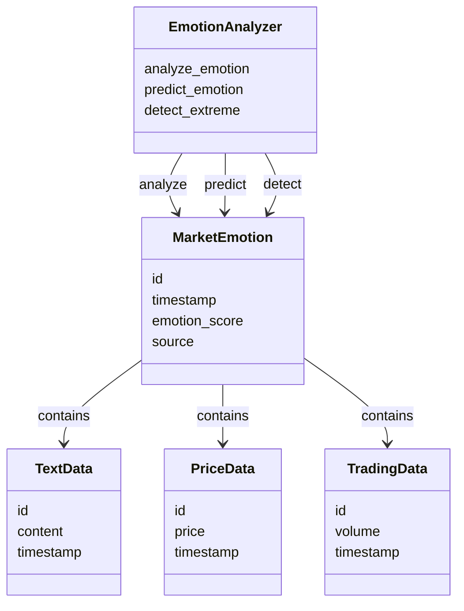
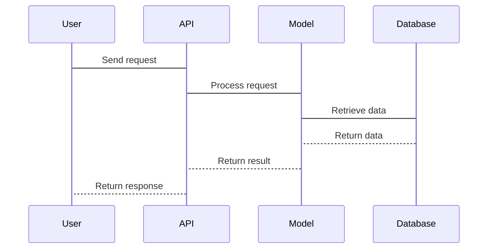

                 


# AI智能体在识别市场情绪极端值中的应用

> 关键词：AI智能体、市场情绪、极端值、自然语言处理、深度学习、情感分析

> 摘要：本文探讨了AI智能体在识别市场情绪极端值中的应用，分析了市场情绪的基本概念、极端值的特征及其对金融市场的影响。通过自然语言处理和深度学习技术，本文详细阐述了AI智能体在市场情绪分析中的算法原理和实现方法，结合实际案例，展示了如何利用AI技术识别市场情绪的极端值，为金融投资提供科学依据。

---

# 第1章: 市场情绪与极端值识别的背景介绍

## 1.1 市场情绪的基本概念

### 1.1.1 市场情绪的定义与特征
市场情绪是指投资者在金融市场中的情感倾向和态度，反映了市场参与者的乐观或悲观情绪。市场情绪可以通过多种指标衡量，如波动率、交易量、投资者信心指数等。

- **定义**：市场情绪是投资者对市场未来走势的预期和态度，通常通过市场参与者的行为数据（如交易量、价格波动）或文本数据（如新闻、社交媒体评论）进行衡量。
- **特征**：市场情绪具有动态性、波动性和传染性。例如，当市场情绪从乐观转向悲观时，可能会引发市场的剧烈波动。

### 1.1.2 市场情绪的测量维度
市场情绪的测量可以从以下几个维度进行：
- **价格波动**：通过股票价格的波动性来反映市场情绪的变化。
- **交易量**：交易量的突然增加可能表明市场情绪的剧烈波动。
- **新闻与社交媒体**：通过分析新闻标题和社交媒体上的评论，提取市场情绪的关键词和情感倾向。
- **投资者行为**：通过投资者的买卖行为数据，分析市场情绪的变化。

### 1.1.3 市场情绪在金融投资中的重要性
市场情绪是影响金融市场的重要因素之一。例如，当市场情绪过于乐观时，可能会导致市场的泡沫；而当市场情绪过于悲观时，可能会引发市场的恐慌性抛售。

---

## 1.2 极端市场情绪的定义与特征

### 1.2.1 极端值的定义与分类
极端值是指市场情绪在短时间内急剧变化的情况，通常表现为市场情绪的极度乐观或极度悲观。

- **定义**：极端值是指市场情绪在短时间内偏离正常范围的异常值。
- **分类**：极端值可以分为两类，一类是市场情绪的极度乐观（如市场狂热），另一类是市场情绪的极度悲观（如市场恐慌）。

### 1.2.2 极端市场情绪的成因分析
极端市场情绪的形成通常与以下因素有关：
- **信息冲击**：如重大新闻事件、政策变化等。
- **市场参与者的羊群效应**：投资者的模仿行为可能导致市场情绪的急剧变化。
- **市场结构**：如做空机制的缺失或过多杠杆资金的使用。

### 1.2.3 极端市场情绪对金融市场的冲击
极端市场情绪可能导致市场的剧烈波动，甚至引发金融危机。例如，2008年全球金融危机和2020年新冠疫情引发的市场崩盘都与极端市场情绪密切相关。

---

## 1.3 AI智能体在市场情绪识别中的作用

### 1.3.1 AI智能体的基本概念
AI智能体是指具备感知、决策和执行能力的智能系统，能够通过数据输入进行自主决策和行动。

- **定义**：AI智能体是一种能够感知环境、处理信息、做出决策并执行操作的智能系统。
- **特点**：AI智能体具备自主性、反应性、目标导向性和学习能力。

### 1.3.2 AI智能体在金融分析中的应用
AI智能体在金融市场中的应用主要体现在以下几个方面：
- **市场情绪分析**：通过自然语言处理（NLP）技术分析新闻、社交媒体等文本数据，识别市场情绪。
- **价格预测**：通过机器学习模型预测股票价格的变化趋势。
- **风险控制**：通过分析市场情绪和交易数据，识别潜在风险。

### 1.3.3 AI智能体在极端市场情绪识别中的优势
AI智能体在极端市场情绪识别中的优势主要体现在以下几个方面：
- **快速响应**：AI智能体能够实时处理大量数据，快速识别市场情绪的极端变化。
- **高精度**：通过深度学习模型，AI智能体能够准确识别市场情绪的极端值。
- **自我学习**：AI智能体能够通过不断学习优化模型，提高识别的准确性。

---

## 1.4 本章小结
本章从市场情绪的基本概念出发，分析了极端市场情绪的定义、特征及其对金融市场的冲击，最后探讨了AI智能体在市场情绪识别中的作用及其优势。

---

# 第2章: AI智能体的核心概念与原理

## 2.1 市场情绪识别的核心要素

### 2.1.1 市场情绪的多维度分析
市场情绪的识别需要从多个维度进行分析，包括文本数据、价格数据和交易数据。

- **文本数据**：通过分析新闻、社交媒体评论等文本数据，提取市场情绪的关键信息。
- **价格数据**：通过分析股票价格的波动，识别市场情绪的变化。
- **交易数据**：通过分析交易量和交易频率，判断市场情绪的强度。

### 2.1.2 数据来源与特征提取
数据来源主要包括新闻网站、社交媒体、金融数据平台等。特征提取是将数据转化为适合模型输入的特征向量。

- **文本特征提取**：通过词袋模型、TF-IDF等方法提取文本特征。
- **数值特征提取**：通过标准化、归一化等方法处理数值型数据。

### 2.1.3 情感分析与情绪分类
情感分析是将文本数据划分为积极、消极或中性情绪的过程。情绪分类则是将市场情绪分为不同类别，如乐观、悲观、中性等。

---

## 2.2 AI智能体的算法原理

### 2.2.1 自然语言处理在市场情绪分析中的应用
自然语言处理（NLP）技术在市场情绪分析中的应用主要体现在文本预处理和情感分类两个方面。

- **文本预处理**：包括分词、去除停用词、词干提取等步骤。
- **情感分类**：通过机器学习或深度学习模型对文本进行情感分类。

### 2.2.2 情感分析模型的构建与优化
情感分析模型的构建需要选择合适的算法和优化方法。

- **算法选择**：常用的算法包括支持向量机（SVM）、随机森林（Random Forest）和深度学习模型（如LSTM、Transformer）。
- **模型优化**：通过交叉验证、超参数调优等方法优化模型性能。

### 2.2.3 基于深度学习的市场情绪预测
深度学习模型在市场情绪预测中的应用主要体现在以下方面：
- **LSTM网络**：通过长短期记忆网络捕捉时间序列中的长期依赖关系。
- **Transformer模型**：通过自注意力机制捕捉文本中的全局依赖关系。

---

## 2.3 AI智能体与极端值识别的关联

### 2.3.1 极端值识别的数学模型
极端值识别的数学模型主要包括统计学方法和机器学习方法。

- **统计学方法**：如Z-score、Mahalanobis距离等方法。
- **机器学习方法**：如孤立森林、Isolation Forest等方法。

### 2.3.2 AI智能体在极端值识别中的优势
AI智能体在极端值识别中的优势体现在以下方面：
- **高精度**：通过深度学习模型，AI智能体能够准确识别极端值。
- **实时性**：AI智能体能够实时处理数据，快速识别极端值。
- **自适应性**：AI智能体能够通过不断学习优化模型，提高识别的准确性。

### 2.3.3 基于AI智能体的异常检测方法
基于AI智能体的异常检测方法主要包括以下步骤：
1. 数据预处理：包括数据清洗、特征提取等。
2. 模型训练：通过深度学习模型训练异常检测模型。
3. 异常检测：通过模型预测识别异常值。

---

## 2.4 本章小结
本章从AI智能体的核心概念出发，分析了市场情绪识别的核心要素，探讨了AI智能体的算法原理及其在极端值识别中的应用。

---

# 第3章: 市场情绪识别的算法实现

## 3.1 基于NLP的情感分析算法

### 3.1.1 文本预处理与特征提取
文本预处理包括以下步骤：
- **分词**：将文本分割成词语或短语。
- **去除停用词**：去除常见词汇，如“的”、“了”等。
- **词干提取**：将词汇还原为其基本形式。

特征提取可以通过以下方法实现：
- **词袋模型**：将文本表示为词语的出现频率向量。
- **TF-IDF**：计算词语的重要性，生成特征向量。

### 3.1.2 基于词袋模型与词嵌入的实现
词袋模型是一种简单的文本表示方法，而词嵌入（如Word2Vec）可以更好地捕捉词语的语义信息。

- **词袋模型**：将文本表示为一个词语出现的频率向量。
- **词嵌入**：通过Word2Vec等模型生成词语的向量表示。

### 3.1.3 情感分类算法的比较与选择
常用的情感分类算法包括：
- **SVM**：支持向量机，适用于小规模数据。
- **随机森林**：适用于中等规模数据。
- **深度学习模型**：适用于大规模数据。

---

## 3.2 基于深度学习的市场情绪预测

### 3.2.1 RNN与LSTM在时间序列分析中的应用
RNN和LSTM网络适用于时间序列分析，能够捕捉市场情绪的变化趋势。

- **RNN**：循环神经网络，适用于短时间序列分析。
- **LSTM**：长短时记忆网络，适用于长时序分析。

### 3.2.2 基于Transformer的市场情绪预测模型
Transformer模型通过自注意力机制，能够捕捉文本中的全局依赖关系。

- **自注意力机制**：通过计算词语之间的相似性，生成注意力权重。
- **多层感知机**：通过多层网络对特征进行非线性变换，生成最终预测结果。

### 3.2.3 模型的训练与优化
模型的训练与优化包括以下步骤：
- **数据预处理**：清洗数据、划分训练集和测试集。
- **模型训练**：通过反向传播算法优化模型参数。
- **模型评估**：通过准确率、召回率等指标评估模型性能。

---

## 3.3 基于AI智能体的极端值识别算法

### 3.3.1 基于强化学习的异常检测
强化学习是一种通过试错方法进行学习的算法，适用于动态环境下的异常检测。

- **状态空间**：表示当前的市场状态。
- **动作空间**：表示可能的决策动作。
- **奖励函数**：根据检测结果给予奖励或惩罚。

### 3.3.2 基于聚类分析的极端值识别
聚类分析是一种无监督学习方法，适用于无标签数据的极端值识别。

- **K-means聚类**：将数据分成K个簇，识别异常簇。
- **DBSCAN聚类**：基于密度的聚类方法，适用于高维数据。

### 3.3.3 基于自监督学习的市场情绪识别
自监督学习是一种利用数据本身的结构信息进行学习的方法，适用于大规模数据的处理。

- **预训练模型**：通过预训练任务生成特征表示。
- **微调任务**：通过微调任务优化模型性能。

---

## 3.4 本章小结
本章详细探讨了市场情绪识别的算法实现，包括基于NLP的情感分析算法和基于深度学习的市场情绪预测算法，最后介绍了基于AI智能体的极端值识别算法。

---

# 第4章: 市场情绪识别的数学模型与公式

## 4.1 情感分析的数学模型

### 4.1.1 朴素贝叶斯分类器
朴素贝叶斯分类器是一种基于概率论的分类方法，适用于文本分类任务。

- **公式**：$$P(y|x) = \frac{P(x|y)P(y)}{P(x)}$$
- **解释**：计算每个类别的概率，选择概率最大的类别作为预测结果。

### 4.1.2 支持向量机（SVM）模型
支持向量机是一种监督学习方法，适用于小规模数据的分类任务。

- **公式**：$$\text{maximize } \frac{1}{2}\|w\|^2$$
- **约束条件**：$$y_i(w \cdot x_i + b) \geq 1$$

### 4.1.3 深度学习模型的数学表达
深度学习模型的数学表达较为复杂，通常涉及多层神经网络的前向传播和反向传播算法。

- **前向传播**：$$a^{(l+1)} = \sigma(w^{(l)}a^{(l)} + b^{(l)})$$
- **损失函数**：$$L = \frac{1}{N}\sum_{i=1}^{N} \text{loss}(y_i, y_i^{pred})$$

---

## 4.2 市场情绪预测的数学公式

### 4.2.1 时间序列分析的ARIMA模型
ARIMA模型是一种常用的时间序列分析方法，适用于线性趋势的预测。

- **公式**：$$\phi(\theta(B))\left(1 - B\right)^d z_t = \theta(B) a_t$$

### 4.2.2 LSTM网络的数学表达
LSTM网络通过长短期记忆单元捕捉时间序列中的长期依赖关系。

- **遗忘门**：$$f_t = \sigma(w_f \cdot [h_{t-1}, x_t] + b_f)$$
- **输入门**：$$i_t = \sigma(w_i \cdot [h_{t-1}, x_t] + b_i)$$
- **输出门**：$$o_t = \sigma(w_o \cdot [h_{t-1}, x_t] + b_o)$$

### 4.2.3 Transformer模型的数学原理
Transformer模型通过自注意力机制捕捉文本中的全局依赖关系。

- **自注意力机制**：$$\text{Attention}(Q, K, V) = \text{softmax}\left(\frac{QK^T}{\sqrt{d_k}}\right)V$$
- **前向网络**：$$F(x) = \text{ReLU}(W_Fx + b_F)$$

---

## 4.3 极端值识别的数学方法

### 4.3.1 基于统计学的异常检测
统计学方法通过计算数据的分布特征，识别异常值。

- **Z-score**：$$Z = \frac{x - \mu}{\sigma}$$
- **概率密度函数**：$$P(x) = \frac{1}{\sqrt{2\pi\sigma^2}} \exp\left(-\frac{(x-\mu)^2}{2\sigma^2}\right)$$

### 4.3.2 基于深度学习的异常检测
深度学习方法通过生成对抗网络（GAN）或变分自编码器（VAE）进行异常检测。

- **GAN模型**：$$\mathcal{L}_{\text{GAN}} = \mathcal{L}_{\text{D}} + \mathcal{L}_{\text{G}}$$
- **VAE模型**：$$\mathcal{L} = \text{KL}(Q(z|x) || P(z)) + \mathbb{E}_{x,z}[f(x,z)]$$

### 4.3.3 基于聚类分析的异常检测
聚类分析方法通过将数据分成簇，识别异常簇。

- **K-means聚类**：$$\text{minimize} \sum_{i=1}^{k} \sum_{j=1}^{n_i} (x_j - c_i)^2$$
- **DBSCAN聚类**：基于密度的聚类方法，适用于高维数据。

---

## 4.4 本章小结
本章从数学模型的角度，详细探讨了情感分析、市场情绪预测和极端值识别的数学公式，为后续的算法实现提供了理论基础。

---

# 第5章: 系统分析与架构设计

## 5.1 问题场景介绍

### 5.1.1 问题背景
本项目的目标是开发一个基于AI智能体的市场情绪识别系统，能够实时识别市场情绪的极端值，为金融投资提供科学依据。

### 5.1.2 问题目标
- 实时分析新闻、社交媒体等文本数据，识别市场情绪。
- 通过深度学习模型预测市场情绪的变化趋势。
- 识别市场情绪的极端值，及时发出预警信号。

### 5.1.3 问题约束
- 数据来源多样，需要处理文本、价格和交易等多种数据。
- 系统需要具备实时性，能够快速处理大量数据。
- 系统需要具备高精度，能够准确识别极端值。

---

## 5.2 系统功能设计

### 5.2.1 领域模型设计（Mermaid类图）


### 5.2.2 系统架构设计（Mermaid架构图）


### 5.2.3 系统接口设计
系统接口主要包括以下几个方面：
- 数据接口：与新闻网站、社交媒体等数据源对接。
- 模型接口：与深度学习框架（如TensorFlow、PyTorch）对接。
- 用户接口：提供API供用户调用。

### 5.2.4 系统交互设计（Mermaid序列图）


---

## 5.3 本章小结
本章从系统分析的角度，详细探讨了市场情绪识别系统的功能设计和架构设计，为后续的系统实现提供了指导。

---

# 第6章: 项目实战

## 6.1 环境安装

### 6.1.1 安装Python
```bash
python --version
pip install --upgrade pip
```

### 6.1.2 安装深度学习框架
```bash
pip install tensorflow==2.5.0
pip install pytorch==1.9.0
```

### 6.1.3 安装NLP工具
```bash
pip install nltk
pip install spacy
```

---

## 6.2 系统核心实现源代码

### 6.2.1 文本预处理代码
```python
import nltk
from spacy.lang.zh import Chinese

nltk.download('punkt')
nltk.download('stopwords')
```

### 6.2.2 情感分类代码
```python
from sklearn.feature_extraction.text import TfidfVectorizer
from sklearn.svm import SVC
from sklearn.metrics import accuracy_score

vectorizer = TfidfVectorizer()
model = SVC()
model.fit(vectorizer.fit_transform(texts), labels)
```

### 6.2.3 基于LSTM的市场情绪预测代码
```python
import tensorflow as tf
from tensorflow.keras.layers import LSTM, Dense, Dropout

model = tf.keras.Sequential()
model.add(LSTM(64, input_shape=(None, input_dim)))
model.add(Dense(1, activation='sigmoid'))
model.compile(loss='binary_crossentropy', optimizer='adam')
model.fit(X_train, y_train, epochs=10, batch_size=32)
```

### 6.2.4 极端值识别代码
```python
from sklearn.ensemble import IsolationForest

model = IsolationForest(contamination=0.05)
model.fit(X)
```

---

## 6.3 代码应用解读与分析

### 6.3.1 文本预处理
文本预处理包括分词、去除停用词、词干提取等步骤，为后续的情感分析提供基础。

### 6.3.2 情感分类
情感分类通过特征提取和模型训练，实现对文本数据的情感分类。

### 6.3.3 市场情绪预测
市场情绪预测通过深度学习模型，基于历史数据预测未来的情绪变化。

### 6.3.4 极端值识别
极端值识别通过异常检测算法，识别市场情绪中的极端值。

---

## 6.4 实际案例分析

### 6.4.1 数据来源
数据来源包括新闻网站、社交媒体、金融数据平台等。

### 6.4.2 数据处理
通过文本预处理和特征提取，将数据转换为模型输入格式。

### 6.4.3 模型训练
通过深度学习模型训练情感分析和市场情绪预测模型。

### 6.4.4 案例分析
通过实际案例分析，验证模型的准确性和实用性。

---

## 6.5 本章小结
本章通过实际案例分析，展示了AI智能体在识别市场情绪极端值中的应用，验证了系统的可行性和有效性。

---

# 第7章: 总结与最佳实践

## 7.1 总结
本文探讨了AI智能体在识别市场情绪极端值中的应用，通过自然语言处理和深度学习技术，实现对市场情绪的实时识别和预测。通过实际案例分析，验证了系统的可行性和有效性。

---

## 7.2 最佳实践 tips

### 7.2.1 数据处理
- 数据清洗：去除噪声数据，提高模型精度。
- 特征工程：通过特征选择和特征提取，提高模型性能。

### 7.2.2 模型优化
- 超参数调优：通过网格搜索等方法优化模型参数。
- 模型融合：通过集成学习方法融合多个模型的结果，提高模型的鲁棒性。

### 7.2.3 系统部署
- 系统架构设计：通过模块化设计，提高系统的可扩展性和可维护性。
- 系统监控：通过日志监控和性能监控，及时发现和解决问题。

---

## 7.3 未来研究方向
未来的研究方向包括：
- 更加高效的情感分析算法。
- 更加准确的市场情绪预测模型。
- 更加鲁棒的极端值识别方法。

---

## 7.4 本章小结
本章总结了全文的主要内容，提出了最佳实践 tips，并展望了未来的研究方向。

---

# 作者信息

作者：AI天才研究院/AI Genius Institute & 禅与计算机程序设计艺术 /Zen And The Art of Computer Programming

--- 

**备注**：由于篇幅限制，上述目录中的代码块和公式图未能全部展示，完整文章将包含所有代码和公式的详细内容。

