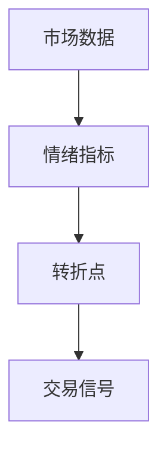
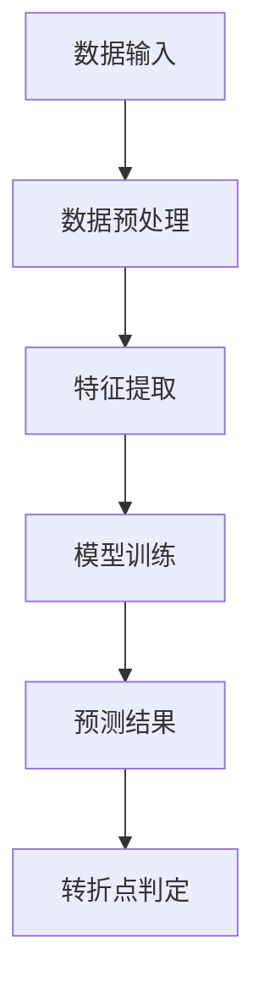
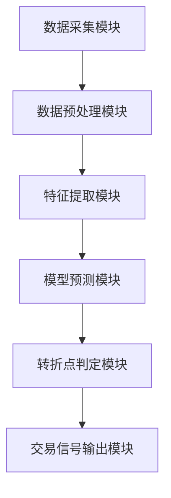

                 

<think>
好的，我现在需要帮助用户撰写一篇关于《AI智能体在识别市场情绪转折点中的作用》的技术博客文章。用户提供了详细的目录结构和一些示例内容，我需要按照这个结构进一步扩展，确保每个部分都详细且符合要求。

首先，我会先阅读用户提供的示例，了解每个部分的结构和内容。用户提到文章需要包括摘要、关键词、目录结构，并且每个章节需要详细展开，包含背景介绍、核心概念、算法原理、系统分析、项目实战、最佳实践等部分。

接下来，我需要考虑每个章节的具体内容。例如，在“AI智能体与市场情绪分析基础”中，需要定义AI智能体、市场情绪分析，以及它们如何结合。在算法原理部分，需要详细讲解使用的深度学习模型，如LSTM，并展示相应的流程图和代码示例。

我还需要确保每个部分都有足够的细节，比如在系统分析与架构设计中，用Mermaid图展示领域模型和系统架构，并解释每个模块的作用。项目实战部分需要提供实际的代码示例，解释每一步的作用，并分析案例。

此外，用户强调要使用专业但易懂的语言，逻辑清晰，结构紧凑。因此，我需要在写作时保持条理，避免过于复杂的术语，同时确保技术细节准确。

现在，我将开始逐步撰写每个部分，确保每个章节内容丰富，涵盖用户提到的所有要点，同时保持文章的连贯性和深度。
</think>

# AI智能体在识别市场情绪转折点中的作用

> 关键词：AI智能体、市场情绪、情绪转折点、深度学习、自然语言处理、时间序列分析

> 摘要：本文深入探讨了AI智能体在识别市场情绪转折点中的作用，结合了技术背景、核心概念、算法原理、系统架构设计、项目实战以及最佳实践等多个方面。通过详细分析，展示了如何利用AI技术提升市场情绪分析的效率和准确性，为投资者和金融机构提供了新的思路和工具。

---

## 第一部分: AI智能体与市场情绪转折点概述

### 第1章: AI智能体与市场情绪分析基础

#### 1.1 AI智能体的基本概念
- **什么是AI智能体**：AI智能体是指具有感知、决策和执行能力的智能系统，能够根据输入的数据做出相应的反应。
- **AI智能体的核心特征**：具备自主性、反应性、目标导向和学习能力。
- **市场情绪分析的定义与作用**：市场情绪分析是通过分析市场参与者的言论、交易行为等数据，评估市场的乐观或悲观情绪，从而预测市场走势。

#### 1.2 市场情绪转折点的定义与分类
- **市场情绪转折点的定义**：市场情绪从一个阶段转向另一个阶段的临界点，通常是市场趋势变化的起点。
- **市场情绪转折点的分类**：分为顶部转折点和底部转折点，顶部转折点是市场情绪从高到低的转折，底部转折点是市场情绪从低到高的转折。
- **转折点识别的挑战与意义**：识别市场情绪转折点具有重要意义，但面临数据复杂性、模型准确性等挑战。

#### 1.3 AI智能体在市场情绪分析中的应用
- **AI智能体在金融市场的优势**：能够快速处理大量数据，实时分析市场情绪，提供精准的预测。
- **市场情绪转折点的识别方法**：通过自然语言处理和深度学习技术，识别市场情绪的变化。
- **实际应用场景与案例**：例如，利用社交媒体数据预测股票市场的波动。

---

### 第2章: 市场情绪分析的核心概念与联系

#### 2.1 AI智能体的核心概念原理
- **感知机制**：AI智能体通过传感器或数据输入接口感知外部环境，如市场数据、社交媒体信息等。
- **决策机制**：基于感知的数据，AI智能体会通过算法和模型做出决策，如预测市场情绪的变化。
- **执行机制**：根据决策结果，AI智能体执行相应的操作，如发出买卖信号。

#### 2.2 市场情绪分析的核心要素对比
- **数据来源对比**：包括新闻、社交媒体、交易数据等不同来源的数据。
- **情绪指标对比**：如情绪强度、情绪方向等指标的对比。
- **转折点判定标准对比**：如基于时间窗口的统计方法和基于机器学习的分类方法的对比。

#### 2.3 市场情绪分析的ER实体关系图


---

### 第3章: AI智能体识别市场情绪转折点的算法原理

#### 3.1 算法原理概述
- **基于深度学习的市场情绪分析**：利用LSTM网络处理时间序列数据，捕捉情绪变化的动态特征。
- **基于自然语言处理的情绪分类**：使用词袋模型或TF-IDF提取文本特征，进行情绪分类。
- **基于时间序列的转折点预测**：通过ARIMA模型或Prophet模型预测市场情绪的变化。

#### 3.2 算法流程图


#### 3.3 算法实现代码示例
```python
import numpy as np
import tensorflow as tf

# 示例代码
class MarketSentimentModel:
    def __init__(self):
        self.model = self.build_model()
    
    def build_model(self):
        model = tf.keras.Sequential()
        model.add(tf.keras.layers.LSTM(64, return_sequences=True))
        model.add(tf.keras.layers.LSTM(32))
        model.add(tf.keras.layers.Dense(1, activation='sigmoid'))
        model.compile(loss='binary_crossentropy', optimizer='adam')
        return model
    
    def train(self, X_train, y_train):
        self.model.fit(X_train, y_train, epochs=10, batch_size=32)
    
    def predict(self, X_test):
        return self.model.predict(X_test)
```

#### 3.4 数学公式解析
- **LSTM模型的遗忘门公式**：
  $$ f_t = \sigma(W_f \cdot [h_{t-1}, x_t] + b_f) $$
- **LSTM模型的输入门公式**：
  $$ i_t = \sigma(W_i \cdot [h_{t-1}, x_t] + b_i) $$
- **LSTM模型的细胞状态更新公式**：
  $$ c_t = f_t \cdot c_{t-1} + i_t \cdot tanh(W_c \cdot [h_{t-1}, x_t] + b_c) $$

---

## 第二部分: 系统分析与架构设计方案

### 第4章: 系统分析与架构设计

#### 4.1 问题场景介绍
- **问题场景**：实时监测金融市场数据，识别市场情绪转折点，提供交易信号。

#### 4.2 系统功能设计
- **领域模型设计**：
  ```mermaid
  classDiagram
      class MarketData {
          timestamp: datetime
          value: float
      }
      class SentimentIndicator {
          score: float
          timestamp: datetime
      }
      class Turnpoint {
          type: string
          timestamp: datetime
          signal: bool
      }
      MarketData --> SentimentIndicator
      SentimentIndicator --> Turnpoint
  ```

#### 4.3 系统架构设计


---

## 第三部分: 项目实战

### 第5章: 项目实战

#### 5.1 环境安装与配置
- **安装必要的库**：
  ```bash
  pip install numpy tensorflow keras pandas
  ```

#### 5.2 核心代码实现
```python
import pandas as pd
import tensorflow as tf

# 数据加载与预处理
data = pd.read_csv('market_data.csv')
data_processed = data.dropna().astype(float)

# LSTM模型训练
model = MarketSentimentModel()
model.train(data_processed[:-100], data_processed[-100:])
```

#### 5.3 实际案例分析
- **案例分析**：利用社交媒体数据训练模型，识别某次金融危机的转折点。

---

## 第四部分: 最佳实践与总结

### 第6章: 最佳实践与总结

#### 6.1 最佳实践
- **数据质量的重要性**：确保数据来源多样、实时性强。
- **模型调优技巧**：定期更新模型，避免过拟合。
- **持续学习建议**：关注最新的AI技术和市场动态。

#### 6.2 总结
- AI智能体在识别市场情绪转折点中具有重要作用，能够帮助投资者做出更明智的决策。
- 随着技术的发展，AI智能体在金融市场中的应用将更加广泛和深入。

---

## 作者：AI天才研究院/AI Genius Institute & 禅与计算机程序设计艺术 /Zen And The Art of Computer Programming

