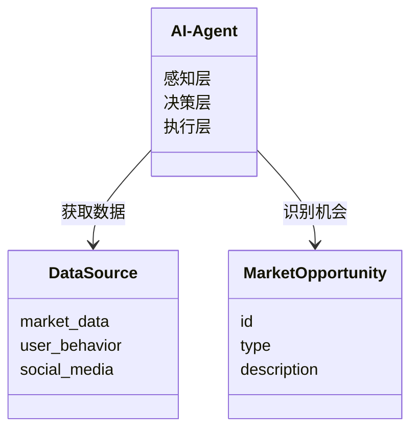
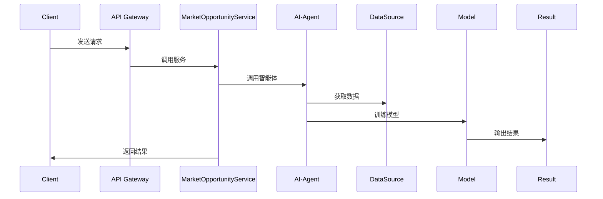

                 


# AI智能体在识别市场结构性机会中的作用

## 关键词：AI智能体, 市场机会, 结构性机会, 强化学习, 系统架构

## 摘要

随着人工智能技术的快速发展，AI智能体在识别市场结构性机会中的作用越来越重要。本文从AI智能体的基本概念出发，深入探讨其在市场机会识别中的应用，详细分析其核心原理、算法模型、系统架构，并通过实际案例展示其在项目中的应用。最后，本文总结了AI智能体在识别市场结构性机会中的优势和未来的发展方向。

---

# 第一部分: AI智能体与市场机会识别基础

## 第1章: AI智能体与市场机会概述

### 1.1 AI智能体的基本概念

#### 1.1.1 什么是AI智能体

AI智能体（Artificial Intelligence Agent）是指在计算机系统中，能够感知环境并采取行动以实现目标的实体。它能够通过传感器获取信息，通过执行器与环境交互，并基于一定的决策规则做出最优决策。

#### 1.1.2 AI智能体的核心特征

| 特征 | 描述 |
|------|------|
| 感知能力 | 能够通过传感器或数据源获取环境信息 |
| 决策能力 | 能够基于获取的信息做出决策 |
| 执行能力 | 能够通过执行器或接口执行决策 |
| 自适应能力 | 能够根据环境变化动态调整行为 |

#### 1.1.3 AI智能体与传统算法的区别

- **传统算法**：基于固定的规则和数据，通常需要明确的输入输出关系，缺乏自主性和适应性。
- **AI智能体**：具有自主性，能够根据环境反馈动态调整行为，具备学习和适应能力。

### 1.2 市场结构性机会的定义

#### 1.2.1 市场机会的分类

- **结构性机会**：存在于市场结构中的长期趋势或模式，如行业增长、技术进步等。
- **随机机会**：短期市场波动或突发事件带来的机会，具有不确定性。

#### 1.2.2 结构性机会的特征

- **长期性**：持续时间较长，影响范围广。
- **可预测性**：可以通过数据分析和模型预测。
- **可操作性**：可以通过策略和行动加以利用。

#### 1.2.3 结构性机会与随机机会的区别

| 特性 | 结构性机会 | 随机机会 |
|------|------------|-----------|
| 持续时间 | 长期       | 短期       |
| 可预测性 | 高         | 低         |
| 影响范围 | 大         | 中小       |

### 1.3 AI智能体在市场机会识别中的作用

#### 1.3.1 AI智能体的优势

- **高效性**：能够快速处理大量数据，识别潜在机会。
- **准确性**：通过机器学习模型，提高机会识别的精准度。
- **适应性**：能够根据市场变化动态调整识别策略。

#### 1.3.2 市场机会识别的挑战

- **数据质量**：市场数据可能存在噪声和偏差。
- **模型复杂性**：需要处理复杂的市场动态和非线性关系。
- **计算资源**：大规模数据处理需要高性能计算资源。

#### 1.3.3 AI智能体的应用场景

- **金融投资**：识别股票、基金等投资机会。
- **市场营销**：发现新兴市场和客户群体。
- **商业策略**：制定基于市场机会的商业计划。

### 1.4 本章小结

本章介绍了AI智能体的基本概念及其在市场机会识别中的作用，强调了结构性机会的特点和识别优势。接下来的章节将深入探讨AI智能体的核心原理和算法模型。

---

# 第二部分: AI智能体的核心原理与技术

## 第2章: AI智能体的感知与决策机制

### 2.1 感知层

#### 2.1.1 数据采集与处理

- **数据来源**：市场数据、用户行为数据、社交媒体数据等。
- **数据处理**：数据清洗、特征提取、数据建模。

#### 2.1.2 特征提取与分析

- **特征选择**：通过统计分析和机器学习方法选择关键特征。
- **特征分析**：分析特征之间的关系，发现潜在机会。

#### 2.1.3 感知模型的构建

- **感知模型**：基于机器学习算法构建感知模型，用于识别市场信号。

### 2.2 决策层

#### 2.2.1 决策规则的制定

- **决策规则**：基于市场数据和历史经验制定决策规则。
- **规则优化**：通过反馈机制不断优化决策规则。

#### 2.2.2 基于强化学习的决策

- **强化学习**：通过奖励机制优化决策策略。
- **策略评估**：评估不同策略的效果，选择最优策略。

#### 2.2.3 决策结果的优化

- **结果分析**：分析决策结果，发现问题并优化。
- **持续改进**：通过反馈机制持续改进决策模型。

### 2.3 执行层

#### 2.3.1 行动策略的制定

- **行动策略**：根据决策结果制定具体的行动策略。
- **策略执行**：通过执行器或接口执行策略。

#### 2.3.2 行动执行的监控

- **监控机制**：实时监控行动执行情况。
- **异常处理**：发现异常情况及时处理。

#### 2.3.3 执行结果的反馈

- **反馈机制**：将执行结果反馈到感知层，用于后续决策。

### 2.4 本章小结

本章详细介绍了AI智能体的感知与决策机制，包括数据处理、特征提取、决策规则制定和执行策略等。接下来的章节将深入探讨AI智能体的算法原理。

---

## 第3章: AI智能体的算法原理

### 3.1 强化学习算法

#### 3.1.1 Q-learning算法

Q-learning是一种经典的强化学习算法，通过更新Q值表来优化决策策略。

$$ Q(s, a) = Q(s, a) + \alpha \times [r + \gamma \times \max Q(s', a') - Q(s, a)] $$

其中，$s$是当前状态，$a$是当前动作，$r$是奖励，$\gamma$是折扣因子，$\alpha$是学习率。

#### 3.1.2 Deep Q-Networks (DQN)算法

DQN算法通过深度神经网络近似Q值函数，解决了传统Q-learning中Q值表存储的问题。

#### 3.1.3 算法优缺点分析

| 算法 | 优点 | 缺点 |
|------|------|------|
| Q-learning | 简单易实现 | 状态空间大时效率低 |
| DQN | 处理高维状态空间能力强 | 训练时间长 |

### 3.2 监督学习算法

#### 3.2.1 分类算法

- **逻辑回归**：用于分类问题，如市场机会分类。
- **支持向量机（SVM）**：适用于小样本数据分类。

#### 3.2.2 回归算法

- **线性回归**：用于预测连续型变量，如市场趋势预测。
- **随机森林回归**：适用于非线性关系的预测。

#### 3.2.3 算法在市场机会识别中的应用

- **分类应用**：识别市场机会类型。
- **回归应用**：预测市场机会的规模和时间。

### 3.3 无监督学习算法

#### 3.3.1 聚类算法

- **K-means**：将市场机会分为不同类别。
- **层次聚类**：发现市场机会的层次结构。

#### 3.3.2 分子式分析

- **主题模型**：如LDA，用于分析市场机会的主题分布。

#### 3.3.3 算法在市场机会识别中的应用

- **聚类应用**：识别相似的市场机会。
- **主题模型应用**：分析市场机会的主题分布。

### 3.4 算法选择与优化

#### 3.4.1 算法选择的依据

- 数据类型和规模
- 问题性质（分类、回归、聚类）
- 模型复杂度和计算资源

#### 3.4.2 算法优化的策略

- 参数调优
- 模型集成
- 模型压缩

#### 3.4.3 算法性能的评估

- 准确率
- 召回率
- F1分数

### 3.5 本章小结

本章介绍了AI智能体常用的算法，包括强化学习、监督学习和无监督学习算法，并分析了它们在市场机会识别中的应用。接下来的章节将探讨AI智能体的数学模型与公式。

---

## 第4章: AI智能体的数学模型与公式

### 4.1 强化学习模型

#### 4.1.1 Q-learning公式

$$ Q(s, a) = Q(s, a) + \alpha \times (r + \gamma \times \max Q(s', a') - Q(s, a)) $$

其中，$\alpha$是学习率，$\gamma$是折扣因子，$r$是奖励，$s$是当前状态，$a$是当前动作，$s'$是下一个状态。

#### 4.1.2 Deep Q-Networks (DQN)公式

$$ Q(s, a) = \arg \max_a Q_\theta(s, a) $$

其中，$\theta$是模型参数，$Q_\theta$是深度神经网络。

### 4.2 监督学习模型

#### 4.2.1 逻辑回归公式

$$ P(y=1|x) = \frac{1}{1 + e^{-\beta x}} $$

其中，$\beta$是模型参数，$x$是输入特征。

#### 4.2.2 支持向量机（SVM）公式

$$ y = \text{sign}(\beta x + b) $$

其中，$\beta$是权重向量，$b$是偏置项，$x$是输入特征。

### 4.3 无监督学习模型

#### 4.3.1 K-means聚类公式

目标函数：

$$ \min \sum_{i=1}^n \sum_{j=1}^k w_{ij} \times d(c_j, x_i) $$

其中，$w_{ij}$是样本$i$属于簇$j$的权重，$d(c_j, x_i)$是样本$i$与簇中心$c_j$的距离。

### 4.4 本章小结

本章详细介绍了AI智能体常用的数学模型与公式，包括强化学习、监督学习和无监督学习模型。接下来的章节将探讨AI智能体的系统架构设计。

---

## 第5章: AI智能体的系统架构设计

### 5.1 问题场景介绍

- **目标**：识别市场结构性机会。
- **数据来源**：市场数据、用户行为数据、社交媒体数据等。
- **需求**：高效、准确地识别市场机会。

### 5.2 系统功能设计

#### 5.2.1 领域模型（Mermaid类图）



#### 5.2.2 系统架构（Mermaid架构图）


#### 5.2.3 系统接口设计

- **API接口**：提供RESTful API，供客户端调用。
- **数据接口**：与数据源对接，获取市场数据。
- **结果接口**：返回识别的市场机会。

#### 5.2.4 系统交互（Mermaid序列图）



### 5.3 本章小结

本章详细介绍了AI智能体的系统架构设计，包括领域模型、系统架构和系统交互设计。接下来的章节将探讨AI智能体的项目实战。

---

## 第6章: AI智能体的项目实战

### 6.1 环境安装

- **安装Python**：Python 3.8及以上版本。
- **安装依赖库**：numpy、pandas、scikit-learn、tensorflow、keras。

### 6.2 系统核心实现源代码

#### 6.2.1 数据处理代码

```python
import pandas as pd
import numpy as np

# 读取数据
data = pd.read_csv('market_data.csv')

# 数据清洗
data = data.dropna()
data = data[~data['date'].isnull()]

# 特征提取
features = data[['price', 'volume', 'market_cap']]
labels = data['opportunity']
```

#### 6.2.2 AI智能体实现代码

```python
import keras
from keras.models import Sequential
from keras.layers import Dense

# 定义模型
model = Sequential()
model.add(Dense(64, activation='relu', input_dim=3))
model.add(Dense(1, activation='sigmoid'))

# 编译模型
model.compile(optimizer='adam', loss='binary_crossentropy', metrics=['accuracy'])

# 训练模型
model.fit(features, labels, epochs=100, batch_size=32)
```

#### 6.2.3 案例分析与代码解读

- **数据处理**：读取市场数据，清洗数据，提取特征。
- **模型训练**：使用神经网络模型训练AI智能体，识别市场机会。
- **结果分析**：分析模型输出的结果，评估识别效果。

### 6.3 本章小结

本章通过实际案例展示了AI智能体在识别市场结构性机会中的应用，详细讲解了环境安装、数据处理、模型训练和结果分析的过程。

---

# 第三部分: 总结与展望

## 第7章: 总结与展望

### 7.1 本章总结

本文详细探讨了AI智能体在识别市场结构性机会中的作用，从基本概念到算法原理，再到系统架构和项目实战，全面介绍了其应用过程。

### 7.2 未来展望

- **算法优化**：探索更高效的强化学习算法。
- **多模态数据融合**：结合文本、图像等多种数据源。
- **实时识别**：实现市场机会的实时识别和响应。

### 7.3 最佳实践 tips

- **数据质量**：确保数据的准确性和完整性。
- **模型选择**：根据具体问题选择合适的算法。
- **持续优化**：通过反馈机制不断优化模型和策略。

### 7.4 小结

AI智能体在识别市场结构性机会中的作用日益重要，未来随着技术的发展，其应用将更加广泛和深入。

---

# 作者：AI天才研究院 & 禅与计算机程序设计艺术

---

**本文由AI天才研究院撰写，转载请注明出处。**

