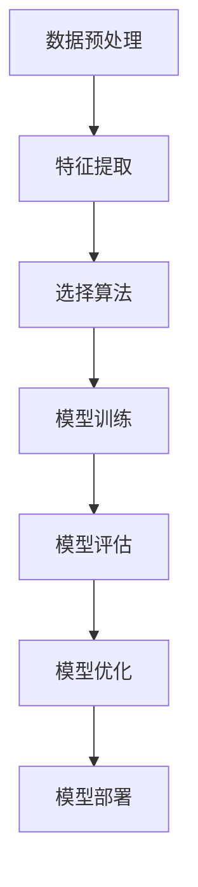
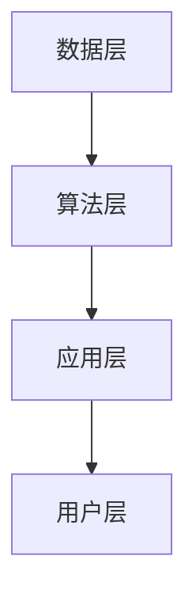

                 


# 第一部分: AI智能体与新兴市场概述

# 第1章: AI智能体的定义与核心概念

## 1.1 AI智能体的定义与特点
### 1.1.1 AI智能体的定义
AI智能体（Artificial Intelligence Agent，简称AI Agent）是指能够感知环境、自主决策并执行任务的智能系统。它具备以下特点：
- **自主性**：能够在没有外部干预的情况下自主运作。
- **反应性**：能够实时感知环境变化并做出相应的反应。
- **目标导向**：具有明确的目标，并通过行动来实现这些目标。
- **学习能力**：能够通过数据和经验不断优化自身的性能。

### 1.1.2 AI智能体的技术基础
AI智能体的核心技术包括：
- **机器学习**：通过大量数据训练模型，使其能够识别模式并做出预测。
- **自然语言处理**：理解并生成人类语言，使AI智能体能够与人类进行有效沟通。
- **计算机视觉**：通过图像识别和处理技术，帮助AI智能体感知和理解视觉信息。
- **强化学习**：通过试错和奖励机制，优化AI智能体的决策能力。

### 1.1.3 AI智能体的应用场景
AI智能体在新兴市场中的应用场景广泛，包括：
- **市场分析**：通过大数据分析，识别市场趋势和潜在机会。
- **风险评估**：评估投资项目的潜在风险，帮助做出决策。
- **自动化交易**：通过算法进行股票、外汇等金融市场的自动交易。
- **客户画像**：通过分析客户行为数据，精准定位目标客户群体。

## 1.2 AI智能体在新兴市场的应用背景
### 1.2.1 新兴市场的特点与挑战
新兴市场通常具有以下特点：
- **高增长性**：经济增长速度快，市场潜力大。
- **不确定性**：市场波动大，政策和经济环境不稳定。
- **复杂性**：市场竞争激烈，行业结构复杂。
- **数据稀缺性**：市场数据不完善，信息不对称严重。

### 1.2.2 AI智能体在新兴市场的优势
AI智能体在新兴市场中的优势主要体现在：
- **数据处理能力**：能够处理大量非结构化数据，发现潜在机会。
- **实时决策能力**：能够快速响应市场变化，做出最优决策。
- **风险控制能力**：通过模型预测和分析，有效降低投资风险。

### 1.2.3 市场价值机会的识别需求
在新兴市场中，识别价值机会的需求主要体现在以下几个方面：
- **发现新兴行业**：通过数据分析，识别新兴行业和潜在热点。
- **挖掘未开发市场**：发现未被充分开发的市场机会，抢占先机。
- **预测市场趋势**：通过模型预测市场趋势，制定长期战略。

## 1.3 AI智能体的核心要素与架构
### 1.3.1 AI智能体的核心要素
AI智能体的核心要素包括：
- **感知模块**：负责收集和处理环境数据。
- **决策模块**：根据感知数据做出决策。
- **执行模块**：执行决策并产生行动。
- **学习模块**：通过反馈不断优化自身的性能。

### 1.3.2 AI智能体的架构设计
AI智能体的架构设计通常包括以下几个层次：
1. **数据层**：负责数据的收集、存储和管理。
2. **算法层**：包括机器学习、深度学习等算法的实现。
3. **应用层**：将算法应用于具体场景，实现目标。
4. **用户层**：与用户进行交互，提供结果和反馈。

### 1.3.3 AI智能体的输入输出机制
AI智能体的输入输出机制主要包括：
- **输入**：接收环境数据、用户指令等。
- **输出**：生成决策结果、反馈信息等。

## 1.4 本章小结
本章介绍了AI智能体的基本概念、技术基础和应用场景，并分析了其在新兴市场的优势和价值机会的识别需求。通过了解AI智能体的核心要素和架构设计，为后续章节的深入分析奠定了基础。

---

# 第2章: AI智能体的算法原理与数学模型

## 2.1 AI智能体的核心算法
### 2.1.1 机器学习算法
机器学习算法是AI智能体的核心算法之一，主要包括：
- **监督学习**：通过标记数据训练模型，使其能够对新数据做出预测。
- **无监督学习**：通过分析数据的内在结构，发现数据中的潜在模式。
- **半监督学习**：结合监督学习和无监督学习，利用少量标记数据和大量未标记数据进行训练。

### 2.1.2 深度学习算法
深度学习算法通过多层神经网络模型，能够自动提取数据的高层次特征，主要包括：
- **卷积神经网络（CNN）**：适用于图像识别和处理。
- **循环神经网络（RNN）**：适用于时间序列数据的处理。
- **生成对抗网络（GAN）**：通过对抗训练生成新的数据样本。

### 2.1.3 强化学习算法
强化学习算法通过试错和奖励机制，优化AI智能体的决策能力，主要包括：
- **Q-learning**：通过Q值函数学习最优策略。
- **Deep Q-Network（DQN）**：结合深度学习和强化学习，实现端到端的决策过程。

## 2.2 数学模型与公式
### 2.2.1 线性回归模型
线性回归模型是最简单的机器学习模型之一，其数学表达式为：
$$ y = \beta_0 + \beta_1x + \epsilon $$
其中，$y$是目标变量，$x$是自变量，$\beta_0$和$\beta_1$是模型参数，$\epsilon$是误差项。

### 2.2.2 神经网络模型
神经网络模型通过多层非线性变换，能够捕捉数据的复杂特征，其数学表达式为：
$$ f(x) = \sigma(w x + b) $$
其中，$w$和$b$是模型参数，$\sigma$是激活函数。

### 2.2.3 强化学习的Q-learning公式
Q-learning是一种经典的强化学习算法，其更新公式为：
$$ Q(s, a) = Q(s, a) + \alpha (r + \gamma \max Q(s', a') - Q(s, a)) $$
其中，$Q(s, a)$是当前状态$s$和动作$a$的Q值，$\alpha$是学习率，$r$是奖励，$\gamma$是折扣因子，$Q(s', a')$是下一个状态$s'$和动作$a'$的Q值。

## 2.3 算法实现与流程图
### 2.3.1 算法实现流程
以下是一个简单的机器学习算法实现流程图：



## 2.4 本章小结
本章详细介绍了AI智能体的核心算法，包括机器学习、深度学习和强化学习，并通过数学公式和流程图展示了算法的实现过程。这些算法为AI智能体在新兴市场的价值机会识别提供了理论基础和技术支持。

---

# 第3章: 新兴市场的价值机会识别

## 3.1 新兴市场的特点与分析
### 3.1.1 新兴市场的定义与分类
新兴市场通常指那些经济快速增长、市场潜力大但尚未完全开发的国家或地区。常见的新兴市场包括中国、印度、巴西等。

### 3.1.2 新兴市场的增长潜力
新兴市场通常具有以下增长潜力：
- **人口红利**：年轻人口比例高，消费能力强。
- **技术创新**：科技发展迅速，新兴行业不断涌现。
- **政策支持**：政府通常会出台一系列政策，鼓励经济发展和市场扩张。

### 3.1.3 新兴市场的风险与挑战
尽管新兴市场潜力巨大，但也存在诸多风险和挑战：
- **经济波动**：受全球经济环境影响，市场波动较大。
- **政策不确定性**：政策变化频繁，增加了市场的不稳定性。
- **基础设施不足**：部分地区基础设施落后，增加了市场进入的难度。

## 3.2 AI智能体在价值机会识别中的作用
### 3.2.1 数据驱动的市场分析
通过收集和分析大量的市场数据，AI智能体能够识别潜在的市场机会和风险。

### 3.2.2 智能预测与趋势分析
利用机器学习和深度学习算法，AI智能体能够对未来市场趋势进行预测，帮助投资者做出更明智的决策。

### 3.2.3 竞争对手分析与市场定位
通过分析竞争对手的市场策略和行为，AI智能体能够帮助企业更好地定位自身，制定有效的市场进入策略。

## 3.3 实际案例分析
### 3.3.1 某新兴市场的价值机会识别案例
以印度市场为例，AI智能体可以通过分析印度的消费数据、政策变化和市场趋势，识别出电子商务、金融科技等领域的潜在机会。

### 3.3.2 AI智能体的应用效果评估
通过对比传统市场分析方法和AI智能体的应用效果，可以发现AI智能体在提高分析效率、精准度和预测能力方面具有显著优势。

## 3.4 本章小结
本章通过分析新兴市场的特点和价值机会识别的难点，探讨了AI智能体在其中的作用，并通过实际案例展示了其应用效果。这为后续章节的设计和实现提供了实际依据。

---

# 第4章: AI智能体的系统架构与设计

## 4.1 系统架构设计
### 4.1.1 分层架构设计
AI智能体的系统架构通常采用分层设计，主要包括：
1. **数据层**：负责数据的采集、存储和管理。
2. **算法层**：实现各种机器学习、深度学习和强化学习算法。
3. **应用层**：将算法应用于具体场景，实现目标。
4. **用户层**：与用户进行交互，提供结果和反馈。

### 4.1.2 模块化设计
AI智能体的系统架构可以划分为以下几个模块：
- **数据采集模块**：负责从多种渠道采集数据。
- **数据预处理模块**：对采集到的数据进行清洗和转换。
- **模型训练模块**：利用算法对数据进行训练，生成模型。
- **模型部署模块**：将训练好的模型部署到实际应用中。

## 4.2 系统功能设计
### 4.2.1 数据分析功能
AI智能体需要具备强大的数据分析能力，能够处理结构化和非结构化数据。

### 4.2.2 自动决策功能
通过算法模型，AI智能体能够自主做出决策，并执行相应的动作。

### 4.2.3 人机交互功能
AI智能体需要与用户进行交互，提供实时反馈和结果展示。

## 4.3 系统架构图
以下是一个典型的AI智能体系统架构图：



## 4.4 本章小结
本章详细介绍了AI智能体的系统架构设计，包括分层架构和模块化设计，并通过系统架构图展示了各层之间的关系。这些设计为AI智能体的实现提供了清晰的指导。

---

# 第5章: 项目实战——AI智能体在新兴市场的应用

## 5.1 项目背景与目标
### 5.1.1 项目背景
本项目旨在通过AI智能体技术，识别新兴市场的价值机会，帮助企业制定更有效的市场策略。

### 5.1.2 项目目标
- **数据采集与处理**：收集新兴市场的相关数据，进行清洗和转换。
- **模型训练与优化**：利用机器学习算法训练模型，并进行优化。
- **价值机会识别**：通过模型预测和分析，识别新兴市场的价值机会。

## 5.2 项目实施步骤
### 5.2.1 环境安装
需要安装以下环境和工具：
- **Python**：编程语言
- **TensorFlow**或**PyTorch**：深度学习框架
- **Pandas**和**NumPy**：数据分析库
- **Scikit-learn**：机器学习库

### 5.2.2 系统核心实现
以下是AI智能体的核心实现代码：

```python
import numpy as np
from sklearn.model_selection import train_test_split
from sklearn.linear_model import LinearRegression

# 数据预处理
X = np.array([[1, 2], [3, 4], [5, 6], [7, 8]])
y = np.array([2, 4, 6, 8])

# 划分训练集和测试集
X_train, X_test, y_train, y_test = train_test_split(X, y, test_size=0.25)

# 模型训练
model = LinearRegression()
model.fit(X_train, y_train)

# 模型预测
y_pred = model.predict(X_test)

# 模型评估
score = model.score(X_test, y_test)
print(f"模型得分：{score}")
```

### 5.2.3 实际案例分析
以识别某新兴市场的消费趋势为例，通过AI智能体分析消费数据，预测未来的消费热点。

### 5.2.4 项目小结
本项目通过实际操作，展示了AI智能体在新兴市场价值机会识别中的应用。通过数据采集、模型训练和案例分析，验证了AI智能体的有效性和实用性。

## 5.3 本章小结
本章通过一个具体的项目案例，详细讲解了AI智能体在新兴市场中的应用。从环境安装到代码实现，再到案例分析，为读者提供了从理论到实践的完整指导。

---

# 第6章: 总结与展望

## 6.1 本章总结
通过前面几章的分析，我们了解了AI智能体在新兴市场价值机会识别中的重要作用。AI智能体通过强大的数据处理能力和智能算法，能够帮助企业快速发现市场机会，降低投资风险。

## 6.2 未来展望
随着人工智能技术的不断发展，AI智能体在新兴市场的应用将更加广泛和深入。未来的研究方向可能包括：
- **多模态数据处理**：结合文本、图像等多种数据源，提高分析的准确性。
- **实时决策能力**：进一步优化算法，提高决策的实时性和响应速度。
- **跨市场分析**：研究如何在多个新兴市场中进行协同分析和决策。

## 6.3 注意事项与最佳实践
在实际应用中，需要注意以下几点：
- **数据质量**：确保数据的准确性和完整性。
- **模型优化**：定期更新模型，保持其预测能力。
- **风险管理**：制定有效的风险管理策略，降低市场波动对投资的影响。

## 6.4 本章小结
本章总结了AI智能体在新兴市场中的应用，并展望了未来的发展方向。同时，提出了在实际应用中需要注意的事项和最佳实践，为读者提供了宝贵的参考。

---

# 作者：AI天才研究院/AI Genius Institute & 禅与计算机程序设计艺术/Zen And The Art of Computer Programming

