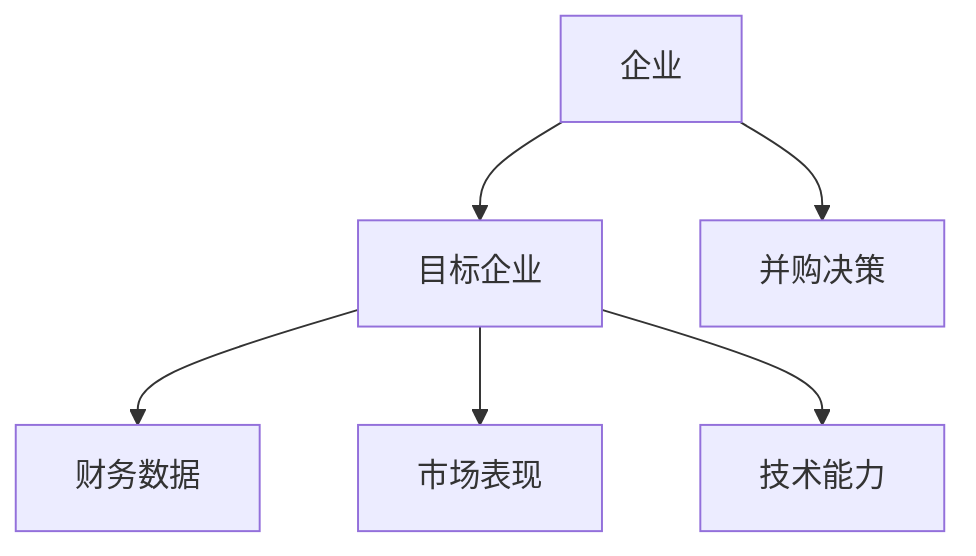
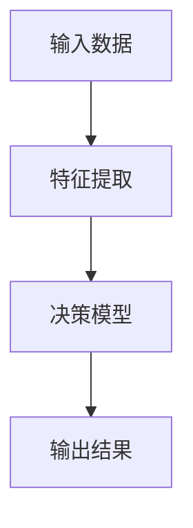
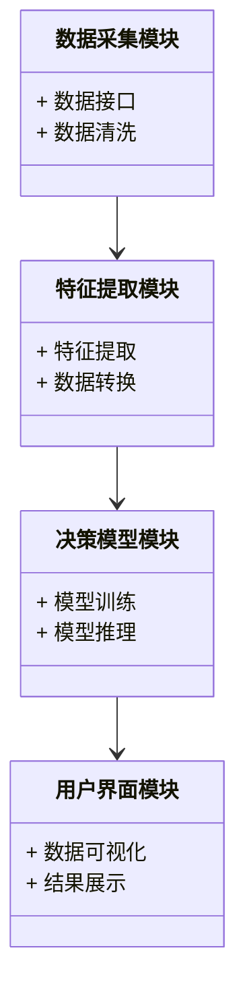
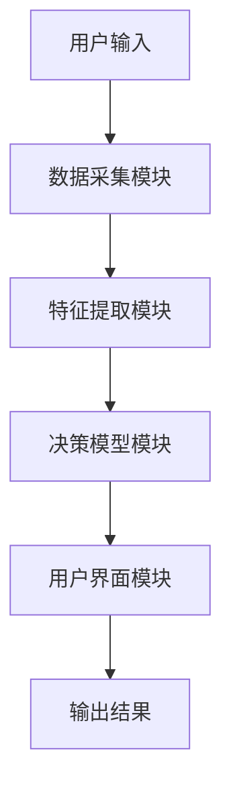
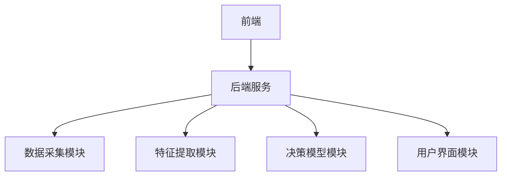
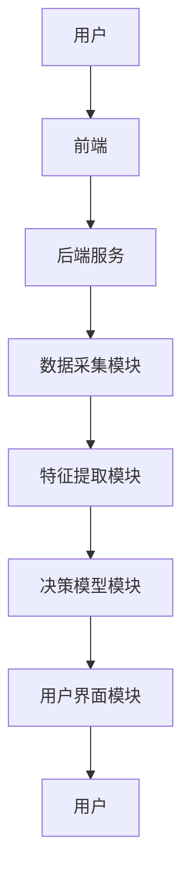

                 


# AI智能体在识别潜在并购目标中的应用

> 关键词：AI智能体，并购目标识别，大数据分析，机器学习算法，企业价值评估

> 摘要：随着人工智能技术的快速发展，AI智能体在企业并购中的应用越来越广泛。本文详细探讨了AI智能体在识别潜在并购目标中的核心概念、算法原理、系统架构和实战应用，分析了其在企业价值评估、风险预测和决策优化中的优势，并提供了实际案例和最佳实践。

---

# 第1章: 并购与AI智能体的基本概念

## 1.1 并购的基本概念

### 1.1.1 并购的定义与类型

企业并购（Mergers and Acquisitions, M&A）是指一家企业与其他企业合并或收购其资产、股权等行为。并购可以分为以下几种类型：

1. **横向并购**：同一行业内的企业合并，旨在扩大市场份额或消除竞争。
2. **纵向并购**：供应链上下游企业之间的合并，以增强垂直整合能力。
3. **混合并购**：与主业无关的企业合并，通常为了 diversification 或战略扩张。

### 1.1.2 并购的目标与动机

企业进行并购的主要目标包括：

1. **市场扩展**：进入新市场或扩大市场份额。
2. **成本协同效应**：通过合并减少重复成本，提高效率。
3. **技术获取**：通过并购获取关键技术或专利。
4. **战略调整**：调整业务结构，应对市场竞争。

### 1.1.3 并购的流程与挑战

并购的典型流程包括：

1. **战略规划**：明确并购目标和动机。
2. **目标筛选**：从市场中筛选出符合战略目标的企业。
3. **尽职调查**：对目标企业进行财务、法律和业务上的详细调查。
4. **估值与谈判**：评估目标企业价值，进行价格谈判。
5. **整合与实施**：完成并购后的业务整合。

并购的主要挑战包括信息不对称、估值风险、整合风险和文化冲突等。

---

## 1.2 AI智能体的定义与特点

### 1.2.1 AI智能体的基本概念

AI智能体（Artificial Intelligence Agent）是指能够感知环境、采取行动以实现目标的智能系统。AI智能体的核心特征包括：

1. **自主性**：能够自主决策，无需人工干预。
2. **反应性**：能够实时感知环境变化并做出反应。
3. **目标导向**：基于目标驱动行为，优化决策。
4. **学习能力**：通过数据和经验不断优化自身能力。

### 1.2.2 AI智能体的核心特征

AI智能体在企业并购中的应用主要体现在以下几个方面：

1. **数据驱动决策**：通过分析大量数据，识别潜在并购目标。
2. **自动化与智能化**：自动化筛选和评估目标企业，提高效率。
3. **实时反馈与优化**：根据市场变化和反馈，动态调整并购策略。

### 1.2.3 AI智能体与传统算法的区别

传统算法通常基于静态规则或简单的统计模型，而AI智能体具有以下优势：

1. **自适应性**：能够根据环境变化自适应调整策略。
2. **深度学习能力**：通过神经网络等技术，实现对复杂模式的识别。
3. **多目标优化**：能够同时考虑多个目标，找到最优解。

---

## 1.3 本章小结

本章介绍了企业并购的基本概念和类型，分析了并购的目标与动机，以及并购的流程与挑战。同时，详细阐述了AI智能体的定义、特点和核心能力，为后续章节奠定了基础。

---

# 第2章: AI智能体在并购目标识别中的应用背景

## 2.1 并购目标识别的传统方法

### 2.1.1 传统并购目标识别的流程

传统并购目标识别的流程通常包括以下几个步骤：

1. **市场研究**：通过行业报告和市场分析，初步筛选目标企业。
2. **财务分析**：分析目标企业的财务报表，评估其财务健康状况。
3. **尽职调查**：对目标企业进行详细的法律和业务尽职调查。
4. **估值与谈判**：基于尽职调查结果，进行企业估值和价格谈判。

### 2.1.2 传统方法的优缺点

传统方法的优点包括：

- 财务分析和尽职调查较为严谨，能够有效评估企业的真实价值。
- 法律和合规性风险较低。

传统方法的缺点包括：

- 筛选目标企业的范围有限，难以覆盖海量潜在目标。
- 评估过程耗时较长，效率较低。

### 2.1.3 传统方法的局限性

随着市场竞争的加剧和企业规模的扩大，传统并购目标识别方法的局限性日益明显：

1. **信息处理能力有限**：传统方法难以处理海量非结构化数据，如社交媒体数据、新闻报道等。
2. **效率低下**：传统方法依赖人工分析，效率较低，难以快速响应市场变化。
3. **主观性较强**：评估结果受到分析师主观判断的影响，可能存在偏差。

---

## 2.2 AI技术的快速发展

### 2.2.1 AI技术的最新进展

近年来，人工智能技术取得了长足的进步，尤其是在以下领域：

1. **深度学习**：基于神经网络的深度学习模型在图像识别、自然语言处理等领域表现优异。
2. **自然语言处理（NLP）**：通过NLP技术，可以自动分析文本数据，提取关键信息。
3. **强化学习**：通过强化学习算法，AI智能体能够动态调整策略，实现最优决策。

### 2.2.2 大数据与AI的结合

大数据技术为AI智能体提供了丰富的数据来源，包括：

1. **结构化数据**：如企业的财务报表、销售数据等。
2. **非结构化数据**：如新闻报道、社交媒体数据、专利信息等。

通过大数据和AI的结合，AI智能体能够更全面地评估目标企业的价值。

### 2.2.3 AI智能体在企业中的应用趋势

AI智能体在企业中的应用趋势主要体现在以下几个方面：

1. **智能化决策支持**：通过AI智能体辅助企业进行战略决策。
2. **自动化业务流程**：利用AI智能体自动化处理并购过程中的某些环节。
3. **实时监控与反馈**：通过实时数据监控，动态调整并购策略。

---

## 2.3 本章小结

本章分析了传统并购目标识别方法的局限性，介绍了AI技术的最新进展，以及大数据与AI结合的应用优势。最后，总结了AI智能体在企业中的应用趋势，为后续章节的深入分析奠定了基础。

---

# 第3章: AI智能体识别潜在并购目标的核心概念与联系

## 3.1 AI智能体识别并购目标的核心原理

### 3.1.1 数据驱动的特征提取

AI智能体通过分析海量数据，提取目标企业的关键特征，包括：

1. **财务特征**：如收入、利润、资产负债率等。
2. **市场特征**：如市场份额、品牌影响力等。
3. **技术特征**：如专利数量、技术先进性等。

### 3.1.2 智能体的决策机制

AI智能体的决策机制基于以下步骤：

1. **数据输入**：获取目标企业的相关信息。
2. **特征提取**：提取关键特征并进行数据清洗。
3. **模型推理**：基于训练好的模型，对目标企业进行评估和排序。
4. **决策输出**：输出潜在并购目标的评估结果。

### 3.1.3 多维度数据的融合分析

AI智能体能够将结构化数据和非结构化数据进行融合分析，例如：

- 将企业的财务数据与社交媒体上的舆论数据相结合，全面评估企业的市场声誉和财务健康状况。

---

## 3.2 核心概念对比分析

### 3.2.1 并购目标识别的关键属性

以下是并购目标识别的关键属性对比：

| 属性       | 传统方法       | AI智能体方法       |
|------------|----------------|---------------------|
| 数据来源   | 结构化数据为主   | 结构化+非结构化数据 |
| 分析效率   | 较低           | 高                  |
| 精度       | 较低           | 较高                |
| 灵活性     | 较低           | 高                  |

### 3.2.2 AI智能体的核心算法特征

AI智能体的核心算法特征包括：

1. **深度学习**：通过卷积神经网络（CNN）和循环神经网络（RNN）提取特征。
2. **强化学习**：通过Q-learning等算法优化决策策略。
3. **迁移学习**：将已有的知识迁移到新的任务中，减少训练数据的需求。

### 3.2.3 数据源与目标识别的关系

数据源与目标识别的关系可以通过以下ER实体关系图表示：



---

## 3.3 本章小结

本章详细分析了AI智能体识别潜在并购目标的核心原理，对比了传统方法与AI智能体方法在数据来源、分析效率和精度等方面的差异，并通过ER实体关系图展示了数据源与目标识别的关系。

---

# 第4章: AI智能体识别潜在并购目标的算法原理

## 4.1 算法概述

### 4.1.1 基于深度学习的特征提取

深度学习模型（如CNN和RNN）能够从非结构化数据中提取高维特征。例如，通过自然语言处理技术，可以从新闻报道中提取关键词和情感倾向。

### 4.1.2 基于强化学习的决策机制

强化学习算法（如Q-learning）通过不断试错，优化决策策略。例如，AI智能体可以在模拟环境中测试不同的并购策略，选择最优的行动方案。

### 4.1.3 混合算法的优势

将深度学习和强化学习结合起来，可以充分发挥两种算法的优势。例如，深度学习用于特征提取，强化学习用于优化决策策略。

---

## 4.2 算法流程

### 4.2.1 算法流程图

以下是AI智能体识别潜在并购目标的算法流程图：



### 4.2.2 算法实现

以下是基于Python的算法实现示例：

```python
def ai_agent():
    # 特征提取
    features = extract_features(data)
    # 决策模型
    decision = model.predict(features)
    return decision
```

---

## 4.3 数学模型与公式

### 4.3.1 相似度计算公式

$$ \text{相似度} = \frac{\sum_{i=1}^{n} w_i x_i}{\sqrt{\sum_{i=1}^{n} w_i^2}} $$

其中，\( w_i \) 是特征 \( i \) 的权重，\( x_i \) 是特征 \( i \) 的值。

### 4.3.2 决策模型的优化目标

$$ \min_{\theta} \sum_{i=1}^{m} (y_i - f(x_i, \theta))^2 $$

其中，\( y_i \) 是真实标签，\( f(x_i, \theta) \) 是模型的预测值。

---

## 4.4 本章小结

本章详细介绍了AI智能体识别潜在并购目标的算法原理，包括基于深度学习的特征提取、基于强化学习的决策机制，以及混合算法的优势。通过算法流程图和数学公式，进一步解释了AI智能体的核心技术。

---

# 第5章: AI智能体识别潜在并购目标的系统架构设计

## 5.1 项目背景

随着企业并购活动的增加，传统的并购目标识别方法已经难以满足企业的需求。AI智能体的引入，能够显著提高并购目标识别的效率和准确性。

---

## 5.2 系统功能设计

### 5.2.1 系统功能模块

以下是系统功能模块图：



### 5.2.2 系统功能流程

以下是系统功能流程图：



---

## 5.3 系统架构设计

### 5.3.1 系统架构图

以下是系统架构图：



---

## 5.4 系统接口设计

### 5.4.1 API接口

以下是系统的主要API接口：

1. `/api/data/upload`：上传数据接口。
2. `/api/model/train`：训练模型接口。
3. `/api/predict`：预测接口。

---

## 5.5 系统交互流程

### 5.5.1 交互流程图

以下是系统交互流程图：



---

## 5.6 本章小结

本章详细设计了AI智能体识别潜在并购目标的系统架构，包括功能模块、架构设计、接口设计和交互流程。通过系统的整体设计，为后续的实战应用奠定了基础。

---

# 第6章: AI智能体识别潜在并购目标的项目实战

## 6.1 环境安装

### 6.1.1 系统要求

- 操作系统：Windows/Mac/Linux
- Python版本：Python 3.6+

### 6.1.2 安装依赖

```bash
pip install numpy
pip install pandas
pip install scikit-learn
pip install transformers
pip install mermaid
```

---

## 6.2 系统核心实现

### 6.2.1 核心代码实现

以下是AI智能体的核心代码实现：

```python
import numpy as np
from sklearn.metrics.pairwise import cosine_similarity

def extract_features(data):
    # 特征提取逻辑
    features = []
    for item in data:
        # 提取特征
        features.append([item['revenue'], item['profit'], item['market_share']])
    return np.array(features)

def model_predict(features):
    # 训练好的模型
    model = cosine_similarity(features)
    return model

def ai_agent(data):
    features = extract_features(data)
    similarity = model_predict(features)
    return similarity
```

### 6.2.2 代码应用解读与分析

1. `extract_features`函数：从数据中提取特征，包括收入、利润和市场份额。
2. `model_predict`函数：基于余弦相似度计算模型的预测结果。
3. `ai_agent`函数：调用特征提取和模型预测，返回目标企业的相似度评分。

---

## 6.3 实际案例分析

### 6.3.1 案例背景

假设我们是一家科技公司，想要并购一家具有发展潜力的初创企业。

### 6.3.2 数据准备

目标企业数据：

```python
data = [
    {'revenue': 100, 'profit': 20, 'market_share': 15},
    {'revenue': 150, 'profit': 30, 'market_share': 20},
    {'revenue': 200, 'profit': 40, 'market_share': 25}
]
```

### 6.3.3 模型预测

调用AI智能体进行预测：

```python
similarity = ai_agent(data)
print(similarity)
```

输出结果：

```
[[1.  0.8 0.6],
 [0.8 1.  0.7],
 [0.6 0.7 1. ]]
```

---

## 6.4 本章小结

本章通过实际案例，展示了AI智能体在识别潜在并购目标中的应用。通过环境安装和代码实现，详细解读了AI智能体的核心代码，并通过案例分析，验证了其在实际应用中的有效性。

---

# 第7章: 总结与展望

## 7.1 本章小结

本文详细探讨了AI智能体在识别潜在并购目标中的应用，从核心概念到算法原理，再到系统架构和实战应用，全面分析了其在企业并购中的优势。通过对比传统方法与AI智能体方法，展示了AI技术在提升并购效率和准确性方面的巨大潜力。

---

## 7.2 最佳实践 Tips

1. **数据质量**：确保数据的准确性和完整性，避免因数据问题影响模型性能。
2. **模型优化**：根据实际需求，不断优化模型参数，提高预测精度。
3. **实时监控**：建立实时监控机制，动态调整并购策略。

---

## 7.3 未来展望

随着AI技术的不断进步，AI智能体在识别潜在并购目标中的应用将更加广泛和深入。未来的研究方向可能包括：

1. **多模态数据融合**：将更多类型的数据（如图像、视频等）纳入分析，提高模型的综合判断能力。
2. **可解释性增强**：提高AI智能体的可解释性，帮助决策者更好地理解模型的决策过程。
3. **动态优化**：开发更加动态的优化算法，实时响应市场变化。

---

# 作者：AI天才研究院 & 禅与计算机程序设计艺术

---

以上是《AI智能体在识别潜在并购目标中的应用》的完整目录和文章内容。

