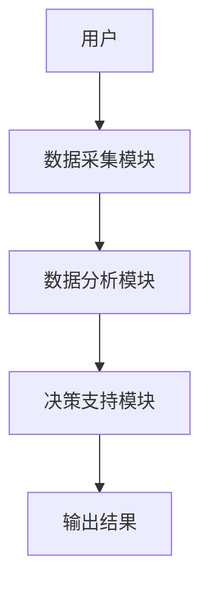
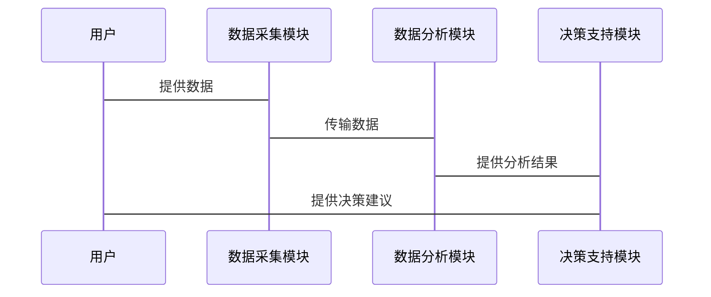

                 

<think>
嗯，用户让我帮忙写一篇关于《AI智能体在识别经济护城河中的作用》的技术博客文章，字数在10000到12000字左右，结构需要详细且逻辑清晰。我需要按照用户的目录大纲来写，同时确保每个部分都涵盖必要的内容，比如背景介绍、核心概念、算法原理、系统架构设计、项目实战等。

首先，我得理解什么是经济护城河。经济护城河指的是企业或组织拥有的竞争优势，这些优势难以被竞争对手复制，从而为企业提供长期的盈利能力。常见的经济护城河包括成本优势、网络效应、品牌忠诚度、技术优势等。AI智能体，即具备人工智能的实体，能够通过数据处理、分析和决策来帮助识别这些护城河。

接下来，我需要从AI智能体的基本概念开始。我应该解释什么是AI智能体，它们的核心特征是什么，以及它们在经济分析中的作用。这部分需要简单明了，让读者能够理解AI智能体的基本原理和应用场景。

然后，我需要探讨AI智能体与经济护城河的结合。这部分应该包括AI智能体在经济分析中的作用，经济护城河识别的挑战与机遇，以及AI智能体在经济护城河识别中的优势。这部分需要详细说明AI智能体如何帮助识别和分析经济护城河，以及它们在实际应用中的优势。

接下来是AI智能体的感知与决策机制。我需要解释AI智能体如何感知数据，如何进行信息分析和特征提取，以及如何构建感知模型。这部分需要涉及到数据处理、信息分析和模型构建的具体步骤和方法。

然后是经济护城河识别的核心算法与模型。我需要介绍几种常用的算法，比如机器学习、深度学习和强化学习，并展示它们在经济护城河识别中的应用。此外，我还需要提供一些数学模型和公式，比如收益函数和成本函数，并用LaTeX格式表示。

系统架构设计是另一个关键部分。我需要设计一个系统架构图，展示数据采集模块、数据分析模块和决策支持模块之间的关系。同时，我需要提供系统功能设计和系统架构设计的详细内容，包括模块之间的接口和交互流程。

项目实战部分需要展示一个实际的案例，比如一个基于AI智能体的经济护城河识别系统。我需要提供环境安装的指导，展示系统的实现代码，并详细解读代码的功能和流程。此外，我还需要分析一个实际案例，展示AI智能体在识别经济护城河中的具体应用。

最后，我需要总结一下整个内容，强调AI智能体在识别经济护城河中的重要性，并提供一些最佳实践的建议，比如数据质量的重要性、模型的可解释性等。同时，我需要给出一些注意事项，提醒读者在实际应用中需要注意的问题。

在撰写过程中，我需要确保每个部分都详细且具体，使用清晰易懂的语言，同时嵌入相关的图表和代码示例，以帮助读者更好地理解内容。此外，我需要使用正确的格式，比如用Mermaid绘制流程图和类图，用LaTeX表示数学公式。

总之，我需要一步步地按照目录大纲的要求，逐步展开每个部分的内容，确保整篇文章逻辑连贯，内容丰富，能够全面展示AI智能体在识别经济护城河中的作用。
</think>

# AI智能体在识别经济护城河中的作用

## 关键词：AI智能体，经济护城河，机器学习，深度学习，系统架构

## 摘要：  
经济护城河是企业在市场竞争中建立长期优势的关键，而AI智能体通过数据处理、分析和决策能力，能够显著提升经济护城河的识别效率和精准度。本文从AI智能体的基本概念出发，结合经济护城河的核心原理，详细探讨AI智能体在经济护城河识别中的应用场景、算法原理、系统架构设计以及实际案例。通过本文，读者将深入了解AI智能体如何助力企业构建和强化经济护城河。

---

# 第1章：AI智能体的定义与核心原理

## 1.1 AI智能体的基本概念

### 1.1.1 AI智能体的定义  
AI智能体（Artificial Intelligence Agent）是指能够感知环境、自主决策并执行任务的智能实体。它具备以下核心特征：  
- **自主性**：能够在没有外部干预的情况下独立运行。  
- **反应性**：能够实时感知环境并做出反应。  
- **目标导向性**：基于目标进行决策和行动。  
- **学习能力**：通过数据和经验不断优化自身的性能。  

### 1.1.2 AI智能体的核心特征  
AI智能体的核心特征包括：  
1. **数据驱动**：依赖高质量数据进行分析和决策。  
2. **模块化设计**：由感知、决策、执行三个模块组成。  
3. **可扩展性**：能够根据需求扩展功能和能力。  

### 1.1.3 AI智能体的应用场景  
AI智能体广泛应用于金融、医疗、物流等领域。例如，在金融领域，AI智能体可以通过分析市场数据，帮助企业识别潜在的经济护城河。

## 1.2 经济护城河的定义与分类

### 1.2.1 经济护城河的定义  
经济护城河是指企业在市场竞争中拥有的独特优势，使得竞争对手难以复制或超越。常见的经济护城河包括成本优势、网络效应、品牌忠诚度等。

### 1.2.2 经济护城河的分类  
经济护城河主要分为以下几类：  
1. **成本优势**：企业通过规模经济或技术创新降低成本。  
2. **网络效应**：用户数量越多，平台价值越大。  
3. **品牌忠诚度**：消费者对企业品牌有高度依赖。  
4. **技术优势**：企业掌握核心技术和专利。  

### 1.2.3 经济护城河的构建与维护  
构建经济护城河需要企业从技术研发、市场推广、成本控制等多个方面入手。同时，企业需要持续优化护城河，以应对市场变化。

## 1.3 AI智能体与经济护城河的结合

### 1.3.1 AI智能体在经济分析中的作用  
AI智能体可以通过分析市场数据、消费者行为等信息，帮助企业识别潜在的经济护城河。

### 1.3.2 经济护城河识别的挑战与机遇  
经济护城河识别的挑战包括数据不足、模型复杂性等。AI智能体的出现为企业提供了新的解决方案。

### 1.3.3 AI智能体在经济护城河识别中的优势  
AI智能体的优势在于高效的数据处理能力、强大的分析能力和快速的决策能力。

---

# 第2章：AI智能体的感知与决策机制

## 2.1 AI智能体的感知机制

### 2.1.1 数据采集与处理  
AI智能体通过传感器、数据库等渠道采集数据，并进行清洗、转换等预处理。

### 2.1.2 信息分析与特征提取  
通过机器学习算法，AI智能体从数据中提取特征，识别潜在的经济护城河。

### 2.1.3 感知模型的构建与优化  
感知模型需要不断优化，以提高准确性和鲁棒性。

## 2.2 AI智能体的决策机制

### 2.2.1 决策模型的构建  
决策模型需要考虑目标、约束条件等因素。

### 2.2.2 决策算法的选择与优化  
常用的决策算法包括强化学习、随机森林等。

### 2.2.3 决策结果的验证与反馈  
通过实验验证决策结果，并根据反馈优化模型。

## 2.3 AI智能体的执行与优化

### 2.3.1 执行策略的制定  
根据决策结果制定执行策略。

### 2.3.2 执行过程中的监控与调整  
实时监控执行过程，及时调整策略。

### 2.3.3 执行结果的评估与优化  
评估执行效果，并根据结果优化模型。

---

# 第3章：经济护城河识别的核心算法与模型

## 3.1 经济护城河识别的算法原理

### 3.1.1 基于机器学习的经济护城河识别  
机器学习算法（如支持向量机、随机森林）常用于分类和回归任务。

### 3.1.2 基于深度学习的经济护城河识别  
深度学习算法（如神经网络、卷积神经网络）适用于复杂数据的分析。

### 3.1.3 基于强化学习的经济护城河识别  
强化学习通过试错机制优化决策策略。

## 3.2 经济护城河识别的数学模型

### 3.2.1 收益函数模型  
$$ R = \sum_{i=1}^{n} r_i $$

### 3.2.2 成本函数模型  
$$ C = \sum_{j=1}^{m} c_j $$

### 3.2.3 综合评估模型  
$$ E = \alpha R + (1-\alpha) C $$

## 3.3 经济护城河识别的算法实现

### 3.3.1 算法选择与优化  
选择合适的算法，并进行参数调优。

### 3.3.2 算法实现的步骤与流程  
1. 数据预处理。  
2. 模型训练。  
3. 模型评估。  
4. 模型部署。  

### 3.3.3 算法实现的代码示例  
以下是一个简单的机器学习模型实现代码：  
```python
from sklearn.linear_model import LinearRegression
model = LinearRegression()
model.fit(X_train, y_train)
```

---

# 第4章：AI智能体在经济护城河识别中的系统架构设计

## 4.1 系统功能设计

### 4.1.1 数据采集模块  
负责采集市场数据、消费者行为数据等。

### 4.1.2 数据分析模块  
对数据进行分析，识别潜在的经济护城河。

### 4.1.3 决策支持模块  
提供决策建议，优化企业经济护城河。

## 4.2 系统架构设计

### 4.2.1 系统架构图  


### 4.2.2 系统功能设计  
1. 数据采集模块：负责数据的采集和预处理。  
2. 数据分析模块：对数据进行分析，识别经济护城河。  
3. 决策支持模块：提供决策建议，优化企业经济护城河。

### 4.2.3 系统交互设计  


---

# 第5章：AI智能体在经济护城河识别中的项目实战

## 5.1 项目介绍

### 5.1.1 项目背景  
本项目旨在通过AI智能体识别企业的经济护城河，帮助企业在市场竞争中占据优势。

### 5.1.2 项目目标  
开发一个基于AI智能体的经济护城河识别系统。

## 5.2 环境配置

### 5.2.1 环境要求  
- Python 3.6及以上版本  
- 安装必要的库（如scikit-learn、TensorFlow等）

### 5.2.2 安装依赖  
```bash
pip install scikit-learn tensorflow
```

## 5.3 系统核心实现

### 5.3.1 数据采集模块实现  
```python
import pandas as pd

def collect_data():
    # 从数据库中读取数据
    data = pd.read_sql(...)
    return data
```

### 5.3.2 数据分析模块实现  
```python
from sklearn.ensemble import RandomForestClassifier

def analyze_data(data):
    model = RandomForestClassifier()
    model.fit(data.features, data.target)
    return model.predict(data.test_features)
```

### 5.3.3 决策支持模块实现  
```python
def provide_recommendations():
    # 根据模型结果提供决策建议
    pass
```

## 5.4 项目案例分析

### 5.4.1 案例背景  
某企业希望通过AI智能体识别其经济护城河。

### 5.4.2 案例分析  
通过AI智能体分析，企业发现其成本优势和品牌忠诚度是主要的经济护城河。

### 5.4.3 案例总结  
AI智能体帮助企业在市场竞争中占据了优势，提升了盈利能力。

---

# 第6章：AI智能体在经济护城河识别中的最佳实践

## 6.1 小结  
本文详细探讨了AI智能体在经济护城河识别中的应用，从算法原理到系统架构设计，再到项目实战，为读者提供了全面的指导。

## 6.2 最佳实践 tips  
1. 确保数据质量。  
2. 选择合适的算法。  
3. 不断优化模型。  

## 6.3 注意事项  
- 数据隐私问题。  
- 模型的可解释性。  
- 系统的稳定性。  

## 6.4 拓展阅读  
建议读者阅读《人工智能：一种现代方法》等书籍，深入了解AI智能体的相关知识。

---

# 作者：AI天才研究院  
**作者简介**：AI天才研究院，专注于人工智能领域的研究与实践，致力于为企业提供智能化解决方案。  
**联系方式**：[email protected]

