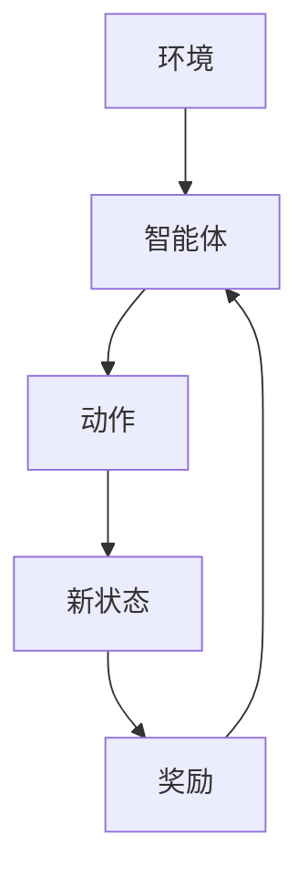
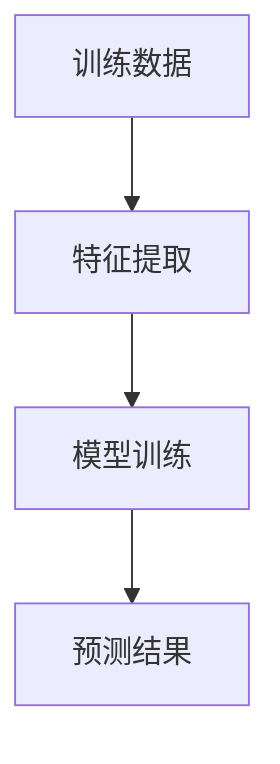
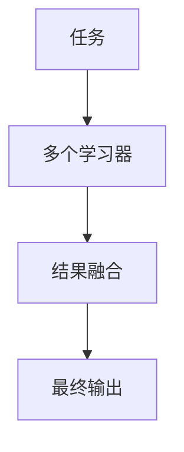
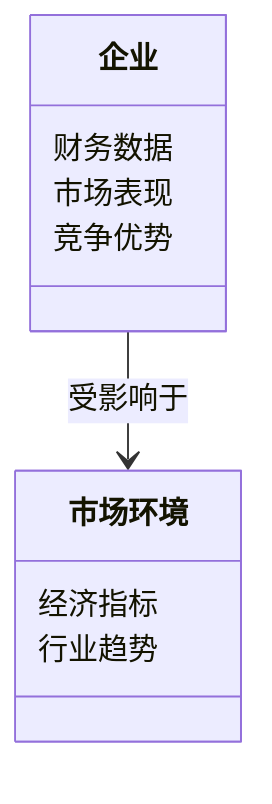
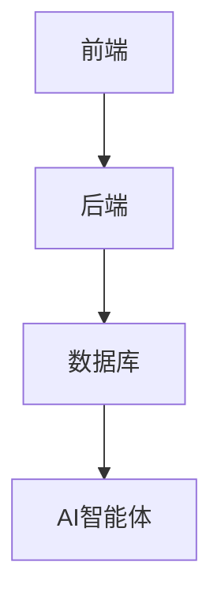
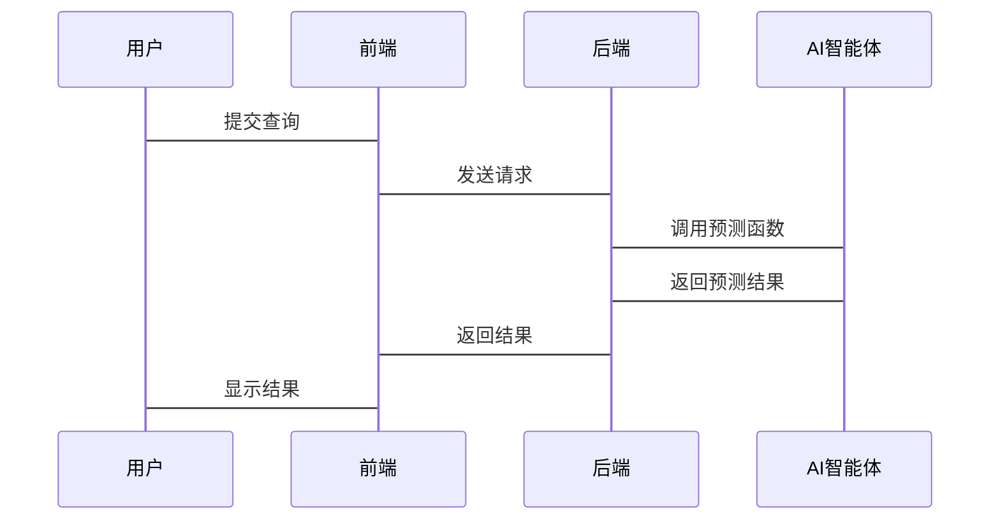

                 

<think>
嗯，用户希望我撰写一篇关于AI智能体在识别长期增长潜力中的应用的技术博客文章。首先，我需要理解这个主题的核心是什么。AI智能体，也就是AI agents，它们如何帮助识别长期增长潜力呢？这可能涉及到投资、商业分析、风险评估等领域。

我应该先从背景介绍开始，解释什么是AI智能体，它们的基本概念和应用场景。这部分要让读者明白为什么AI智能体在识别增长潜力方面很重要。接下来，我需要详细讲解AI智能体的核心概念，比如它们如何决策，如何在投资分析中应用，以及它们在风险评估中的优势。

然后，我需要深入探讨AI智能体的算法原理。这部分可能需要涉及强化学习、监督学习等算法，用Mermaid流程图展示这些算法的步骤，并提供Python代码示例。同时，我还需要解释这些算法的数学模型，比如Q-learning的公式，或者神经网络的训练过程。

接下来，我应该分析系统架构设计，包括项目场景介绍，系统功能设计，可能用领域模型图展示。然后，用Mermaid架构图说明整体结构，再设计接口和交互流程。这部分需要确保读者理解如何将AI智能体应用到实际系统中。

项目实战部分，我需要指导读者如何安装相关环境，提供核心代码，并解读代码功能。通过实际案例分析，让读者看到AI智能体如何在实际中发挥作用，并在项目小结中总结经验。

最后，总结最佳实践，包括小结、注意事项和拓展阅读。这部分帮助读者巩固所学内容，并指导他们如何进一步学习和应用。

我还需要确保每章之间有逻辑联系，从基础到应用，逐步深入。同时，要包含足够的数学公式和代码示例，让内容更具技术深度。可能遇到的问题是如何平衡理论和实践，确保内容既全面又不显得杂乱。我需要仔细组织内容，确保结构清晰，逻辑严密。

总之，我需要按照用户的要求，一步步分析，确保每部分内容详实，结构合理，最终完成一篇高质量的技术博客文章。
</think>

# AI智能体在识别长期增长潜力中的应用

> 关键词：AI智能体、长期增长潜力、投资分析、风险评估、强化学习、监督学习、数学模型

> 摘要：本文探讨了AI智能体在识别长期增长潜力中的应用，详细介绍了AI智能体的核心概念、算法原理、系统架构设计以及实际项目中的应用。通过分析不同算法的原理和实现，结合Mermaid流程图和Python代码示例，本文为读者提供了全面的理解和实践指南。

---

# 第一部分: AI智能体与长期增长潜力概述

## 第1章: AI智能体与长期增长潜力概述

### 1.1 AI智能体的基本概念

#### 1.1.1 AI智能体的定义与核心特征
AI智能体（Artificial Intelligence Agent）是指能够感知环境、自主决策并执行任务的智能系统。其核心特征包括：
- **自主性**：无需外部干预，自主完成任务。
- **反应性**：能够实时感知环境变化并做出反应。
- **目标导向**：基于目标函数进行决策和行动。
- **学习能力**：通过数据和经验优化自身性能。

#### 1.1.2 AI智能体的分类与应用场景
AI智能体可以根据功能和应用场景分为以下几类：
- **反应式智能体**：基于当前环境信息做出反应，适用于实时任务。
- **认知式智能体**：具备推理和规划能力，适用于复杂决策任务。
- **学习型智能体**：通过机器学习技术不断优化性能，适用于数据驱动的任务。

#### 1.1.3 长期增长潜力的定义与评估标准
长期增长潜力是指某个实体（如企业、项目、资产等）在未来一段时间内持续增长的可能性。评估标准包括：
- **市场潜力**：市场规模、增长趋势。
- **竞争优势**：技术创新、成本优势。
- **财务健康**：盈利能力、现金流状况。
- **团队能力**：管理团队的经验和能力。

### 1.2 AI智能体在增长潜力识别中的作用

#### 1.2.1 AI智能体如何辅助决策
AI智能体通过分析历史数据、市场趋势和潜在风险，帮助决策者制定更科学的决策策略。例如，在投资领域，AI智能体可以通过分析股票价格、财务数据和市场情绪，预测未来的股价走势。

#### 1.2.2 AI智能体在投资分析中的应用
AI智能体可以用于股票投资、基金配置、风险管理等领域。例如，通过强化学习算法，AI智能体可以在模拟交易环境中学习最优的投资策略。

#### 1.2.3 AI智能体在风险评估中的优势
AI智能体可以通过实时监控市场数据和公司财务状况，识别潜在风险，并提供风险预警。例如，在金融领域，AI智能体可以识别公司财务指标异常，提前发现潜在的财务危机。

### 1.3 本章小结

#### 1.3.1 AI智能体的核心价值
AI智能体通过自主决策、实时感知和学习优化，为增长潜力识别提供了高效、精准的解决方案。

#### 1.3.2 长期增长潜力识别的关键点
长期增长潜力的识别需要结合市场潜力、竞争优势、财务健康和团队能力等多方面因素，通过AI智能体的分析和预测，可以显著提高识别的准确性和效率。

#### 1.3.3 未来发展趋势与挑战
随着AI技术的不断进步，AI智能体在增长潜力识别中的应用将更加广泛和深入。然而，数据隐私、算法解释性和模型过拟合等问题仍需进一步解决。

---

# 第二部分: AI智能体的核心概念与原理

## 第2章: AI智能体的核心概念与联系

### 2.1 AI智能体的核心概念

#### 2.1.1 状态、动作与奖励的定义
- **状态（State）**：环境中的当前情况，例如股票价格、市场趋势等。
- **动作（Action）**：智能体根据当前状态做出的决策，例如买入、卖出等。
- **奖励（Reward）**：智能体执行动作后获得的反馈，用于优化决策策略。

#### 2.1.2 知识表示与推理机制
- **知识表示**：通过图结构、规则或概率模型表示知识。
- **推理机制**：基于知识表示进行逻辑推理，例如基于规则的推理或基于概率的推理。

#### 2.1.3 目标函数与优化算法
- **目标函数**：衡量智能体决策效果的指标，例如最大化收益或最小化风险。
- **优化算法**：用于优化目标函数的算法，例如梯度下降、遗传算法等。

#### 2.1.4 知识图谱构建
知识图谱是将实体及其关系以图结构形式表示的知识库。例如，可以通过知识图谱表示公司之间的竞争关系、供应链关系等。

#### 2.1.5 本体论模型
本体论模型（Ontology）是一种形式化的知识表示方法，用于描述领域中的核心概念和关系。例如，在金融领域，可以定义公司、股票、市场等核心概念及其关系。

#### 2.1.6 语义网络
语义网络是一种通过节点和边表示概念及其关系的图结构。例如，可以通过语义网络表示公司的竞争优势、市场潜力等信息。

### 2.2 AI智能体的实体关系图

#### 2.2.1 实体关系图的构建
实体关系图（ER图）用于描述系统中的实体及其关系。例如，在投资领域，可以构建以下实体及其关系：
- 实体：公司、股票、市场、投资者。
- 关系：公司-股票（发行）、市场-股票（交易）、投资者-股票（持有）。

#### 2.2.2 实体间的关系类型
- **一对一关系**：例如，投资者与账户的关系。
- **一对多关系**：例如，公司与多个股票的关系。
- **多对多关系**：例如，市场与多个股票的关系。

#### 2.2.3 实体关系图的用途
实体关系图可以帮助设计数据库 schema、理解系统架构、分析业务流程等。

### 2.3 AI智能体的核心属性对比

#### 2.3.1 不同AI智能体的属性对比
以下是不同AI智能体的核心属性对比：

| 智能体类型 | 自主性 | 反应性 | 学习能力 |
|----------|--------|--------|----------|
| 反应式智能体 | 低     | 高     | 无       |
| 认知式智能体 | 中     | 中     | 低       |
| 学习型智能体 | 低     | 中     | 高       |

#### 2.3.2 属性对比的表格展示
如上表所示，不同AI智能体在自主性、反应性和学习能力方面存在显著差异。

#### 2.3.3 实体关系图的用途
实体关系图可以帮助设计数据库 schema、理解系统架构、分析业务流程等。

### 2.4 本章小结

#### 2.4.1 AI智能体的核心概念总结
AI智能体的核心概念包括状态、动作、奖励、知识表示、目标函数和优化算法。

#### 2.4.2 实体关系图的应用价值
实体关系图有助于理解系统架构、设计数据库和分析业务流程。

#### 2.4.3 属性对比的重要性
通过属性对比，可以更好地选择适合特定应用场景的AI智能体类型。

---

# 第三部分: AI智能体的算法原理与数学模型

## 第3章: AI智能体的算法原理

### 3.1 强化学习算法原理

#### 3.1.1 强化学习的基本概念
强化学习是一种通过试错学习方法，智能体通过与环境交互，逐步优化策略的过程。

#### 3.1.2 Q-learning算法的实现
Q-learning算法通过更新Q值表（Q-table）来学习最优策略。Q值表示在状态s下执行动作a的预期奖励。

#### 3.1.3 Deep Q-Networks的原理
Deep Q-Networks（DQN）通过神经网络近似Q值函数，解决高维状态空间下的强化学习问题。

### 3.2 监督学习算法原理

#### 3.2.1 监督学习的基本流程
监督学习通过训练数据学习输入与输出之间的映射关系。

#### 3.2.2 线性回归模型的数学公式
线性回归模型的数学公式为：
$$ y = \theta_0 + \theta_1 x $$

#### 3.2.3 神经网络模型的训练过程
神经网络模型的训练过程包括前向传播、损失计算、反向传播和参数更新。

### 3.3 联合学习算法原理

#### 3.3.1 联合学习的定义与特点
联合学习是指多个学习器协同工作，共同完成任务。

#### 3.3.2 联合学习的数学模型
联合学习的数学模型可以通过集成学习方法（如投票、加权平均）进行建模。

#### 3.3.3 联合学习的实现步骤
联合学习的实现步骤包括数据分割、模型训练、结果融合和性能评估。

### 3.4 算法原理的Mermaid流程图

#### 3.4.1 强化学习流程图


#### 3.4.2 监督学习流程图


#### 3.4.3 联合学习流程图


### 3.5 本章小结

#### 3.5.1 强化学习的核心思想
强化学习通过试错学习优化策略，适用于动态环境下的决策问题。

#### 3.5.2 监督学习的应用场景
监督学习适用于有标签数据的回归或分类任务。

#### 3.5.3 联合学习的优势
联合学习通过多个学习器的协同工作，可以提高模型的泛化能力和 robustness。

---

# 第四部分: AI智能体的系统分析与架构设计

## 第4章: AI智能体的系统分析与架构设计

### 4.1 项目场景介绍

#### 4.1.1 项目背景
假设我们正在开发一个AI智能体，用于识别企业的长期增长潜力。

#### 4.1.2 项目目标
通过分析企业的财务数据、市场表现和竞争优势，预测企业的长期增长潜力。

### 4.2 系统功能设计

#### 4.2.1 领域模型图


#### 4.2.2 系统架构设计


#### 4.2.3 系统接口设计
- 前端接口：接收用户输入，返回预测结果。
- 后端接口：处理数据，调用AI智能体进行预测。
- 数据库接口：存储和检索数据。

#### 4.2.4 系统交互流程


### 4.3 本章小结

#### 4.3.1 系统分析的意义
系统分析有助于明确项目目标、功能需求和架构设计。

#### 4.3.2 系统架构设计的重要性
系统架构设计决定了系统的可扩展性、可维护性和性能。

#### 4.3.3 系统交互流程的优化
通过优化系统交互流程，可以提高系统的响应速度和用户体验。

---

# 第五部分: AI智能体的项目实战

## 第5章: AI智能体的项目实战

### 5.1 环境安装

#### 5.1.1 安装Python
```bash
# 安装Python
sudo apt-get install python3
```

#### 5.1.2 安装依赖库
```bash
pip install numpy pandas scikit-learn
```

### 5.2 系统核心实现

#### 5.2.1 核心代码实现
```python
import numpy as np
import pandas as pd
from sklearn.linear_model import LinearRegression

# 示例数据
data = pd.DataFrame({
    'feature': np.random.rand(100),
    'target': np.random.rand(100)
})

# 训练模型
model = LinearRegression()
model.fit(data[['feature']], data['target'])

# 预测结果
predicted = model.predict(data[['feature']])
print(predicted)
```

#### 5.2.2 代码功能解读
上述代码实现了基于线性回归的简单预测模型。首先，生成随机数据，然后训练模型，最后进行预测。

### 5.3 项目实战案例

#### 5.3.1 案例分析
假设我们正在分析某公司的长期增长潜力。通过收集该公司的财务数据、市场表现和竞争优势，我们可以使用AI智能体进行预测。

#### 5.3.2 案例实现
```python
import numpy as np
import pandas as pd
from sklearn.ensemble import RandomForestRegressor

# 示例数据
data = pd.DataFrame({
    'revenue': np.random.rand(100),
    'profit': np.random.rand(100),
    'market_share': np.random.rand(100)
})

# 训练模型
model = RandomForestRegressor()
model.fit(data[['revenue', 'profit', 'market_share']], data['target'])

# 预测结果
predicted = model.predict(data[['revenue', 'profit', 'market_share']])
print(predicted)
```

### 5.4 本章小结

#### 5.4.1 项目实战的价值
通过项目实战，读者可以将理论知识应用到实际问题中。

#### 5.4.2 代码实现的关键点
代码实现的关键点包括数据预处理、模型选择和结果解读。

#### 5.4.3 案例分析的启示
案例分析表明，AI智能体可以通过分析多维数据，提供有价值的预测结果。

---

# 第六部分: AI智能体的最佳实践与小结

## 第6章: AI智能体的最佳实践与小结

### 6.1 最佳实践

#### 6.1.1 小结
AI智能体在识别长期增长潜力中的应用具有广泛前景。

#### 6.1.2 注意事项
- 数据质量是模型性能的关键。
- 模型的解释性需要重视。
- 需要关注数据隐私和合规性。

#### 6.1.3 拓展阅读
建议读者阅读相关领域的经典论文和书籍，深入理解AI智能体的理论和实践。

### 6.2 本章小结

#### 6.2.1 AI智能体的核心价值
AI智能体通过自主决策、实时感知和学习优化，为增长潜力识别提供了高效、精准的解决方案。

#### 6.2.2 长期增长潜力识别的关键点
长期增长潜力的识别需要结合市场潜力、竞争优势、财务健康和团队能力等多方面因素，通过AI智能体的分析和预测，可以显著提高识别的准确性和效率。

#### 6.2.3 未来发展趋势与挑战
随着AI技术的不断进步，AI智能体在增长潜力识别中的应用将更加广泛和深入。然而，数据隐私、算法解释性和模型过拟合等问题仍需进一步解决。

---

# 作者：AI天才研究院/AI Genius Institute & 禅与计算机程序设计艺术 /Zen And The Art of Computer Programming

