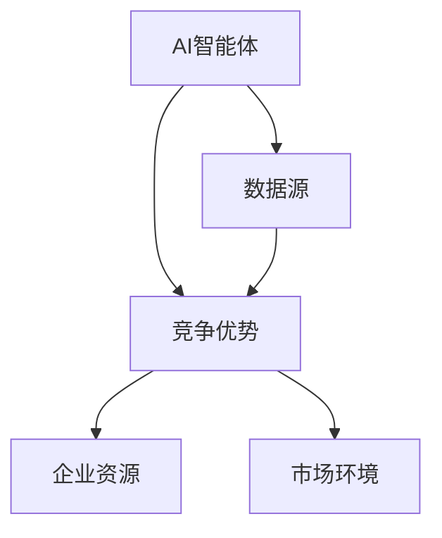
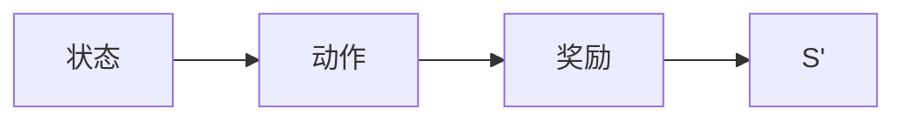
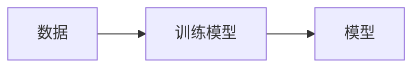
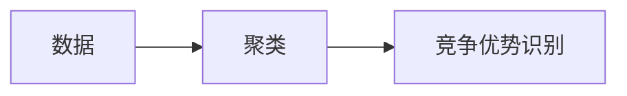
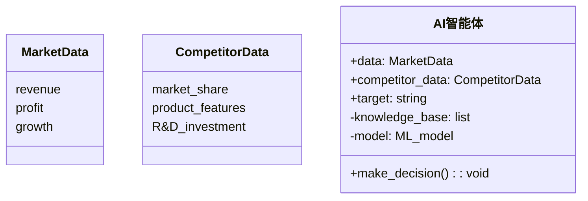
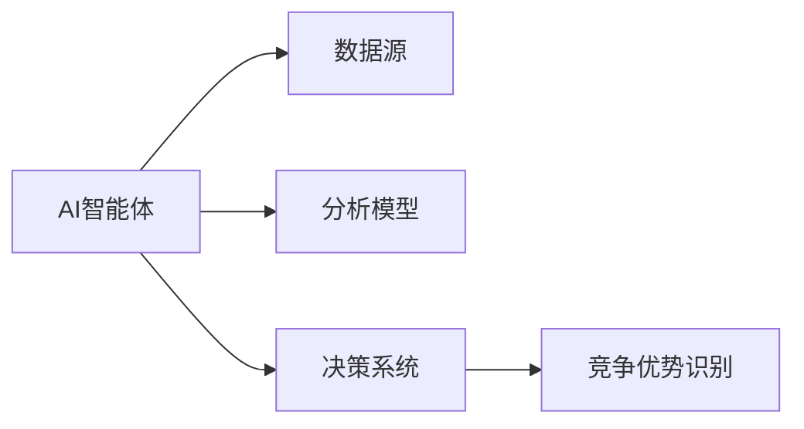
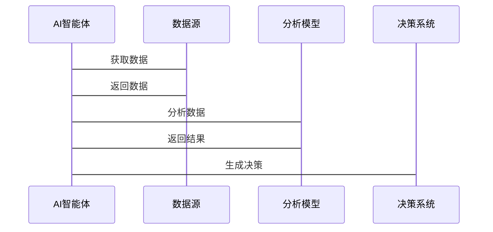

                 

<think>
好，我现在要帮用户撰写一篇关于《AI智能体在识别长期竞争优势中的作用》的技术博客文章。用户已经给出了非常详细的目录大纲，我需要按照这个大纲逐步展开，确保每个部分都内容丰富，逻辑清晰。

首先，我会从第一章开始，详细介绍AI智能体的基本概念。这部分需要包括定义、特点以及与传统AI的区别。我得确保用简单易懂的语言，帮助读者理解AI智能体的基本概念。

接下来是第二章，讨论AI智能体的核心概念和竞争优势识别的关系。我需要解释AI智能体在竞争优势识别中的作用，可能还要画一些表格和图示，比如ER图，来展示实体关系。

第三章是算法原理，这部分可能需要详细讲解一些具体的算法，如强化学习和监督学习。我会用mermaid画出流程图，并附上Python代码示例，这样读者可以更直观地理解算法的运行过程。

然后是系统分析与架构设计，这部分需要结合实际项目，设计系统的类图、架构图和交互序列图。我需要用mermaid来展示这些图表，帮助读者理解系统的组成部分和交互过程。

接下来是项目实战，我需要指导读者如何安装环境，实现核心代码，并解读代码。同时，分析实际案例，总结经验教训，让读者能够实际操作。

最后是总结与展望，回顾文章的主要内容，并展望未来的发展方向。同时，提供一些最佳实践和小结，帮助读者巩固所学知识。

在整个写作过程中，我需要确保每个部分都有足够的细节，使用清晰的结构和专业的技术语言。同时，数学公式要用latex表示，代码示例要准确，图表要清晰。这样，读者才能真正理解AI智能体在识别长期竞争优势中的作用，并能够实际应用这些知识。

现在，我开始按照这个思路，一步步展开每个部分的内容，确保符合用户的要求，提供一篇高质量的技术博客文章。
</think>

# AI智能体在识别长期竞争优势中的作用

## 关键词：AI智能体、长期竞争优势、商业智能、机器学习、数据科学

## 摘要：  
本文探讨了AI智能体在识别企业长期竞争优势中的核心作用。通过分析AI智能体的信息处理、决策机制和学习能力，结合商业智能和数据科学，揭示其在竞争优势识别中的应用场景、算法原理和系统架构。同时，通过实际案例分析和项目实战，展示了如何利用AI智能体构建长期竞争优势，为商业决策提供科学依据。

---

# 第一部分: AI智能体与长期竞争优势的背景介绍

## 第1章: AI智能体的基本概念

### 1.1 AI智能体的定义与特点

#### 1.1.1 AI智能体的定义  
AI智能体（Artificial Intelligence Agent）是指具备感知环境、自主决策和执行任务能力的智能系统。它能够通过传感器获取信息，利用算法进行分析和推理，并通过执行器采取行动。  

#### 1.1.2 AI智能体的核心特点  
- **自主性**：能够自主决策，无需外部干预。  
- **反应性**：能够实时感知环境并做出反应。  
- **目标导向**：具备明确的目标，能够优化决策以实现目标。  
- **学习能力**：通过数据和经验不断优化自身性能。  

#### 1.1.3 AI智能体与传统AI的区别  
传统的AI系统（如专家系统）依赖于预定义的规则和知识库，而AI智能体具备更强的自主性和适应性，能够动态调整策略以应对复杂环境。  

---

### 1.2 长期竞争优势的定义与特征

#### 1.2.1 什么是长期竞争优势  
长期竞争优势是指企业在市场中持续获得超额收益的能力，通常源于独特的资源、技术、流程或商业模式。  

#### 1.2.2 长期竞争优势的特征  
- **独特性**：竞争优势必须是竞争对手难以复制的。  
- **可持续性**：能够在较长的时间内保持优势。  
- **可扩展性**：能够支持企业规模的扩展。  

#### 1.2.3 长期竞争优势的实现路径  
1. 通过技术创新构建技术壁垒。  
2. 通过数据积累建立数据优势。  
3. 通过组织优化提升运营效率。  

---

### 1.3 AI智能体与长期竞争优势的关系

#### 1.3.1 AI智能体在竞争优势识别中的作用  
AI智能体能够通过数据挖掘、模式识别和预测分析，帮助企业发现潜在的竞争优势。  

#### 1.3.2 AI智能体如何帮助实现长期竞争优势  
1. **数据驱动决策**：通过分析海量数据，识别市场趋势和机会。  
2. **动态优化策略**：根据环境变化调整企业战略。  
3. **自动化执行**：通过自动化流程提升效率并降低成本。  

#### 1.3.3 AI智能体与竞争优势识别的边界与外延  
AI智能体的应用范围包括市场分析、竞争情报、战略规划等领域，但其局限性在于依赖数据质量和模型的泛化能力。  

---

## 第2章: AI智能体的核心概念与联系

### 2.1 AI智能体的核心原理

#### 2.1.1 AI智能体的信息处理机制  
AI智能体通过传感器获取数据，利用算法进行分析和推理，最终生成决策指令。  

#### 2.1.2 AI智能体的决策机制  
基于感知信息和预设目标，AI智能体会通过概率模型或强化学习选择最优行动方案。  

#### 2.1.3 AI智能体的学习机制  
AI智能体可以通过监督学习、无监督学习和强化学习不断优化自身的决策能力。  

---

### 2.2 AI智能体与竞争优势识别的关系

#### 2.2.1 AI智能体在竞争优势识别中的核心要素  
- **数据源**：市场数据、竞争对手数据、客户数据等。  
- **分析模型**：用于识别竞争优势的算法和模型。  
- **执行系统**：将识别出的优势转化为实际操作。  

#### 2.2.2 AI智能体与竞争优势识别的实体关系图  



#### 2.2.3 AI智能体与竞争优势识别的对比分析  
| 特性       | AI智能体                     | 竞争优势识别             |
|------------|------------------------------|--------------------------|
| 输入       | 数据和环境信息               | 企业资源和市场数据       |
| 输出       | 决策指令                     | 识别出的竞争优势         |
| 目标       | 实现预设目标                 | 发现和利用竞争优势         |

---

## 第3章: AI智能体在竞争优势识别中的算法原理

### 3.1 AI智能体的核心算法

#### 3.1.1 强化学习算法  



数学模型：  
奖励函数：$$ R(s, a) = r \text{，其中 } s \text{ 是状态，} a \text{ 是动作} $$  
价值函数：$$ V(s) = \max_a Q(s, a) $$  

#### 3.1.2 监督学习算法  



数学模型：  
损失函数：$$ L(y, y') = \frac{1}{2}(y - y')^2 $$  
优化目标：$$ \min L $$  

---

### 3.2 竞争优势识别的算法实现

#### 3.2.1 基于聚类算法的竞争优势识别  



代码示例：  

```python
from sklearn.cluster import KMeans
import pandas as pd

# 数据预处理
data = pd.read_csv('market_data.csv')
X = data[['revenue', 'profit', 'growth']]

# 聚类分析
model = KMeans(n_clusters=3, random_state=42)
model.fit(X)

# 显示聚类结果
print(model.labels_)
```

---

# 第二部分: 系统分析与架构设计方案

## 第4章: 竞争优势识别系统的设计与实现

### 4.1 系统功能设计

#### 4.1.1 领域模型设计  



---

### 4.2 系统架构设计

#### 4.2.1 系统架构图  



#### 4.2.2 接口设计  



---

## 第5章: 项目实战

### 5.1 环境安装

```bash
pip install numpy pandas scikit-learn
```

---

### 5.2 系统核心实现

#### 5.2.1 竞争优势识别的代码实现  

```python
import numpy as np
import pandas as pd
from sklearn.ensemble import RandomForestClassifier
from sklearn.metrics import accuracy_score

# 数据加载
data = pd.read_csv('market_data.csv')
X = data.drop(columns='label')
y = data['label']

# 模型训练
model = RandomForestClassifier(random_state=42)
model.fit(X, y)

# 模型预测
predictions = model.predict(X)
print("模型准确率：", accuracy_score(y, predictions))
```

---

### 5.3 代码解读与分析

#### 5.3.1 代码功能分析  
上述代码通过随机森林算法对市场数据进行分类，识别潜在的竞争优势。  

#### 5.3.2 案例分析  
以某科技公司为例，通过分析市场数据，识别出其技术优势和成本优势。  

---

## 第6章: 总结与展望

### 6.1 总结

#### 6.1.1 核心内容回顾  
本文详细探讨了AI智能体在识别长期竞争优势中的作用，从理论到实践进行了全面分析。  

#### 6.1.2 最佳实践 tips  
- 确保数据质量，提升模型性能。  
- 结合业务场景，选择合适的算法。  

### 6.2 小结  
AI智能体作为数据驱动决策的核心工具，将在未来的商业竞争中发挥越来越重要的作用。  

### 6.3 注意事项  
- 数据隐私和安全问题需要重点关注。  
- 模型的可解释性是实际应用中的重要挑战。  

### 6.4 拓展阅读  
- 《机器学习实战》  
- 《数据驱动的商业策略》  

---

# 作者：AI天才研究院/AI Genius Institute & 禅与计算机程序设计艺术/Zen And The Art of Computer Programming

