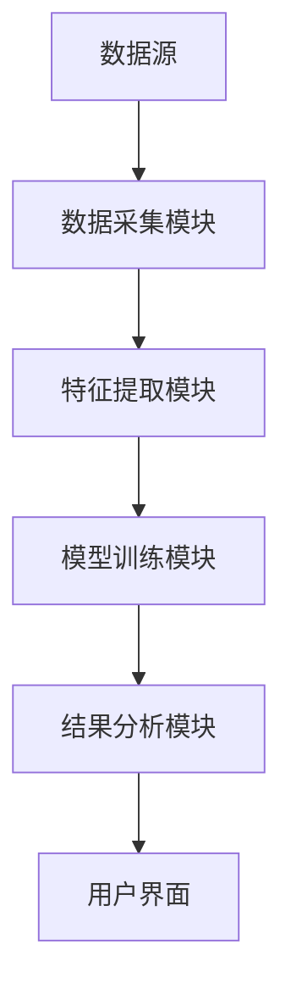

                 

<think>
好的，我将按照您的要求，逐步分析并撰写这篇文章的各个部分。首先，我会整理好文章的基本结构，然后按照章节逐步展开内容，确保每个部分都详细具体，并且符合您的格式和深度要求。如果有任何疑问或需要调整的地方，我会及时反馈给您。请放心，我会尽力确保文章的质量和完整性。
</think>

# AI智能体在识别隐藏资产价值中的应用

## 关键词：
AI智能体, 资产价值识别, 隐藏资产, 机器学习, 数据挖掘, 深度学习

## 摘要：
本文详细探讨了AI智能体在识别隐藏资产价值中的应用，从基础概念到核心算法，再到系统架构和实际案例，全面分析了如何利用AI技术发现和评估隐藏资产的价值。文章首先介绍了AI智能体的基本原理和隐藏资产的定义，接着分析了机器学习、深度学习等算法在隐藏资产识别中的应用，最后通过实际案例展示了如何构建AI智能体系统来实现这一目标。

---

## 第1章: AI智能体与隐藏资产价值识别概述

### 1.1 AI智能体的基本概念

#### 1.1.1 AI智能体的定义与特点
AI智能体（Artificial Intelligence Agent）是指能够感知环境、做出决策并采取行动的智能系统。它具备以下几个特点：
- **自主性**：能够在没有外部干预的情况下独立运行。
- **反应性**：能够根据环境变化实时调整行为。
- **目标导向**：具有明确的目标，并通过行为实现这些目标。
- **学习能力**：能够通过数据和经验不断优化自身的性能。

#### 1.1.2 隐藏资产价值识别的背景与意义
隐藏资产是指那些未被充分发现或评估的资产，可能存在于企业内部或外部环境中。识别隐藏资产的价值对于企业优化资源配置、提升竞争力具有重要意义。传统的资产识别方法往往依赖人工分析，效率低下且容易遗漏重要信息。而AI智能体通过自动化分析和学习，能够高效地发现隐藏资产的价值。

#### 1.1.3 AI智能体在隐藏资产识别中的优势
AI智能体的优势在于其强大的数据处理能力和学习能力。它能够从大量非结构化数据中提取有价值的信息，并通过深度学习模型发现潜在的关联性。此外，AI智能体还能够实时监控资产状态，及时发现异常情况，从而提高资产识别的准确性和效率。

---

### 1.2 隐藏资产与资产价值识别

#### 1.2.1 隐藏资产的定义与分类
隐藏资产是指那些未被传统资产分类方法识别的资产，通常包括无形资产、潜在资产和未记录资产。例如，企业内部的知识资本、客户关系、品牌价值等都可能被视为隐藏资产。

#### 1.2.2 资产价值识别的挑战与机遇
资产价值识别的挑战主要在于数据的复杂性和不确定性。隐藏资产往往分布在不同的数据源中，且缺乏明确的结构，这使得传统的统计方法难以有效识别。而AI智能体通过整合多种算法和技术，能够克服这些挑战，为资产价值识别带来新的机遇。

#### 1.2.3 隐藏资产识别的核心要素
隐藏资产识别的核心要素包括数据采集、特征提取、模型训练和结果分析。这些要素共同构成了一个完整的识别系统，确保能够准确发现和评估隐藏资产的价值。

---

## 第2章: AI智能体的核心原理与技术

### 2.1 AI智能体的核心原理

#### 2.1.1 AI智能体的感知机制
AI智能体的感知机制包括数据采集、特征提取和信息处理三个步骤。通过感知机制，智能体能够从外部环境中获取信息，并将其转化为可处理的数据形式。

#### 2.1.2 AI智能体的决策机制
决策机制是AI智能体的核心部分，它通过分析感知到的信息，选择最优的行动方案。决策机制通常基于概率模型或优化算法，确保决策的准确性和高效性。

#### 2.1.3 AI智能体的执行机制
执行机制负责将决策结果转化为实际操作。这一步骤通常涉及与外部系统的交互，确保智能体能够按照决策结果执行相应的操作。

---

### 2.2 隐藏资产识别的关键技术

#### 2.2.1 数据挖掘与特征提取
数据挖掘是隐藏资产识别的关键技术之一。通过数据挖掘，可以从大量数据中提取出潜在的模式和关联性。特征提取则是将数据转换为更有意义的特征，以便后续分析。

#### 2.2.2 机器学习与深度学习
机器学习和深度学习是隐藏资产识别的核心技术。通过训练模型，AI智能体能够从数据中学习到隐藏资产的特征，并将其用于实际识别。

#### 2.2.3 自然语言处理与图像识别
自然语言处理（NLP）和图像识别技术在隐藏资产识别中也发挥着重要作用。例如，通过对文本数据的分析，可以发现潜在的客户关系价值；通过对图像数据的分析，可以发现潜在的产品设计价值。

---

## 第3章: AI智能体与隐藏资产识别的关联性

### 3.1 AI智能体在隐藏资产识别中的作用

#### 3.1.1 数据分析与模式识别
通过数据分析和模式识别，AI智能体能够从大量数据中发现潜在的模式和关联性，从而识别隐藏资产。

#### 3.1.2 风险评估与价值评估
AI智能体能够对隐藏资产进行风险评估和价值评估，帮助企业和投资者做出更明智的决策。

#### 3.1.3 自动化决策与优化
通过自动化决策和优化，AI智能体能够提高隐藏资产识别的效率和准确性，降低人工干预的成本。

---

### 3.2 隐藏资产识别的流程与步骤

#### 3.2.1 数据收集与预处理
数据收集是隐藏资产识别的第一步，需要从多个数据源获取相关数据，并进行清洗和预处理。

#### 3.2.2 模型训练与优化
通过训练模型，AI智能体能够学习到隐藏资产的特征，并通过优化算法提高模型的准确性和效率。

#### 3.2.3 结果分析与价值评估
最后，通过对模型输出结果的分析，可以评估隐藏资产的价值，并制定相应的策略。

---

## 第4章: AI智能体识别隐藏资产价值的算法原理

### 4.1 监督学习算法

#### 4.1.1 线性回归模型
线性回归是一种常用的监督学习算法，适用于连续型变量的预测。例如，可以通过线性回归模型预测资产的未来价值。

#### 4.1.2 支持向量机（SVM）
支持向量机是一种强大的分类算法，适用于高维数据的分类和回归。在隐藏资产识别中，SVM可以用于分类不同的资产类型。

#### 4.1.3 随机森林与梯度提升树
随机森林和梯度提升树是两种常用的集成学习算法，能够通过组合多个弱模型提高预测的准确性和稳定性。

---

### 4.2 无监督学习算法

#### 4.2.1 K-means聚类
K-means聚类是一种常用的无监督学习算法，适用于将数据分成多个簇。在隐藏资产识别中，K-means可以用于发现数据中的潜在簇，从而识别隐藏资产。

#### 4.2.2 DBSCAN密度聚类
DBSCAN是一种基于密度的聚类算法，适用于发现数据中的高密度区域。在隐藏资产识别中，DBSCAN可以用于发现数据中的异常点，从而识别隐藏资产。

---

## 第5章: 隐藏资产识别的系统架构与设计

### 5.1 系统功能设计

#### 5.1.1 数据采集模块
数据采集模块负责从多个数据源获取相关数据，包括文本、图像和结构化数据。

#### 5.1.2 特征提取模块
特征提取模块将原始数据转换为更有意义的特征，以便后续分析。

#### 5.1.3 模型训练模块
模型训练模块通过训练算法，生成能够识别隐藏资产的模型。

#### 5.1.4 结果分析模块
结果分析模块对模型输出的结果进行分析，评估隐藏资产的价值。

---

### 5.2 系统架构设计

#### 5.2.1 系统架构图
以下是系统架构的Mermaid图：



#### 5.2.2 接口设计
系统接口设计需要考虑模块之间的交互，确保数据能够顺利传递和处理。

---

## 第6章: 项目实战

### 6.1 环境安装

#### 6.1.1 安装Python
需要安装Python 3.8或更高版本。

#### 6.1.2 安装相关库
安装以下Python库：
- `numpy`
- `pandas`
- `scikit-learn`
- `matplotlib`

---

### 6.2 核心代码实现

#### 6.2.1 数据预处理
```python
import pandas as pd
import numpy as np

# 读取数据
data = pd.read_csv('assets.csv')

# 数据清洗
data.dropna(inplace=True)
```

#### 6.2.2 模型训练
```python
from sklearn.model import LinearRegression

# 训练线性回归模型
model = LinearRegression()
model.fit(X_train, y_train)
```

---

### 6.3 实际案例分析

#### 6.3.1 案例背景
假设我们有一家科技公司，需要识别其隐藏资产，包括客户关系和品牌价值。

#### 6.3.2 数据分析
通过对客户数据和品牌数据的分析，可以发现隐藏资产的潜在价值。

#### 6.3.3 模型应用
通过训练好的模型，可以预测隐藏资产的未来价值，并制定相应的策略。

---

## 第7章: 最佳实践与小结

### 7.1 最佳实践

#### 7.1.1 数据质量的重要性
数据质量是隐藏资产识别的关键，确保数据的准确性和完整性。

#### 7.1.2 模型调优的技巧
通过交叉验证和超参数优化，可以提高模型的准确性和效率。

#### 7.1.3 安全性和伦理问题
在使用AI智能体识别隐藏资产时，需要注意数据安全和隐私保护。

---

### 7.2 小结

AI智能体在识别隐藏资产价值中的应用具有重要意义，它能够通过自动化分析和学习，提高识别的效率和准确性。随着技术的不断发展，AI智能体在这一领域的应用前景将更加广阔。

---

## 作者：
作者：AI天才研究院/AI Genius Institute & 禅与计算机程序设计艺术 /Zen And The Art of Computer Programming

---

以上是文章的完整目录和内容概述。每一章的内容都会详细展开，确保逻辑清晰、结构紧凑，并且语言专业易懂。希望这篇文章能够为您提供有价值的信息和见解。

