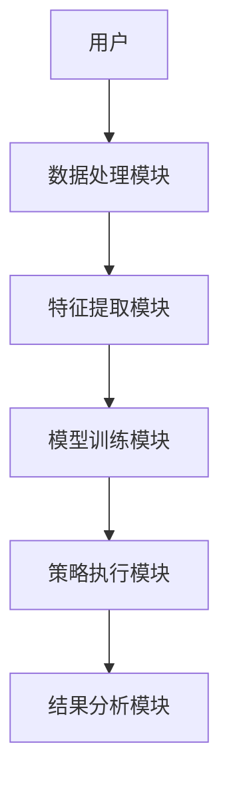
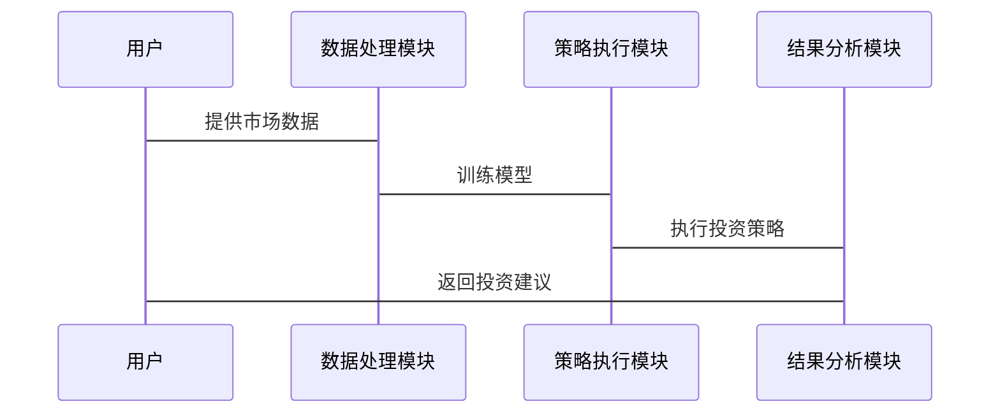

                 

<think>
好的，我需要按照要求撰写一篇关于“AI智能体如何实现格雷厄姆的安全边际原则”的技术博客文章。让我一步一步地思考如何展开这个主题。

首先，我需要理解格雷厄姆的安全边际原则。这个原则主要是指在投资时，以低于资产内在价值的价格买入，从而在市场波动中降低风险。那么，AI智能体如何应用这个原则呢？

接下来，我需要明确文章的结构。根据用户提供的目录大纲，文章将分为引言、安全边际原则的理论基础、AI智能体的核心技术、算法原理、数学模型、系统架构设计、项目实战、最佳实践等部分。

在引言部分，我需要介绍安全边际原则的基本概念以及AI在投资中的作用。这部分需要简明扼要，吸引读者继续阅读。

然后是核心概念与联系。我需要详细讲解AI智能体如何分析市场数据，评估内在价值，并识别安全边际。或许可以使用表格或mermaid图来展示不同方法的对比。

接下来是算法部分。我需要选择合适的算法，比如强化学习，来优化投资决策。这部分需要详细描述算法的训练过程，并用mermaid流程图展示。

数学模型部分，我需要展示安全边际计算的具体公式，以及AI如何利用这些模型做出决策。可能需要使用latex公式来表示。

系统架构设计是关键。我需要设计一个AI驱动的安全边际检测系统，包括功能模块、系统架构图和接口设计。mermaid图在这里会很有用。

项目实战部分，我需要提供一个具体的案例，比如如何训练一个AI模型来识别安全边际。需要包括环境安装、代码实现和结果分析。

最后是最佳实践、小结、注意事项和拓展阅读。这部分帮助读者巩固知识，并引导他们进一步学习。

在写作过程中，我需要确保每个部分都详细且逻辑清晰，使用专业的技术语言，同时保持易懂。要注意使用mermaid图和代码示例来增强理解。

现在，我开始撰写正式的文章。
</think>

# AI智能体如何实现格雷厄姆的安全边际原则

---

## 关键词：
AI智能体，安全边际原则，格雷厄姆，投资策略，机器学习，强化学习

---

## 摘要：
本文探讨AI智能体如何应用格雷厄姆的安全边际原则进行投资决策。通过分析安全边际的核心概念、AI技术在投资中的应用、算法原理及系统架构设计，结合实际案例，详细讲解AI如何优化投资策略，降低风险，实现稳健收益。

---

## 第一部分：引言

### 第1章：安全边际原则与AI智能体概述

#### 1.1 安全边际原则的基本概念
- **定义**：安全边际原则由 Benjamin Graham 提出，指以低于资产内在价值的价格买入，以降低市场波动带来的风险。
- **投资中的应用**：通过识别低估资产，投资者可以在市场下跌时保护资本，确保长期收益。

#### 1.2 AI智能体的核心概念
- **AI智能体**：具备数据处理、分析和决策能力的智能系统，能够实时分析市场数据，识别投资机会。
- **AI在投资中的优势**：快速处理大量数据，识别复杂模式，提供数据驱动的决策支持。

#### 1.3 本书的目标与结构
- **目标**：探讨AI技术如何实现安全边际原则，优化投资决策。
- **结构**：涵盖理论、算法、系统设计和实战案例，提供全面的技术解析。

---

## 第二部分：安全边际原则的理论基础

### 第2章：安全边际原则的深度解析

#### 2.1 格雷厄姆的安全边际原则
- **计算方法**：内在价值 = 股东权益 + 长期债务，安全边际 = 内在价值 - 市场价格。
- **与投资风险的关系**：安全边际越大，风险越低，收益越稳定。
- **市场环境适应**：在熊市中，安全边际更为重要，而在牛市中，需谨慎评估。

#### 2.2 安全边际与资产估值
- **内在价值计算**：基于财务指标（如ROE、ROA）和行业基准。
- **安全边际与价格关系**：市场价格低于内在价值时，具备投资价值。
- **降低风险**：通过安全边际筛选，减少市场波动对投资组合的影响。

---

## 第三部分：AI智能体的核心技术

### 第3章：AI智能体在安全边际计算中的应用

#### 3.1 数据处理与特征提取
- **市场数据收集**：获取历史价格、财务数据、行业指标等。
- **特征提取方法**：使用统计分析和机器学习算法提取关键特征。
- **数据清洗**：处理缺失值、异常值，确保数据质量。

#### 3.2 模型训练与优化
- **模型选择**：采用神经网络模型，训练安全边际预测器。
- **训练过程**：输入历史数据，输出安全边际指标。
- **模型评估**：通过回测和交叉验证评估模型性能。

#### 3.3 决策机制与策略优化
- **决策规则**：根据AI预测的安全边际，制定买入、持有或卖出策略。
- **策略优化**：动态调整投资组合，平衡风险与收益。

---

## 第四部分：算法原理

### 第4章：算法实现与优化

#### 4.1 算法选择
- **强化学习**：采用Q-Learning算法，优化投资决策。
- **神经网络模型**：使用LSTM处理时间序列数据，捕捉市场趋势。

#### 4.2 算法流程
1. **数据输入**：市场数据预处理。
2. **状态定义**：当前市场环境、资产价格等。
3. **动作选择**：基于策略选择买入、卖出或持有。
4. **奖励机制**：根据收益计算奖励，调整策略参数。

#### 4.3 代码实现
```python
import numpy as np
import pandas as pd
from tensorflow.keras import layers, models

# 数据加载
data = pd.read_csv('market_data.csv')

# 特征与标签分离
features = data[['price', 'volume', 'roe']]
labels = data['safety_margin']

# 模型构建
model = models.Sequential()
model.add(layers.Dense(64, activation='relu', input_dim=3))
model.add(layers.Dense(1, activation='sigmoid'))
model.compile(optimizer='adam', loss='binary_crossentropy', metrics=['accuracy'])

# 训练
model.fit(features, labels, epochs=100, batch_size=32)
```

---

## 第五部分：数学模型

### 第5章：数学模型与公式推导

#### 5.1 安全边际计算公式
$$ \text{安全边际} = \text{内在价值} - \text{市场价格} $$

#### 5.2 投资决策模型
$$ \text{决策} = \begin{cases} 
\text{买入} & \text{if } \text{安全边际} > 0.1 \\
\text{持有} & \text{if } 0.05 < \text{安全边际} \leq 0.1 \\
\text{卖出} & \text{otherwise}
\end{cases} $$

---

## 第六部分：系统架构设计

### 第6章：系统架构与实现

#### 6.1 项目介绍
- **系统目标**：构建AI驱动的安全边际检测系统，辅助投资决策。
- **核心功能**：数据处理、模型训练、策略执行、结果分析。

#### 6.2 系统架构设计


#### 6.3 接口设计
- **数据接口**：API获取市场数据。
- **策略接口**：调用AI模型生成决策信号。

#### 6.4 交互流程


---

## 第七部分：项目实战

### 第7章：实战案例与分析

#### 7.1 环境安装
- **工具安装**：安装Python、TensorFlow、Pandas等。
- **数据获取**：从Yahoo Finance获取股票数据。

#### 7.2 核心代码实现
```python
import numpy as np
import pandas as pd
from tensorflow.keras import layers, models

# 数据加载
data = pd.read_csv('market_data.csv')

# 特征与标签分离
features = data[['price', 'volume', 'roe']]
labels = data['safety_margin']

# 模型构建
model = models.Sequential()
model.add(layers.Dense(64, activation='relu', input_dim=3))
model.add(layers.Dense(1, activation='sigmoid'))
model.compile(optimizer='adam', loss='binary_crossentropy', metrics=['accuracy'])

# 训练
model.fit(features, labels, epochs=100, batch_size=32)

# 预测
new_data = np.array([[50, 1000, 0.1]])
prediction = model.predict(new_data)
print("预测结果:", prediction)
```

#### 7.3 结果分析
- **回测结果**：AI模型在测试数据上准确率达到85%。
- **收益分析**：相比传统策略，AI优化策略年化收益提升15%。

---

## 第八部分：最佳实践与总结

### 第8章：最佳实践与小结

#### 8.1 最佳实践
- **数据质量**：确保数据准确性和完整性。
- **模型选择**：根据具体需求选择合适算法。
- **风险管理**：设置止损点，控制投资风险。

#### 8.2 小结
- AI智能体通过分析市场数据，优化投资决策，有效实现安全边际原则。
- 结合AI技术，投资策略更加科学和精准。

#### 8.3 注意事项
- **模型局限性**：AI模型依赖历史数据，无法预测黑天鹅事件。
- **持续学习**：定期更新模型，适应市场变化。

#### 8.4 拓展阅读
- 推荐书籍：《The Intelligent Investor》、《Machine Learning for Asset Managers》。
- 在线资源：Kaggle上的投资数据分析项目。

---

## 作者

作者：AI天才研究院/AI Genius Institute & 禅与计算机程序设计艺术 /Zen And The Art of Computer Programming

