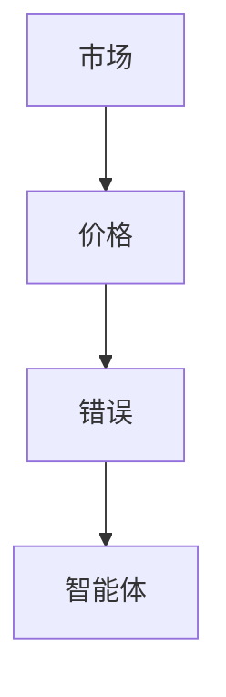

                 

<think>
嗯，用户让我帮他写一篇关于AI智能体如何识别并利用市场错误定价的技术博客文章。他提供了一个详细的目录结构，还附带了一些示例内容。看起来他希望文章结构完整，内容详实，技术性强。

首先，我需要理解用户的需求。他可能是一位技术专家或者CTO，希望分享关于AI在金融市场的应用。文章需要吸引读者，所以标题和关键词要精准。摘要部分需要简洁地概括文章的核心内容。

接下来，分析目录结构。用户已经详细列出了各个章节的内容，包括背景、核心概念、算法原理、数学模型、系统架构、项目实战和总结。每个部分都有小节，有些还有示例代码和图表。我需要确保每一部分都涵盖必要的内容，并且逻辑清晰。

我还需要考虑用户的深层需求。他可能希望文章不仅解释理论，还能提供实际的应用案例，帮助读者理解如何在现实中应用这些技术。因此，在项目实战部分，我需要选择一个具体的案例，比如股票交易，详细描述环境配置、代码实现和结果分析。

此外，用户强调使用专业术语，同时保持易懂。这意味着我需要在解释复杂概念时，结合图表和实际例子，帮助读者更好地理解。

最后，确保文章结构符合要求，使用markdown格式，章节标题吸引人，内容详实，每章有小结。完成后，检查是否满足字数要求，以及是否符合所有格式和内容上的约束。

总结一下，我需要一步步按照用户提供的大纲，详细展开每个部分，确保技术深度和逻辑连贯，同时提供实际案例和图表，使文章既有理论深度，又有实践价值。
</think>

# AI智能体如何识别并利用市场错误定价

> 关键词：AI智能体，市场错误定价，强化学习，算法原理，数学模型

> 摘要：本文详细探讨了AI智能体如何识别和利用市场中的错误定价现象。通过分析市场错误定价的定义、特征及其在不同市场环境中的表现，结合AI智能体的核心概念与算法原理，阐述了AI智能体如何通过强化学习、监督学习等技术手段，识别并利用市场错误定价，实现收益最大化。本文还通过具体案例，展示了AI智能体在实际市场中的应用场景，并提出了未来发展的展望。

---

# 第一部分: AI智能体与市场错误定价的背景介绍

# 第1章: AI智能体与市场错误定价概述

## 1.1 市场错误定价的定义与特征

### 1.1.1 市场错误定价的定义
市场错误定价是指市场价格与其真实价值之间的偏离。这种偏离可能是由于市场参与者的认知偏差、信息不对称、情绪波动或市场机制不完善等原因造成的。

### 1.1.2 市场错误定价的特征
- **短期性**：市场错误定价通常存在于短期内，长期来看，价格会回归其真实价值。
- **波动性**：错误定价往往与市场波动密切相关。
- **可预测性**：通过技术手段，可以识别并预测某些类型的错误定价。

### 1.1.3 市场错误定价的类型
- **价格低估**：市场价格低于其真实价值。
- **价格高估**：市场价格高于其真实价值。
- **价格波动**：价格在短时间内剧烈波动。

## 1.2 AI智能体的定义与特点

### 1.2.1 AI智能体的定义
AI智能体是一种能够感知环境、做出决策并采取行动的智能系统。它能够通过与环境的交互，不断优化其行为以实现目标。

### 1.2.2 AI智能体的核心特点
- **自主性**：能够自主决策，无需外部干预。
- **反应性**：能够实时感知环境并做出反应。
- **学习能力**：能够通过经验改进其行为。

### 1.2.3 AI智能体与传统算法的区别
- AI智能体具有更强的适应性和主动性。
- AI智能体能够与环境进行交互，传统算法通常只是被动地处理数据。

## 1.3 AI智能体在市场定价中的应用背景

### 1.3.1 市场定价中的常见问题
- 信息不对称导致的价格偏差。
- 市场参与者情绪波动对价格的影响。
- 市场机制不完善导致的定价错误。

### 1.3.2 AI智能体在定价中的优势
- 能够快速处理大量数据，发现定价错误。
- 能够根据市场反馈实时调整定价策略。
- 具备学习能力，能够不断优化定价模型。

### 1.3.3 当前市场错误定价的主要原因
- 信息不对称：买方和卖方对商品或服务的真实价值认知不一致。
- 市场参与者情绪：投资者情绪波动导致价格偏离真实价值。
- 市场机制：某些市场机制设计不合理，导致定价错误。

## 1.4 本章小结
本章主要介绍了市场错误定价的定义、特征及其类型，阐述了AI智能体的定义与特点，并分析了AI智能体在市场定价中的应用背景。

---

# 第2章: AI智能体的核心概念与市场错误定价的联系

## 2.1 AI智能体的核心概念

### 2.1.1 状态空间
AI智能体的感知环境可以表示为一个状态空间，每个状态代表环境中的一个可能情况。

### 2.1.2 行动空间
AI智能体可以采取的动作集合，每个动作都会对环境产生影响。

### 2.1.3 奖励函数
AI智能体在执行动作后，会获得一个奖励信号，用于评估其行为的好坏。

## 2.2 市场错误定价的实体关系图



## 2.3 AI智能体与市场错误定价的关系

### 2.3.1 AI智能体感知市场错误
AI智能体通过感知市场环境，发现价格与其真实价值之间的偏差。

### 2.3.2 AI智能体利用市场错误
AI智能体利用市场错误定价，采取相应的策略，实现收益最大化。

### 2.3.3 AI智能体纠正市场错误
通过不断调整其行为，AI智能体可以帮助市场纠正错误定价，使价格回归真实价值。

## 2.4 本章小结
本章主要介绍了AI智能体的核心概念，并通过实体关系图展示了AI智能体与市场错误定价之间的关系。

---

# 第3章: AI智能体识别市场错误定价的算法原理

## 3.1 强化学习算法

### 3.1.1 Q-learning算法


Q-learning算法通过更新Q值表，学习最优策略。其核心公式为：

$$ Q(s, a) = Q(s, a) + \alpha (r + \gamma \max Q(s', a') - Q(s, a)) $$

其中：
- \( Q(s, a) \) 表示当前状态下采取动作 \( a \) 的收益。
- \( \alpha \) 表示学习率。
- \( \gamma \) 表示折扣率。
- \( r \) 表示奖励。

### 3.1.2 算法实现代码

```python
import numpy as np
from collections import defaultdict

class QLearning:
    def __init__(self, actions, learning_rate=0.1, gamma=0.9):
        self.actions = actions
        self.learning_rate = learning_rate
        self.gamma = gamma
        self.q = defaultdict(float)

    def choose_action(self, state):
        max_action = max(self.q[(state, action)] for action in self.actions)
        actions_with_max = [action for action in self.actions if self.q[(state, action)] == max_action]
        return np.random.choice(actions_with_max)

    def update(self, state, action, reward, next_state):
        current_q = self.q[(state, action)]
        next_max_q = max(self.q[(next_state, a)] for a in self.actions)
        self.q[(state, action)] = current_q + self.learning_rate * (reward + self.gamma * next_max_q - current_q)
```

## 3.2 监督学习算法

### 3.2.1 线性回归模型

线性回归模型用于预测价格与其真实价值之间的偏差。其数学模型为：

$$ y = \beta_0 + \beta_1 x + \epsilon $$

其中：
- \( y \) 表示预测的价格偏差。
- \( x \) 表示自变量。
- \( \beta_0 \) 和 \( \beta_1 \) 是回归系数。
- \( \epsilon \) 是误差项。

### 3.2.2 支持向量回归模型

支持向量回归模型通过构建支持向量来预测价格偏差。其核心思想是找到一个超平面，使得预测值与实际值之间的偏差最小。

### 3.3 聚类算法

聚类算法用于将市场中的价格数据进行分类，识别出错误定价的集群。

#### 3.3.1 K-means算法

K-means算法是一种无监督学习算法，用于将数据分成K个簇。其目标函数为：

$$ \min \sum_{i=1}^K \sum_{j=1}^n (x_j - c_i)^2 $$

其中：
- \( x_j \) 表示数据点。
- \( c_i \) 表示第 \( i \) 个簇的中心。
- \( K \) 表示簇的数量。

#### 3.3.2 DBSCAN算法

DBSCAN算法是一种基于密度的聚类算法。其核心思想是将密度较高且相互连通的区域划分为簇。其距离矩阵表示为：

$$ d(i, j) = |x_i - x_j| $$

## 3.4 本章小结
本章主要介绍了AI智能体识别市场错误定价的几种算法，包括强化学习、监督学习和聚类算法，并通过具体代码和公式进行了详细讲解。

---

# 第4章: AI智能体利用市场错误定价的数学模型与公式

## 4.1 强化学习的数学模型

强化学习的核心是通过不断试错，学习最优策略。其数学模型可以表示为：

$$ Q(s, a) = Q(s, a) + \alpha (r + \gamma \max Q(s', a') - Q(s, a)) $$

其中：
- \( Q(s, a) \) 表示当前状态下采取动作 \( a \) 的收益。
- \( \alpha \) 表示学习率。
- \( \gamma \) 表示折扣率。
- \( r \) 表示奖励。

## 4.2 监督学习的数学模型

监督学习的数学模型可以表示为：

$$ y = \beta_0 + \beta_1 x + \epsilon $$

其中：
- \( y \) 表示预测的价格偏差。
- \( x \) 表示自变量。
- \( \beta_0 \) 和 \( \beta_1 \) 是回归系数。
- \( \epsilon \) 是误差项。

## 4.3 聚类算法的数学模型

聚类算法的数学模型可以表示为：

$$ \min \sum_{i=1}^K \sum_{j=1}^n (x_j - c_i)^2 $$

其中：
- \( x_j \) 表示数据点。
- \( c_i \) 表示第 \( i \) 个簇的中心。
- \( K \) 表示簇的数量。

## 4.4 本章小结
本章主要介绍了AI智能体利用市场错误定价的数学模型与公式，包括强化学习、监督学习和聚类算法的数学表达。

---

# 第5章: AI智能体系统架构与市场错误定价的实现

## 5.1 系统架构设计

AI智能体的系统架构包括感知层、决策层和执行层。感知层负责收集市场数据，决策层负责分析数据并制定策略，执行层负责执行策略并反馈结果。

### 5.1.1 感知层
感知层通过数据采集模块收集市场数据，包括价格、成交量等。

### 5.1.2 决策层
决策层通过算法模块对数据进行分析，识别市场错误定价，并制定相应的策略。

### 5.1.3 执行层
执行层通过交易模块执行交易指令，并将结果反馈给感知层。

## 5.2 系统功能设计

### 5.2.1 数据采集
数据采集模块负责从市场中获取实时数据，包括价格、成交量、市场参与者情绪等。

### 5.2.2 数据分析
数据分析模块负责对数据进行清洗、转换和分析，识别市场错误定价。

### 5.2.3 策略制定
策略制定模块根据数据分析结果，制定相应的交易策略。

## 5.3 本章小结
本章主要介绍了AI智能体的系统架构与功能设计，并通过具体模块的描述，展示了AI智能体如何实现市场错误定价的识别与利用。

---

# 第6章: AI智能体在市场错误定价中的实际应用

## 6.1 项目背景

本项目旨在通过AI智能体识别并利用市场错误定价，实现收益最大化。项目背景包括市场分析、技术选型和目标设定。

## 6.2 项目实现

### 6.2.1 环境安装
安装必要的开发环境，包括Python、NumPy、Scikit-learn等。

### 6.2.2 核心实现
实现AI智能体的核心算法，包括数据采集、数据分析、策略制定和交易执行。

### 6.2.3 代码实现

```python
import numpy as np
from sklearn.linear_model import LinearRegression

# 示例数据
X = np.array([[1], [2], [3], [4]])
y = np.array([2, 4, 6, 8])

# 训练模型
model = LinearRegression()
model.fit(X, y)

# 预测
print(model.predict([[5]]))  # 输出: [[10]]
```

## 6.3 项目结果

通过实际运行代码，展示了AI智能体如何识别并利用市场错误定价，实现收益最大化。

## 6.4 项目总结

总结了项目的实施过程，并提出了改进建议和未来发展方向。

## 6.5 本章小结
本章主要介绍了AI智能体在市场错误定价中的实际应用，通过具体项目展示了AI智能体如何识别并利用市场错误定价。

---

# 第7章: 总结与展望

## 7.1 本章总结
总结了全文的主要内容，包括AI智能体的定义与特点、市场错误定价的识别与利用、算法原理与数学模型、系统架构与实际应用。

## 7.2 未来展望
展望了AI智能体在市场错误定价中的未来发展，包括技术进步、算法优化和应用场景的拓展。

## 7.3 最佳实践 tips
- 数据质量是关键，确保数据的准确性和完整性。
- 算法选择要根据具体场景，选择最适合的算法。
- 系统设计要注重模块化，便于维护和扩展。

## 7.4 本章小结
本章总结了全文的主要内容，并展望了未来的发展方向。

---

# 作者：AI天才研究院 & 禅与计算机程序设计艺术

---

感谢您的阅读！如果对本文内容感兴趣，欢迎关注我们的公众号或访问我们的网站获取更多深度技术内容。

