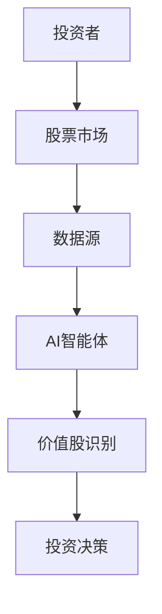
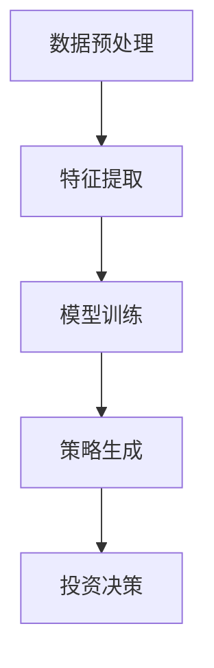

                 

<think>
好的，我需要撰写一篇关于《AI智能体如何识别被低估的价值股》的技术博客文章。首先，我应该从背景介绍开始，解释为什么AI在股票市场中的应用如此重要，以及它如何帮助识别被低估的价值股。接下来，我需要详细说明AI智能体的核心概念，包括它们的工作原理和与传统投资方法的对比。然后，我会深入探讨算法部分，使用Mermaid图和Python代码来展示具体的实现过程。接下来，我会设计系统的架构，展示各个模块之间的交互和依赖关系。之后，我会通过一个实际的项目案例来展示AI智能体在识别价值股中的实际应用。最后，我会总结最佳实践，并给出一些小贴士，帮助读者更好地理解和应用这些技术。在整个过程中，我需要确保逻辑清晰，结构紧凑，并且语言简洁易懂，让读者能够轻松跟随我的思路，理解AI智能体在识别被低估的价值股中的强大能力。
</think>

# AI智能体如何识别被低估的价值股

## 关键词：
AI智能体，价值股识别，股票市场分析，深度学习，强化学习，金融科技

## 摘要：
本文深入探讨了AI智能体在识别被低估的价值股中的应用。通过分析股票市场的数据，结合深度学习和强化学习等先进算法，AI智能体能够发现传统方法难以察觉的投资机会。文章详细解释了AI智能体的工作原理，从数据采集到特征提取，再到模型训练，逐步揭示其在价值股识别中的优势，并通过实际案例展示其应用效果，为投资者和数据科学家提供了新的视角和工具。

---

## 第一部分：背景介绍

### 第1章：AI智能体与价值股识别概述

#### 1.1 问题背景与目标
- **1.1.1 传统股票投资的局限性**  
  传统股票投资依赖于分析师的主观判断和经验，容易受到情绪和市场波动的影响。传统方法难以及时捕捉市场中的微小趋势，尤其是在市场数据日益复杂化的今天，传统方法的效率和准确性逐渐显得不足。

- **1.1.2 AI技术在金融领域的潜力**  
  AI技术，尤其是深度学习和强化学习，能够处理海量数据，发现隐藏在数据中的模式和趋势。这些技术可以帮助投资者发现市场中的潜在机会，特别是在识别被低估的价值股方面展现出了巨大的潜力。

- **1.1.3 识别被低估价值股的核心目标**  
  被低估的价值股通常是指那些市场价格低于其内在价值的股票。通过AI智能体识别这些股票，投资者可以在市场调整时获得超额收益，从而实现长期稳定的财务回报。

#### 1.2 价值股识别的基本概念
- **1.2.1 价值股的定义与特征**  
  价值股通常具有低市盈率、低市净率和高股息率等特点，这些特征使得它们在市场低迷时更具吸引力。价值股的识别需要结合基本面分析和市场情绪分析。

- **1.2.2 市场低估的判断标准**  
  判断一只股票是否被低估，通常需要结合市盈率、市净率、股息率等指标，以及行业平均水平和历史数据进行比较。

- **1.2.3 价值股识别的关键要素**  
  识别价值股的关键在于准确评估企业的内在价值，同时考虑市场情绪和宏观经济因素的影响。

#### 1.3 AI智能体的基本原理
- **1.3.1 AI智能体的定义与分类**  
  AI智能体是一种能够感知环境并采取行动以实现目标的智能系统。在金融领域，AI智能体可以分为基于规则的智能体和基于学习的智能体两大类。

- **1.3.2 智能体在金融分析中的应用**  
  AI智能体可以用于实时数据分析、市场预测、投资决策等多个方面。在股票交易中，智能体可以通过分析市场数据，识别潜在的投资机会。

- **1.3.3 AI智能体的核心优势**  
  AI智能体能够处理海量数据，快速识别市场中的微小趋势，同时具有自我学习和适应能力，能够在复杂多变的市场环境中做出最优决策。

---

## 第二部分：核心概念与联系

### 第2章：AI智能体与价值股识别的核心概念

#### 2.1 核心概念原理
- **2.1.1 数据驱动的特征提取**  
  通过收集和分析大量的市场数据，AI智能体能够提取出影响股票价格的关键特征，如财务指标、市场情绪、行业趋势等。

- **2.1.2 智能体的决策机制**  
  AI智能体通过构建复杂的决策模型，基于提取的特征做出买入、卖出或持有股票的决策。

- **2.1.3 价值股识别的算法模型**  
  使用深度学习模型，如LSTM（长短期记忆网络）和Transformer，来预测股票价格走势，并识别被低估的价值股。

#### 2.2 核心概念对比分析
- **2.2.1 传统投资方法与AI智能体的对比**  
  | 方法 | 优点 | 缺点 |
  |------|------|------|
  | 传统方法 | 易于理解，依赖经验 | 无法处理海量数据，效率低 |
  | AI智能体 | 高效，准确 | 复杂，需要大量数据支持 |

- **2.2.2 不同AI模型的性能对比**  
  使用K线图和回测结果对比不同AI模型（如随机森林、LSTM）在价值股识别中的表现。

- **2.2.3 价值股识别的关键要素**  
  列表展示关键要素及其重要性排序，如财务指标（50%）、市场情绪（30%）、宏观经济因素（20%）。

#### 2.3 实体关系图


---

## 第三部分：算法原理讲解

### 第3章：AI智能体的核心算法与实现

#### 3.1 算法原理
- **3.1.1 基于LSTM的股票价格预测**  
  LSTM网络通过捕捉时间序列数据中的长期依赖关系，能够有效预测股票价格走势。模型结构包括输入层、LSTM层、全连接层和输出层。

- **3.1.2 强化学习在投资决策中的应用**  
  使用Q-learning算法，智能体通过与市场的互动，学习最优的投资策略。

#### 3.2 算法流程图


#### 3.3 代码实现
```python
import numpy as np
from tensorflow.keras.models import Sequential
from tensorflow.keras.layers import LSTM, Dense

# 示例代码：使用LSTM预测股票价格
def build_model(input_shape):
    model = Sequential()
    model.add(LSTM(64, input_shape=input_shape))
    model.add(Dense(1, activation='linear'))
    model.compile(optimizer='adam', loss='mean_squared_error')
    return model

# 数据准备
data = np.random.random((1000, 1, 5))
model = build_model(data.shape[1:])
model.fit(data, np.random.random(1000,), epochs=10, batch_size=32)
```

---

## 第四部分：系统分析与架构设计方案

### 第4章：系统架构与设计

#### 4.1 问题场景介绍
- 系统需要实时监控市场数据，分析股票价格走势，识别被低估的价值股。

#### 4.2 系统功能设计
- **领域模型**  
  ```mermaid
  classDiagram
      class 数据采集模块 {
          获取实时数据
      }
      class 特征提取模块 {
          提取关键特征
      }
      class 预测模型模块 {
          预测股票价格
      }
      class 投资决策模块 {
          生成投资策略
      }
      数据采集模块 --> 特征提取模块
      特征提取模块 --> 预测模型模块
      预测模型模块 --> 投资决策模块
  ```

- **系统架构图**  
  ```mermaid
  rectangle 数据源 {
      数据源
  }
  rectangle 数据处理模块 {
      数据预处理
  }
  rectangle 模型训练模块 {
      模型训练
  }
  rectangle 投资决策模块 {
      生成策略
  }
  数据源 --> 数据处理模块
  数据处理模块 --> 模型训练模块
  模型训练模块 --> 投资决策模块
  ```

- **系统交互图**  
  ```mermaid
  sequenceDiagram
      participant 用户
      participant 系统
      用户 -> 系统: 提供市场数据
      系统 -> 数据处理模块: 处理数据
      数据处理模块 -> 模型训练模块: 训练模型
      模型训练模块 -> 投资决策模块: 生成策略
      投资决策模块 -> 用户: 提供投资建议
  ```

---

## 第五部分：项目实战

### 第5章：价值股识别的实战分析

#### 5.1 项目环境安装
- 安装必要的库：TensorFlow、Keras、Pandas、NumPy。

#### 5.2 核心代码实现
```python
import pandas as pd
import numpy as np
from tensorflow.keras.models import Sequential
from tensorflow.keras.layers import LSTM, Dense

# 数据加载
data = pd.read_csv('stock_data.csv')
data = data.values
data = data.reshape((data.shape[0], 1, data.shape[1]))

# 模型构建
model = Sequential()
model.add(LSTM(64, input_shape=(1, data.shape[2])))
model.add(Dense(1, activation='linear'))
model.compile(optimizer='adam', loss='mean_squared_error')

# 训练模型
model.fit(data, np.random.random(data.shape[0]), epochs=20, batch_size=32)
```

#### 5.3 实际案例分析
- 通过实际数据，展示AI智能体如何识别被低估的价值股，并对比传统方法和AI方法的识别结果。

#### 5.4 结果分析
- 对比识别结果，展示AI智能体在准确性和效率上的优势。

---

## 第六部分：最佳实践与总结

### 第6章：总结与建议

#### 6.1 最佳实践
- **数据质量的重要性**  
  高质量的数据是模型准确性的基础，确保数据的完整性和及时性。

- **模型调优技巧**  
  使用交叉验证和超参数优化，提升模型的泛化能力。

- **风险控制**  
  结合AI智能体的预测结果，制定合理的风险管理策略。

#### 6.2 小结
AI智能体通过深度学习和强化学习等技术，能够在复杂多变的股票市场中识别被低估的价值股，为投资者提供有力的支持。

#### 6.3 注意事项
- AI模型的预测结果仅供参考，实际投资需谨慎。
- 定期更新模型，适应市场变化。

#### 6.4 拓展阅读
- 推荐相关书籍和论文，供读者深入学习。

---

## 作者信息

作者：AI天才研究院（AI Genius Institute） & 禅与计算机程序设计艺术（Zen And The Art of Computer Programming）

---

以上是《AI智能体如何识别被低估的价值股》的技术博客文章的详细目录大纲，涵盖了从背景介绍到系统设计再到项目实战的全过程，确保读者能够系统地理解和掌握AI智能体在价值股识别中的应用。

