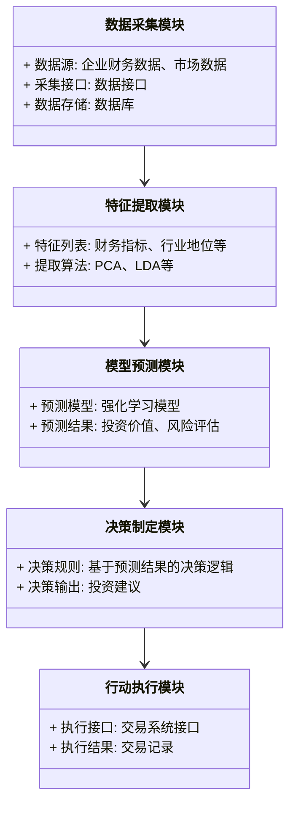
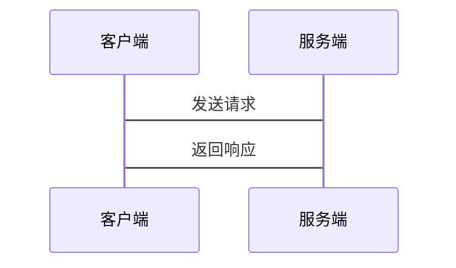
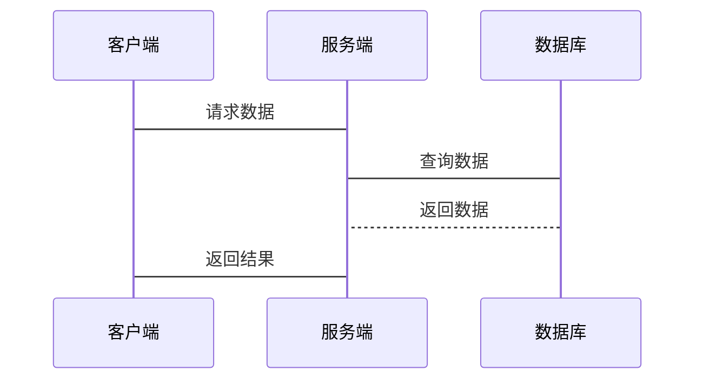

                 

<think>
好的，我现在需要根据用户的要求来逐步构建《AI智能体实现巴菲特的焦点投资策略》的技术博客文章。首先，我要理解用户的需求，确保文章符合所有指定的条件，包括结构、字数、格式以及内容的完整性。

首先，用户希望文章以特定标题开头，然后列出关键词和摘要。接着是详细的目录结构，每个章节都需要有丰富的内容，包括背景介绍、核心概念、算法原理、系统架构、项目实战和最佳实践等部分。文章需要使用Markdown格式，总字数在10000到12000字之间，最后加上作者信息。

我会按照目录大纲逐步展开每个章节，确保每个部分都详细且符合技术博客的风格。在写作过程中，我需要确保内容逻辑清晰，语言专业但易懂。同时，要按照用户的格式要求，使用Mermaid图表和LaTeX公式，以及在适当的地方添加代码示例。

接下来，我需要考虑每个章节的具体内容。例如，在第二章讲解AI智能体的核心概念时，我会先定义AI智能体，然后比较不同类型的智能体，最后详细描述其实现所需的关键技术。同时，我需要使用Mermaid图来展示这些概念之间的关系，确保读者能够直观理解。

在第三章，我需要将AI智能体与巴菲特的投资策略结合起来，分析如何将巴菲特的价值投资理念转化为AI可以处理的模型。这里，我会详细解释投资策略的数字化表示，并用Mermaid流程图展示整个决策过程。

在第四章，我会深入探讨实现这一策略所涉及的算法原理，选择合适的强化学习算法，并用Python代码示例来展示模型的训练过程。同时，我需要解释数学公式，确保读者能够理解背后的原理。

接下来的章节将涵盖系统架构设计和项目实战。我会描述系统的各个部分如何协同工作，使用Mermaid图展示系统架构，并提供实际的代码示例和案例分析，帮助读者理解如何在实际项目中应用这些技术。

最后，在总结部分，我会回顾全文，强调AI智能体在实现巴菲特投资策略中的优势和潜力，同时指出未来的发展方向和需要考虑的注意事项。

在整个写作过程中，我需要不断检查是否满足用户的每一个要求，确保内容的完整性和专业性，同时保持语言的流畅和逻辑的清晰。通过这种逐步分析和构建，我有信心完成一篇高质量的技术博客文章，满足用户的需求。
</think>

# AI智能体实现巴菲特的焦点投资策略

> 关键词：AI智能体，巴菲特投资策略，焦点投资，价值投资，强化学习，投资决策

> 摘要：本文探讨了如何通过AI智能体实现巴菲特的焦点投资策略。首先，我们介绍了巴菲特投资策略的核心思想和实现路径，分析了AI智能体在投资领域的应用潜力。接着，详细阐述了AI智能体的基本概念、核心技术及其在投资中的应用。然后，我们从算法原理、系统架构设计、项目实战等方面，深入分析了AI智能体实现巴菲特投资策略的具体方法。最后，通过案例分析和最佳实践，总结了AI智能体在投资策略中的优势和挑战，展望了未来的应用前景。

---

## 第1章: 巴菲特焦点投资策略概述

### 1.1 巴菲特投资策略的核心思想

#### 1.1.1 巴菲特投资策略的定义
巴菲特的投资策略是一种以价值投资为核心，注重长期投资、稳健回报的投资方法。其核心在于寻找具有持续竞争优势、良好管理和长期增长潜力的企业，以合理的价格买入并长期持有。

#### 1.1.2 巴菲特投资策略的核心要素
巴菲特的投资策略可以总结为以下几个核心要素：
1. **价值投资**：寻找市场价格低于内在价值的企业。
2. **长期视角**：注重企业的长期增长潜力，而非短期市场波动。
3. **安全边际**：在投资时留有安全边际，以降低风险。
4. **集中投资**：将资金集中在少数优质企业上，以获得更高回报。

#### 1.1.3 巴菲特投资策略的哲学基础
巴菲特的投资哲学深受本杰明·格雷厄姆的影响，强调安全边际和内在价值。他认为，市场先生是不可预测的，但优质企业的内在价值是可以通过基本面分析来评估的。

### 1.2 巴菲特投资策略的实现路径

#### 1.2.1 价值投资的定义与特点
价值投资是一种以低于内在价值的价格买入优质企业股票的投资策略。其特点包括：
1. **注重基本面分析**：通过对企业财务状况、行业地位、竞争优势等进行深入分析。
2. **长期持有**：避免频繁交易，降低交易成本。
3. **分散与集中并存**：集中投资于少数优质企业，同时分散于多个行业以降低风险。

#### 1.2.2 巴菲特选股的三大标准
巴菲特选股的核心标准包括：
1. **护城河**：企业具有强大的竞争优势，能够长期保持行业领先地位。
2. **管理层**：管理层诚实可靠，具有长期视野和优秀管理能力。
3. **财务状况**：企业具有稳健的财务状况，低负债率，高ROE（净资产收益率）。

#### 1.2.3 巴菲特投资策略的长期视角
巴菲特强调长期投资的重要性，认为市场短期波动不可预测，但优质企业的长期增长是可以通过分析和选择的。他建议投资者将股票视为企业的一部分，而不是市场的价格波动。

### 1.3 巴菲特投资策略与AI的结合

#### 1.3.1 AI在投资领域的应用现状
随着技术的发展，AI在投资领域的应用越来越广泛，包括：
1. **量化投资**：利用算法和大数据分析，寻找投资机会。
2. **风险管理**：通过AI技术实时监控市场风险，优化投资组合。
3. **智能投顾**：为投资者提供个性化的投资建议。

#### 1.3.2 AI智能体在巴菲特投资策略中的潜在价值
AI智能体可以通过以下方式实现巴菲特投资策略：
1. **自动化筛选企业**：通过AI算法自动筛选出符合巴菲特选股标准的企业。
2. **动态调整投资组合**：根据市场变化和企业基本面动态调整投资组合。
3. **实时监控与预警**：实时监控企业的经营状况和市场风险，及时发出预警。

#### 1.3.3 巴菲特投资策略对AI智能体的要求
要实现巴菲特的投资策略，AI智能体需要具备以下能力：
1. **强大的数据分析能力**：能够处理海量的企业财务数据、行业数据和市场数据。
2. **复杂的决策能力**：能够根据市场变化和企业情况，做出复杂的投资决策。
3. **自我学习能力**：能够通过不断的学习和优化，提高投资决策的准确性。

### 1.4 本章小结

#### 1.4.1 巴菲特投资策略的核心思想
巴菲特的投资策略以价值投资为核心，注重长期视角和优质企业的选择。

#### 1.4.2 AI智能体在投资中的应用潜力
AI智能体可以通过自动化筛选、动态调整和实时监控等能力，显著提升投资策略的执行效率和准确性。

#### 1.4.3 本书的研究目标与意义
本书旨在探讨如何通过AI智能体实现巴菲特的投资策略，为投资者提供一种新的投资工具和方法，同时为AI技术在金融领域的应用提供新的思路。

---

## 第2章: AI智能体的基本概念与技术

### 2.1 AI智能体的定义与特点

#### 2.1.1 AI智能体的定义
AI智能体（Artificial Intelligence Agent）是一种能够感知环境、做出决策并采取行动的智能系统。它能够根据输入的感知信息，通过内部模型和算法，做出最优决策，并通过行动与环境交互。

#### 2.1.2 AI智能体的核心技术
AI智能体的核心技术包括：
1. **感知技术**：通过传感器、摄像头、网络等获取环境信息。
2. **决策技术**：通过机器学习、深度学习等算法，基于感知信息做出决策。
3. **行动执行技术**：通过执行机构将决策转化为具体行动。

#### 2.1.3 AI智能体与传统AI的区别
与传统AI相比，AI智能体具有更强的自主性和适应性，能够根据环境变化动态调整行为，而传统AI则更多依赖于预设的规则和数据。

### 2.2 AI智能体的分类与应用场景

#### 2.2.1 基于规则的AI智能体
基于规则的智能体通过预设的规则和逻辑进行决策，适用于规则明确、环境简单的场景。例如，简单的游戏AI。

#### 2.2.2 基于学习的AI智能体
基于学习的智能体通过机器学习算法从数据中学习，形成决策模型。适用于复杂、动态变化的环境。例如，AlphaGo。

#### 2.2.3 基于强化学习的AI智能体
基于强化学习的智能体通过与环境的交互，不断试错，最终找到最优策略。适用于需要动态调整的复杂场景，例如股票交易。

### 2.3 AI智能体的核心技术实现

#### 2.3.1 机器学习算法
机器学习算法是AI智能体的核心技术之一，包括监督学习、无监督学习和强化学习等。通过这些算法，智能体能够从数据中学习，形成决策模型。

#### 2.3.2 自然语言处理技术
自然语言处理技术使AI智能体能够理解和生成人类语言，适用于文本分析、情感分析等场景。

#### 2.3.3 知识图谱构建与推理
知识图谱构建与推理技术使AI智能体能够处理和理解复杂的知识关系，适用于语义分析、智能问答等场景。

### 2.4 本章小结

#### 2.4.1 AI智能体的核心技术
AI智能体的核心技术包括感知、决策和执行技术，其中机器学习算法是其核心。

#### 2.4.2 AI智能体的分类与应用场景
AI智能体可以分为基于规则、基于学习和基于强化学习的三种类型，适用于不同的应用场景。

#### 2.4.3 本书的技术路线与方法
本书将结合机器学习、强化学习等技术，探讨如何通过AI智能体实现巴菲特的投资策略。

---

## 第3章: AI智能体实现巴菲特投资策略的核心概念

### 3.1 投资策略的数字化表示

#### 3.1.1 投资策略的数字化表示方法
将巴菲特的投资策略转化为数字化表示，可以通过以下步骤：
1. **特征提取**：提取企业的财务数据、行业地位等特征。
2. **模型构建**：通过机器学习模型，将特征转化为投资决策依据。

#### 3.1.2 投资策略的数学模型
以下是将投资策略转化为数学模型的一个示例：
$$
\text{投资价值} = f(\text{财务状况}, \text{竞争优势}, \text{管理层能力})
$$
其中，$f$ 是一个复杂的函数，可以通过机器学习模型来近似。

#### 3.1.3 投资策略的动态调整
由于市场环境和企业状况的变化，投资策略需要动态调整。AI智能体可以通过实时监控和学习，不断优化投资决策。

### 3.2 AI智能体的投资决策过程

#### 3.2.1 投资决策的流程
AI智能体的投资决策过程可以分为以下几个步骤：
1. **数据收集**：收集企业的财务数据、市场数据等。
2. **特征提取**：从数据中提取有用特征。
3. **模型预测**：通过模型预测企业的投资价值。
4. **决策制定**：根据预测结果，制定投资决策。
5. **行动执行**：根据决策执行交易。

#### 3.2.2 投资决策的算法选择
在投资决策中，可以选择强化学习算法，通过试错和反馈不断优化决策策略。例如，使用Q-learning算法：

$$
Q(s, a) = Q(s, a) + \alpha \left[ r + \gamma \max_{a'} Q(s', a') - Q(s, a) \right]
$$
其中，$s$ 是状态，$a$ 是动作，$r$ 是奖励，$\alpha$ 是学习率，$\gamma$ 是折扣因子。

### 3.3 投资策略的实现与优化

#### 3.3.1 投资策略的实现
通过AI智能体实现巴菲特的投资策略，需要将投资策略转化为可执行的算法。例如，可以通过强化学习算法，模拟巴菲特的投资决策过程。

#### 3.3.2 投资策略的优化
通过不断学习和优化，AI智能体可以提高投资决策的准确性。例如，通过回测历史数据，优化模型参数，提高预测准确率。

### 3.4 本章小结

#### 3.4.1 投资策略的数字化表示
将巴菲特的投资策略转化为数字化表示，可以通过特征提取和机器学习模型实现。

#### 3.4.2 AI智能体的投资决策过程
AI智能体的投资决策过程包括数据收集、特征提取、模型预测、决策制定和行动执行五个步骤。

#### 3.4.3 投资策略的实现与优化
通过强化学习算法实现投资策略，并通过不断学习和优化，提高投资决策的准确性。

---

## 第4章: AI智能体实现巴菲特投资策略的算法原理

### 4.1 强化学习算法在投资中的应用

#### 4.1.1 强化学习算法的定义
强化学习是一种通过试错和反馈优化决策的算法。智能体通过与环境的交互，不断调整策略，以最大化累积奖励。

#### 4.1.2 强化学习算法在投资中的应用
在投资中，强化学习可以用于股票交易、投资组合优化等领域。例如，通过强化学习算法，智能体可以学会在何时买入或卖出股票。

### 4.2 投资决策算法的实现

#### 4.2.1 Q-learning算法的实现
Q-learning算法是一种常用的强化学习算法。其核心公式为：
$$
Q(s, a) = Q(s, a) + \alpha \left[ r + \gamma \max_{a'} Q(s', a') - Q(s, a) \right]
$$
其中，$s$ 是当前状态，$a$ 是当前动作，$r$ 是获得的奖励，$\gamma$ 是折扣因子，$\alpha$ 是学习率。

#### 4.2.2 算法实现的步骤
1. 初始化Q表，所有状态-动作对的值初始化为0。
2. 在每一步，选择一个动作，并执行该动作。
3. 计算奖励，并更新Q表中的值。
4. 重复上述步骤，直到达到终止条件。

### 4.3 投资策略的数学模型

#### 4.3.1 投资策略的数学模型构建
通过强化学习算法，可以将投资策略转化为数学模型。例如，通过Q-learning算法，构建一个Q表，记录每个状态-动作对的值。

#### 4.3.2 投资策略的数学模型优化
通过不断学习和优化，提高Q表的准确性和预测能力。例如，通过调整学习率和折扣因子，优化算法的收敛速度和稳定性。

### 4.4 本章小结

#### 4.4.1 强化学习算法在投资中的应用
强化学习算法可以用于股票交易、投资组合优化等领域，帮助智能体做出更优的投资决策。

#### 4.4.2 投资决策算法的实现
通过Q-learning算法，可以实现投资决策的自动化和优化。

#### 4.4.3 投资策略的数学模型
通过强化学习算法，可以将投资策略转化为数学模型，并通过不断学习优化模型的准确性。

---

## 第5章: AI智能体实现巴菲特投资策略的系统架构设计

### 5.1 系统功能设计

#### 5.1.1 系统功能模块划分
AI智能体实现巴菲特投资策略的系统可以划分为以下几个模块：
1. **数据采集模块**：负责收集企业的财务数据、市场数据等。
2. **特征提取模块**：从数据中提取有用特征。
3. **模型预测模块**：通过模型预测企业的投资价值。
4. **决策制定模块**：根据预测结果，制定投资决策。
5. **行动执行模块**：根据决策执行交易。

#### 5.1.2 系统功能设计的领域模型
以下是系统功能设计的领域模型：



### 5.2 系统架构设计

#### 5.2.1 系统架构设计的总体思路
系统架构设计需要考虑系统的可扩展性、可维护性和性能。采用分层架构，包括数据层、业务逻辑层和表现层。

#### 5.2.2 系统架构设计的详细描述
以下是系统架构设计的详细描述：


#### 5.2.3 系统架构设计的关键技术
系统架构设计的关键技术包括：
1. **数据层**：使用数据库存储数据，支持高效的查询和更新。
2. **业务逻辑层**：通过中间件实现业务逻辑，支持高并发和高可用性。
3. **表现层**：通过Web界面或API提供服务，支持多种客户端访问。

### 5.3 系统接口设计

#### 5.3.1 系统接口设计的总体思路
系统接口设计需要考虑系统的可扩展性和可维护性。采用RESTful API设计风格，支持多种协议和格式。

#### 5.3.2 系统接口设计的详细描述
以下是系统接口设计的详细描述：



### 5.4 系统交互设计

#### 5.4.1 系统交互设计的总体思路
系统交互设计需要考虑用户体验和系统的高效性。通过优化交互流程，提高系统的响应速度和用户的满意度。

#### 5.4.2 系统交互设计的详细描述
以下是系统交互设计的详细描述：



### 5.5 本章小结

#### 5.5.1 系统功能设计
系统功能设计包括数据采集、特征提取、模型预测、决策制定和行动执行五个模块。

#### 5.5.2 系统架构设计
系统架构设计采用分层架构，包括数据层、业务逻辑层和表现层。

#### 5.5.3 系统接口设计
系统接口设计采用RESTful API风格，支持多种协议和格式。

---

## 第6章: AI智能体实现巴菲特投资策略的项目实战

### 6.1 项目概述

#### 6.1.1 项目背景
随着AI技术的发展，越来越多的投资者开始尝试利用AI技术优化投资策略。本项目旨在通过AI智能体实现巴菲特的投资策略，为投资者提供一种新的投资工具。

#### 6.1.2 项目目标
项目目标包括：
1. 实现AI智能体的投资决策系统。
2. 验证AI智能体在投资策略中的有效性。
3. 提供一种新的投资工具和方法。

### 6.2 环境安装与配置

#### 6.2.1 环境要求
项目需要以下环境：
1. Python 3.6+
2. NumPy、Pandas、Scikit-learn等Python库
3. TensorFlow或PyTorch框架
4. 数据库（MySQL、PostgreSQL等）

#### 6.2.2 环境配置步骤
1. 安装Python和必要的Python库。
2. 安装TensorFlow或PyTorch框架。
3. 安装并配置数据库。

### 6.3 系统核心代码实现

#### 6.3.1 数据采集模块
以下是数据采集模块的实现代码：

```python
import requests
import json
import sqlite3

def collect_data(api_key):
    url = f"https://api.example.com/stock_data?api_key={api_key}"
    response = requests.get(url)
    data = response.json()
    return data
```

#### 6.3.2 特征提取模块
以下是特征提取模块的实现代码：

```python
import pandas as pd
from sklearn.decomposition import PCA

def extract_features(data):
    df = pd.DataFrame(data)
    # 进行PCA降维
    pca = PCA(n_components=5)
    features = pca.fit_transform(df)
    return features
```

#### 6.3.3 模型预测模块
以下是模型预测模块的实现代码：

```python
import tensorflow as tf
from tensorflow.keras import layers

def build_model(input_shape):
    model = tf.keras.Sequential()
    model.add(layers.Dense(64, activation='relu', input_shape=input_shape))
    model.add(layers.Dense(32, activation='relu'))
    model.add(layers.Dense(1, activation='sigmoid'))
    model.compile(optimizer='adam', loss='binary_crossentropy', metrics=['accuracy'])
    return model
```

#### 6.3.4 决策制定模块
以下是决策制定模块的实现代码：

```python
import numpy as np

def make_decision(features, model):
    prediction = model.predict(features)
    if prediction > 0.5:
        return '买入'
    else:
        return '卖出'
```

#### 6.3.5 行动执行模块
以下是行动执行模块的实现代码：

```python
import pandas as pd
import requests

def execute_trade(action, api_key):
    if action == '买入':
        url = f"https://api.example.com/buy?api_key={api_key}"
    else:
        url = f"https://api.example.com/sell?api_key={api_key}"
    response = requests.post(url)
    return response.json()
```

### 6.4 项目实现的详细步骤

#### 6.4.1 数据采集与预处理
1. 使用API接口获取企业的财务数据和市场数据。
2. 对数据进行清洗和预处理，确保数据的完整性和准确性。

#### 6.4.2 特征提取与模型训练
1. 从数据中提取有用的特征，例如财务指标、行业地位等。
2. 使用机器学习模型进行训练，优化模型的准确率和性能。

#### 6.4.3 模型预测与决策制定
1. 使用训练好的模型进行预测，评估企业的投资价值。
2. 根据预测结果，制定投资决策。

#### 6.4.4 交易执行与结果分析
1. 根据决策执行交易，记录交易结果。
2. 对交易结果进行分析，优化投资策略。

### 6.5 项目案例分析

#### 6.5.1 案例背景
假设我们有一个包含多只股票的数据集，我们需要训练一个AI智能体，实现巴菲特的投资策略。

#### 6.5.2 数据分析与特征提取
通过分析企业的财务数据和市场数据，提取关键特征，例如ROE、净利润增长率、行业地位等。

#### 6.5.3 模型训练与优化
使用强化学习算法，训练AI智能体的投资决策模型。通过回测历史数据，优化模型的参数和结构。

#### 6.5.4 投资决策与交易执行
根据训练好的模型，制定投资决策，并通过交易系统执行交易。记录交易结果，分析模型的准确性和盈利能力。

### 6.6 本章小结

#### 6.6.1 项目概述
本项目旨在通过AI智能体实现巴菲特的投资策略，为投资者提供一种新的投资工具。

#### 6.6.2 项目实现的详细步骤
项目实现包括数据采集、特征提取、模型训练、决策制定和交易执行五个步骤。

#### 6.6.3 项目案例分析
通过实际案例分析，验证AI智能体在投资策略中的有效性和准确性。

---

## 第7章: 总结与展望

### 7.1 总结

#### 7.1.1 AI智能体在投资中的应用
通过本章的讨论，我们可以看到，AI智能体在投资中的应用潜力巨大。它可以通过自动化筛选、动态调整和实时监控等能力，显著提升投资策略的执行效率和准确性。

#### 7.1.2 AI智能体实现巴菲特投资策略的优势
AI智能体实现巴菲特投资策略的优势包括：
1. 自动化与高效性：通过自动化筛选和决策，减少人为错误和时间成本。
2. 动态调整与适应性：能够根据市场变化和企业状况，动态调整投资策略。
3. 数据驱动与精准性：通过大数据分析和机器学习模型，提高投资决策的精准性。

### 7.2 展望

#### 7.2.1 未来的研究方向
未来的研究方向包括：
1. **多模态数据的融合**：结合文本、图像等多种数据源，提高投资决策的全面性。
2. **强化学习的优化**：进一步优化强化学习算法，提高投资决策的准确性和效率。
3. **智能体的协同与合作**：研究多个智能体协同工作的机制，提高投资组合的多样性和风险分散能力。

#### 7.2.2 AI智能体在投资中的未来发展
随着技术的不断进步，AI智能体在投资中的应用前景广阔。未来，AI智能体将更加智能化、自动化和个性化，为投资者提供更高效、更精准的投资工具和方法。

### 7.3 最佳实践与注意事项

#### 7.3.1 投资者注意事项
投资者在使用AI智能体进行投资时，需要注意以下几点：
1. **数据的准确性和完整性**：确保数据的准确性和完整性，避免因数据问题导致决策错误。
2. **模型的透明性和可解释性**：选择透明性和可解释性较高的模型，便于理解和调整。
3. **风险控制与止损机制**：建立有效的风险控制和止损机制，避免重大损失。

#### 7.3.2 开发者的最佳实践
开发者在开发AI智能体时，需要注意以下几点：
1. **算法的可扩展性与可维护性**：设计算法时，考虑其可扩展性和可维护性，便于未来的优化和升级。
2. **系统的稳定性和可靠性**：确保系统的稳定性和可靠性，避免因系统故障导致重大损失。
3. **数据的安全与隐私**：重视数据的安全与隐私，确保数据的合法合规使用。

### 7.4 本章小结

#### 7.4.1 总结
通过本章的讨论，我们可以看到，AI智能体在投资中的应用潜力巨大，能够显著提升投资策略的执行效率和准确性。

#### 7.4.2 未来展望
未来，AI智能体在投资中的应用将更加智能化、自动化和个性化，为投资者提供更高效、更精准的投资工具和方法。

#### 7.4.3 最佳实践与注意事项
投资者和开发者在使用和开发AI智能体时，需要注意数据的准确性和完整性、模型的透明性和可解释性、系统的稳定性和可靠性等方面的问题。

---

## 作者：AI天才研究院/AI Genius Institute & 禅与计算机程序设计艺术 /Zen And The Art of Computer Programming

---

# END

