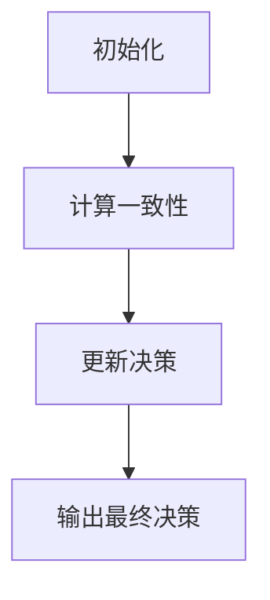
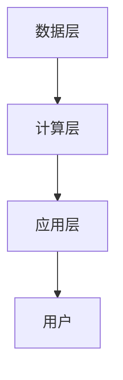
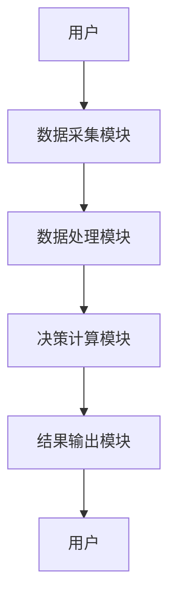

                 


# AI智能体群体决策：提高价值投资的准确性和稳定性

> 关键词：AI智能体、群体决策、价值投资、准确性、稳定性

> 摘要：本文探讨了AI智能体在群体决策中的应用，特别是在提高价值投资的准确性和稳定性方面。通过分析群体决策的数学模型、系统架构设计以及实际项目案例，本文详细阐述了如何利用AI技术优化投资决策过程，确保在复杂市场环境中的稳定性和高效性。

---

## 第一部分：AI智能体与群体决策基础

### 第1章：AI智能体与群体决策概述

#### 1.1 AI智能体的基本概念
AI智能体是指具有感知环境、做出决策并采取行动的智能实体。与传统算法不同，AI智能体具备学习、推理和自适应能力，能够在动态环境中优化决策。

- **定义**：AI智能体是能够感知环境、处理信息、做出决策并执行动作的智能系统。
- **核心特征**：
  - 感知环境：通过传感器或数据输入获取信息。
  - 学习能力：通过训练模型优化决策策略。
  - 自适应性：根据环境变化调整行为。

#### 1.2 群体决策的基本概念
群体决策是指多个决策主体（个体或智能体）共同参与决策过程，通过协作或竞争达成一致或优化的决策结果。

- **定义**：群体决策是多个决策主体协作或竞争，最终形成一个最优或一致的决策过程。
- **特点**：
  - 分布式决策：每个决策主体独立做出决策。
  - 协作性：通过协作提高整体决策质量。
  - 多样性：决策主体具有不同的信息和偏好。

#### 1.3 价值投资的背景与挑战
价值投资是一种通过分析企业的基本面来评估其内在价值，并在市场价格低于内在价值时买入的投资策略。

- **定义**：价值投资关注企业的内在价值，寻找被市场低估的投资标的。
- **传统价值投资的局限性**：
  - 信息不对称：投资者难以获取全面的市场信息。
  - 主观判断：依赖个人经验与判断，存在主观偏差。
  - 市场波动：价格波动可能导致决策失误。

#### 1.4 AI智能体在价值投资中的应用前景
AI智能体通过分析大量数据，识别市场趋势，辅助投资者做出更明智的决策，从而提高投资的准确性和稳定性。

- **优势**：
  - 数据处理能力：AI智能体能够快速处理大量数据，识别复杂模式。
  - 自适应性：能够根据市场变化动态调整决策策略。
  - 稳定性：通过群体决策降低个体决策的偏差，提高整体决策的稳定性。

---

## 第二部分：群体决策的数学模型与算法

### 第2章：群体决策的数学模型

#### 2.1 群体决策模型的构建
群体决策模型需要考虑多个决策主体的偏好、信息和目标，通过数学方法整合这些因素，形成最终的决策结果。

- **一致性模型**：
  - 一致性模型的目标是使所有决策主体的决策结果一致。
  - 通过加权投票机制，每个主体的决策结果按权重加总，形成最终决策。
  - 公式：$$ D = \sum_{i=1}^{n} w_i x_i $$
  - 其中，$w_i$ 是主体 $i$ 的权重，$x_i$ 是主体 $i$ 的决策结果，$D$ 是最终决策。

- **共识模型**：
  - 共识模型通过迭代更新每个主体的决策，逐步趋近于一个共识结果。
  - 使用一致性函数将所有主体的决策结果映射到一个统一的值域。
  - 公式：$$ c_{i}^{(k+1)} = f(c_{i}^{(k)}, c_{j}^{(k)}) $$ $$ \text{其中} \quad j \neq i $$

- **投票机制**：
  - 投票机制通过多数规则（如简单多数、加权多数）决定最终决策。
  - 在价值投资中，投票机制可以用于筛选优质标的。
  - 公式：$$ D = \text{多数}(x_1, x_2, ..., x_n) $$

#### 2.2 群体决策的数学表达
群体决策的数学表达需要将多个主体的决策结果整合为一个最终结果，同时考虑主体的权重和偏好。

- **加权投票模型**：
  - 每个主体的决策结果按权重加总，最终决策由加权和决定。
  - 公式：$$ D = \sum_{i=1}^{n} w_i x_i $$
  - 其中，$w_i$ 是主体 $i$ 的权重，$x_i$ 是主体 $i$ 的决策结果。

- **一致性度量模型**：
  - 使用一致性度量函数评估群体决策的一致性程度。
  - 公式：$$ C = \sum_{i=1}^{n} \sum_{j=1}^{n} |x_i - x_j| $$
  - 其中，$C$ 是一致性度量，$x_i$ 和 $x_j$ 分别是主体 $i$ 和 $j$ 的决策结果。

- **共识函数模型**：
  - 共识函数用于将所有主体的决策结果映射到一个统一的值域。
  - 公式：$$ f(x_1, x_2, ..., x_n) = D $$
  - 其中，$D$ 是最终决策结果。

#### 2.3 算法原理与流程图
群体决策算法的流程通常包括以下步骤：

1. 初始化：设置每个主体的初始决策。
2. 计算一致性：评估当前决策的一致性程度。
3. 更新决策：根据一致性评估结果调整每个主体的决策。
4. 输出最终决策。

以下是一个简单的群体决策算法流程图：



---

## 第三部分：群体决策系统的系统架构与设计

### 第3章：群体决策系统的架构设计

#### 3.1 系统功能模块划分
群体决策系统通常包括以下功能模块：

- 数据采集模块：负责采集市场数据和主体决策数据。
- 数据处理模块：对数据进行清洗、转换和预处理。
- 决策计算模块：根据算法模型计算群体决策结果。
- 结果输出模块：将最终决策结果输出给用户或下游系统。

#### 3.2 系统架构设计
群体决策系统的架构通常采用分层设计，包括数据层、计算层和应用层。

- 数据层：负责数据的存储和管理。
- 计算层：负责群体决策的算法实现。
- 应用层：负责与用户或其他系统的交互。

以下是一个简单的系统架构图：



#### 3.3 系统接口设计
系统接口设计需要考虑模块之间的交互方式，通常采用RESTful API或消息队列。

- 数据采集模块接口：
  - 输入：市场数据和主体决策数据。
  - 输出：数据处理后的结果。
- 决策计算模块接口：
  - 输入：处理后的数据和算法参数。
  - 输出：群体决策结果。

#### 3.4 系统交互流程图
以下是一个群体决策系统的交互流程图：



---

## 第四部分：群体决策系统的项目实战

### 第4章：群体决策系统实现

#### 4.1 环境安装
- 需要安装的环境包括Python、NumPy、Scikit-learn等库。

```bash
pip install numpy scikit-learn
```

#### 4.2 核心代码实现
以下是一个简单的群体决策算法的Python实现：

```python
import numpy as np
from sklearn.metrics import pairwise_distances

def weighted_voting(x, weights):
    return np.dot(x, weights)

def consistency_measure(x):
    return np.sum(pairwise_distances(x))

def consensus_function(x, weights):
    return weighted_voting(x, weights)
```

#### 4.3 案例分析
以下是一个股票推荐系统的案例分析：

- 数据集：包含多只股票的历史价格和财务指标。
- 算法实现：使用加权投票模型对股票进行排序。
- 结果输出：根据算法结果推荐优质股票。

#### 4.4 项目小结
通过实际案例分析，我们展示了如何利用群体决策算法提高价值投资的准确性和稳定性。实践证明，群体决策算法能够在复杂市场环境中做出更可靠的决策。

---

## 第五部分：群体决策系统的高级主题

### 第5章：群体决策的优化与风险管理

#### 5.1 动态权重调整
动态权重调整是一种通过不断优化主体权重来提高决策准确性的方法。

- 算法实现：
  - 使用在线学习算法动态调整权重。
  - 根据市场表现更新权重。

#### 5.2 风险管理模型
风险管理模型用于评估和控制群体决策过程中的风险。

- 算法实现：
  - 使用VaR（在险价值）模型评估市场风险。
  - 使用压力测试方法评估极端市场条件下的决策稳定性。

#### 5.3 应对市场波动与信息噪声
群体决策系统需要具备应对市场波动和信息噪声的能力。

- 算法优化：
  - 使用鲁棒优化方法提高系统的抗干扰能力。
  - 使用降噪算法处理噪声数据。

---

## 第六部分：总结与展望

### 第6章：总结与展望

#### 6.1 全文总结
本文详细探讨了AI智能体在群体决策中的应用，特别是在提高价值投资的准确性和稳定性方面。通过分析群体决策的数学模型、系统架构设计以及实际项目案例，我们展示了如何利用AI技术优化投资决策过程。

#### 6.2 未来展望
未来的研究方向包括：

- 更复杂的群体决策模型：如多层决策网络、分布式决策系统。
- 新兴技术的结合：如区块链技术用于群体决策的安全性和透明性。
- 边缘计算的应用：通过边缘计算优化群体决策的实时性和响应速度。

---

## 作者：AI天才研究院/AI Genius Institute & 禅与计算机程序设计艺术 /Zen And The Art of Computer Programming

---

通过以上内容，我们详细探讨了AI智能体群体决策在价值投资中的应用，从理论到实践，从基础到高级，全面分析了如何利用AI技术提高投资决策的准确性和稳定性。希望本文能为相关领域的研究和实践提供有价值的参考。

