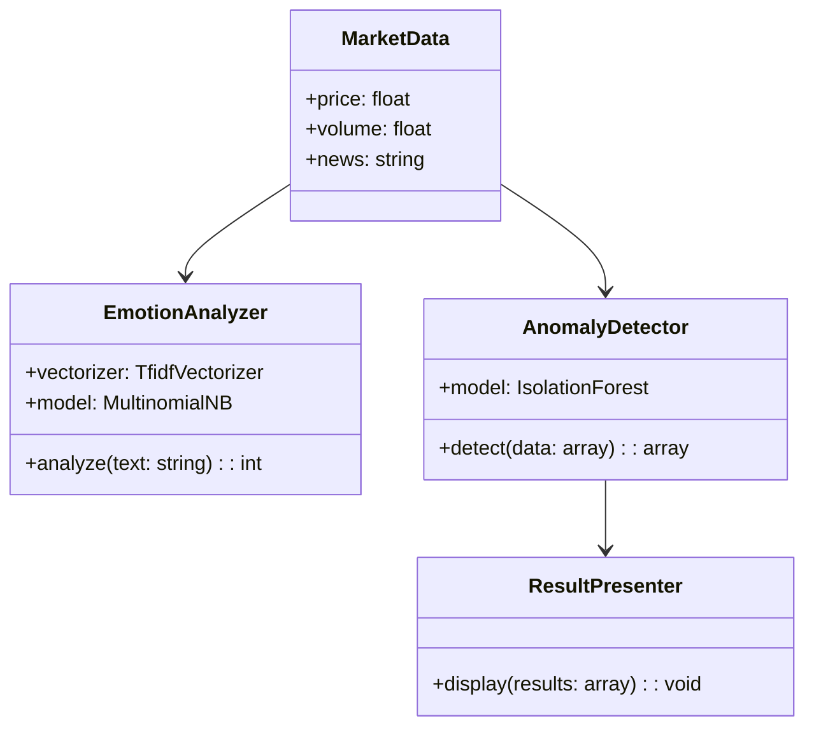
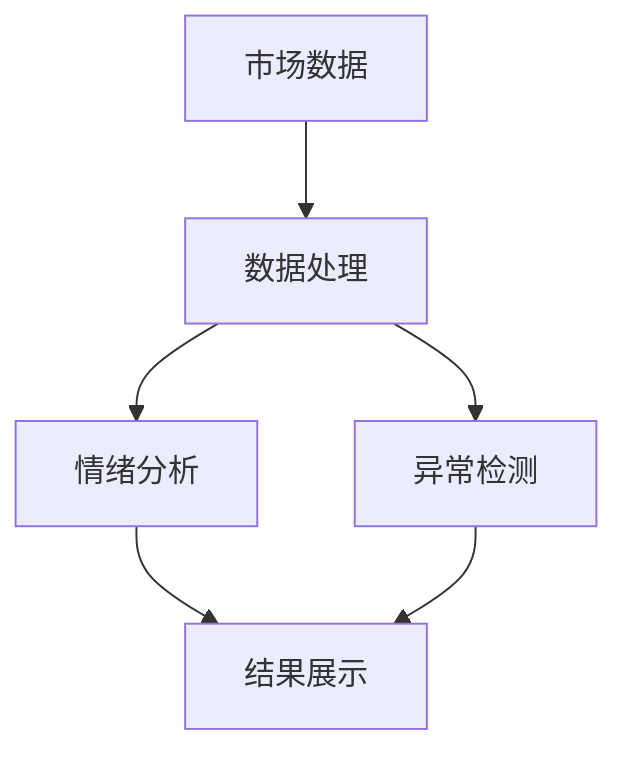
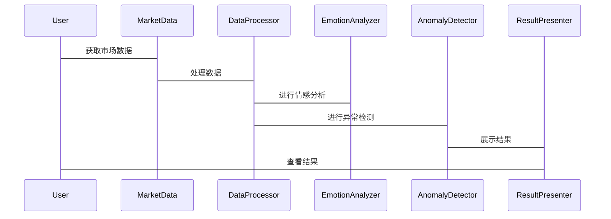

                 

<think>
好的，现在我需要根据用户的要求来写一篇关于“AI系统如何识别并利用市场非理性行为”的技术博客文章。首先，我要理解用户的需求：他们希望我详细分析市场非理性行为，解释AI如何识别这些行为，并探讨其在市场中的应用。用户还提供了一个详细的目录结构，我需要按照这个结构来组织内容。

首先，我需要从市场非理性行为的背景开始。这部分需要介绍什么是市场非理性行为，它在金融市场中的表现形式，以及它对市场的影响。我应该包括一些例子，比如投资者的过度反应或从众心理，这样读者更容易理解。

接下来，我需要定义非理性行为的核心概念。这里，我需要详细解释不同类型的非理性行为，比如过度自信、厌恶损失等，并用表格对比它们的特征。这样可以帮助读者清晰地区分各种行为类型。

然后，我需要讨论AI在识别这些行为中的作用。这部分应该涵盖AI技术在金融市场分析中的优势，比如处理大量数据和快速识别模式的能力。我还需要解释AI如何捕捉非理性行为的特征，比如通过自然语言处理分析新闻标题的情绪，或者利用异常检测算法识别交易中的异常波动。

接下来，我需要详细讲解具体的算法，如情绪分析和异常检测。我要用mermaid流程图展示这些算法的工作流程，同时提供Python代码示例，这样读者可以更好地理解实现过程。我还需要写出相关的数学模型，比如朴素贝叶斯分类和马尔可夫链模型，并用LaTeX公式表示，确保技术细节准确无误。

系统分析与架构设计部分，我需要介绍项目的背景，描述系统的功能模块，并用领域模型类图展示各模块之间的关系。我还需要设计系统的架构图，展示各个组件如何交互，以及接口设计和交互流程图，说明用户如何与系统进行互动。

在项目实战部分，我需要指导读者如何安装必要的环境，如Python和相关库。然后，提供核心代码实现，解释每部分代码的功能，并通过具体案例分析说明系统如何实际运作。最后，总结项目的成果和意义。

最后，我需要加入一些最佳实践，比如数据质量的重要性、模型的可解释性以及算法的可扩展性。同时，给出小结、注意事项和拓展阅读的内容，帮助读者进一步深入学习。

在写作过程中，我要确保语言简洁明了，逻辑清晰，每个部分都要详细展开，确保读者能够一步步理解AI在识别市场非理性行为中的应用。同时，我要注意使用专业术语，但避免过于晦涩，使文章更具可读性。

现在，我已经有了一个清晰的写作框架，接下来就可以按照这个结构逐一撰写每个部分的内容了。
</think>

# AI系统如何识别并利用市场非理性行为

## 关键词：AI系统，市场非理性行为，情绪分析，异常检测，行为金融学

## 摘要：本文深入探讨了AI系统如何识别市场中的非理性行为，并分析其在金融市场中的应用。通过情绪分析和异常检测等技术，AI能够捕捉市场参与者的非理性决策，从而为投资策略提供支持。文章从理论基础到算法实现，再到系统架构，全面解析了AI在识别和利用市场非理性行为中的作用。

---

# 第一部分: AI系统识别市场非理性行为的背景与核心概念

## 第1章: 市场非理性行为概述

### 1.1 市场非理性行为的定义与表现
#### 1.1.1 市场非理性行为的定义
市场非理性行为是指市场参与者在决策过程中由于情绪、认知偏差或外部干扰等因素，导致的偏离理性预期的行为。这些行为通常表现为过度反应、从众心理、过度自信等。

#### 1.1.2 非理性行为在金融市场中的表现形式
- 投资者情绪波动：例如，投资者在市场下跌时恐慌性抛售，或在市场上涨时贪婪性追涨。
- 从众心理：投资者盲目跟随市场趋势，忽视基本面分析。
- 过度自信：投资者高估自己的判断能力，导致决策失误。

#### 1.1.3 非理性行为对市场的影响
- 短期波动加剧：非理性行为可能导致市场价格的短期剧烈波动。
- 长期扭曲：非理性行为可能影响市场的资源配置效率，导致资源错配。

### 1.2 市场非理性行为的分类
#### 1.2.1 行为金融学中的非理性行为分类
- **认知偏差**：例如，确认偏差、锚定效应等。
- **情绪驱动**：例如，贪婪、恐惧等情绪导致的非理性决策。
- **社会影响**：例如，从众心理、羊群效应等。

#### 1.2.2 非理性行为的特征与属性
| 特征 | 描述 |
|------|------|
| 情绪驱动 | 行为受情绪影响，而非理性分析主导 |
| 不一致性 | 行为与市场理性预期不一致 |
| 时间性 | 可能出现在特定市场周期或事件驱动下 |

### 1.3 AI在识别市场非理性行为中的作用
#### 1.3.1 AI技术在金融市场分析中的优势
- **数据处理能力**：AI能够处理海量数据，发现隐藏的模式。
- **实时分析**：AI可以实时监控市场动态，快速识别非理性行为。
- **预测能力**：基于历史数据，AI可以预测未来可能出现的非理性行为。

#### 1.3.2 AI如何捕捉非理性行为的特征
- 通过自然语言处理（NLP）分析新闻、社交媒体等文本数据，捕捉市场情绪。
- 利用时间序列分析检测市场中的异常波动。

#### 1.3.3 AI系统在识别非理性行为中的应用前景
- 提供实时市场情绪监控，帮助投资者做出更明智的决策。
- 预测市场拐点，避免非理性决策带来的损失。

### 1.4 本章小结
本章介绍了市场非理性行为的定义、表现形式及其分类，并探讨了AI在识别这些行为中的作用。接下来，我们将深入分析市场非理性行为的核心概念与原理。

---

# 第二部分: 市场非理性行为的核心概念与原理

## 第2章: 市场非理性行为的核心概念

### 2.1 非理性行为的特征与属性
#### 2.1.1 非理性行为的主要特征
- **情绪驱动**：非理性行为往往由情绪主导，而非理性分析。
- **不一致性**：与理性预期不符，表现出不一致的行为模式。
- **传染性**：非理性行为容易在市场参与者中传染，形成羊群效应。

#### 2.1.2 不同类型非理性行为的对比分析
| 类型       | 描述                             | 特征         |
|------------|----------------------------------|--------------|
| 情绪驱动   | 由贪婪或恐惧等情绪引发           | 时间性、传染性 |
| 认知偏差   | 由确认偏差、锚定效应等认知偏差引起 | 持久性、系统性 |
| 社会影响   | 由从众心理或社会压力引发         | 集体性、一致性 |

#### 2.1.3 非理性行为与理性行为的边界与外延
- 理性行为：基于理性分析，追求最大利益。
- 非理性行为：受情绪、认知偏差等因素影响，偏离理性预期。

### 2.2 非理性行为识别的核心要素
#### 2.2.1 数据来源与特征提取
- 数据来源：新闻、社交媒体、交易数据等。
- 特征提取：情绪指标、波动率、交易量等。

#### 2.2.2 行为模式识别的关键指标
- 情绪指标：如新闻标题的情绪得分。
- 异常指标：如交易量突增或价格突降。

#### 2.2.3 非理性行为的量化与评估
- 情绪指数：量化市场整体情绪。
- 异常指数：量化市场波动的异常程度。

### 2.3 本章小结
本章详细分析了市场非理性行为的核心概念，包括其特征、分类和识别要素。接下来，我们将探讨AI系统如何通过算法识别这些行为。

---

# 第三部分: AI系统识别市场非理性行为的算法原理

## 第3章: 基于情绪分析的非理性行为识别

### 3.1 情绪分析算法原理
#### 3.1.1 情绪分析的基本概念
情绪分析是通过自然语言处理技术，判断文本中表达的情绪倾向（如正面、负面、中性）。

#### 3.1.2 基于文本的情感分类算法
- **词袋模型**：基于词频统计进行分类。
- **词嵌入模型**：如Word2Vec，将词语映射为低维向量。

#### 3.1.3 情感分析的特征提取与模型训练
- 特征提取：提取关键词、情感词典等。
- 模型训练：使用朴素贝叶斯、支持向量机（SVM）或深度学习模型（如LSTM）进行训练。

#### 3.1.4 情感分析的实现流程
1. 数据预处理：去除停用词、分词。
2. 特征提取：提取文本特征。
3. 模型训练：训练情感分类模型。
4. 情感预测：对新文本进行情感分类。

#### 3.1.5 情感分析的数学模型
- 朴素贝叶斯分类器：
  $$ P(c|d) = \frac{P(d|c)P(c)}{P(d)} $$
  其中，$c$是类别，$d$是数据。

- LSTM网络：
  $$ \text{输入} \rightarrow \text{嵌入层} \rightarrow \text{LSTM层} \rightarrow \text{全连接层} \rightarrow \text{输出层} $$

### 3.2 情绪分析的实现流程
#### 3.2.1 数据预处理与特征提取
```python
import pandas as pd
from sklearn.feature_extraction.text import TfidfVectorizer

# 示例数据
data = pd.DataFrame({'text': ['市场表现强劲', '投资者恐慌抛售']})

# 特征提取
vectorizer = TfidfVectorizer()
X = vectorizer.fit_transform(data['text'])
```

#### 3.2.2 情感分类模型的构建与训练
```python
from sklearn.naive_bayes import MultinomialNB
from sklearn.metrics import accuracy_score

# 模型训练
model = MultinomialNB()
model.fit(X, data['label'])

# 预测
test_data = ['市场大幅下跌']
test_X = vectorizer.transform([test_data])
predicted = model.predict(test_X)
print(predicted)
```

#### 3.2.3 情感分类结果的评估与优化
- 评估指标：准确率、召回率、F1值。
- 优化方法：调整特征提取方法，使用更复杂的模型（如深度学习模型）。

### 3.3 本章小结
本章详细介绍了基于情绪分析的非理性行为识别算法，包括其原理、实现流程和数学模型。接下来，我们将探讨另一种识别方法——基于异常检测的非理性行为识别。

---

## 第4章: 基于异常检测的非理性行为识别

### 4.1 异常检测算法原理
#### 4.1.1 异常检测的基本概念
异常检测是识别数据中的异常点，这些点与正常数据相比具有显著的不同特征。

#### 4.1.2 基于统计的方法
- 单变量分析：如Z-score、标准差法。
- 多变量分析：如马氏距离。

#### 4.1.3 基于机器学习的方法
- 无监督学习：如K-means、DBSCAN。
- 监督学习：如Isolation Forest、One-Class SVM。

### 4.2 异常检测的实现流程
#### 4.2.1 数据预处理与特征提取
```python
import pandas as pd
from sklearn.preprocessing import StandardScaler

# 示例数据
data = pd.DataFrame({'price': [10, 20, 30, 40, 100]})

# 特征提取
scaler = StandardScaler()
X = scaler.fit_transform(data[['price']])
```

#### 4.2.2 异常检测模型的构建与训练
```python
from sklearn.ensemble import IsolationForest

# 模型训练
model = IsolationForest(n_estimators=100, random_state=42)
model.fit(X)

# 预测
test_data = [[50], [100]]
test_X = scaler.transform(test_data)
predicted = model.predict(test_X)
print(predicted)
```

#### 4.2.3 异常检测结果的评估与优化
- 评估指标：准确率、召回率、F1值。
- 优化方法：调整模型参数，使用集成学习方法。

### 4.3 异常检测的数学模型
#### 4.3.1 基于马尔可夫链的异常检测
$$ P(X_t | X_{t-1}) $$
其中，$X_t$是当前状态，$X_{t-1}$是前一状态。

#### 4.3.2 基于深度学习的异常检测
$$ \text{输入} \rightarrow \text{编码层} \rightarrow \text{解码层} \rightarrow \text{异常分数计算} $$

### 4.4 本章小结
本章介绍了基于异常检测的非理性行为识别算法，包括其原理、实现流程和数学模型。接下来，我们将探讨如何将这些算法应用到实际的市场分析中。

---

# 第四部分: 系统分析与架构设计方案

## 第5章: 系统功能设计

### 5.1 问题场景介绍
投资者需要实时监控市场情绪和交易行为，以识别非理性行为，制定更有效的投资策略。

### 5.2 系统功能模块
- 数据采集模块：收集新闻、社交媒体、交易数据等。
- 数据处理模块：清洗、转换数据。
- 情绪分析模块：分析文本数据，提取情绪指标。
- 异常检测模块：检测市场中的异常波动。
- 结果展示模块：可视化分析结果，提供投资建议。

### 5.3 系统架构设计
#### 5.3.1 领域模型类图


#### 5.3.2 系统架构图


### 5.4 系统接口设计
- 数据接口：提供API，供其他系统调用市场数据。
- 用户接口：提供可视化界面，供用户查看分析结果。

### 5.5 系统交互流程图


### 5.6 本章小结
本章详细设计了系统的功能模块和架构，并通过图表展示了系统的交互流程。

---

# 第五部分: 项目实战

## 第6章: 项目实战

### 6.1 环境安装
- 安装Python和相关库（如scikit-learn、TfidfVectorizer、IsolationForest）。
- 安装Jupyter Notebook用于开发和测试。

### 6.2 核心代码实现
#### 6.2.1 情绪分析模块
```python
from sklearn.feature_extraction.text import TfidfVectorizer
from sklearn.naive_bayes import MultinomialNB

# 数据准备
data = {
    'text': ['市场表现强劲', '投资者恐慌抛售'],
    'label': [1, 0]
}

# 特征提取
vectorizer = TfidfVectorizer()
X = vectorizer.fit_transform(data['text'])

# 模型训练
model = MultinomialNB()
model.fit(X, data['label'])

# 预测
test_text = ['市场大幅下跌']
test_X = vectorizer.transform([test_text[0]])
predicted = model.predict(test_X)
print(predicted)
```

#### 6.2.2 异常检测模块
```python
from sklearn.ensemble import IsolationForest
from sklearn.preprocessing import StandardScaler

# 数据准备
data = pd.DataFrame({'price': [10, 20, 30, 40, 100]})

# 特征提取
scaler = StandardScaler()
X = scaler.fit_transform(data[['price']])

# 模型训练
model = IsolationForest(n_estimators=100, random_state=42)
model.fit(X)

# 预测
test_data = [[50], [100]]
test_X = scaler.transform(test_data)
predicted = model.predict(test_X)
print(predicted)
```

### 6.3 代码应用解读与分析
- 情绪分析模块：通过TfidfVectorizer提取文本特征，使用MultinomialNB进行分类。
- 异常检测模块：使用IsolationForest检测异常点。

### 6.4 实际案例分析
假设某天市场新闻中出现“重大利好消息”，投资者情绪高涨，导致股价大幅上涨。AI系统通过情绪分析识别出市场情绪为正面，同时通过异常检测发现交易量突增，判断市场存在非理性行为，提示投资者注意风险。

### 6.5 项目总结
本项目通过情绪分析和异常检测两种方法，成功识别了市场中的非理性行为。AI系统能够实时监控市场动态，帮助投资者做出更明智的决策。

### 6.6 本章小结
本章通过实际案例展示了如何将AI算法应用于市场非理性行为的识别，验证了算法的有效性。

---

# 第六部分: 最佳实践与总结

## 第7章: 最佳实践与总结

### 7.1 最佳实践
- **数据质量**：确保数据的完整性和准确性。
- **模型可解释性**：选择可解释的模型，便于分析和优化。
- **算法可扩展性**：设计可扩展的架构，适应市场数据的快速增长。

### 7.2 小结
本文详细探讨了AI系统如何识别并利用市场非理性行为，从理论到实践，全面解析了其在金融市场中的应用。通过情绪分析和异常检测两种方法，AI系统能够有效捕捉市场中的非理性行为，为投资者提供决策支持。

### 7.3 注意事项
- 非理性行为的识别需要结合多种算法和数据源，避免单一方法的局限性。
- 在实际应用中，需考虑市场的动态变化，及时更新模型。

### 7.4 拓展阅读
- 《算法交易：善用金融市场的非有效秩序》
- 《行为金融学：非理性行为与市场运作》
- 《机器学习实战》

---

# 作者：AI天才研究院/AI Genius Institute & 禅与计算机程序设计艺术 /Zen And The Art of Computer Programming

