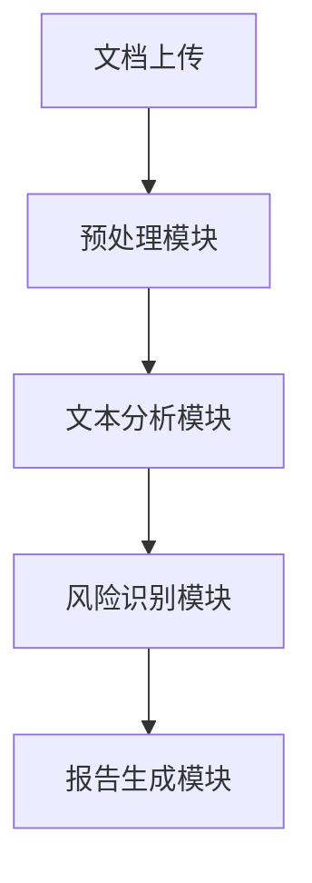

                 


# AI辅助企业并购尽职调查：自动化文档分析与风险识别

> 关键词：AI，企业并购，尽职调查，文档分析，风险识别，自然语言处理，机器学习

> 摘要：本文详细探讨了AI技术在企业并购尽职调查中的应用，特别是自动化文档分析和风险识别方面。文章从背景、技术原理、系统架构到实际应用，全面分析了AI如何提升企业并购的效率和准确性。通过具体案例和代码实现，展示了AI在尽职调查中的潜力和优势。

---

# 第1章: 企业并购与尽职调查基础

## 1.1 企业并购的基本概念
### 1.1.1 企业并购的定义与类型
企业并购（Mergers and Acquisitions, M&A）是指一家企业与其他企业合并或收购其资产或股份的过程。常见的并购类型包括：
- **横向并购**：同一行业内的企业合并。
- **纵向并购**：产业链上下游的企业合并。
- **混合并购**：无直接关联的企业合并。

### 1.1.2 并购过程中的关键环节
企业并购通常包括以下几个关键环节：
1. **战略决策**：确定并购目标和动机。
2. **尽职调查**：对目标企业进行全面的调查和评估。
3. **估值与谈判**：确定目标企业价值并进行谈判。
4. **整合与实施**：完成并购后的资源整合与业务整合。

### 1.1.3 尽职调查的重要性
尽职调查是企业并购过程中最关键的一环，旨在评估目标企业的财务状况、法律问题、业务模式等潜在风险。传统尽职调查依赖人工分析，耗时且效率低下，而AI技术的引入显著提升了这一过程的效率和准确性。

---

## 1.2 AI技术在企业并购中的应用
### 1.2.1 AI技术的基本概念
人工智能（AI）是指计算机系统模拟人类智能的能力，包括学习、推理、感知和决策等。AI技术在企业并购中的应用主要集中在数据处理、模式识别和自动化分析等方面。

### 1.2.2 AI在企业并购中的应用场景
- **文档分析**：AI能够快速处理大量文档，提取关键信息。
- **风险识别**：通过机器学习模型预测和识别潜在风险。
- **估值与预测**：利用大数据分析和预测模型评估企业价值。

### 1.2.3 AI辅助尽职调查的优势
- **提高效率**：AI能够快速处理大量文档，节省时间。
- **降低错误率**：AI算法能够减少人为错误，提高准确性。
- **深度分析**：AI能够挖掘数据中的隐藏信息，提供更全面的评估。

---

## 1.3 文档分析与风险识别
### 1.3.1 文档分析的基本概念
文档分析是指对目标企业的各类文档（如财务报表、合同、法律文件等）进行结构化处理和信息提取的过程。传统文档分析依赖人工操作，而AI技术能够实现自动化处理。

### 1.3.2 风险识别的核心要素
风险识别是尽职调查的核心任务之一，包括识别财务风险、法律风险、市场风险等。AI技术可以通过自然语言处理（NLP）和机器学习模型实现风险的自动识别和分类。

### 1.3.3 AI在文档分析与风险识别中的作用
- **自动化处理**：AI能够快速处理大量文档，提取关键信息。
- **智能分类**：基于NLP技术，AI能够对文档进行分类和标签化处理。
- **风险预测**：利用机器学习模型预测潜在风险，提供决策支持。

---

## 1.4 本章小结
本章介绍了企业并购的基本概念、AI技术在并购中的应用以及文档分析与风险识别的核心要素。AI技术的应用显著提升了企业并购尽职调查的效率和准确性，为并购决策提供了有力支持。

---

# 第2章: 自然语言处理与文档分析

## 2.1 自然语言处理（NLP）基础
### 2.1.1 NLP的定义与核心任务
自然语言处理是指计算机对人类语言进行理解、生成和处理的过程。核心任务包括文本分类、信息提取、情感分析等。

### 2.1.2 常见的NLP技术与工具
- **分词**：将文本分割成词语或短语。
- **实体识别**：识别文本中的实体（如人名、地名、组织名）。
- **句法分析**：分析句子的语法结构。
- **NLP工具**：如spaCy、NLTK、Gensim等。

### 2.1.3 NLP在文档分析中的应用
- **信息提取**：从文档中提取关键信息（如日期、金额、合同条款等）。
- **文本分类**：将文档分类为不同类别（如财务报告、法律文件等）。

---

## 2.2 文本分类与信息提取
### 2.2.1 文本分类的基本原理
文本分类是将文本分为不同类别的过程，常用算法包括决策树、随机森林、支持向量机（SVM）等。

### 2.2.2 信息提取的关键技术
信息提取是从文本中抽取特定信息的技术，常用方法包括基于规则的提取和基于机器学习的提取。

### 2.2.3 基于NLP的文档分类与信息提取案例
案例：从财务报表中提取关键财务指标（如收入、利润、成本等）。

---

## 2.3 本章小结
本章介绍了自然语言处理技术的基本概念、常见工具和应用场景。NLP技术在文档分析中的应用显著提升了信息提取的效率和准确性。

---

# 第3章: 机器学习与风险识别

## 3.1 机器学习基础
### 3.1.1 机器学习的定义与分类
机器学习是指计算机通过数据学习模式并进行预测的过程。主要分类包括监督学习、无监督学习和强化学习。

### 3.1.2 监督学习、无监督学习与强化学习
- **监督学习**：基于标记数据进行训练，预测未知数据。
- **无监督学习**：基于未标记数据进行训练，发现数据中的隐藏结构。
- **强化学习**：通过与环境交互学习最优策略。

### 3.1.3 机器学习在风险识别中的应用
- **监督学习**：用于分类问题，如风险分类。
- **无监督学习**：用于聚类问题，如客户分群。

---

## 3.2 风险识别的算法实现
### 3.2.1 常见的风险识别算法
- **决策树**：用于分类问题，如高风险、中风险、低风险。
- **随机森林**：基于决策树的集成方法，用于分类和回归。
- **支持向量机（SVM）**：用于分类和回归问题。

### 3.2.2 基于机器学习的风险识别模型
案例：利用随机森林算法对目标企业的财务风险进行分类。

### 3.2.3 风险识别模型的训练与优化
- **数据预处理**：特征选择、数据清洗。
- **模型训练**：选择合适的算法，调整参数。
- **模型评估**：通过准确率、召回率等指标评估模型性能。

---

## 3.3 本章小结
本章介绍了机器学习技术的基本概念、常见算法和应用场景。机器学习在风险识别中的应用为尽职调查提供了强大的工具支持。

---

# 第4章: 系统架构与实现

## 4.1 系统功能模块设计
### 4.1.1 文档上传与预处理模块
- **功能**：用户上传文档，系统进行格式转换和预处理。
- **实现**：使用Python的Pandas库进行数据处理。

### 4.1.2 文本分析与信息提取模块
- **功能**：对文档进行文本分类和信息提取。
- **实现**：使用spaCy进行分词和实体识别。

### 4.1.3 风险识别与评估模块
- **功能**：基于机器学习模型进行风险分类。
- **实现**：使用Scikit-learn库进行模型训练和预测。

### 4.1.4 报告生成模块
- **功能**：生成尽职调查报告，包括风险分析和建议。
- **实现**：使用ReportLab库生成PDF报告。

---

## 4.2 系统架构图


---

## 4.3 本章小结
本章详细介绍了AI辅助企业并购尽职调查系统的功能模块和系统架构。通过模块化设计和高效的算法实现，系统能够快速完成文档分析和风险识别，为并购决策提供支持。

---

# 第5章: 项目实战与案例分析

## 5.1 环境搭建与工具安装
### 5.1.1 开发环境的选择与配置
- **Python版本**：建议使用Python 3.8或更高版本。
- **开发工具**：推荐使用PyCharm或VS Code。

### 5.1.2 NLP工具与机器学习框架的安装
- **NLP工具**：安装spaCy、NLTK、Gensim。
- **机器学习框架**：安装Scikit-learn、XGBoost。

---

## 5.2 核心代码实现
### 5.2.1 文档上传与预处理
```python
import os
import pandas as pd

def upload_document(file_path):
    # 读取文件
    with open(file_path, 'r') as f:
        content = f.read()
    return content

def preprocess(content):
    # 分词
    tokens = content.split()
    return tokens
```

### 5.2.2 文本分析与信息提取
```python
import spacy

nlp = spacy.load("en_core_web_sm")

def extract_entities(text):
    doc = nlp(text)
    entities = []
    for ent in doc.ents:
        entities.append((ent.text, ent.label_))
    return entities
```

### 5.2.3 风险识别与评估
```python
from sklearn.ensemble import RandomForestClassifier

def train_model(X_train, y_train):
    model = RandomForestClassifier()
    model.fit(X_train, y_train)
    return model

def predict_risk(model, X_test):
    y_pred = model.predict(X_test)
    return y_pred
```

---

## 5.3 案例分析
案例：某科技公司并购尽职调查。
- **文档分析**：分析目标公司的财务报表和合同。
- **风险识别**：识别潜在的法律风险和财务风险。
- **报告生成**：生成尽职调查报告，提出并购建议。

---

## 5.4 本章小结
本章通过实际案例展示了AI技术在企业并购尽职调查中的应用。通过代码实现和案例分析，读者可以深入了解如何利用AI技术提升尽职调查的效率和准确性。

---

# 第6章: 法律与伦理考虑

## 6.1 数据隐私与合规性
- **数据隐私**：确保文档分析过程中保护数据隐私。
- **合规性**：遵守相关法律法规，如GDPR。

## 6.2 AI技术的伦理问题
- **透明性**：确保AI决策的透明性。
- **公平性**：避免算法偏见，确保决策公平。

## 6.3 本章小结
本章讨论了AI技术在企业并购尽职调查中的法律与伦理问题，强调数据隐私和算法透明的重要性。

---

# 第7章: 未来趋势与挑战

## 7.1 AI技术的未来发展趋势
- **深度学习**：深度学习模型在NLP和机器学习中的应用。
- **自动化工具**：AI辅助工具的普及和优化。

## 7.2 挑战与应对策略
- **数据质量问题**：提高数据质量和完整性。
- **技术瓶颈**：解决AI技术在复杂场景中的应用问题。

## 7.3 本章小结
本章展望了AI技术在企业并购尽职调查中的未来发展趋势，并讨论了面临的挑战和应对策略。

---

# 附录

## 附录A: 工具指南
- **NLP工具**：spaCy、NLTK。
- **机器学习框架**：Scikit-learn、XGBoost。

## 附录B: 术语表
- **NLP**：自然语言处理。
- **AI**：人工智能。
- **随机森林**：机器学习算法。

## 附录C: 参考文献
- [1] 刘海涛. 《机器学习实战》. 北京: 清华大学出版社, 2018.
- [2] 王伟. 《自然语言处理入门》. 北京: 人民邮电出版社, 2019.

---

# 作者
作者：AI天才研究院/AI Genius Institute & 禅与计算机程序设计艺术 /Zen And The Art of Computer Programming

