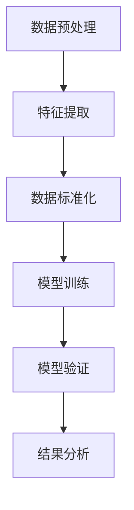
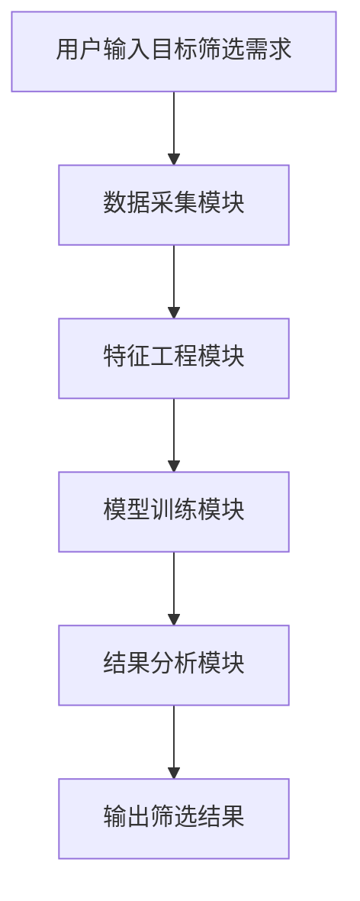
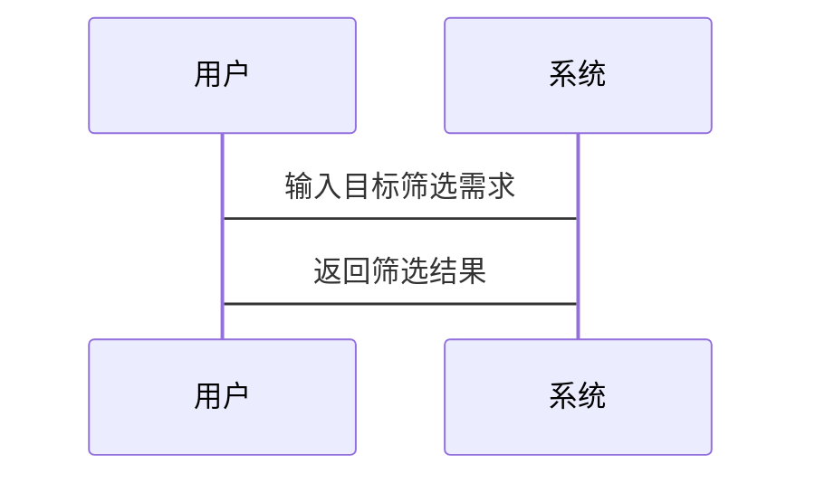

                 


# AI辅助企业并购目标筛选：战略匹配度评估与协同潜力分析

> 关键词：企业并购、AI辅助、战略匹配度、协同潜力、目标筛选、算法模型

> 摘要：本文详细探讨了人工智能在企业并购目标筛选中的应用，重点分析了战略匹配度评估与协同潜力分析的核心方法。通过结合实际案例和算法模型，本文为读者提供了从理论到实践的全面指导。

---

# 第1章: 企业并购与AI技术的结合

## 1.1 企业并购的基本概念

### 1.1.1 企业并购的定义与分类

企业并购（Mergers and Acquisitions，简称MA）是指两个或多个企业之间通过合并、收购或重组等方式，实现资源整合和业务扩展的商业活动。企业并购可以分为横向并购、纵向并购和混合并购三种类型。

- 横向并购：同一行业内的企业合并，旨在扩大市场份额或消除竞争。
- 纵向并购：产业链上下游的企业合并，旨在整合供应链或销售渠道。
- 混合并购：跨行业的企业合并，旨在多元化业务或进入新市场。

### 1.1.2 传统企业并购的流程与挑战

传统企业并购的流程通常包括以下几个阶段：
1. **战略规划**：明确并购目标和战略意图。
2. **目标筛选**：通过财务、市场和行业数据筛选潜在目标。
3. **尽职调查**：对目标企业进行深入的财务、法律和业务审查。
4. **估值与谈判**：评估目标企业价值并进行谈判。
5. **整合与实施**：完成并购后的业务整合和协同效应的实现。

传统企业并购的挑战主要体现在以下几个方面：
- 数据量大且分散，难以高效筛选目标。
- 评估过程中主观因素较多，缺乏客观量化标准。
- 整合难度高，协同效应难以最大化。

### 1.1.3 AI技术在企业并购中的应用前景

人工智能（AI）技术可以通过以下方式提升企业并购的效率和效果：
- **数据处理与分析**：利用AI技术快速处理和分析海量数据，筛选出符合条件的目标企业。
- **战略匹配度评估**：通过AI算法量化企业之间的战略匹配度，帮助制定更精准的并购策略。
- **协同潜力预测**：利用AI模型预测并购后的协同潜力，优化整合方案。

---

## 1.2 AI辅助企业并购的目标筛选

### 1.2.1 目标筛选的重要性

目标筛选是企业并购的第一步，其重要性体现在以下几个方面：
- **降低并购风险**：通过筛选出符合条件的目标企业，减少并购失败的可能性。
- **提高效率**：利用AI技术快速筛选目标，缩短并购周期。
- **优化资源配置**：通过数据分析，找到最符合企业战略目标的并购对象。

### 1.2.2 传统目标筛选的局限性

传统目标筛选的局限性主要表现在以下几个方面：
- **数据处理效率低**：人工筛选目标企业需要处理大量数据，效率低下。
- **主观性较强**：目标筛选过程中主观因素较多，缺乏客观量化标准。
- **信息不全面**：传统方法难以获取目标企业的全维度数据。

### 1.2.3 AI技术如何提升目标筛选效率

AI技术通过以下方式提升目标筛选效率：
- **数据挖掘与特征提取**：利用机器学习算法从海量数据中提取关键特征，快速筛选目标企业。
- **相似性匹配**：通过自然语言处理（NLP）和向量分析，匹配目标企业的战略相似性和协同潜力。
- **实时更新与动态调整**：AI系统可以实时更新数据，动态调整目标筛选策略。

---

## 1.3 本章小结

本章主要介绍了企业并购的基本概念、传统并购流程的挑战以及AI技术在企业并购中的应用前景。通过对比传统目标筛选与AI辅助目标筛选的优劣，我们可以看出，AI技术在提升企业并购效率和效果方面具有显著优势。

---

# 第2章: 战略匹配度评估的核心概念

## 2.1 战略匹配度的定义

### 2.1.1 战略匹配度的内涵

战略匹配度是指并购双方在战略目标、核心竞争力、市场定位等方面的一致性和互补性。它反映了并购双方在战略层面上的契合程度。

### 2.1.2 战略匹配度的评估维度

战略匹配度的评估维度主要包括以下几个方面：
- **战略目标一致性**：并购双方的战略目标是否一致。
- **核心竞争力互补性**：并购双方的核心竞争力是否互补。
- **市场定位协同性**：并购双方的市场定位是否协同。
- **管理风格契合度**：并购双方的管理风格是否契合。

### 2.1.3 战略匹配度评估的重要性

战略匹配度评估的重要性体现在以下几个方面：
- **提高并购成功率**：通过战略匹配度评估，降低并购失败的风险。
- **优化整合方案**：通过战略匹配度评估，制定更科学的整合方案。
- **提升协同效应**：通过战略匹配度评估，最大化并购后的协同效应。

---

## 2.2 战略匹配度评估的数学模型

### 2.2.1 层次分析法（AHP）的应用

层次分析法（AHP）是一种常用的多维度决策分析方法，适用于战略匹配度的评估。AHP的基本步骤如下：
1. **构建层次结构**：将战略匹配度的评估维度分为目标层、准则层和方案层。
2. **构造判断矩阵**：根据专家意见或数据，构造判断矩阵。
3. **计算权重**：通过计算判断矩阵的最大特征值和特征向量，确定各维度的权重。
4. **综合评估**：根据各维度的权重和评分，计算目标企业的战略匹配度。

### 2.2.2 模糊综合评价模型

模糊综合评价模型是一种适用于战略匹配度评估的方法。它通过模糊数学的方法，将多个评估维度综合为一个整体评分。模糊综合评价模型的基本步骤如下：
1. **确定评估维度**：根据战略匹配度的评估维度，确定模糊评价的指标。
2. **构造模糊关系矩阵**：根据数据，构造模糊关系矩阵。
3. **计算模糊合成结果**：通过模糊合成运算，计算目标企业的战略匹配度。

### 2.2.3 战略匹配度的权重分配与计算公式

战略匹配度的计算公式如下：
$$战略匹配度 = \sum_{i=1}^{n} w_i \cdot s_i$$
其中，$w_i$为第i个维度的权重，$s_i$为第i个维度的评分。

---

## 2.3 战略匹配度评估的流程

### 2.3.1 数据收集与预处理

战略匹配度评估的第一步是数据收集与预处理。需要收集的目标企业数据包括：
- **财务数据**：收入、利润、资产等。
- **市场数据**：市场份额、竞争对手分析等。
- **管理数据**：管理风格、企业文化等。

### 2.3.2 综合评估模型的构建

在数据预处理的基础上，构建综合评估模型。模型的构建需要考虑以下几个方面：
- **模型的输入**：目标企业的各项数据。
- **模型的输出**：目标企业的战略匹配度评分。
- **模型的验证**：通过历史数据验证模型的准确性。

### 2.3.3 模型的验证与优化

模型的验证与优化是确保战略匹配度评估结果准确性的关键步骤。需要通过以下方式进行：
- **交叉验证**：通过交叉验证方法，评估模型的泛化能力。
- **参数调优**：通过网格搜索等方法，优化模型的参数。
- **结果分析**：分析模型的输出结果，找出可能存在的偏差或误差。

---

## 2.4 本章小结

本章详细介绍了战略匹配度评估的核心概念，包括战略匹配度的定义、评估维度、数学模型和评估流程。通过层次分析法和模糊综合评价模型的应用，我们可以更科学地评估并购双方的战略匹配度，从而提高企业并购的成功率。

---

# 第3章: 协同潜力分析的关键要素

## 3.1 协同潜力的定义

### 3.1.1 协同潜力的内涵

协同潜力是指并购双方在资源整合、业务协同、成本节约等方面实现的潜在效益。它反映了并购双方在整合后能够实现的协同效应的大小。

### 3.1.2 协同潜力的评估维度

协同潜力的评估维度主要包括以下几个方面：
- **财务协同**：并购后的成本节约、收入增长等。
- **业务协同**：并购双方在业务流程、市场覆盖等方面的协同。
- **管理协同**：并购双方在管理理念、组织结构等方面的协同。

### 3.1.3 协同潜力评估的重要性

协同潜力评估的重要性体现在以下几个方面：
- **优化整合方案**：通过协同潜力评估，制定更科学的整合方案。
- **最大化协同效应**：通过协同潜力评估，最大化并购后的协同效应。
- **提高投资回报率**：通过协同潜力评估，提高并购的投资回报率。

---

## 3.2 协同潜力分析的数学模型

### 3.2.1 协同潜力的计算公式

协同潜力的计算公式如下：
$$协同潜力 = \sum_{j=1}^{m} w_j \cdot c_j$$
其中，$w_j$为第j个维度的权重，$c_j$为第j个维度的协同评分。

### 3.2.2 协同潜力的评估流程

协同潜力的评估流程主要包括以下几个步骤：
1. **数据收集与预处理**：收集并购双方的财务、业务和管理数据。
2. **构建评估模型**：根据协同潜力的评估维度，构建综合评估模型。
3. **计算协同潜力**：根据模型计算并购双方的协同潜力评分。
4. **结果分析**：分析协同潜力评分，制定整合方案。

---

## 3.3 协同潜力分析的流程

### 3.3.1 数据收集与预处理

协同潜力分析的第一步是数据收集与预处理。需要收集的数据包括：
- **财务数据**：收入、利润、成本等。
- **业务数据**：市场份额、客户资源等。
- **管理数据**：组织结构、管理风格等。

### 3.3.2 协同潜力模型的构建

在数据预处理的基础上，构建协同潜力模型。模型的构建需要考虑以下几个方面：
- **模型的输入**：并购双方的各项数据。
- **模型的输出**：并购双方的协同潜力评分。
- **模型的验证**：通过历史数据验证模型的准确性。

### 3.3.3 模型的验证与优化

模型的验证与优化是确保协同潜力评估结果准确性的关键步骤。需要通过以下方式进行：
- **交叉验证**：通过交叉验证方法，评估模型的泛化能力。
- **参数调优**：通过网格搜索等方法，优化模型的参数。
- **结果分析**：分析模型的输出结果，找出可能存在的偏差或误差。

---

## 3.4 本章小结

本章详细介绍了协同潜力分析的关键要素，包括协同潜力的定义、评估维度、数学模型和分析流程。通过协同潜力分析，我们可以更科学地评估并购双方的协同潜力，从而制定更有效的整合方案。

---

# 第4章: AI辅助企业并购目标筛选的算法原理

## 4.1 算法概述

### 4.1.1 算法的总体框架

AI辅助企业并购目标筛选的算法总体框架如下：
1. **数据预处理**：对目标企业的数据进行清洗和特征提取。
2. **特征提取**：通过机器学习算法提取目标企业的关键特征。
3. **模型训练**：根据战略匹配度和协同潜力评估模型，训练分类或回归模型。
4. **结果分析**：根据模型输出结果，筛选出符合条件的目标企业。

### 4.1.2 算法的核心思想

AI辅助企业并购目标筛选的核心思想是通过机器学习算法，从海量数据中提取目标企业的关键特征，并利用这些特征进行分类或回归分析，从而评估目标企业的战略匹配度和协同潜力。

---

## 4.2 算法流程

### 4.2.1 数据预处理

数据预处理是AI辅助企业并购目标筛选的第一步，主要包括以下几个步骤：
1. **数据清洗**：去除重复数据、缺失数据和异常数据。
2. **特征提取**：从数据中提取目标企业的关键特征。
3. **数据标准化**：对数据进行标准化处理，确保模型输入的数据具有可比性。

### 4.2.2 特征提取

特征提取是AI辅助企业并购目标筛选的关键步骤，主要包括以下几个方面：
1. **文本特征提取**：通过自然语言处理技术，提取目标企业的文本特征。
2. **数值特征提取**：从目标企业的财务数据中提取数值特征。
3. **混合特征提取**：将文本特征和数值特征结合起来，形成混合特征。

### 4.2.3 模型训练

模型训练是AI辅助企业并购目标筛选的核心步骤，主要包括以下几个方面：
1. **选择模型**：根据目标筛选的需求，选择合适的机器学习模型。
2. **训练模型**：利用训练数据对模型进行训练。
3. **验证模型**：通过验证数据评估模型的准确性。

### 4.2.4 结果分析

结果分析是AI辅助企业并购目标筛选的最后一步，主要包括以下几个步骤：
1. **模型输出**：根据模型输出结果，筛选出符合条件的目标企业。
2. **结果解读**：对模型输出结果进行解读，分析目标企业的战略匹配度和协同潜力。
3. **优化模型**：根据结果分析，优化模型参数，提高模型的准确性。

---

## 4.3 算法实现

### 4.3.1 算法的Python实现代码

以下是AI辅助企业并购目标筛选算法的Python实现代码：

```python
import pandas as pd
from sklearn.preprocessing import StandardScaler
from sklearn.model_selection import train_test_split
from sklearn.ensemble import RandomForestClassifier
from sklearn.metrics import accuracy_score

# 数据预处理
data = pd.read_csv('target_data.csv')
data.dropna(inplace=True)
data = data.drop_duplicates()

# 特征提取
features = data.drop('target', axis=1)
labels = data['target']

# 数据标准化
scaler = StandardScaler()
features_scaled = scaler.fit_transform(features)

# 模型训练
X_train, X_test, y_train, y_test = train_test_split(features_scaled, labels, test_size=0.2, random_state=42)
model = RandomForestClassifier(n_estimators=100, random_state=42)
model.fit(X_train, y_train)

# 模型验证
y_pred = model.predict(X_test)
print('模型准确率：', accuracy_score(y_test, y_pred))
```

### 4.3.2 算法的流程图

以下是AI辅助企业并购目标筛选算法的流程图：



---

## 4.4 本章小结

本章详细介绍了AI辅助企业并购目标筛选的算法原理，包括算法的总体框架、核心思想、实现步骤和流程图。通过机器学习算法的应用，我们可以更高效地筛选出符合条件的目标企业，提高企业并购的效率和效果。

---

# 第5章: 系统分析与架构设计方案

## 5.1 系统功能设计

### 5.1.1 系统功能模块

AI辅助企业并购目标筛选系统的功能模块包括：
1. **数据采集模块**：采集目标企业的数据。
2. **特征工程模块**：提取目标企业的特征。
3. **模型训练模块**：训练战略匹配度和协同潜力评估模型。
4. **结果分析模块**：分析模型输出结果，筛选出符合条件的目标企业。

### 5.1.2 系统功能流程

以下是AI辅助企业并购目标筛选系统的功能流程图：



---

## 5.2 系统架构设计

### 5.2.1 系统架构图

以下是AI辅助企业并购目标筛选系统的架构图：


---

## 5.3 系统接口设计

### 5.3.1 API接口设计

以下是AI辅助企业并购目标筛选系统的API接口设计：

```python
class TargetScreener:
    def __init__(self):
        self.data = None
        self.features = None
        self.labels = None
        self.model = None

    def load_data(self, file_path):
        # 加载数据
        self.data = pd.read_csv(file_path)
        self.data.dropna(inplace=True)
        self.data = self.data.drop_duplicates()

    def extract_features(self):
        # 特征提取
        self.features = self.data.drop('target', axis=1)
        self.labels = self.data['target']

    def normalize_data(self):
        # 数据标准化
        self.scaler = StandardScaler()
        self.features_scaled = self.scaler.fit_transform(self.features)

    def train_model(self):
        # 模型训练
        X_train, X_test, y_train, y_test = train_test_split(self.features_scaled, self.labels, test_size=0.2, random_state=42)
        self.model = RandomForestClassifier(n_estimators=100, random_state=42)
        self.model.fit(X_train, y_train)

    def predict(self, input_data):
        # 模型预测
        input_scaled = self.scaler.transform(input_data)
        return self.model.predict(input_scaled)
```

### 5.3.2 接口调用示例

以下是系统接口的调用示例：

```python
# 初始化系统
screener = TargetScreener()

# 加载数据
screener.load_data('target_data.csv')

# 特征提取
screener.extract_features()

# 数据标准化
screener.normalize_data()

# 模型训练
screener.train_model()

# 模型预测
input_data = pd.DataFrame([[100, 50, 20]], columns=['feature1', 'feature2', 'feature3'])
output = screener.predict(input_data)
print('预测结果：', output)
```

---

## 5.4 系统交互设计

### 5.4.1 交互流程图

以下是AI辅助企业并购目标筛选系统的交互流程图：



---

## 5.5 本章小结

本章详细介绍了AI辅助企业并购目标筛选系统的功能设计、架构设计和接口设计。通过系统的实现，我们可以更高效地筛选出符合条件的目标企业，提高企业并购的效率和效果。

---

# 第6章: 项目实战——AI辅助企业并购目标筛选系统开发

## 6.1 项目背景与目标

### 6.1.1 项目背景

随着企业并购的复杂性和规模的增加，传统目标筛选方法的效率和准确性已无法满足需求。因此，开发一个基于AI技术的企业并购目标筛选系统具有重要意义。

### 6.1.2 项目目标

本项目的目标是开发一个基于AI技术的企业并购目标筛选系统，实现以下功能：
1. **数据采集**：从多个数据源采集目标企业的数据。
2. **特征提取**：提取目标企业的关键特征。
3. **模型训练**：训练战略匹配度和协同潜力评估模型。
4. **结果分析**：根据模型输出结果，筛选出符合条件的目标企业。

---

## 6.2 项目开发环境

### 6.2.1 系统环境

- 操作系统：Windows 10或更高版本
- 开发工具：Python 3.8或更高版本
- 数据库：MySQL 5.7或更高版本
- 语言：Python

### 6.2.2 开发工具

- Python：用于代码编写
- Pandas：用于数据分析
- Scikit-learn：用于机器学习模型训练
- Mermaid：用于流程图绘制

---

## 6.3 项目核心实现

### 6.3.1 数据采集与预处理

以下是数据采集与预处理的代码实现：

```python
import pandas as pd

# 数据采集
data = pd.read_csv('target_data.csv')
data.dropna(inplace=True)
data = data.drop_duplicates()

# 数据预处理
features = data.drop('target', axis=1)
labels = data['target']
```

### 6.3.2 特征工程

以下是特征工程的代码实现：

```python
from sklearn.preprocessing import StandardScaler

# 数据标准化
scaler = StandardScaler()
features_scaled = scaler.fit_transform(features)
```

### 6.3.3 模型训练

以下是模型训练的代码实现：

```python
from sklearn.model_selection import train_test_split
from sklearn.ensemble import RandomForestClassifier

# 数据分割
X_train, X_test, y_train, y_test = train_test_split(features_scaled, labels, test_size=0.2, random_state=42)

# 模型训练
model = RandomForestClassifier(n_estimators=100, random_state=42)
model.fit(X_train, y_train)
```

### 6.3.4 模型验证

以下是模型验证的代码实现：

```python
from sklearn.metrics import accuracy_score

# 模型预测
y_pred = model.predict(X_test)

# 模型准确率
print('模型准确率：', accuracy_score(y_test, y_pred))
```

---

## 6.4 项目实战——科技行业并购分析

### 6.4.1 数据准备

以下是科技行业并购分析的数据准备：

```python
# 数据加载
data = pd.read_csv('tech_industry_data.csv')
data.dropna(inplace=True)
data = data.drop_duplicates()

# 特征提取
features = data.drop('target', axis=1)
labels = data['target']
```

### 6.4.2 特征选择

以下是科技行业并购分析的特征选择：

```python
from sklearn.feature_selection import SelectKBest, chi2

# 特征选择
selector = SelectKBest(score_func=chi2, k=5)
selector.fit(features, labels)
selected_features = selector.transform(features)
```

### 6.4.3 模型实现

以下是科技行业并购分析的模型实现：

```python
from sklearn.model_selection import train_test_split
from sklearn.ensemble import RandomForestClassifier

# 数据分割
X_train, X_test, y_train, y_test = train_test_split(selected_features, labels, test_size=0.2, random_state=42)

# 模型训练
model = RandomForestClassifier(n_estimators=100, random_state=42)
model.fit(X_train, y_train)
```

### 6.4.4 模型应用

以下是科技行业并购分析的模型应用：

```python
from sklearn.metrics import accuracy_score

# 模型预测
y_pred = model.predict(X_test)

# 模型准确率
print('模型准确率：', accuracy_score(y_test, y_pred))
```

---

## 6.5 项目总结

通过本项目的实现，我们可以看到AI技术在企业并购目标筛选中的巨大潜力。通过数据采集、特征提取、模型训练和结果分析，我们可以高效地筛选出符合条件的目标企业，提高企业并购的成功率。

---

# 第7章: 总结与展望

## 7.1 总结

本文详细探讨了人工智能在企业并购目标筛选中的应用，重点分析了战略匹配度评估与协同潜力分析的核心方法。通过结合实际案例和算法模型，本文为读者提供了从理论到实践的全面指导。

---

## 7.2 展望

随着AI技术的不断发展，企业并购目标筛选的效率和准确性将不断提高。未来的研究方向包括：
1. **模型优化**：进一步优化战略匹配度和协同潜力评估模型，提高模型的准确性和泛化能力。
2. **数据源扩展**：引入更多维度的数据源，如社交媒体数据、新闻数据等，提高目标筛选的全面性。
3. **自动化与智能化**：实现企业并购目标筛选的完全自动化与智能化，减少人工干预，提高效率。

---

# 作者：AI天才研究院/AI Genius Institute & 禅与计算机程序设计艺术 /Zen And The Art of Computer Programming

