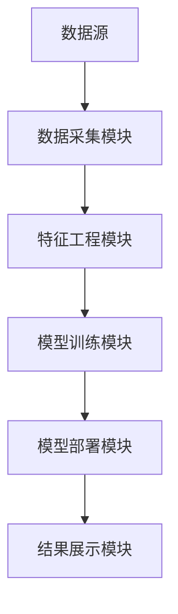

                 


# AI辅助发现新兴市场价值投资标的

> 关键词：AI技术、价值投资、新兴市场、金融分析、机器学习

> 摘要：本文探讨如何利用AI技术在新兴市场中发现有价值的投资标的。通过分析AI在金融领域的应用，揭示其在价值投资中的潜力，并详细讲解相关的算法原理、系统架构设计及实际案例。

---

# 第1章 AI与价值投资的结合

## 1.1 价值投资的基本概念

### 1.1.1 价值投资的定义与核心理念

- 价值投资是一种长期投资策略，旨在通过分析公司基本面，寻找被市场低估的投资标的。
- 核心理念包括安全边际、长期视角和内在价值评估。
- 价值投资的边界在于市场波动和信息不对称，其外延包括成长型投资和趋势投资。

### 1.1.2 价值投资的核心要素

- **内在价值**：通过DCF模型评估公司未来现金流的现值。
- **安全边际**：买入价格低于内在价值，以降低投资风险。
- **竞争优势**：分析公司的护城河，如品牌、技术壁垒等。

### 1.1.3 价值投资的边界与外延

- **边界**：价值投资不适用于所有市场环境，尤其在高波动性和信息不透明的情况下。
- **外延**：扩展到成长投资和趋势投资，结合成长性和行业趋势判断投资价值。

## 1.2 AI技术在金融领域的应用背景

### 1.2.1 AI技术的基本概念

- 人工智能（AI）：模拟人类认知过程，利用机器学习、深度学习等技术处理数据。
- 机器学习：通过数据训练模型，使其具备预测和分类能力。
- 深度学习：基于神经网络的深层结构，能够处理非结构化数据，如文本和图像。

### 1.2.2 AI在金融领域的应用现状

- **量化交易**：利用算法进行高频交易和套利。
- **风险管理**：通过AI识别市场风险，优化投资组合。
- **客户画像**：基于AI分析客户行为，提供个性化投资建议。

### 1.2.3 AI技术与价值投资的结合

- **数据处理**：AI能够快速分析大量非结构化数据，如新闻和社交媒体信息，提取市场情绪。
- **预测模型**：利用机器学习模型预测股票价格和市场趋势，辅助价值评估。
- **组合优化**：通过AI优化投资组合，平衡风险与收益。

## 1.3 本章小结

- 本章介绍了价值投资的基本概念及其在金融领域的应用，重点分析了AI技术如何与价值投资结合，提升投资效率和准确性。

---

# 第2章 AI辅助发现新兴市场的核心概念

## 2.1 AI辅助投资的核心概念

### 2.1.1 AI辅助投资的定义

- 利用AI技术辅助投资决策，包括数据采集、分析和预测。

### 2.1.2 AI辅助投资的核心要素

- **数据源**：包括市场数据、新闻、社交媒体等多源数据。
- **模型构建**：基于机器学习和深度学习构建预测模型。
- **实时监控**：实时跟踪市场变化，调整投资策略。

### 2.1.3 AI辅助投资的原理

- 通过数据挖掘和模式识别，发现潜在的投资机会。
- 利用自然语言处理分析市场情绪，辅助价值判断。

## 2.2 新兴市场的定义与特征

### 2.2.1 新兴市场的定义

- 经济处于快速发展阶段，具有较高增长潜力的国家或地区。

### 2.2.2 新兴市场的特征

- **高波动性**：市场波动较大，信息不透明。
- **高增长性**：经济增长快，投资机会多。
- **多样性**：新兴市场涵盖多个行业和领域。

### 2.2.3 新兴市场的投资机会

- **行业增长**：新兴行业如科技、消费等具有巨大潜力。
- **市场低估**：部分公司因市场波动被低估，具有投资价值。

## 2.3 AI与新兴市场结合的潜力

### 2.3.1 AI在新兴市场中的应用潜力

- 数据分析：处理新兴市场的非结构化数据，提取有用信息。
- 预测模型：预测新兴市场股票价格和行业趋势。

### 2.3.2 AI技术对新兴市场投资的影响

- 提高投资效率，降低信息获取成本。
- 发现潜在投资机会，优化投资组合。

### 2.3.3 AI在新兴市场中的优势与挑战

- **优势**：快速处理大量数据，发现市场规律。
- **挑战**：数据质量参差不齐，市场波动大。

## 2.4 本章小结

- 本章探讨了AI辅助投资的核心概念，分析了新兴市场的特征和投资机会，重点阐述了AI在新兴市场中的应用潜力和挑战。

---

# 第3章 AI辅助价值投资的算法原理

## 3.1 价值投资的数学模型

### 3.1.1 CAPM模型

- **公式**：$$ E(r_i) = r_f + β_i (E(r_m) - r_f) $$
- **解释**：CAPM模型用于计算资产的预期收益，考虑其系统性风险β。

### 3.1.2 风险调整后的收益模型

- **夏普比率**：衡量投资组合的风险调整后收益。
- **公式**：$$ \text{夏普比率} = \frac{E(r_p) - r_f}{\sigma_p} $$

### 3.1.3 价值投资的回归分析

- **线性回归模型**：分析公司财务指标与股票收益的关系。
- **公式**：$$ y = β_0 + β_1x_1 + β_2x_2 + ... + β_nx_n + ε $$

## 3.2 AI算法在价值投资中的应用

### 3.2.1 机器学习算法

- **支持向量机（SVM）**：用于分类和回归，预测股票价格。
- **随机森林**：用于特征重要性分析，识别关键财务指标。

### 3.2.2 深度学习算法

- **LSTM网络**：用于时间序列预测，分析历史股价走势。
- **卷积神经网络（CNN）**：用于图像识别，分析K线图。

### 3.2.3 自然语言处理

- **情感分析**：分析新闻和社交媒体情绪，判断市场走势。
- **实体识别**：识别公司名称和行业信息，辅助投资决策。

## 3.3 算法原理的数学公式

### 3.3.1 CAPM模型的公式

$$ E(r_i) = r_f + β_i (E(r_m) - r_f) $$

### 3.3.2 机器学习回归模型的公式

$$ y = β_0 + β_1x_1 + β_2x_2 + ... + β_nx_n + ε $$

## 3.4 本章小结

- 本章详细讲解了价值投资的数学模型和AI算法的应用，分析了不同算法在投资中的作用和实现原理。

---

# 第4章 AI辅助投资系统的架构设计

## 4.1 系统架构概述

### 4.1.1 系统整体架构

- **模块化设计**：数据采集、特征工程、模型训练、模型部署。
- **分层架构**：数据层、计算层、应用层。

### 4.1.2 系统模块划分

- 数据采集模块：收集市场数据、新闻等信息。
- 特征工程模块：提取有用特征，如财务指标、市场情绪。
- 模型训练模块：训练机器学习模型，进行预测。
- 模型部署模块：将模型部署到生产环境，实时预测。

### 4.1.3 系统功能设计

- 数据处理：清洗和预处理数据。
- 模型训练：训练机器学习模型。
- 预测分析：生成投资建议和风险评估。
- 结果展示：可视化分析结果。

## 4.2 系统功能模块实现

### 4.2.1 数据采集模块

- 使用网络爬虫采集新闻数据。
- 通过API接口获取市场数据。

### 4.2.2 特征工程模块

- 数据清洗：处理缺失值和异常值。
- 特征提取：提取关键特征，如财务指标和市场情绪。

### 4.2.3 模型训练模块

- 选择合适的算法，如随机森林和LSTM。
- 调参优化，提升模型性能。

### 4.2.4 模型部署模块

- 部署模型到云平台，提供API服务。
- 实时监控模型性能，及时调整。

## 4.3 系统架构图



## 4.4 本章小结

- 本章详细描述了AI辅助投资系统的架构设计，包括各个模块的功能和实现方式，以及系统的整体架构。

---

# 第5章 项目实战：AI辅助新兴市场投资系统

## 5.1 环境安装与配置

### 5.1.1 安装Python环境

- 使用Anaconda安装Python 3.8以上版本。

### 5.1.2 安装依赖库

- 使用pip安装numpy、pandas、scikit-learn等库。

### 5.1.3 安装Jupyter Notebook

- 用于数据处理和模型训练的交互式环境。

## 5.2 系统核心实现源代码

### 5.2.1 数据采集模块

```python
import requests
from bs4 import BeautifulSoup

def fetch_data(url):
    response = requests.get(url)
    soup = BeautifulSoup(response.text, 'html.parser')
    # 提取数据并返回
    return data
```

### 5.2.2 特征工程模块

```python
import pandas as pd

def preprocess_data(data):
    # 数据清洗和特征提取
    return processed_data
```

### 5.2.3 模型训练模块

```python
from sklearn.ensemble import RandomForestRegressor

def train_model(X, y):
    model = RandomForestRegressor()
    model.fit(X, y)
    return model
```

### 5.2.4 模型部署模块

```python
import joblib

def save_model(model, filename):
    joblib.dump(model, filename)

def load_model(filename):
    return joblib.load(filename)
```

## 5.3 实际案例分析与解读

### 5.3.1 数据来源与预处理

- 数据来源：新兴市场的股票数据和新闻数据。
- 数据清洗：处理缺失值和异常值。
- 特征提取：提取财务指标和市场情绪。

### 5.3.2 模型训练与优化

- 训练随机森林模型，预测股票价格。
- 调整参数，如n_estimators和max_depth，优化模型性能。

### 5.3.3 投资建议生成

- 基于模型预测结果，生成投资建议。
- 结合市场情绪和公司基本面，优化投资组合。

## 5.4 项目小结

- 本章通过一个实际项目展示了AI辅助投资系统的实现过程，从数据采集到模型部署，详细讲解了每个步骤的具体操作。

---

# 第6章 最佳实践与注意事项

## 6.1 最佳实践

### 6.1.1 数据处理

- 确保数据质量，处理缺失值和异常值。
- 使用适当的方法进行特征工程，提取有用信息。

### 6.1.2 模型选择

- 根据数据类型和任务选择合适的算法。
- 通过交叉验证优化模型参数。

### 6.1.3 系统部署

- 部署模型到可靠云平台，确保服务可用性。
- 定期监控模型性能，及时更新模型。

## 6.2 小结

- 本章总结了AI辅助投资系统的最佳实践，提供了在实际应用中需要注意的事项和优化建议。

---

# 作者：AI天才研究院 & 禅与计算机程序设计艺术

---

通过以上详细的目录结构，文章系统地介绍了AI辅助发现新兴市场价值投资标的的理论基础、算法原理和实际应用。每个章节都深入浅出地讲解了相关内容，确保读者能够全面理解AI在金融投资中的潜力和实现方法。

