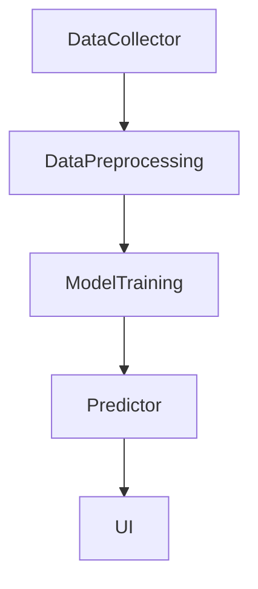

                 


# 《AI辅助发现隐藏的价值投资机会》

## 关键词：AI，价值投资，大数据分析，机器学习，股票预测，投资机会

## 摘要：本文探讨了如何利用人工智能技术辅助发现隐藏的价值投资机会。通过分析大数据，构建机器学习模型，设计系统架构，提供实战案例，总结经验与展望未来，帮助投资者利用AI技术提升投资决策的准确性和效率。

---

## 第1章: AI在价值投资中的背景与概念

### 1.1 价值投资的定义与核心要素

#### 1.1.1 价值投资的基本概念
价值投资是一种投资策略，旨在通过分析公司的基本面，如财务状况、行业地位和管理团队等，寻找市场价格低于其内在价值的股票。其核心在于寻找被市场低估的投资标的。

#### 1.1.2 价值投资的核心要素
- **内在价值**：公司未来现金流的现值，计算公式为：
  $$ V = \sum_{t=1}^{n} \frac{CF_t}{(1+r)^t} $$
  其中，$CF_t$为第t年的现金流，$r$为折现率。
- **安全边际**：买入价格低于内在价值，以降低风险。
- **长期视角**：关注公司的长期增长潜力。

#### 1.1.3 价值投资的边界与外延
- **边界**：依赖于准确的内在价值评估，受市场波动和信息不全影响。
- **外延**：不仅限于股票，还包括债券、房地产等多种资产。

### 1.2 AI技术在金融领域的应用背景

#### 1.2.1 金融数据分析的复杂性
金融市场数据具有高度复杂性，包括大量非结构化数据（如新闻、社交媒体）和结构化数据（如财务报表）。传统方法难以处理这些数据。

#### 1.2.2 AI技术在金融领域的优势
- **数据处理能力**：AI能够快速处理和分析大量数据，发现潜在模式。
- **预测能力**：通过机器学习模型，AI可以预测股票价格走势。
- **自动化交易**：AI可以实时分析市场数据，执行交易决策。

#### 1.2.3 价值投资与AI技术的结合
AI技术可以辅助价值投资者，通过分析大数据优化投资决策，发现市场低估的标的。

---

## 第2章: 价值投资与AI技术的核心概念

### 2.1 核心概念原理

#### 2.1.1 价值投资的核心原理
- **基本面分析**：通过财务数据评估公司价值。
- **安全边际**：买入价格低于内在价值。

#### 2.1.2 AI技术的核心原理
- **数据处理**：收集、清洗和预处理数据。
- **特征提取**：提取对预测有影响的特征。
- **模型训练**：训练机器学习模型进行预测。

### 2.2 核心概念属性特征对比

| 属性         | 价值投资             | AI技术               |
|--------------|----------------------|----------------------|
| 数据类型     | 结构化数据为主         | 结构化和非结构化数据 |
| 方法论       | 基于财务指标分析       | 基于机器学习模型     |
| 时间跨度     | 长期视角             | 可短期也可长期       |
| 灵活性       | 较低                 | 较高                 |

### 2.3 ER实体关系图
```mermaid
er
    entity 价值投资机会 {
        key: 机会ID
        attribute: 机会名称, 机会描述, 机会价值
    }
    entity AI分析数据 {
        key: 数据ID
        attribute: 数据来源, 数据类型, 数据时间
    }
    entity 投资者 {
        key: 投资者ID
        attribute: 投资者名称, 投资策略, 投资目标
    }
    value_investment_chance与ai_data 关联: 分析结果
    value_investment_chance与investor 关联: 投资决策
```

### 2.4 本章小结
本章介绍了价值投资和AI技术的核心概念，并通过对比分析展示了两者在属性上的差异。ER图展示了价值投资机会、AI分析数据和投资者之间的关系。

---

## 第3章: 大数据分析在金融投资中的应用

### 3.1 大数据分析的基本概念

#### 3.1.1 数据分析的定义
数据分析是通过处理数据，提取有用信息，支持决策的过程。在金融领域，数据分析用于评估投资机会和风险。

### 3.2 金融大数据的特征

#### 3.2.1 数据的多样性
金融数据包括股票价格、财务报表、新闻、社交媒体等多种类型。

#### 3.2.2 数据的实时性
金融市场数据需要实时处理，以便快速做出决策。

#### 3.2.3 数据的复杂性
金融数据往往包含噪声和不确定性，增加了分析的难度。

### 3.3 数据预处理与特征提取

#### 3.3.1 数据清洗
- **去除缺失值**：处理缺失数据，如删除或填充。
- **去除异常值**：识别并处理异常值，确保数据的准确性。

#### 3.3.2 特征提取
- **文本特征提取**：从新闻中提取关键词，使用TF-IDF方法。
- **数值特征提取**：从财务报表中提取关键指标，如市盈率（P/E）、市净率（P/B）。

### 3.4 数据分析与可视化

#### 3.4.1 数据分析方法
- **描述性分析**：总结数据的基本统计特征。
- **预测性分析**：使用回归分析预测股票价格。

#### 3.4.2 数据可视化
使用工具如Matplotlib绘制股票价格走势和财务指标分布。

### 3.5 本章小结
本章介绍了大数据分析在金融投资中的应用，重点讨论了数据预处理和特征提取的方法，以及数据分析与可视化的技术。

---

## 第4章: 机器学习模型在价值投资中的应用

### 4.1 机器学习模型的基本原理

#### 4.1.1 线性回归模型
- **简单线性回归**：$y = \beta_0 + \beta_1 x + \epsilon$
- **多元线性回归**：$y = \beta_0 + \beta_1 x_1 + \beta_2 x_2 + ... + \beta_n x_n + \epsilon$

#### 4.1.2 随机森林模型
随机森林是一种基于决策树的集成学习方法，通过构建多个决策树并进行投票或平均来提高预测准确性。

### 4.2 机器学习模型的选择与优化

#### 4.2.1 模型选择
根据数据特征和目标选择合适的模型，如线性回归适用于线性关系，随机森林适用于复杂关系。

#### 4.2.2 模型优化
- **参数调优**：使用网格搜索或随机搜索调整模型参数。
- **交叉验证**：通过K折交叉验证评估模型性能。

### 4.3 机器学习模型在价值投资中的应用

#### 4.3.1 股票价格预测
使用历史数据训练模型，预测未来股票价格。

#### 4.3.2 风险评估
通过模型评估投资组合的风险，如VaR（Value at Risk）。

### 4.4 本章小结
本章介绍了机器学习模型的基本原理，并讨论了在价值投资中的应用，包括股票价格预测和风险评估。

---

## 第5章: 系统架构设计与实现

### 5.1 系统架构设计

#### 5.1.1 系统模块划分
- **数据采集模块**：收集股票价格、财务报表、新闻等数据。
- **数据处理模块**：清洗和预处理数据。
- **模型训练模块**：训练机器学习模型。
- **预测模块**：基于模型预测股票价格。
- **用户界面模块**：展示分析结果。

#### 5.1.2 系统架构图


### 5.2 系统功能设计

#### 5.2.1 数据采集
从Yahoo Finance等平台获取股票数据。

#### 5.2.2 数据处理
清洗数据，处理缺失值和异常值。

#### 5.2.3 模型训练
训练随机森林模型，评估模型性能。

#### 5.2.4 预测与可视化
预测股票价格，并通过图表展示结果。

### 5.3 系统实现

#### 5.3.1 数据采集代码
```python
import pandas_datareader as pdr

# 从Yahoo Finance获取数据
data = pdr.get_data_yahoo('AAPL', start='2020-01-01', end='2023-01-01')
```

#### 5.3.2 数据处理代码
```python
# 处理缺失值
data = data.dropna()

# 标准化数据
from sklearn.preprocessing import StandardScaler
scaler = StandardScaler()
scaled_data = scaler.fit_transform(data[['Close', 'Volume']])
```

#### 5.3.3 模型训练代码
```python
from sklearn.ensemble import RandomForestRegressor
from sklearn.metrics import mean_squared_error

# 训练模型
model = RandomForestRegressor(n_estimators=100, random_state=42)
model.fit(X_train, y_train)

# 评估模型
y_pred = model.predict(X_test)
rmse = mean_squared_error(y_test, y_pred)
print(f'RMSE: {rmse}')
```

### 5.4 本章小结
本章详细描述了AI辅助价值投资系统的架构设计与实现，包括数据采集、处理、模型训练和预测模块的实现。

---

## 第6章: 项目实战与案例分析

### 6.1 环境搭建

#### 6.1.1 安装依赖
安装必要的库，如pandas、scikit-learn、matplotlib。

### 6.2 系统实现

#### 6.2.1 核心代码实现
```python
import pandas as pd
import numpy as np
from sklearn.ensemble import RandomForestRegressor
from sklearn.metrics import mean_squared_error
import matplotlib.pyplot as plt

# 加载数据
data = pd.read_csv('stock_data.csv')

# 数据处理
data = data.dropna()
X = data[['PE', 'PB', 'Revenue_Growth']]
y = data['Price']

# 划分训练集和测试集
from sklearn.model_selection import train_test_split
X_train, X_test, y_train, y_test = train_test_split(X, y, test_size=0.2, random_state=42)

# 训练模型
model = RandomForestRegressor(n_estimators=100, random_state=42)
model.fit(X_train, y_train)

# 预测与评估
y_pred = model.predict(X_test)
rmse = mean_squared_error(y_test, y_pred)
print(f'RMSE: {rmse}')

# 可视化
plt.scatter(y_test, y_pred)
plt.xlabel('True Values')
plt.ylabel('Predicted Values')
plt.title('True vs Predicted Values')
plt.show()
```

#### 6.2.2 案例分析
以苹果公司为例，分析模型预测的准确性，并讨论结果对投资决策的影响。

### 6.3 本章小结
本章通过实际案例展示了AI辅助价值投资系统的实现过程，包括环境搭建、数据处理、模型训练和结果分析。

---

## 第7章: 总结与展望

### 7.1 总结
本文探讨了AI技术在价值投资中的应用，通过大数据分析和机器学习模型，帮助投资者发现隐藏的价值机会。

### 7.2 展望
未来，随着AI技术的发展，价值投资将更加依赖于大数据和复杂模型，可能出现更多创新性的投资策略。

---

## 附录

### 附录A: 数据集
- 数据来源：Yahoo Finance
- 数据格式：CSV
- 数据字段：股票代码、交易日期、收盘价、市盈率、市净率等。

### 附录B: 工具与库
- Python库：pandas、scikit-learn、matplotlib。
- 数据获取工具：pandas_datareader。

---

## 作者：AI天才研究院 & 禅与计算机程序设计艺术

---

**本文通过系统化的分析和实践，展示了如何利用AI技术辅助价值投资，帮助投资者发现隐藏的价值机会。希望读者能通过本文掌握AI在投资中的应用，并在实际操作中取得成功。**

