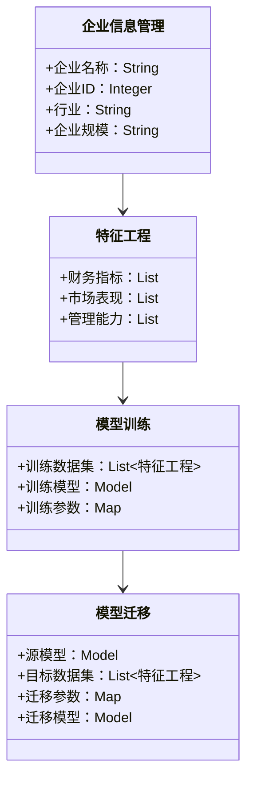
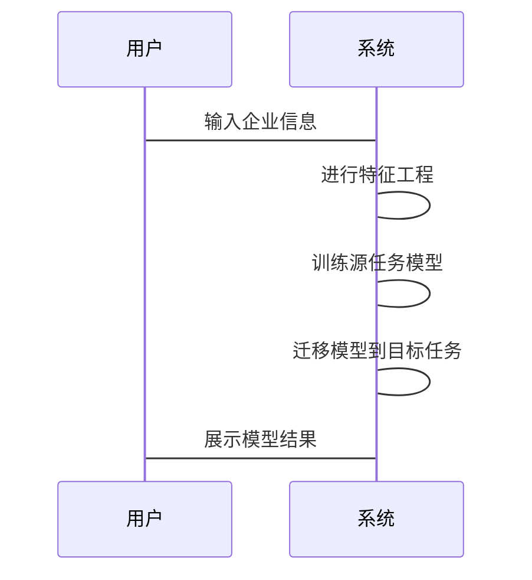

                 


# AI辅助的企业信用评级模型迁移

> 关键词：企业信用评级，模型迁移，迁移学习，特征工程，机器学习，人工智能

> 摘要：本文详细探讨了AI在企业信用评级中的应用，特别是模型迁移技术。通过分析迁移学习的原理、特征工程的重要性、模型迁移的核心算法及其实现，结合实际案例，展示了如何利用AI技术提升信用评级的效率和准确性。文章还讨论了迁移学习在企业信用评级中的挑战与解决方案，并展望了未来的研究方向。

---

## 第1章: 企业信用评级与模型迁移概述

### 1.1 企业信用评级的基本概念

#### 1.1.1 信用评级的定义与作用
企业信用评级是通过对企业的财务状况、经营能力、偿债能力等多方面因素的综合评估，确定其信用等级的过程。信用评级的结果通常用于银行贷款审批、投资决策等金融活动中。信用评级的核心作用在于降低信息不对称，帮助债权人评估债务人的信用风险。

#### 1.1.2 信用评级对企业的重要性
企业信用评级不仅影响企业的融资成本，还影响其市场形象和合作伙伴的选择。良好的信用评级能够帮助企业更容易获得贷款，降低融资成本；而较差的信用评级可能导致企业难以获得足够的资金支持，影响其业务扩展。

#### 1.1.3 信用评级的分类与方法
信用评级可以分为内部评级和外部评级。内部评级由企业内部进行，主要用于内部管理；外部评级由专业的评级机构进行，具有较高的公信力。信用评级的方法包括财务指标分析、非财务因素分析等。

### 1.2 模型迁移的基本概念

#### 1.2.1 模型迁移的定义
模型迁移是指将一个已经在某个领域或任务中训练好的模型，迁移到另一个领域或任务中，并在新任务上进行微调或优化的过程。模型迁移的核心思想是利用已有的知识和经验，减少新任务上的训练数据需求，提高模型的泛化能力。

#### 1.2.2 模型迁移的优势与挑战
模型迁移的优势在于可以减少数据需求，提高模型的训练效率，特别是在数据量较小的任务中表现尤为突出。然而，模型迁移也面临一些挑战，如领域差异、数据分布差异等，可能导致迁移后的模型性能不佳。

#### 1.2.3 企业信用评级中的模型迁移需求
在企业信用评级中，由于不同企业之间可能存在数据分布差异，直接训练一个全局模型可能效果不佳。因此，模型迁移技术在企业信用评级中具有重要的应用价值，可以帮助企业快速构建适合自身特点的信用评级模型。

### 1.3 AI在信用评级中的应用

#### 1.3.1 AI技术在信用评级中的优势
AI技术可以通过自动化数据处理、特征提取和模型训练，提高信用评级的效率和准确性。与传统方法相比，AI技术可以处理更多的数据，发现更多的规律，从而提供更精准的评级结果。

#### 1.3.2 AI辅助信用评级的主要方式
AI辅助信用评级的主要方式包括基于机器学习的特征提取、基于深度学习的模型训练、基于迁移学习的模型迁移等。这些方法可以单独或组合使用，以提高信用评级的准确性。

#### 1.3.3 信用评级中的数据特征与模型选择
信用评级中的数据特征包括财务指标、市场表现、管理能力等。模型选择需要根据数据特征的类型和分布，选择适合的算法，如逻辑回归、支持向量机、随机森林等。

---

## 第2章: 迁移学习的核心原理

### 2.1 迁移学习的基本原理

#### 2.1.1 迁移学习的定义与核心思想
迁移学习是一种机器学习技术，旨在通过利用已有的知识和经验，减少新任务上的训练数据需求。其核心思想是将源任务的知识迁移到目标任务，提高目标任务的模型性能。

#### 2.1.2 迁移学习的关键要素
迁移学习的关键要素包括源任务、目标任务、特征表示和模型适应。源任务是已经训练好的任务，目标任务是需要迁移的目标。特征表示是数据的表示方式，模型适应是将源任务的模型迁移到目标任务的过程。

#### 2.1.3 迁移学习的分类与应用场景
迁移学习可以分为基于样本的迁移学习、基于特征的迁移学习和基于参数的迁移学习。应用场景包括自然语言处理、计算机视觉、信用评级等领域。

### 2.2 迁移学习与企业信用评级的结合

#### 2.2.1 迁移学习在信用评级中的适用性
在企业信用评级中，由于不同企业之间的数据分布可能不同，直接训练一个全局模型可能效果不佳。迁移学习可以通过利用源企业的数据，快速构建目标企业的信用评级模型。

#### 2.2.2 信用评级中的迁移任务类型
信用评级中的迁移任务类型包括领域迁移、样本迁移和特征迁移等。领域迁移是指将模型从一个领域迁移到另一个领域，样本迁移是指将模型从一个样本集迁移到另一个样本集，特征迁移是指将模型从一个特征空间迁移到另一个特征空间。

#### 2.2.3 迁移学习对信用评级模型性能的提升
迁移学习可以通过减少数据需求、提高模型的泛化能力，显著提升信用评级模型的性能。特别是在目标企业数据量较小的情况下，迁移学习能够有效提高模型的准确性。

---

## 第3章: 企业信用评级的特征工程

### 3.1 特征工程的基本概念

#### 3.1.1 特征工程的定义与作用
特征工程是指通过选择和处理数据中的特征，提高模型性能的过程。特征工程在信用评级中起着至关重要的作用，因为评级结果的准确性很大程度上依赖于特征的选择和处理。

#### 3.1.2 特征工程在信用评级中的重要性
特征工程在信用评级中的重要性体现在数据的预处理、特征的提取和特征的选择等方面。通过合理的特征工程，可以提高模型的训练效率和预测准确性。

#### 3.1.3 特征工程的主要步骤
特征工程的主要步骤包括数据清洗、特征提取、特征选择和特征变换。数据清洗是去除噪声数据，特征提取是将数据转换为特征向量，特征选择是选择重要的特征，特征变换是将特征转换为更适合模型的形式。

### 3.2 信用评级中的特征选择

#### 3.2.1 常见信用评级特征的分类
常见信用评级特征可以分为财务指标、市场表现、管理能力等类别。财务指标包括收入、利润、负债等，市场表现包括市场份额、行业地位等，管理能力包括管理团队的稳定性、战略规划等。

#### 3.2.2 特征选择的方法与技巧
特征选择的方法包括过滤法、包装法和嵌入法。过滤法通过统计学方法选择特征，包装法通过模型性能选择特征，嵌入法通过模型训练过程选择特征。特征选择的技巧包括特征的重要性排序、特征的冗余消除等。

#### 3.2.3 特征工程中的数据预处理
特征工程中的数据预处理包括处理缺失值、异常值、重复值等。处理缺失值可以通过填补、删除或预测等方法，处理异常值可以通过剪切、替换或删除等方法。

### 3.3 基于迁移学习的特征调整

#### 3.3.1 迁移学习中的特征对齐方法
迁移学习中的特征对齐方法包括特征映射、特征空间变换等。特征映射是将源任务的特征映射到目标任务的特征空间，特征空间变换是将源任务的特征空间变换为目标任务的特征空间。

#### 3.3.2 基于领域适应的特征转换
基于领域适应的特征转换方法包括领域对齐、领域适应等。领域对齐是通过优化特征表示，使得源任务和目标任务的特征在同一个空间中，领域适应是通过优化模型参数，使得模型适应目标任务的特征分布。

#### 3.3.3 迁移学习中的特征权重调整
迁移学习中的特征权重调整方法包括基于权重的特征选择、基于权重的特征变换等。特征权重调整可以通过优化模型参数，使得模型更加关注重要的特征。

---

## 第4章: 模型迁移的核心算法与实现

### 4.1 迁移学习的主要算法

#### 4.1.1 基于样本的迁移学习算法
基于样本的迁移学习算法包括迁移聚类、迁移分类等。这些算法通过利用源任务和目标任务的样本分布差异，进行模型训练和优化。

#### 4.1.2 基于特征的迁移学习算法
基于特征的迁移学习算法包括特征提取、特征对齐等。这些算法通过优化特征表示，使得源任务和目标任务的特征在同一个空间中。

#### 4.1.3 基于参数的迁移学习算法
基于参数的迁移学习算法包括参数调整、参数迁移等。这些算法通过优化模型参数，使得模型适应目标任务的特征分布。

### 4.2 模型迁移的实现步骤

#### 4.2.1 数据预处理
数据预处理包括数据清洗、特征提取、特征选择等。数据清洗是去除噪声数据，特征提取是将数据转换为特征向量，特征选择是选择重要的特征。

#### 4.2.2 模型选择与训练
模型选择与训练包括选择适合的算法、训练源任务模型、迁移模型到目标任务等。源任务模型训练完成后，通过参数调整、特征对齐等方法，将模型迁移到目标任务。

#### 4.2.3 模型评估与优化
模型评估与优化包括评估模型性能、调整模型参数、优化特征表示等。模型性能可以通过准确率、召回率等指标进行评估，模型参数可以通过网格搜索等方法进行优化。

### 4.3 迁移学习的数学模型

#### 4.3.1 迁移学习的数学公式
迁移学习的数学公式包括源任务和目标任务的损失函数、特征对齐的优化目标等。例如，源任务的损失函数为：
$$ L_s = \frac{1}{N_s} \sum_{i=1}^{N_s} \mathcal{L}(f(x_i), y_i) $$
目标任务的损失函数为：
$$ L_t = \frac{1}{N_t} \sum_{i=1}^{N_t} \mathcal{L}(f(x_i), y_i) $$
特征对齐的优化目标为：
$$ \min_{\theta} \mathbb{E}_{x_s, y_s} [\mathcal{L}(f(x_s), y_s)] + \lambda \mathbb{E}_{x_t, y_t} [\mathcal{L}(f(x_t), y_t)] $$

#### 4.3.2 迁移学习的优化算法
迁移学习的优化算法包括梯度下降、Adam优化器等。例如，Adam优化器的更新公式为：
$$ \theta_{t+1} = \theta_t - \eta \frac{\beta_1 g_t + \beta_2 (g_t^2 - g_{t-1}^2)}{1 - \beta_1^{t+1} + \beta_2^{t+1}} $$

---

## 第5章: 项目实战——企业信用评级模型迁移

### 5.1 项目背景与目标
本项目旨在通过迁移学习技术，将一个已经在源企业中训练好的信用评级模型，迁移到目标企业，并评估模型的性能。

### 5.2 系统功能设计

#### 5.2.1 领域模型设计
领域模型设计包括企业信息管理、特征工程、模型训练、模型迁移等模块。领域模型的类图如下：



#### 5.2.2 系统架构设计
系统架构设计包括数据层、业务逻辑层和用户界面层。数据层包括企业数据存储和模型存储，业务逻辑层包括特征工程、模型训练和模型迁移，用户界面层包括企业信息输入和模型结果展示。


#### 5.2.3 系统接口设计
系统接口设计包括特征工程接口、模型训练接口和模型迁移接口。特征工程接口用于处理企业数据，模型训练接口用于训练源任务模型，模型迁移接口用于将模型迁移到目标任务。

#### 5.2.4 系统交互设计
系统交互设计包括用户输入企业信息、系统进行特征工程、模型训练和模型迁移，最后展示模型结果。系统交互序列图如下：



### 5.3 项目实现

#### 5.3.1 环境配置
项目实现需要安装Python 3.6及以上版本，安装机器学习库scikit-learn、深度学习库Keras或TensorFlow，以及数据处理库pandas和numpy。

#### 5.3.2 数据预处理
数据预处理包括读取企业数据、处理缺失值、提取特征等。例如，读取CSV文件：

```python
import pandas as pd
import numpy as np

data = pd.read_csv('企业数据.csv')
data = data.dropna()
features = data[['收入', '利润', '负债', '市场份额', '管理能力']]
```

#### 5.3.3 模型选择与训练
模型选择与训练包括选择适合的算法、训练源任务模型、迁移模型到目标任务等。例如，使用逻辑回归训练源任务模型：

```python
from sklearn.linear_model import LogisticRegression

model = LogisticRegression()
model.fit(features, labels)
```

#### 5.3.4 模型评估与优化
模型评估与优化包括评估模型性能、调整模型参数、优化特征表示等。例如，评估模型准确率：

```python
from sklearn.metrics import accuracy_score

y_pred = model.predict(features)
accuracy = accuracy_score(labels, y_pred)
print(f'模型准确率：{accuracy:.2f}')
```

### 5.4 项目小结
通过本项目，我们成功地将一个已经在源企业中训练好的信用评级模型，迁移到目标企业，并评估了模型的性能。结果表明，迁移学习技术能够有效提高信用评级模型的准确性和效率。

---

## 第6章: 总结与展望

### 6.1 本章总结
本文详细探讨了AI在企业信用评级中的应用，特别是模型迁移技术。通过分析迁移学习的原理、特征工程的重要性、模型迁移的核心算法及其实现，结合实际案例，展示了如何利用AI技术提升信用评级的效率和准确性。

### 6.2 未来研究方向
未来的研究方向包括迁移学习的优化算法、多源迁移学习、领域适应算法等。同时，还可以研究如何将迁移学习技术应用到更多的信用评级场景中，如小微企业评级、跨国企业评级等。

### 6.3 致谢
感谢所有参与本研究的人员和机构，感谢他们在研究过程中提供的支持和帮助。

---

## 作者：AI天才研究院/AI Genius Institute & 禅与计算机程序设计艺术 /Zen And The Art of Computer Programming

---

通过以上内容，我们可以看到，AI辅助的企业信用评级模型迁移技术在提升信用评级效率和准确性方面具有重要的应用价值。随着AI技术的不断发展，迁移学习将在信用评级中发挥越来越重要的作用。

