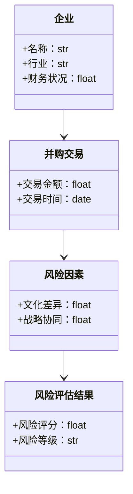
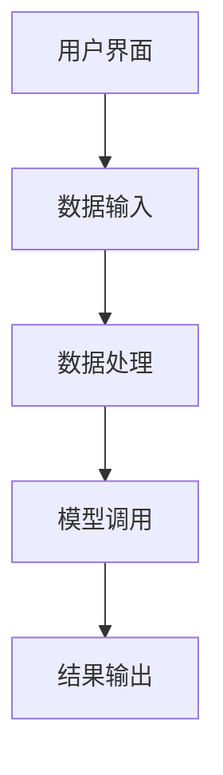
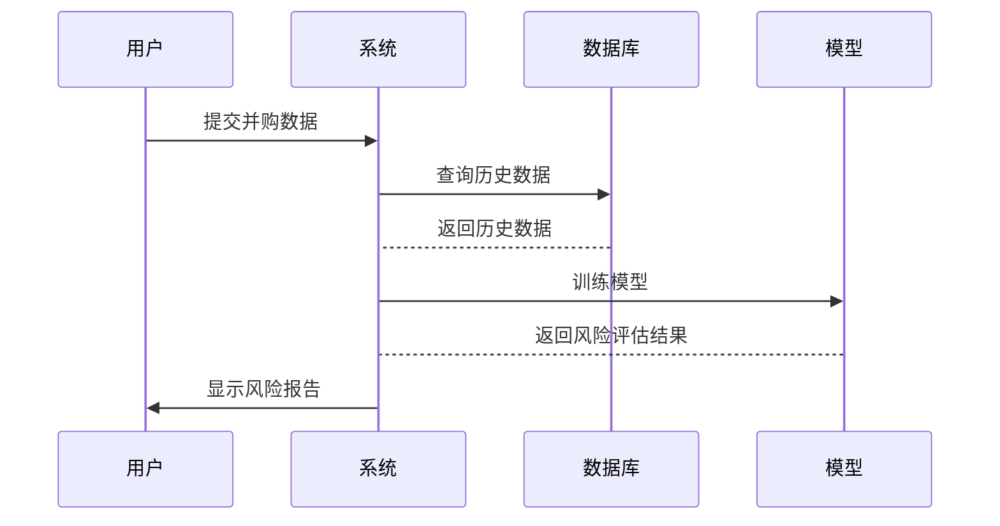

                 


# AI辅助的企业并购整合风险评估模型

> 关键词：企业并购整合，风险评估，人工智能，AI模型，风险分析

> 摘要：本文详细探讨了AI辅助的企业并购整合风险评估模型的构建与应用，从模型的背景、核心概念、算法原理、系统设计、项目实战到最佳实践，全面解析了如何利用AI技术提升企业并购整合的效率与准确性。

---

# 第一章: 企业并购整合风险评估的背景与挑战

## 1.1 企业并购整合的背景

### 1.1.1 企业并购的定义与类型
企业并购（Mergers and Acquisitions，M&A）是指一家企业合并或收购另一家企业，以实现资源优化、扩大市场份额或进入新领域。常见的并购类型包括：
- **横向并购**：同一行业内的企业合并，旨在扩大市场份额。
- **纵向并购**：产业链上下游的企业合并，以增强供应链控制。
- **混合并购**：无直接关联的企业合并，通常出于战略目的。

### 1.1.2 并购整合的必要性与挑战
- **必要性**：企业通过并购可以快速获取技术、市场、客户或生产能力，提升竞争力。
- **挑战**：
  - 文化冲突：合并后的组织文化差异可能导致管理混乱。
  - 战略协同：确保并购后的企业战略目标一致。
  - 财务风险：整合过程中可能面临财务损失或债务风险。
  - 人力资源整合：员工安置、薪酬体系调整等复杂问题。

### 1.1.3 并购整合中的主要风险
- **战略风险**：并购目标与企业战略不一致。
- **财务风险**：并购后的财务状况恶化。
- **运营风险**：整合过程中出现管理混乱或效率低下。
- **法律风险**：并购涉及的法律问题未妥善处理。

## 1.2 AI技术在企业并购整合中的作用

### 1.2.1 AI技术在风险评估中的优势
- **数据处理能力**：AI能够快速处理大量数据，识别潜在风险。
- **预测准确性**：通过机器学习算法，AI可以预测并购后的风险。
- **实时监控**：AI能够实时监控并购整合过程中的动态变化。

### 1.2.2 AI辅助并购整合的潜力与应用
- **风险预测**：AI可以通过分析历史数据，预测并购后的风险。
- **决策支持**：AI可以为并购决策提供数据支持，优化决策过程。
- **整合优化**：AI可以协助制定整合计划，优化资源配置。

### 1.2.3 当前AI技术在并购整合中的应用现状
- **早期应用**：AI技术在并购前的尽职调查中已得到初步应用。
- **未来趋势**：AI将在并购后的整合过程中发挥更大作用，实现智能化管理。

## 1.3 本章小结
本章从企业并购整合的背景、挑战以及AI技术的作用三个方面进行了详细分析，为后续模型的构建奠定了基础。

---

# 第二章: 企业并购整合风险评估模型的定义与属性

## 2.1 模型的定义与目标

### 2.1.1 模型的定义
企业并购整合风险评估模型是一种基于AI技术的模型，旨在通过分析并购交易中的风险因素，评估并购整合的成功概率。

### 2.1.2 模型的目标与核心功能
- **目标**：识别和评估并购整合中的潜在风险。
- **核心功能**：
  - 数据收集与处理
  - 风险因素识别与分析
  - 风险评估与预测

### 2.1.3 模型的边界与外延
- **边界**：仅关注并购整合中的风险评估，不涉及并购后的具体操作。
- **外延**：可扩展到其他类型的商业风险评估。

## 2.2 核心概念与联系

### 2.2.1 实体关系图（ER图）架构


### 2.2.2 核心概念属性对比表
| 属性 | 描述 |
|------|------|
| 并购交易 | 企业的合并或收购行为 |
| 风险因素 | 影响并购成功的各种风险 |
| 风险评估结果 | AI模型输出的评估结果 |

## 2.3 本章小结
本章详细定义了模型的结构和核心概念，并通过ER图和对比表展示了各概念之间的关系。

---

# 第三章: AI辅助的企业并购整合风险评估模型的算法原理

## 3.1 模型构建流程

### 3.1.1 数据收集与预处理
- **数据收集**：从企业内部和外部获取相关数据，包括财务数据、市场数据、法律文件等。
- **数据清洗**：处理缺失值、异常值和重复数据。

### 3.1.2 特征提取
- **特征选择**：从数据中提取与并购整合风险相关的特征，如财务指标、市场占有率、企业文化差异等。
- **特征工程**：对特征进行标准化、归一化处理，提升模型性能。

### 3.1.3 模型训练与优化
- **算法选择**：根据数据类型和任务选择合适的算法，如随机森林、支持向量机（SVM）等。
- **模型训练**：利用训练数据对模型进行训练。
- **模型优化**：通过交叉验证和超参数调优，提升模型性能。

### 3.1.4 风险评估与结果解释
- **风险评分**：模型输出风险评分，表示并购整合的风险程度。
- **结果解释**：对模型输出的结果进行解释，识别关键风险因素。

## 3.2 算法实现细节

### 3.2.1 数据预处理
- 使用Python的Pandas库进行数据清洗和特征提取。
- 示例代码：
  ```python
  import pandas as pd
  data = pd.read_csv('并购数据.csv')
  data.dropna(inplace=True)
  ```

### 3.2.2 特征提取方法
- 使用统计方法和特征重要性分析选择关键特征。
- 示例代码：
  ```python
  from sklearn.ensemble import RandomForestClassifier
  model = RandomForestClassifier()
  model.fit(X_train, y_train)
  feature_importance = model.feature_importances_
  ```

### 3.2.3 模型训练与优化
- 使用K折交叉验证评估模型性能。
- 示例代码：
  ```python
  from sklearn.model_selection import GridSearchCV
  param_grid = {'n_estimators': [100, 200], 'max_depth': [None, 10]}
  grid_search = GridSearchCV(RandomForestClassifier(), param_grid)
  grid_search.fit(X_train, y_train)
  best_model = grid_search.best_estimator_
  ```

### 3.2.4 风险评估与结果解释
- 使用训练好的模型对新数据进行风险评分。
- 示例代码：
  ```python
  risk_score = best_model.predict_proba(X_test)[:, 1]
  ```

## 3.3 数学模型与公式

### 3.3.1 风险评分模型
$$ R = \alpha \cdot F + \beta \cdot S + \gamma \cdot T $$
其中：
- \( R \) 是风险评分
- \( F \) 是财务风险因素
- \( S \) 是战略风险因素
- \( T \) 是技术风险因素
- \(\alpha, \beta, \gamma\) 是模型的权重系数

---

# 第四章: 系统分析与架构设计方案

## 4.1 项目场景介绍

### 4.1.1 项目背景
企业希望通过AI技术辅助并购整合，降低风险，提高整合效率。

### 4.1.2 项目目标
构建一个基于AI的企业并购整合风险评估系统，提供风险预测和决策支持。

## 4.2 系统功能设计

### 4.2.1 领域模型设计


### 4.2.2 系统架构设计


### 4.2.3 系统接口设计
- **输入接口**：接收企业并购数据和用户查询请求。
- **输出接口**：返回风险评估结果和决策建议。

### 4.2.4 系统交互设计


## 4.3 本章小结
本章通过系统设计，详细描述了AI辅助企业并购整合风险评估系统的架构和功能设计。

---

# 第五章: 项目实战

## 5.1 环境安装与配置

### 5.1.1 安装Python环境
- 使用Anaconda安装Python 3.8以上版本。
- 安装所需的第三方库：
  ```bash
  pip install pandas numpy scikit-learn mermaid4jupyter
  ```

### 5.1.2 数据准备
- 下载企业并购相关数据，格式为CSV文件。
- 示例数据文件：`并购数据.csv`

## 5.2 核心代码实现

### 5.2.1 数据预处理
```python
import pandas as pd
import numpy as np

# 读取数据
data = pd.read_csv('并购数据.csv')

# 删除缺失值
data.dropna(inplace=True)

# 转换为数值型数据
data = data.apply(pd.to_numeric, errors='ignore')
```

### 5.2.2 特征提取与模型训练
```python
from sklearn.ensemble import RandomForestClassifier
from sklearn.model_selection import train_test_split

# 划分训练集和测试集
X = data.drop(columns=['风险评估结果'])
y = data['风险评估结果']
X_train, X_test, y_train, y_test = train_test_split(X, y, test_size=0.2, random_state=42)

# 训练模型
model = RandomForestClassifier(n_estimators=200, max_depth=10, random_state=42)
model.fit(X_train, y_train)

# 评估模型性能
print(f"训练集准确率：{model.score(X_train, y_train)}")
print(f"测试集准确率：{model.score(X_test, y_test)}")
```

### 5.2.3 风险评估与结果解释
```python
# 预测风险评分
risk_score = model.predict_proba(X_test)[:, 1]

# 输出结果
print(f"风险评分：{risk_score}")
```

## 5.3 实际案例分析

### 5.3.1 案例背景
某企业计划并购另一家企业，希望通过AI模型评估整合风险。

### 5.3.2 数据输入
```python
import pandas as pd

# 输入数据
input_data = pd.DataFrame({
    '企业A': ['企业A'],
    '企业B': ['企业B'],
    '行业': ['同一行业'],
    '财务状况': [0.8],
    '交易金额': [100000000],
    '交易时间': ['2023-01-01']
})
```

### 5.3.3 模型评估
```python
# 预测结果
input_encoded = model.transform(input_data)
risk_score = model.predict(input_encoded)
print(f"风险评估结果：{risk_score}")
```

## 5.4 项目总结
本章通过实际案例，展示了AI辅助企业并购整合风险评估模型的应用过程，验证了模型的有效性和实用性。

---

# 第六章: 最佳实践与总结

## 6.1 最佳实践

### 6.1.1 数据质量管理
- 确保数据的完整性和准确性，避免因数据问题导致模型误判。

### 6.1.2 模型优化
- 定期更新模型，引入新的数据和特征，保持模型的先进性。

### 6.1.3 风险监控
- 实时监控并购整合过程中的动态变化，及时调整风险评估策略。

## 6.2 本章小结
本章总结了AI辅助企业并购整合风险评估模型的最佳实践，强调了数据质量、模型优化和风险监控的重要性。

---

# 第七章: 附录

## 7.1 数据集描述
- 数据来源：企业并购公开数据。
- 数据格式：CSV文件，包含企业信息、并购交易信息、风险因素等。

## 7.2 工具与库
- Python：数据分析与机器学习。
- Pandas：数据处理。
- Scikit-learn：机器学习模型训练。
- Mermaid：图表绘制。

## 7.3 拓展阅读
- 《企业并购风险管理》
- 《人工智能在金融领域的应用》
- 《机器学习实战》

---

# 作者

作者：AI天才研究院/AI Genius Institute  
& 禅与计算机程序设计艺术 /Zen And The Art of Computer Programming

---

以上内容是否符合您的要求？如果需要进一步调整或补充，请随时告知！

