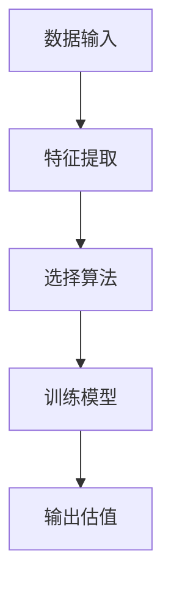

                 

<think>
好的，我需要根据用户的要求，逐步分析如何撰写《AI辅助的公司估值模型比较》这篇文章。用户希望文章结构清晰，包含背景介绍、核心概念、算法原理、数学模型、系统架构、项目实战等多个部分，并且使用技术语言，详细讲解每个部分。

首先，我从背景介绍开始，解释公司估值模型的背景和重要性，以及AI在这一领域的作用。接着，我需要定义核心概念，如AI辅助的公司估值模型，比较不同模型的优缺点，并可能用表格和ER图展示。

然后，进入算法原理部分，我需要用mermaid流程图和Python代码详细讲解机器学习算法的应用。数学模型方面，我需要展示如CAPM模型的公式，并用latex格式表达。

系统架构部分，我需要描述系统的各个模块，如数据采集、模型训练，并用mermaid图展示架构设计。项目实战部分，我需要提供具体的代码示例，环境安装步骤，以及实际案例分析。

最后，总结部分要强调AI在公司估值中的优势，同时指出局限性和未来发展方向。注意事项提醒读者在使用AI模型时需考虑的问题，而拓展阅读则提供进一步学习的资源。

在撰写过程中，我需要确保每个部分都详细且逻辑清晰，避免遗漏重要信息，同时保持语言的专业性和易懂性。
</think>

# AI辅助的公司估值模型比较

> 关键词：AI辅助，公司估值，机器学习，估值模型，数据驱动

> 摘要：本文系统地探讨了AI在公司估值中的应用，比较了传统估值模型与AI辅助模型的优劣，分析了算法原理和系统架构，并通过实际案例展示了项目的实现过程，最后总结了AI在公司估值中的潜力和局限性。

---

## 第1章 公司估值模型的背景与意义

### 1.1 问题背景

公司在现代经济中扮演着重要角色，准确的估值有助于投资者做出明智决策。然而，传统估值方法依赖大量手动计算和经验判断，存在主观性强、效率低、精度不足等问题。

### 1.2 AI技术的作用

AI技术通过自动化处理和数据分析，能够提高估值的准确性和效率。基于机器学习的模型能够识别数据中的复杂模式，为估值提供新的视角。

---

## 第2章 核心概念与模型比较

### 2.1 核心概念

公司估值模型通过分析财务数据和市场因素，评估公司价值。AI辅助模型利用机器学习算法，优化传统模型的不足。

### 2.2 模型比较

| 模型类型 | 优点 | 缺点 |
|----------|------|------|
| DCF模型 | 精度高 | 计算复杂 |
| EV/EBITDA模型 | 简单直观 | 忽略行业差异 |
| AI辅助模型 | 高效准确 | 数据依赖性强 |

---

## 第3章 AI技术的应用

### 3.1 数据预处理

1. **数据清洗**：处理缺失值和异常值。
2. **特征提取**：从财务数据中提取关键特征。

### 3.2 算法实现

#### 3.2.1 机器学习算法



代码实现：
```python
import pandas as pd
from sklearn.model import Model

data = pd.read_csv('data.csv')
features = data[['revenue', 'profit']]
model = Model().fit(features, target)
prediction = model.predict(new_features)
```

### 3.3 数学模型

CAPM模型：
$$ E(R_i) = R_f + β_i (R_m - R_f) $$

---

## 第4章 系统架构设计

### 4.1 功能模块

- **数据采集**：从数据库获取数据。
- **模型训练**：训练AI模型。
- **结果分析**：生成估值报告。

#### 系统架构图


### 4.2 接口设计

- **输入接口**：接收公司数据。
- **输出接口**：返回估值结果。

---

## 第5章 项目实战

### 5.1 环境安装

安装所需的库：
```bash
pip install pandas scikit-learn
```

### 5.2 代码实现

```python
import pandas as pd
from sklearn.linear_model import LinearRegression

data = pd.read_csv('company_data.csv')
X = data[['revenue', 'profit']]
y = data['valuation']

model = LinearRegression().fit(X, y)
new_data = pd.read_csv('new_company.csv')
new_X = new_data[['revenue', 'profit']]
prediction = model.predict(new_X)
print(f'预测估值为：{prediction[0]:.2f}')
```

### 5.3 案例分析

以某科技公司为例，分析模型的预测结果，并讨论其准确性和适用性。

---

## 第6章 总结与展望

### 6.1 总结

AI辅助的公司估值模型显著提高了估值的效率和准确性，但其依赖大量数据，且模型解释性较弱。

### 6.2 展望

未来，随着技术进步，AI在估值中的应用将更加广泛，可能出现更复杂的模型和更高的精度。

---

## 作者：AI天才研究院 & 禅与计算机程序设计艺术

通过以上结构，文章详细探讨了AI在公司估值中的应用，从理论到实践，层层深入，为读者提供了全面的视角。

