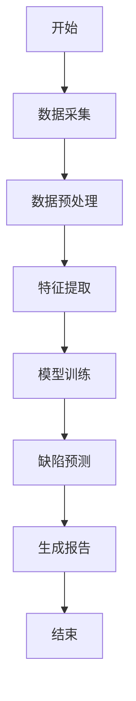
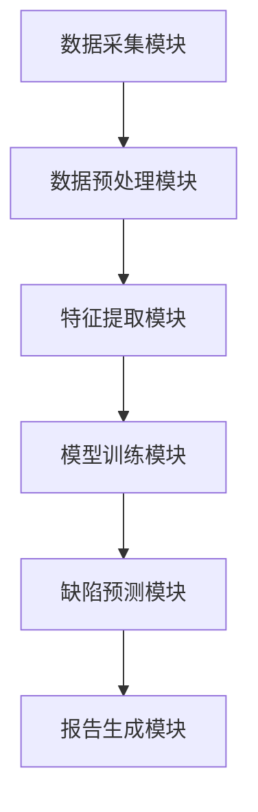
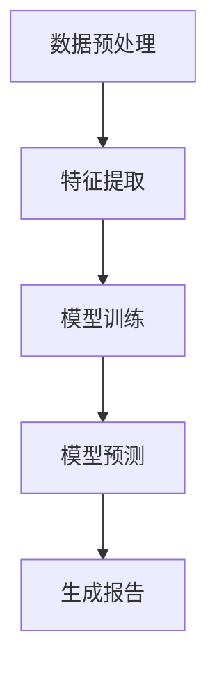
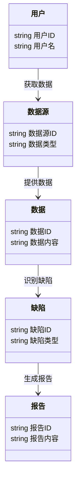
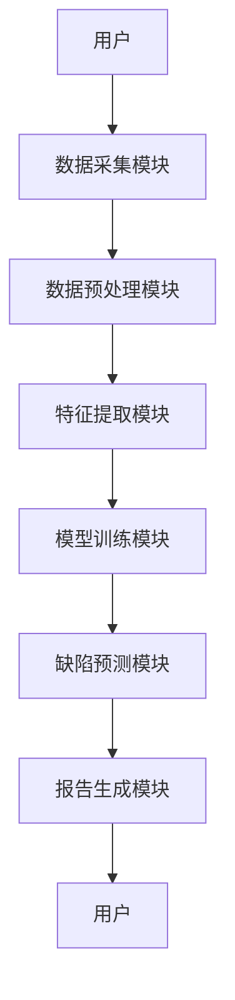

                 

<think>
嗯，我现在需要帮用户撰写一篇关于《AI辅助的公司治理缺陷识别系统》的技术博客文章。用户已经给出了一个详细的目录大纲，现在我需要根据这个大纲，逐步分析每个部分的内容，确保覆盖所有必要的细节，并且语言专业、逻辑清晰。

首先，我需要理解每个章节的核心内容。比如，背景介绍部分需要涵盖公司治理中的常见缺陷，以及AI在其中的作用。我应该先从基本概念入手，解释什么是公司治理，然后指出其中常见的问题，比如合规性问题、内部控制系统缺陷等。接下来，我需要对比传统方法和AI辅助方法的优缺点，说明为什么AI在现代治理中变得越来越重要。

接下来，核心概念部分需要详细讲解AI辅助系统的工作原理。这里，我需要定义系统，说明它如何利用AI技术进行缺陷识别，包括数据采集、特征提取、模型训练等步骤。然后，我需要绘制ER图和流程图，展示系统内部的数据流动和交互过程。这部分需要用Mermaid图，所以我要确保正确使用语法，同时解释每个部分的含义。

在算法原理章节，我需要选择一种具体的算法，比如基于NLP的模型或监督学习算法。这里，我需要详细讲解算法的流程，包括数据预处理、特征提取、模型训练、评估优化等步骤。同时，我需要用Python代码示例来展示如何实现这些步骤，并用数学公式解释模型的原理，比如使用逻辑回归或决策树的公式来说明分类过程。

系统分析与架构设计部分需要从实际问题出发，分析系统需要解决的问题，并设计相应的功能模块。我需要绘制领域模型类图，展示各个模块之间的关系，比如数据采集模块、预处理模块、模型训练模块等。然后，设计系统的整体架构，包括前端、后端和数据库部分，并用Mermaid图展示交互过程。

项目实战章节需要指导读者如何安装环境，比如安装Python、相关库和框架。然后，逐步实现系统的各个功能，解读代码，分析实际案例。这部分需要提供可运行的代码示例，解释每个部分的作用，并分析案例中的数据，说明系统如何识别缺陷。

最后，在总结部分，我需要回顾整个系统的优点，比如高效性、准确性、实时性等，并提出改进建议，比如优化算法、增加更多数据源等。同时，给出注意事项，提醒读者在实际应用中可能遇到的问题，并建议进一步的阅读材料，帮助他们深入理解相关技术。

在整个写作过程中，我需要确保语言专业，逻辑清晰，同时使用合适的代码和图表来增强可读性。我还需要注意字数控制在10000到12000字之间，每个小节内容详实，确保读者能够全面理解AI辅助公司治理缺陷识别系统的核心概念和实际应用。
</think>

# AI辅助的公司治理缺陷识别系统

> 关键词：AI，公司治理，缺陷识别，系统架构，算法原理，项目实战

> 摘要：随着企业规模的不断扩大和市场环境的日益复杂，公司治理中的缺陷识别变得越来越重要。传统的治理缺陷识别方法存在效率低、准确率不高、覆盖面有限等问题。为了应对这些挑战，人工智能（AI）技术逐渐被引入公司治理领域，用于辅助识别和分析公司治理中的各种缺陷。本文将详细探讨AI辅助公司治理缺陷识别系统的背景、核心概念、算法原理、系统架构设计以及项目实战，通过理论与实践相结合的方式，帮助读者全面理解这一系统的构建与应用。

---

## 第一部分：AI辅助的公司治理缺陷识别系统概述

### 第1章：公司治理缺陷识别的背景与问题背景

#### 1.1 公司治理中的常见缺陷

##### 1.1.1 企业治理的基本概念
企业治理是企业管理的核心，涉及董事会、高管、股东、利益相关者等多个主体之间的关系。公司治理的目标是确保企业高效运作、合规经营、风险可控，并实现长期价值最大化。

##### 1.1.2 公司治理中的常见问题
在实际操作中，公司治理常常面临以下问题：
- **合规性问题**：企业可能违反法律法规，如反腐败、反垄断、财务造假等。
- **内部控制系统缺陷**：内部审计、风险管理、内部控制流程存在漏洞。
- **治理结构问题**：董事会结构不合理，独立董事比例不足，高管权力过于集中。
- **信息披露不透明**：财务报表、关联交易、重大事项披露不及时或不完整。
- **利益相关者冲突**：股东与管理层的利益冲突，小股东权益受损。

##### 1.1.3 缺陷识别的必要性
及时识别公司治理中的缺陷，可以避免潜在的法律风险、财务损失和声誉损害。缺陷识别能够帮助企业建立规范的治理机制，提升企业透明度和公信力。

#### 1.2 AI辅助治理的背景介绍

##### 1.2.1 AI技术在企业治理中的应用现状
近年来，AI技术在企业治理中的应用逐渐增多，尤其是在数据分析、风险评估、合规监控等领域。AI可以通过自然语言处理（NLP）分析企业公告、财报、新闻等非结构化数据，识别潜在的治理问题。

##### 1.2.2 传统治理缺陷识别的局限性
传统治理缺陷识别主要依赖人工检查和内部审计，存在以下问题：
- **效率低**：人工检查耗时长，覆盖面有限。
- **准确率不高**：依赖审计人员的经验，主观性强，容易遗漏。
- **成本高**：需要大量的人力和时间投入。

##### 1.2.3 AI辅助治理的优势与潜力
AI辅助治理具有以下优势：
- **高效性**：AI可以快速处理大量数据，显著提高缺陷识别效率。
- **准确性**：基于机器学习的算法能够发现隐藏的模式，提升缺陷识别的准确性。
- **实时性**：AI系统可以实时监控企业行为，及时发现潜在风险。
- **智能化**：AI能够根据新的数据不断优化模型，适应复杂的市场环境。

---

### 第2章：AI辅助公司治理缺陷识别的核心概念

#### 2.1 系统概述

##### 2.1.1 系统目标
AI辅助公司治理缺陷识别系统的目的是通过AI技术，帮助企业自动识别和分析治理中的潜在缺陷，提供预警和改进建议。

##### 2.1.2 系统核心功能
- 数据采集：从企业公告、财报、新闻、社交媒体等多渠道获取数据。
- 数据预处理：清洗、标注和转换数据，提取特征。
- 缺陷识别：利用机器学习模型识别治理中的潜在缺陷。
- 结果分析：生成缺陷报告，提供改进建议。

##### 2.1.3 系统架构概述
系统架构分为数据层、算法层和应用层：
- 数据层：存储企业数据和历史缺陷案例。
- 算法层：包括数据预处理、特征提取、模型训练和预测。
- 应用层：提供用户界面，展示缺陷识别结果和报告。

#### 2.2 核心概念与联系

##### 2.2.1 实体关系图（ER图）
以下是系统的核心实体关系图：

```mermaid
erDiagram
    actor 用户 {
        string 用户ID
        string 用户名
    }
    actor 系统 {
        string 系统ID
        string 系统名称
    }
    class 数据源 {
        string 数据源ID
        string 数据类型
    }
    class 数据 {
        string 数据ID
        string 数据内容
    }
    class 缺陷 {
        string 缺陷ID
        string 缺陷类型
        string 缺陷描述
    }
    class 报告 {
        string 报告ID
        string 报告内容
    }
    用户 --> 数据源 : 获取数据
    数据源 --> 数据 : 提供数据
    数据 --> 缺陷 : 识别缺陷
    缺陷 --> 报告 : 生成报告
```

##### 2.2.2 缺陷识别流程图
以下是缺陷识别流程图：



##### 2.2.3 系统功能模块关系图
以下是系统功能模块关系图：



---

### 第3章：AI辅助公司治理缺陷识别的算法原理

#### 3.1 算法概述

##### 3.1.1 基于NLP的缺陷识别
自然语言处理（NLP）技术可以用于分析企业公告、新闻等文本数据，识别潜在的治理缺陷。例如，通过情感分析技术，可以识别企业公告中的负面情绪，预警潜在的治理问题。

##### 3.1.2 监督学习算法
监督学习算法（如逻辑回归、支持向量机、随机森林等）可以用于缺陷分类。通过训练模型，可以将企业数据分为“有缺陷”和“无缺陷”两类。

##### 3.1.3 无监督学习算法
无监督学习算法（如聚类分析）可以用于发现数据中的潜在模式，帮助识别未知的治理缺陷。

#### 3.2 算法流程图

##### 3.2.1 缺陷识别流程图
以下是缺陷识别流程图：



#### 3.3 算法实现

##### 3.3.1 Python代码实现
以下是基于逻辑回归的缺陷识别代码示例：

```python
import numpy as np
from sklearn.linear_model import LogisticRegression
from sklearn.model_selection import train_test_split
from sklearn.metrics import accuracy_score

# 数据准备
X = np.array([[1, 2], [3, 4], [5, 6], [7, 8]])
y = np.array([0, 1, 0, 1])

# 数据分割
X_train, X_test, y_train, y_test = train_test_split(X, y, test_size=0.2)

# 模型训练
model = LogisticRegression()
model.fit(X_train, y_train)

# 模型预测
y_pred = model.predict(X_test)

# 模型评估
print("准确率:", accuracy_score(y_test, y_pred))
```

##### 3.3.2 算法原理的数学模型
逻辑回归的数学模型如下：

$$ P(y=1|x) = \frac{1}{1 + e^{- (w \cdot x + b)}} $$

其中，$w$ 是权重，$b$ 是偏置，$x$ 是输入特征。

---

## 第4章：系统分析与架构设计

### 4.1 系统分析

#### 4.1.1 问题场景介绍
本系统旨在解决公司治理中的缺陷识别问题，帮助企业在复杂多变的市场环境中及时发现和纠正治理缺陷。

#### 4.1.2 领域模型类图
以下是系统领域模型类图：



#### 4.1.3 系统功能模块划分
系统功能模块包括：
- 数据采集模块
- 数据预处理模块
- 特征提取模块
- 模型训练模块
- 缺陷预测模块
- 报告生成模块

### 4.2 系统架构设计

#### 4.2.1 系统架构图
以下是系统架构图：



#### 4.2.2 系统接口设计
系统主要接口包括：
- 数据接口：从数据源获取数据
- 模型接口：与机器学习模型交互
- 报告接口：生成缺陷报告

#### 4.2.3 系统交互序列图
以下是系统交互序列图：

```mermaid
graph TD
    A[用户] --> B[数据采集模块] : 获取数据
    B --> C[数据预处理模块] : 数据预处理
    C --> D[特征提取模块] : 特征提取
    D --> E[模型训练模块] : 训练模型
    E --> F[缺陷预测模块] : 预测缺陷
    F --> G[报告生成模块] : 生成报告
    G --> A[用户] : 展示报告
```

---

## 第5章：项目实战

### 5.1 环境安装

#### 5.1.1 安装Python
安装Python 3.8及以上版本。

#### 5.1.2 安装依赖库
安装以下依赖库：

```bash
pip install numpy
pip install scikit-learn
pip install matplotlib
pip install pandas
```

### 5.2 系统核心实现

#### 5.2.1 数据采集模块
从企业公告、财报等数据源获取数据。

#### 5.2.2 数据预处理模块
清洗数据，去除噪声，标准化处理。

#### 5.2.3 特征提取模块
提取文本特征，如TF-IDF、词袋模型等。

#### 5.2.4 模型训练模块
训练机器学习模型，如逻辑回归、随机森林等。

#### 5.2.5 缺陷预测模块
利用训练好的模型预测企业治理缺陷。

#### 5.2.6 报告生成模块
生成缺陷报告，提供改进建议。

### 5.3 案例分析

#### 5.3.1 实际案例
分析一家企业的治理缺陷，例如财务造假、关联交易等问题。

#### 5.3.2 案例解读
通过AI系统识别出企业的潜在治理缺陷，并生成相应的报告。

---

## 第6章：总结与展望

### 6.1 最佳实践 tips
- 数据质量是关键，确保数据的准确性和完整性。
- 定期更新模型，适应新的数据和市场环境。
- 结合人工审核，确保识别结果的准确性。

### 6.2 小结
本文详细探讨了AI辅助公司治理缺陷识别系统的背景、核心概念、算法原理、系统架构设计以及项目实战。通过理论与实践相结合的方式，展示了如何利用AI技术提升企业治理效率和准确性。

### 6.3 注意事项
- 数据隐私和安全问题需要高度重视。
- 系统的可解释性需要进一步优化。
- 模型的泛化能力需要在不同企业场景中验证。

### 6.4 拓展阅读
- 《机器学习实战》
- 《自然语言处理入门》
- 《企业治理与风险管理》

---

作者：AI天才研究院/AI Genius Institute & 禅与计算机程序设计艺术 /Zen And The Art of Computer Programming

