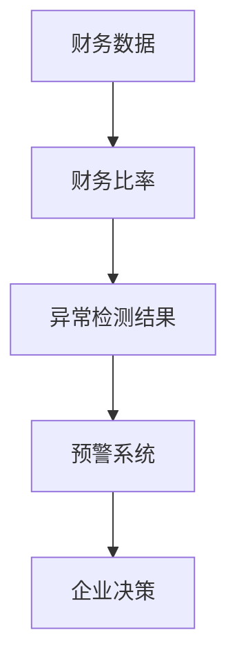
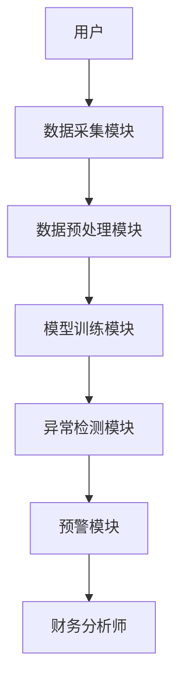
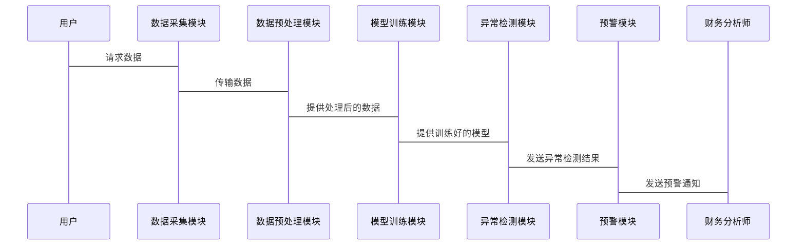

                 


# AI辅助的公司财务比率异常检测

> 关键词：财务比率，异常检测，人工智能，机器学习，数据分析

> 摘要：本文深入探讨了如何利用人工智能技术辅助公司财务比率异常检测。通过结合传统财务分析与现代机器学习算法，本文分析了财务比率异常检测的核心概念、算法原理、系统架构及实际应用。文章还通过具体案例展示了如何使用Python代码实现异常检测模型，并提供了系统设计与优化的建议。

---

# 第1章: 财务比率异常检测的背景与意义

## 1.1 问题背景

### 1.1.1 财务比率分析的基本概念
财务比率是衡量企业财务健康状况的重要指标，常用的比率包括：

- **流动性比率**：衡量企业偿还短期债务的能力，如流动比率（$流动资产/流动负债$）和速动比率（$（流动资产-存货）/流动负债$）。
- **杠杆比率**：衡量企业负债水平，如资产负债率（$总负债/总资产$）和利息覆盖倍数（$息税前利润/利息支出$）。
- **盈利能力比率**：衡量企业盈利能力，如净利润率（$净利润/营业收入$）和ROE（$净利润/股东权益$）。
- **运营效率比率**：衡量企业资产使用效率，如存货周转率（$成本 of goods sold/平均存货$）和应收账款周转率（$营业收入/平均应收账款$）。

### 1.1.2 异常检测在财务分析中的重要性
财务比率异常可能预示着企业潜在的财务风险，例如：

- 流动比率过低可能意味着企业无法偿还短期债务。
- 净利润率异常下降可能表明企业盈利能力减弱。
- 高杠杆比率可能增加企业的财务风险。

### 1.1.3 传统财务分析的局限性
传统财务分析依赖人工计算和判断，存在以下问题：

- **主观性**：不同分析师可能对同一比率有不同的解读。
- **效率低下**：手工计算和分析耗时且容易出错。
- **缺乏实时性**：无法及时发现财务异常情况。

---

## 1.2 数据来源与处理

### 1.2.1 财务数据的获取与预处理
财务数据通常来源于企业的财务报表，包括资产负债表、利润表和现金流量表。预处理步骤包括：

1. 数据清洗：处理缺失值、重复值和异常值。
2. 数据转换：将不同单位的财务数据统一化。
3. 数据标准化：对不同量纲的特征进行标准化处理。

### 1.2.2 异常数据的识别与清洗
在数据预处理阶段，需要识别并处理异常数据点。例如：

- 使用Z-score方法检测异常值：$$ Z = \frac{x - \mu}{\sigma} $$
  - 当$|Z| > 3$时，数据点可能为异常值。
- 使用Isolation Forest算法清洗异常数据。

### 1.2.3 数据标准化与特征提取
为了提高模型的性能，需要对数据进行标准化处理。例如：

- 使用标准Scaler对财务数据进行标准化：$$ x_{scaled} = \frac{x - \mu}{\sigma} $$
- 从原始数据中提取有用的特征，例如将多步财务数据转化为时间序列特征。

---

## 1.3 技术背景

### 1.3.1 人工智能在财务分析中的应用
人工智能技术，尤其是机器学习算法，在财务分析中的应用日益广泛，包括：

- **自然语言处理（NLP）**：分析财务报告和新闻，提取关键词和情感倾向。
- **计算机视觉（CV）**：识别财务报表中的图像信息。
- **机器学习模型**：预测财务趋势、识别异常交易。

### 1.3.2 异常检测算法的基本原理
异常检测算法可以分为以下几类：

1. **基于统计的方法**：如Z-score、马氏距离。
2. **基于距离的方法**：如k近邻（k-NN）、Isolation Forest。
3. **基于密度的方法**：如DBSCAN、Local Outlier Factor（LOF）。
4. **基于深度学习的方法**：如Autoencoder、GAN。

### 1.3.3 财务比率分析与机器学习的结合
通过将财务比率作为输入特征，利用机器学习算法训练模型，可以实现自动化的财务异常检测。例如：

- 使用随机森林模型对财务比率进行分类，识别异常情况。
- 使用XGBoost模型对财务数据进行回归分析，预测潜在风险。

---

## 1.4 研究现状与挑战

### 1.4.1 当前研究热点与技术瓶颈
当前研究主要集中在以下几个方面：

- **算法优化**：如何提高异常检测算法的准确性和效率。
- **多模态数据融合**：将财务数据与其他数据源（如市场数据、新闻数据）结合，提高检测精度。
- **模型解释性**：如何解释机器学习模型的决策过程，以便财务分析师更好地理解结果。

### 1.4.2 数据隐私与合规性问题
财务数据通常包含敏感信息，数据隐私和合规性问题是企业在应用AI技术时需要重点关注的。

### 1.4.3 跨领域应用的潜在机会
AI技术在财务比率异常检测中的应用可以扩展到其他领域，例如供应链管理、风险管理等。

---

## 1.5 应用价值与前景

### 1.5.1 提高财务分析效率
AI技术可以自动化处理大量财务数据，显著提高分析效率。

### 1.5.2 降低企业财务风险
通过及时发现和预警财务异常情况，企业可以采取措施降低风险。

### 1.5.3 未来发展趋势与研究方向
未来的研究方向可能包括：

- **实时检测**：开发实时财务异常检测系统。
- **可解释性增强**：提高模型的可解释性，便于财务分析师理解和使用。
- **多模态融合**：结合多种数据源，提升检测精度。

---

# 第2章: 财务比率与异常检测的核心概念

## 2.1 财务比率的基本属性

### 2.1.1 财务比率的分类与计算公式
财务比率可以分为四类：

1. **流动性比率**：衡量企业偿还短期债务的能力。
   - 流动比率：$$ \text{流动资产} / \text{流动负债} $$
   - 速动比率：$$ (\text{流动资产} - \text{存货}) / \text{流动负债} $$
2. **杠杆比率**：衡量企业的负债水平。
   - 资产负债率：$$ \text{总负债} / \text{总资产} $$
   - 利息覆盖倍数：$$ \text{息税前利润} / \text{利息支出} $$
3. **盈利能力比率**：衡量企业的盈利能力。
   - 净利润率：$$ \text{净利润} / \text{营业收入} $$
   - ROE：$$ \text{净利润} / \text{股东权益} $$
4. **运营效率比率**：衡量企业资产使用效率。
   - 存货周转率：$$ \text{成本 of goods sold} / \text{平均存货} $$
   - 应收账款周转率：$$ \text{营业收入} / \text{平均应收账款} $$

### 2.1.2 各类比率的经济意义
- **流动性比率**：越高，企业偿还短期债务的能力越强。
- **杠杆比率**：越低，企业的财务风险越小。
- **盈利能力比率**：越高，企业的盈利能力越强。
- **运营效率比率**：越高，企业的资产使用效率越高。

---

## 2.2 异常检测的基本原理

### 2.2.1 异常检测的定义与分类
异常检测是指识别数据中与预期模式或行为显著不同的数据点或事件。根据应用场景的不同，异常检测可以分为以下几种类型：

1. **点异常**：单个数据点的异常，例如某一笔交易金额远超正常水平。
2. **上下文异常**：在特定上下文中异常，例如某段时间内的销售额突然下降。
3. **群体异常**：一组数据点的异常，例如某一批次的产品质量显著下降。

---

## 2.3 财务比率与异常检测的关系

### 2.3.1 财务比率异常的潜在影响
财务比率异常可能表明企业存在以下问题：

- **流动性风险**：企业无法偿还短期债务。
- **财务压力**：企业可能面临破产风险。
- **盈利能力下降**：企业可能无法维持持续的盈利能力。

### 2.3.2 异常检测在财务预警中的作用
通过检测财务比率异常，企业可以及时采取措施，避免潜在的财务危机。

### 2.3.3 两者结合的实际应用场景
例如，企业可以通过检测流动比率的异常变化，及时发现潜在的流动性风险。

---

## 2.4 核心概念对比分析

### 2.4.1 财务比率与财务指标的对比
| 特性         | 财务比率                | 财务指标                |
|--------------|------------------------|------------------------|
| 定义         | 比例关系                | 数量关系                |
| 作用         | 分析企业财务状况        | 监测企业经营状况        |
| 计算公式     | 流动比率：$流动资产/流动负债$ | 净利润：$营业收入 - 营业成本 - 税费 - 利息支出$ |
| 示例         | 流动比率=2.5           | 净利润=100万元         |

---

## 2.5 实体关系图（ER图）



---

## 2.6 算法原理

### 2.6.1 马氏距离
马氏距离是一种衡量数据点与整体数据分布差异的方法，公式为：

$$ D = \sqrt{(x - \mu)^T \Sigma^{-1} (x - \mu)} $$

其中，$\mu$是数据的均值向量，$\Sigma$是协方差矩阵。

---

## 2.6.2 Isolation Forest
Isolation Forest是一种基于树的异常检测算法，通过构建随机树将数据点隔离出来。其核心思想是，异常点更容易被隔离。

---

## 2.6.3 One-Class SVM
One-Class SVM是一种用于异常检测的支持向量机算法，通过在数据分布的边界上构建一个超球，将异常点与正常点分开。

---

## 2.6.4 局部异常因子（LOF）
LOF算法通过比较数据点的局部密度与全局密度，判断其是否为异常点。公式为：

$$ LOF = \frac{\text{局部密度}}{\text{全局密度}} $$

---

## 2.6.5 XGBoost模型
XGBoost是一种高效的梯度提升算法，常用于分类和回归问题。在财务比率异常检测中，可以使用XGBoost模型对财务数据进行分类。

---

## 2.6.6 代码实现

### 示例代码
```python
from sklearn.ensemble import IsolationForest
import pandas as pd
import numpy as np

# 加载数据
data = pd.read_csv('financial_ratios.csv')

# 数据预处理
X = data.drop('label', axis=1).values
y = data['label'].values

# 训练Isolation Forest模型
model = IsolationForest(n_estimators=100, contamination=0.05)
model.fit(X)

# 预测异常点
y_pred = model.predict(X)
outliers = data[y_pred == -1]

print("检测到的异常点：", outliers.shape)
```

---

## 2.7 系统分析与架构设计

### 2.7.1 问题场景介绍
企业需要实时监控财务数据，及时发现异常情况。

### 2.7.2 系统功能设计
系统功能模块包括：

1. 数据采集模块：从财务系统中获取数据。
2. 数据预处理模块：清洗和标准化数据。
3. 模型训练模块：训练异常检测模型。
4. 异常检测模块：实时检测财务比率异常。
5. 预警模块：向相关人员发送预警通知。

### 2.7.3 系统架构设计


### 2.7.4 接口设计
系统接口包括：

1. 数据接口：从财务系统获取数据。
2. 模型接口：与训练好的模型交互。
3. 预警接口：向相关人员发送预警通知。

---

## 2.7.5 交互流程


---

## 2.8 项目实战

### 2.8.1 环境安装
需要安装以下Python库：

```bash
pip install pandas scikit-learn matplotlib seaborn
```

### 2.8.2 核心代码实现
```python
import pandas as pd
from sklearn.ensemble import IsolationForest
import matplotlib.pyplot as plt
import seaborn as sns

# 加载数据
data = pd.read_csv('financial_ratios.csv')

# 数据预处理
X = data.drop('label', axis=1).values
y = data['label'].values

# 可视化
plt.figure(figsize=(10,6))
sns.scatterplot(x=X[:,0], y=X[:,1], hue=y, palette='viridis')
plt.title('财务比率分布')
plt.show()

# 训练模型
model = IsolationForest(n_estimators=100, contamination=0.05)
model.fit(X)

# 预测异常点
y_pred = model.predict(X)
outliers = data[y_pred == -1]

# 可视化异常点
plt.figure(figsize=(10,6))
sns.scatterplot(x=X[:,0], y=X[:,1], hue=y_pred, palette='viridis')
plt.title('异常点检测结果')
plt.show()

print("检测到的异常点数量：", len(outliers))
```

### 2.8.3 代码解读与分析
1. 数据加载与预处理：从CSV文件中读取数据，并提取特征和标签。
2. 数据可视化：使用Seaborn绘制财务比率的分布图，帮助理解数据分布。
3. 模型训练：使用Isolation Forest算法训练异常检测模型。
4. 异常检测：预测异常点，并可视化结果。

---

## 2.9 最佳实践

### 2.9.1 小结
本文详细介绍了财务比率异常检测的核心概念和算法原理，通过具体案例展示了如何使用Python代码实现异常检测模型。

### 2.9.2 注意事项
1. 数据预处理是关键，需要仔细清洗和标准化数据。
2. 模型选择需要根据具体场景和数据特点进行调整。
3. 结果解释需要结合业务背景，避免误判。

### 2.9.3 拓展阅读
- 《Python机器学习实战》
- 《数据挖掘导论》
- 《异常检测技术与应用》

---

# 作者

作者：AI天才研究院/AI Genius Institute & 禅与计算机程序设计艺术 /Zen And The Art of Computer Programming

---

通过本文的详细讲解，读者可以全面了解AI辅助的公司财务比率异常检测的核心概念、算法原理和实际应用。希望本文能够为相关领域的研究和实践提供有价值的参考。

