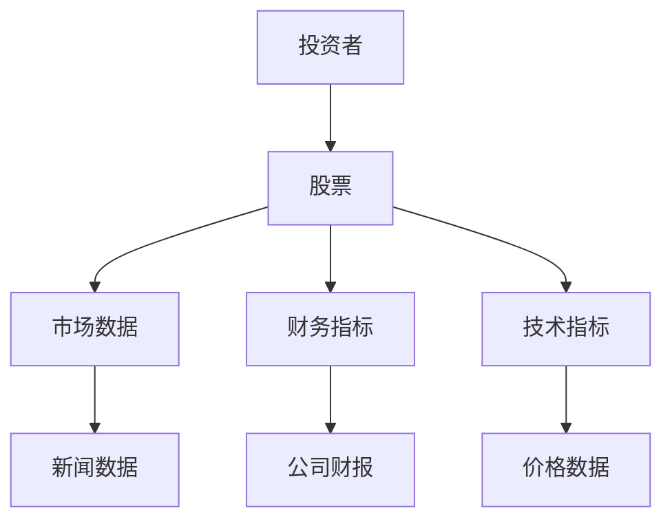
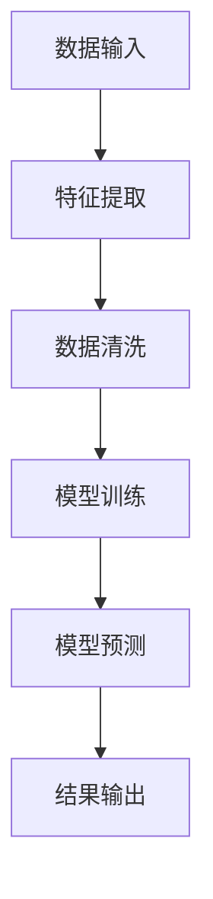
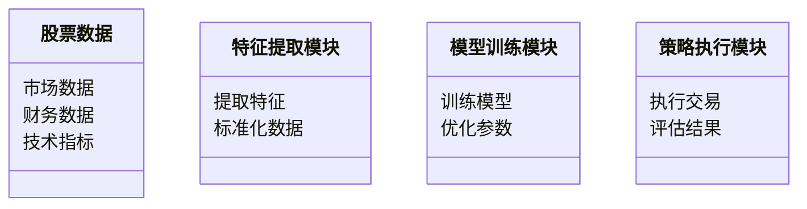
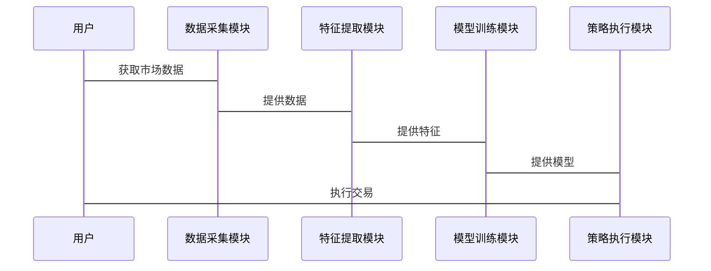

                 


# AI辅助识别价值股轮动机会

> 关键词：AI技术，股票分析，价值股识别，轮动策略，机器学习，算法交易，股票预测

> 摘要：本文详细探讨了AI技术在识别价值股轮动机会中的应用。首先介绍了价值股的基本概念和股票轮动策略的意义，接着分析了AI在金融领域的应用前景。然后从核心概念、算法原理、系统架构、项目实战等多方面详细阐述了AI辅助识别价值股的具体实现过程，最后总结了最佳实践和未来发展趋势。

---

# 第1章: 价值股与轮动策略的基本概念

## 1.1 价值股的定义与特征

### 1.1.1 价值股的基本定义

价值股是指那些市场价格低于其内在价值的股票。通常，价值股具有较高的分红率、较低的市盈率和市净率，吸引追求稳定收益的投资者。这种股票往往在市场低估时出现，通过长期持有可以获得超额收益。

### 1.1.2 价值股的核心特征

- **低市盈率（P/E Ratio）**：市盈率低于行业平均水平，表明股票价格相对于盈利较低。
- **低市净率（P/B Ratio）**：市净率低于行业平均水平，表明股价相对于资产价值较低。
- **高股息率（Dividend Yield）**：股息收益率较高，吸引追求稳定收益的投资者。
- **稳定的财务表现**：公司财务状况健康，盈利稳定，具有较强的抗风险能力。

### 1.1.3 价值股的投资价值评估

价值股的投资价值通常通过以下指标进行评估：

$$
\text{内在价值} = \frac{\text{净利润} \times \text{折现率}}{\text{增长率}}
$$

通过对比市场价格与内在价值，投资者可以判断是否存在投资机会。

## 1.2 股票轮动策略的定义与分类

### 1.2.1 股票轮动的基本概念

股票轮动策略是指根据市场环境变化，动态调整投资组合中的股票，以捕捉不同阶段的市场机会。这种策略通常基于技术分析、基本面分析或市场情绪等因素。

### 1.2.2 股票轮动的主要分类

- **行业轮动**：根据行业景气度和周期性变化，调整投资组合中的行业配置。
- **风格轮动**：根据市场风格（如成长、价值、大盘、小盘）的变化，调整投资策略。
- **区域轮动**：根据地区经济表现，调整投资区域配置。

### 1.2.3 股票轮动策略的应用场景

- **市场波动较大时**：通过轮动策略减少市场风险。
- **经济周期变化时**：根据经济周期选择合适的行业或风格。
- **突发事件影响时**：快速调整投资组合，应对突发事件带来的市场冲击。

## 1.3 AI技术在股票分析中的应用前景

### 1.3.1 AI在金融领域的应用现状

人工智能技术在金融领域的应用日益广泛，包括股票预测、风险管理、交易执行等多个方面。AI技术的引入显著提高了金融分析的效率和准确性。

### 1.3.2 AI在股票分析中的优势

- **数据处理能力**：AI可以处理海量数据，发现传统方法难以察觉的模式和趋势。
- **预测准确性**：通过机器学习算法，AI能够基于历史数据预测未来的价格走势。
- **实时性**：AI系统可以实时监控市场变化，快速做出反应。

### 1.3.3 AI辅助股票轮动策略的潜力

AI技术可以通过分析市场情绪、技术指标和财务数据，帮助投资者制定更科学的轮动策略。例如，通过自然语言处理技术分析新闻和社交媒体，预测市场情绪变化，从而优化投资组合。

---

## 1.4 本章小结

本章介绍了价值股的基本概念和股票轮动策略的定义与分类，分析了AI技术在股票分析中的应用前景。AI技术的引入为价值股识别和轮动策略提供了新的可能性，能够帮助投资者更好地捕捉市场机会。

---

# 第2章: AI辅助识别价值股的核心概念与联系

## 2.1 核心概念原理

### 2.1.1 数据特征提取

在AI辅助识别价值股的过程中，数据特征提取是关键步骤。常用的特征包括：

- **技术指标**：如RSI、MACD、布林带等。
- **财务指标**：如市盈率、市净率、ROE等。
- **市场情绪指标**：如新闻情感、社交媒体热度等。

### 2.1.2 模型训练与优化

通过机器学习算法（如随机森林、支持向量机等）对提取的特征进行建模，优化模型参数以提高预测准确率。

### 2.1.3 策略执行与评估

根据模型预测结果制定投资策略，并通过回测和风险指标（如夏普比率、最大回撤等）评估策略的有效性。

## 2.2 核心概念属性特征对比表格

表2.1展示了不同股票特征的对比分析：

| 特征类型 | 特征名称 | 描述 | 示例 |
|----------|----------|------|------|
| 技术指标 | RSI     | 相对强弱指数，衡量股票超买或超卖状态 | 0-100 |
| 财务指标 | P/E     | 市盈率，衡量股票价格相对于每股收益的高低 | 15 |
| 市场情绪 | 舆情得分 | 衡量市场对股票的正面或负面情绪 | 0.8 |

## 2.3 ER实体关系图

通过ER图可以清晰展示各实体之间的关系：



## 2.4 本章小结

本章详细讲解了AI辅助识别价值股的核心概念，包括数据特征提取、模型训练与优化以及策略执行与评估。通过对比表格和ER图，进一步明确了各特征之间的关系和作用。

---

# 第3章: AI辅助识别价值股的算法原理

## 3.1 算法原理概述

### 3.1.1 机器学习在股票分析中的应用

机器学习算法广泛应用于股票预测、风险评估和投资组合优化等领域。通过训练模型，AI系统能够识别市场中的潜在模式。

### 3.1.2 常见的股票预测算法

- **线性回归**：用于预测股票价格趋势。
- **支持向量机（SVM）**：适用于分类问题，如判断股票是否为价值股。
- **随机森林**：通过集成学习提高预测准确率。

### 3.1.3 算法选择的依据

算法选择通常基于数据类型、模型复杂度和计算效率等因素。例如，时间序列数据适合使用LSTM模型，分类问题适合使用SVM或随机森林。

## 3.2 算法流程图

以下是股票预测的算法流程图：



## 3.3 算法实现代码

### 3.3.1 数据预处理

```python
import pandas as pd
data = pd.read_csv('stock_data.csv')
data.dropna(inplace=True)
```

### 3.3.2 特征工程

```python
from sklearn.preprocessing import StandardScaler
scaler = StandardScaler()
X_scaled = scaler.fit_transform(X)
```

### 3.3.3 模型训练

```python
from sklearn.ensemble import RandomForestClassifier
model = RandomForestClassifier(n_estimators=100)
model.fit(X_scaled, y)
```

### 3.3.4 模型评估

```python
from sklearn.metrics import accuracy_score
y_pred = model.predict(X_test_scaled)
print("准确率:", accuracy_score(y_test, y_pred))
```

## 3.4 数学公式

股票价格预测的线性回归模型如下：

$$
y = \beta_0 + \beta_1 x_1 + \beta_2 x_2 + \ldots + \beta_n x_n + \epsilon
$$

其中，$y$ 是预测的股票价格，$x_i$ 是各特征变量，$\beta_i$ 是回归系数，$\epsilon$ 是误差项。

## 3.5 本章小结

本章详细讲解了AI辅助识别价值股的算法原理，包括常见算法的选择、流程图的设计以及代码实现。通过数学公式和代码示例，帮助读者理解算法的工作原理。

---

# 第4章: 系统分析与架构设计方案

## 4.1 问题场景介绍

在实际应用中，投资者需要一个实时监控和分析股票市场数据的系统，以便快速识别价值股轮动机会。

## 4.2 项目介绍

本项目旨在开发一个基于AI的股票分析系统，帮助投资者识别价值股轮动机会。系统包括数据采集、特征提取、模型训练和策略执行四个模块。

## 4.3 系统功能设计

### 4.3.1 领域模型



### 4.3.2 系统架构设计


### 4.3.3 系统接口设计

系统接口主要分为数据接口和用户接口。数据接口用于获取实时市场数据，用户接口用于展示分析结果和执行交易指令。

### 4.3.4 系统交互



## 4.4 本章小结

本章通过系统分析与架构设计方案，详细描述了AI辅助识别价值股轮动机会的整体框架和实现过程。通过领域模型和系统架构图，帮助读者理解系统的各个组成部分及其交互关系。

---

# 第5章: 项目实战

## 5.1 环境安装

### 5.1.1 安装Python环境

```bash
python --version
pip install numpy pandas scikit-learn
```

### 5.1.2 安装数据接口库

```bash
pip install pandas_datareader
```

## 5.2 系统核心实现源代码

### 5.2.1 数据采集

```python
import pandas_datareader as pdr
data = pdr.get_dataYahoo('AAPL')
```

### 5.2.2 特征提取

```python
from sklearn.preprocessing import MinMaxScaler
scaler = MinMaxScaler()
X_scaled = scaler.fit_transform(data)
```

### 5.2.3 模型训练

```python
from sklearn.ensemble import RandomForestRegressor
model = RandomForestRegressor(n_estimators=100)
model.fit(X_scaled, y)
```

### 5.2.4 策略执行

```python
def execute_trade(signals):
    if signals == 'buy':
        print("执行买入操作")
    elif signals == 'sell':
        print("执行卖出操作")
```

## 5.3 代码应用解读与分析

### 5.3.1 数据采集模块

通过`pandas_datareader`获取股票数据，清洗数据并提取特征。

### 5.3.2 模型训练模块

使用随机森林回归模型进行训练，优化模型参数以提高预测准确率。

### 5.3.3 策略执行模块

根据模型预测结果生成交易信号，并执行买入或卖出操作。

## 5.4 实际案例分析

以苹果公司股票为例，通过数据采集、特征提取和模型训练，生成交易信号并执行交易。

## 5.5 本章小结

本章通过实际案例分析，详细讲解了AI辅助识别价值股轮动机会的实现过程。通过代码示例和实际操作，帮助读者理解如何将理论应用于实践。

---

# 第6章: 最佳实践、小结与展望

## 6.1 最佳实践

### 6.1.1 数据选择

选择高质量的数据源，确保数据的完整性和准确性。

### 6.1.2 模型优化

通过交叉验证和网格搜索优化模型参数，提高预测准确率。

### 6.1.3 风险控制

设定止损和止盈点，控制投资风险。

## 6.2 本章小结

通过本文的详细讲解，读者可以系统地掌握AI辅助识别价值股轮动机会的核心概念、算法原理和实现方法。最佳实践部分提供了实际操作中的注意事项和优化建议。

## 6.3 未来展望

随着AI技术的不断发展，股票分析将更加智能化和自动化。未来的研究方向包括更复杂的模型、多模态数据的融合以及个性化投资策略的制定。

---

# 作者

作者：AI天才研究院/AI Genius Institute & 禅与计算机程序设计艺术 /Zen And The Art of Computer Programming

