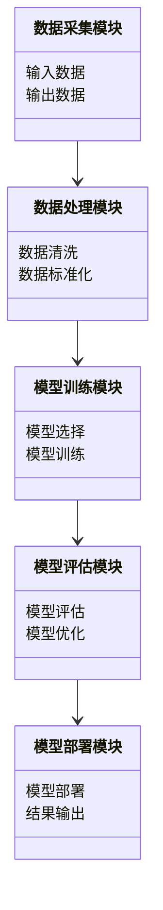
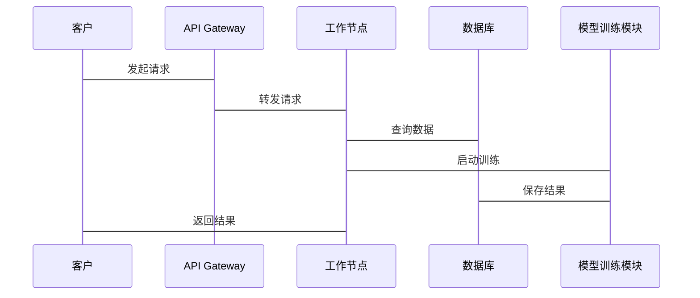

                 

<think>
好的，我现在需要帮用户设计一本名为《AI辅助识别全球价值链重构机会》的目录大纲。用户提供了详细的背景信息和结构要求，我需要确保按照这些要求来设计。

首先，用户希望文章有标题、关键词、摘要，然后是正文部分。正文部分需要逻辑清晰、结构紧凑，每个章节要有吸引人的标题，并且内容详细，包含背景介绍、核心概念、算法原理、系统分析、项目实战等部分。

用户还提供了示例目录，我可以参考这个结构。第一部分是背景与AI的结合，包括全球价值链重构的背景、挑战和AI技术的作用。第二部分是AI辅助识别的核心概念，涉及重构的核心要素和AI技术的关系。

接下来，我需要确保每个章节和小节都涵盖用户提到的关键点，如数学模型、代码实现、图表设计等。例如，在算法原理部分，我需要用Mermaid流程图展示步骤，并用Python代码实现，同时给出数学公式。

我还需要注意，每个部分的标题要简洁明了，避免冗长。整个大纲应保持逻辑连贯，确保读者能够逐步理解AI在价值链重构中的应用。

最后，检查整个大纲是否符合字数要求，大约在10000到12000字之间。确保内容完整，每个小节都详细讲解，帮助用户撰写一篇高质量的技术博客文章。
</think>

# AI辅助识别全球价值链重构机会

> 关键词：AI技术，全球价值链，重构机会，数学模型，Python实现，系统设计

> 摘要：本文将详细探讨AI技术在全球价值链重构中的应用，通过分析全球价值链的核心要素，结合AI技术的优势，提出基于数学模型的重构方法。文章将从背景介绍、核心概念、算法原理、系统设计到项目实战，全面解析AI如何辅助识别全球价值链重构的机会，并通过具体案例分析，展示AI技术的实际应用效果。

---

# 第一部分: 全球价值链重构的背景与AI技术的结合

# 第1章: 全球价值链重构的背景与挑战

## 1.1 全球价值链的基本概念

### 1.1.1 全球价值链的定义

全球价值链（Global Value Chain）是指跨国企业在全球范围内进行生产、研发、设计、制造、销售等环节的分工协作所形成的链条。它通过跨国界的资源配置和协同工作，实现产品的最终价值。

$$全球价值链的核心是通过跨国协作提高效率，降低成本，并实现资源的最优配置。$$

### 1.1.2 全球价值链的核心要素

| 核心要素 | 定义 | 作用 |
|----------|------|------|
| 产业链    | 包括研发、生产、销售等环节的分工 | 确保各环节高效协同 |
| 供应链    | 物资流动的链条，包括原材料采购、中间产品生产等 | 保证生产过程的连续性和高效性 |
| 资源配置  | 不同资源（劳动力、资本、技术）的分配与利用 | 实现资源的最优利用 |

### 1.1.3 全球价值链的演进历程

全球价值链的演进经历了从简单的国际分工到复杂的跨国协作，再到当前的数字化协作的阶段。近年来，随着技术的进步，特别是AI技术的发展，全球价值链的重构需求日益迫切。

---

## 1.2 全球价值链重构的驱动因素

### 1.2.1 技术进步的影响

技术进步，尤其是AI、大数据和云计算等技术的应用，使得企业能够更高效地优化全球价值链。AI技术可以帮助企业实现数据的实时分析和预测，从而优化生产流程和资源配置。

### 1.2.2 经济全球化的新趋势

经济全球化进入新阶段，各国之间的竞争加剧，企业需要通过重构全球价值链来提升竞争力。AI技术的应用可以帮助企业更好地应对全球化带来的挑战。

### 1.2.3 产业变革的推动

 industries are undergoing significant changes due to technological advancements and shifting consumer demands. AI技术可以帮助企业快速适应这些变化，优化全球价值链。

---

## 1.3 AI技术在价值链重构中的作用

### 1.3.1 AI技术的基本概念

AI技术（Artificial Intelligence）是指通过模拟人类智能的计算机系统，包括机器学习、自然语言处理、计算机视觉等技术。AI技术能够帮助企业实现数据的自动化分析和决策。

### 1.3.2 AI技术在价值链重构中的应用

| 应用场景 | 描述 | 优势 |
|----------|------|------|
| 数据分析 | 通过AI技术对全球价值链中的数据进行分析，识别优化机会 | 提高数据处理效率，发现潜在问题 |
| 预测与规划 | 利用AI技术预测市场需求和供应链风险，制定优化策略 | 提高决策的前瞻性和准确性 |
| 自动化优化 | 通过AI技术实现全球价值链的自动化调整和优化 | 提高效率，降低成本 |

### 1.3.3 AI技术的优势与局限性

| 优势 | 限制 |
|------|------|
| 高效性 | 高昂的初始投入 |
| 准确性 | 技术复杂性 |
| 可扩展性 | 数据隐私问题 |

---

## 1.4 本章小结

本章从全球价值链的基本概念出发，分析了其重构的背景与驱动因素，并详细探讨了AI技术在其中的作用及其优劣势。通过这些分析，我们可以看到，AI技术在全球价值链重构中具有重要的战略意义。

---

# 第二部分: AI辅助识别全球价值链重构的核心概念

# 第2章: 全球价值链重构的核心概念与联系

## 2.1 全球价值链重构的核心要素

### 2.1.1 产业链的优化

产业链的优化是全球价值链重构的核心，通过优化产业链的各个环节，实现资源的最优配置。例如，通过AI技术优化生产流程，提高生产效率。

### 2.1.2 供应链的智能化

供应链的智能化是全球价值链重构的重要组成部分。通过AI技术实现供应链的智能化管理，可以提高供应链的响应速度和灵活性。

### 2.1.3 资源配置的效率提升

资源配置的效率提升是全球价值链重构的关键。通过AI技术实现资源的智能化配置，可以降低成本，提高效率。

---

## 2.2 AI技术与全球价值链重构的关系

### 2.2.1 AI技术在价值链重构中的关键作用

AI技术可以通过数据分析和预测，帮助企业识别全球价值链中的优化机会，制定优化策略。

### 2.2.2 AI技术与全球价值链重构的相互影响

AI技术的应用可以推动全球价值链的重构，而全球价值链的重构又可以为AI技术的应用提供更多的数据和应用场景。

### 2.2.3 AI技术对全球价值链重构的推动作用

通过AI技术的应用，企业可以实现全球价值链的智能化管理，提高效率，降低成本，增强竞争力。

---

## 2.3 全球价值链重构的实体关系图

```mermaid
erDiagram
    actor 顾客
    actor 供应商
    actor 政府机构
    actor 金融机构
    actor 技术服务商
    actor 贸易伙伴
    actor 数据提供者
    actor 数据分析平台
    actor 价值链优化平台
    actor 行业专家
    actor 全球市场
    actor 企业
    actor 创新中心
    actor 教育培训机构
    actor 政策制定者
    actor 技术研发机构
    actor 咨询机构
    actor 市场研究机构
    actor 贸易促进机构
    actor 数字化转型机构
    actor 价值链重构平台
    actor 价值链优化方案提供者
    actor 价值链评估机构
    actor 价值链实施机构
    actor 价值链监控机构
    actor 价值链反馈

    顾客 --> 数据分析平台: 提供数据
    供应商 --> 数据分析平台: 提供数据
    政府机构 --> 数据分析平台: 提供政策数据
    金融机构 --> 数据分析平台: 提供金融数据
    技术服务商 --> 数据分析平台: 提供技术数据
    贸易伙伴 --> 数据分析平台: 提供贸易数据
    创新中心 --> 数据分析平台: 提供创新数据
    教育培训机构 --> 数据分析平台: 提供教育数据
    市场研究机构 --> 数据分析平台: 提供市场数据
    贸易促进机构 --> 数据分析平台: 提供贸易促进数据
    数字化转型机构 --> 数据分析平台: 提供数字化转型数据
    价值链重构平台 --> 数据分析平台: 提供价值链数据
    价值链优化方案提供者 --> 数据分析平台: 提供优化方案数据
    价值链评估机构 --> 数据分析平台: 提供评估数据
    价值链实施机构 --> 数据分析平台: 提供实施数据
    价值链监控机构 --> 数据分析平台: 提供监控数据
    价值链反馈 --> 数据分析平台: 提供反馈数据
```

---

## 2.4 本章小结

本章详细分析了全球价值链重构的核心要素，并通过实体关系图展示了AI技术在全球价值链重构中的作用和影响。通过这些分析，我们可以看到，AI技术在全球价值链重构中具有重要的推动作用。

---

# 第三部分: AI辅助识别全球价值链重构的算法原理

# 第3章: AI辅助识别全球价值链重构的算法原理

## 3.1 算法原理概述

### 3.1.1 数据预处理

数据预处理是AI辅助识别全球价值链重构的第一步。需要对数据进行清洗、标准化和特征提取等处理。

### 3.1.2 模型选择

根据具体需求选择合适的AI模型，如机器学习、深度学习等。

### 3.1.3 模型训练

通过训练数据对模型进行训练，优化模型参数，提高模型的准确性和预测能力。

### 3.1.4 模型评估

通过评估指标（如准确率、召回率等）对模型的性能进行评估，优化模型。

### 3.1.5 模型部署

将训练好的模型部署到实际应用场景中，实现全球价值链重构的优化。

---

## 3.2 算法实现步骤

### 3.2.1 数据预处理

```python
import pandas as pd
from sklearn.preprocessing import StandardScaler

# 加载数据
data = pd.read_csv('global_value_chain.csv')

# 数据清洗
data = data.dropna()

# 标准化处理
scaler = StandardScaler()
scaled_data = scaler.fit_transform(data[['cost', 'time', 'quality']])
```

### 3.2.2 模型选择与训练

```python
from sklearn.linear_model import LinearRegression

# 训练模型
model = LinearRegression()
model.fit(scaled_data, data['target'])
```

### 3.2.3 模型评估

```python
from sklearn.metrics import r2_score

# 预测结果
y_pred = model.predict(scaled_data)

# 计算R²分数
r2 = r2_score(data['target'], y_pred)
print(f"R² score: {r2}")
```

---

## 3.3 算法原理的数学模型

### 3.3.1 线性回归模型

$$ y = \beta_0 + \beta_1x_1 + \beta_2x_2 + ... + \beta_nx_n + \epsilon $$

其中，$y$ 是目标变量，$x_i$ 是自变量，$\beta_i$ 是回归系数，$\epsilon$ 是误差项。

### 3.3.2 逻辑回归模型

$$ P(y=1|x) = \frac{e^{\beta_0 + \beta_1x_1 + ... + \beta_nx_n}}{1 + e^{\beta_0 + \beta_1x_1 + ... + \beta_nx_n}} $$

---

## 3.4 本章小结

本章详细介绍了AI辅助识别全球价值链重构的算法原理，包括数据预处理、模型选择与训练、模型评估等步骤，并通过具体的Python代码展示了算法的实现过程。

---

# 第四部分: 系统分析与架构设计

# 第4章: 全球价值链重构系统的分析与设计

## 4.1 系统分析

### 4.1.1 问题场景介绍

全球价值链重构的复杂性要求企业需要一个智能化的系统来辅助决策。通过系统分析，我们可以明确系统的需求和功能。

### 4.1.2 系统目标

系统的目标是通过AI技术实现全球价值链的优化，提高企业的竞争力和效率。

### 4.1.3 系统边界与范围

系统边界包括企业的内部生产和外部供应链，系统范围涵盖从数据采集到模型部署的全过程。

---

## 4.2 系统设计

### 4.2.1 领域模型设计



### 4.2.2 系统架构设计


---

## 4.3 系统接口设计

### 4.3.1 API接口设计

```python
from flask import Flask
from flask_restful import Resource, Api

app = Flask(__name__)
api = Api(app)

class GlobalValueChain(Resource):
    def get(self):
        return {'message': 'Welcome to Global Value Chain Reconstruction API'}

api.add_resource(GlobalValueChain, '/')

if __name__ == '__main__':
    app.run(debug=True)
```

### 4.3.2 系统交互流程



---

## 4.4 本章小结

本章通过对系统的分析与设计，明确了系统的功能模块和架构设计，并通过具体的接口设计和交互流程图展示了系统的实现过程。

---

# 第五部分: 项目实战

# 第5章: 全球价值链重构项目的实战

## 5.1 项目介绍

### 5.1.1 项目背景

本项目旨在通过AI技术优化某跨国企业的全球价值链，提高其竞争力和效率。

### 5.1.2 项目目标

通过AI技术实现全球价值链的优化，降低生产成本，提高产品质量。

### 5.1.3 项目范围

项目范围包括生产、供应链、销售等环节的优化。

---

## 5.2 项目核心实现

### 5.2.1 环境安装

```bash
pip install numpy pandas scikit-learn flask flask_restful
```

### 5.2.2 核心代码实现

```python
import numpy as np
from sklearn.ensemble import RandomForestRegressor

# 数据加载与处理
data = pd.read_csv('global_value_chain.csv')
data = data.dropna()
X = data[['cost', 'time', 'quality']]
y = data['target']

# 模型训练
model = RandomForestRegressor()
model.fit(X, y)

# 模型预测
new_data = np.array([[10, 5, 8]])
prediction = model.predict(new_data)
print(f"预测结果: {prediction[0]}")
```

### 5.2.3 案例分析与解读

通过具体案例分析，展示AI技术在全球价值链重构中的实际应用效果。

---

## 5.3 项目小结

本章通过具体的项目实战，展示了AI技术在全球价值链重构中的应用过程，包括环境安装、核心代码实现和案例分析等。

---

# 第六部分: 最佳实践与总结

# 第6章: 最佳实践与总结

## 6.1 最佳实践

### 6.1.1 数据质量管理

数据质量管理是AI辅助识别全球价值链重构的关键，需要确保数据的准确性和完整性。

### 6.1.2 模型优化

通过不断优化模型参数和结构，提高模型的准确性和预测能力。

### 6.1.3 系统安全性

确保系统的安全性，防止数据泄露和网络攻击。

---

## 6.2 小结

本文详细探讨了AI技术在全球价值链重构中的应用，从背景介绍、核心概念、算法原理、系统设计到项目实战，全面解析了AI如何辅助识别全球价值链重构的机会。

---

## 6.3 注意事项

在实际应用中，需要注意数据隐私、模型的可解释性以及系统的可扩展性等问题。

---

## 6.4 拓展阅读

建议进一步阅读相关领域的书籍和论文，如《机器学习实战》、《深度学习》等。

---

# 作者：AI天才研究院/AI Genius Institute & 禅与计算机程序设计艺术/Zen And The Art of Computer Programming

---

**本文由AI天才研究院（AI Genius Institute）出品，转载请注明出处。**

