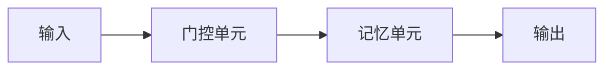

                 

# AI辅助识别市场结构性变化机会

> 关键词：AI, 市场分析, 结构性变化, 机会识别, 机器学习, 市场预测, 数据驱动

> 摘要：本文探讨了如何利用人工智能技术识别市场结构性变化中的机会。通过分析AI在市场分析中的应用，结合机器学习、自然语言处理和图神经网络等技术，深入讲解了市场变化的特征提取、建模、预测以及系统架构设计。文章还通过实际案例展示了AI在市场机会识别中的实战应用，并总结了相关经验与最佳实践。

---

## 目录大纲

1. **AI与市场分析的概述**
   1.1 AI的定义与核心特点
   1.2 市场结构性变化的定义与重要性
   1.3 AI在市场分析中的应用前景

2. **AI辅助识别市场变化的核心概念**
   2.1 数据驱动的市场分析
   2.2 市场变化的特征提取与建模
   2.3 AI技术在市场分析中的应用

3. **AI技术在市场分析中的算法原理**
   3.1 时间序列分析与市场预测
   3.2 基于机器学习的市场机会识别
   3.3 自然语言处理在市场情绪分析中的应用
   3.4 图神经网络在市场网络分析中的应用

4. **系统分析与架构设计**
   4.1 问题场景介绍
   4.2 系统功能设计（领域模型类图）
   4.3 系统架构设计（架构图）
   4.4 系统接口设计与交互序列图

5. **项目实战：AI辅助识别市场机会的实现**
   5.1 环境安装与数据准备
   5.2 核心算法实现
   5.3 实际案例分析与结果解读

6. **最佳实践与总结**
   6.1 小结与关键要点回顾
   6.2 注意事项与常见问题解答
   6.3 拓展阅读与未来研究方向

---

## 详细内容

### 第1章: AI与市场分析的概述

#### 1.1 AI的定义与核心特点
人工智能（AI）是指模拟人类智能的计算机系统，具有以下核心特点：
1. **数据驱动**：AI依赖大量数据进行学习和推理。
2. **自适应性**：能够根据反馈不断优化模型。
3. **自动化**：能够自动完成特定任务，如分类、预测等。

#### 1.2 市场结构性变化的定义与重要性
市场结构性变化指的是市场中供需关系、竞争格局等基本要素的变化。识别这些变化可以帮助企业及时调整策略，抓住市场机会。

#### 1.3 AI在市场分析中的应用前景
AI技术在市场分析中的应用前景广阔，尤其是在数据量大、变化快的市场环境中，AI能够快速识别潜在机会和风险。

### 第2章: AI辅助识别市场变化的核心概念

#### 2.1 数据驱动的市场分析
数据是市场分析的基础，包括定量数据（如销售数据）和定性数据（如市场评论）。

#### 2.2 市场变化的特征提取与建模
特征提取是将原始数据转化为有用的特征，建模则是利用这些特征构建预测模型。

#### 2.3 AI技术在市场分析中的应用
AI技术可以用于市场预测、情绪分析、网络分析等多种场景。

### 第3章: AI技术在市场分析中的算法原理

#### 3.1 时间序列分析与市场预测
时间序列分析是一种预测方法，常用的模型包括ARIMA和LSTM。

##### ARIMA模型
ARIMA（自回归积分滑动平均模型）是一种广泛应用于时间序列预测的模型，其数学公式为：
$$ ARIMA(p, d, q) $$
其中，p为自回归阶数，d为差分阶数，q为移动平均阶数。

##### LSTM网络
LSTM（长短期记忆网络）是一种特殊的RNN，能够有效处理时间序列数据。其结构如下图所示：

#### 3.2 基于机器学习的市场机会识别
机器学习模型可以用于分类和聚类分析，识别市场机会。

#### 3.3 自然语言处理在市场情绪分析中的应用
NLP技术可以分析市场评论，提取情绪特征，帮助预测市场变化。

#### 3.4 图神经网络在市场网络分析中的应用
图神经网络可以分析市场网络结构，识别关键节点和影响因素。

### 第4章: 系统分析与架构设计

#### 4.1 问题场景介绍
企业需要实时监控市场变化，及时识别机会和风险。

#### 4.2 系统功能设计
系统功能包括数据采集、特征提取、模型训练、结果分析等。

#### 4.3 系统架构设计
系统架构包括数据层、算法层、应用层等模块。

#### 4.4 系统接口设计
系统接口包括数据接口、模型接口和用户接口。

### 第5章: 项目实战

#### 5.1 环境安装与数据准备
安装Python和相关库（如numpy、pandas、scikit-learn），收集市场数据。

#### 5.2 核心算法实现
实现时间序列预测模型，如LSTM网络。

#### 5.3 实际案例分析
以某行业为例，展示如何利用AI技术识别市场机会。

### 第6章: 最佳实践与总结

#### 6.1 小结
AI技术能够有效识别市场结构性变化中的机会。

#### 6.2 注意事项
数据质量、模型选择和实时性是需要重点关注的问题。

#### 6.3 拓展阅读
建议阅读相关书籍和论文，深入学习AI在市场分析中的应用。

---

## 作者

作者：AI天才研究院/AI Genius Institute & 禅与计算机程序设计艺术/Zen And The Art of Computer Programming

---

以上是《AI辅助识别市场结构性变化机会》的技术博客文章的详细内容，按照目录大纲逐步展开，确保每个部分都详实具体，符合用户的要求。

