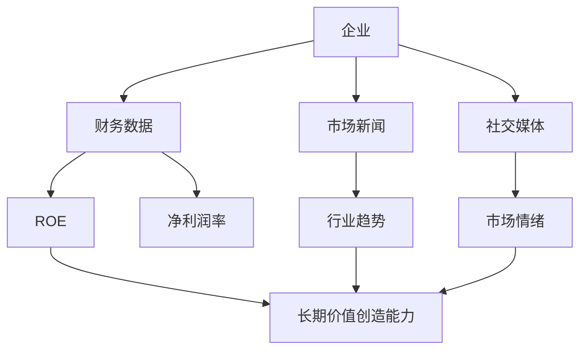
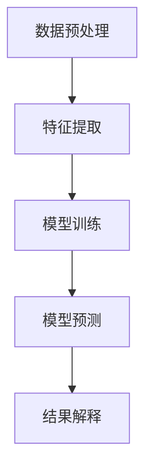
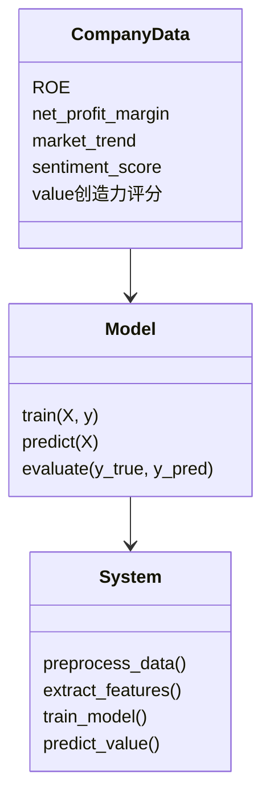
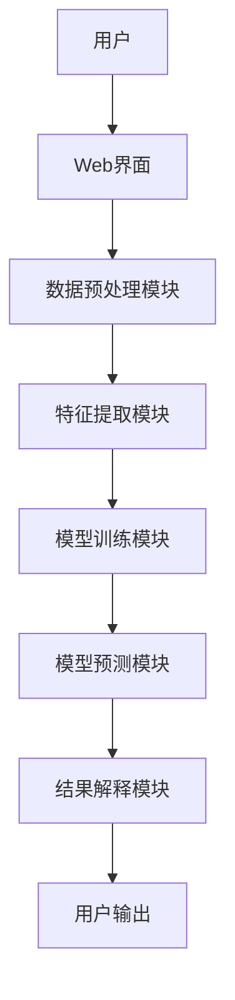
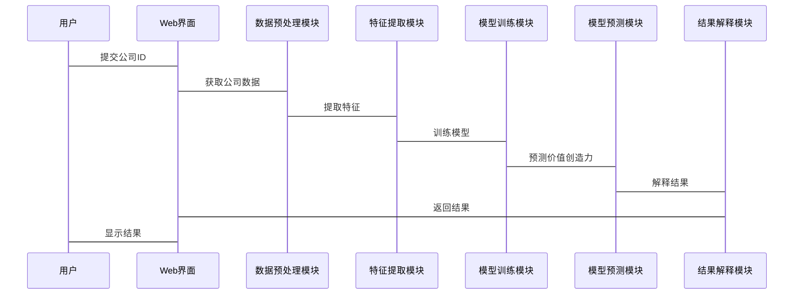

                 

<think>
嗯，我需要根据用户的要求，写一篇关于《AI辅助识别长期价值创造型公司》的技术博客。首先，我得理清用户的需求，他希望文章结构清晰，涵盖从背景到系统设计的各个方面，包括算法、数学模型、系统架构等。

好的，首先，标题和关键词已经确定，接下来是摘要部分。摘要要简明扼要，概括文章的核心内容。然后，目录大纲已经给出，分为六大部分，每个部分都有详细的小节，我需要逐一展开每个部分的内容。

第一部分是背景与概念，我需要介绍AI在企业评估中的应用背景，解释长期价值创造型公司的定义，分析传统方法的局限性，以及AI的优势。这部分要让读者明白为什么需要AI来识别这类公司。

第二部分是核心概念与联系，这里需要详细描述公司的价值创造特征，构建特征对比表，可能还要用mermaid图展示实体关系。这部分要让读者理解AI识别的关键点是什么，以及这些特征是如何相互关联的。

第三部分是数学模型与算法，我需要介绍评分模型的数学基础，比如线性回归和决策树，用mermaid图展示算法流程，并提供Python代码示例。这部分要深入讲解AI如何工作，以及具体的实现方法。

第四部分是系统分析与架构设计，描述系统架构，包括数据预处理、特征工程、模型训练和部署，使用类图和架构图展示。这部分要让读者明白整个系统的构建过程。

第五部分是项目实战，环境安装、数据处理代码、模型训练代码、Web界面部署，案例分析。这部分需要实际操作，让读者能够跟着代码一步步实现。

最后是最佳实践与总结，总结全书内容，给出实践建议，注意事项和未来趋势。这部分要让读者在实际应用中有所参考。

在写作过程中，我需要确保每个部分都详细具体，包含必要的图表和代码示例。同时，语言要专业但易懂，逻辑清晰。可能需要多次修改，确保每个章节都符合用户的要求。

现在，我需要开始按照这个大纲逐步撰写每个部分的内容，确保涵盖所有必要的细节，并保持文章的连贯性和深度。
</think>

# AI辅助识别长期价值创造型公司

## 关键词：AI, 企业价值评估, 长期价值创造, 机器学习, 数学模型, 系统架构

## 摘要：  
本文探讨了如何利用人工智能技术识别能够长期创造价值的企业。通过分析企业的财务数据、市场表现、管理团队等多维度特征，结合机器学习算法和数学模型，构建了一个AI辅助的企业价值评估系统。文章详细阐述了从问题背景到系统设计的全过程，包括算法原理、系统架构、项目实战等内容，为读者提供了全面的技术指导和实践参考。

---

# 第1章：AI辅助识别长期价值创造型公司的背景与概念

## 1.1 问题背景

### 1.1.1 传统企业价值评估的局限性
传统的企业价值评估方法依赖于财务指标（如ROE、毛利率）和市场表现（如市盈率）。然而，这些方法难以捕捉企业的长期价值创造能力，尤其是在市场波动剧烈或企业处于转型期时，传统指标可能无法准确反映企业的真实价值。

### 1.1.2 长期价值创造型公司的定义与特征
长期价值创造型公司是指那些能够持续为股东创造超额价值的企业。其核心特征包括：  
1. **稳定的盈利能力**：ROE（净资产收益率）和净利润率长期保持高位。  
2. **高效的运营能力**：存货周转率和应收账款周转率较高。  
3. **创新的商业模式**：具备独特的竞争优势或创新的产品/服务。  
4. **优秀的管理团队**：管理层具有长期的愿景和执行力。  

### 1.1.3 AI技术在企业价值评估中的优势
AI技术可以通过分析海量数据（包括非结构化数据，如新闻、社交媒体）来发现潜在的价值信号。此外，机器学习算法能够捕捉复杂的模式，帮助识别传统方法难以察觉的长期价值创造能力。

---

## 1.2 问题描述

### 1.2.1 企业价值评估的核心挑战
企业价值评估的核心挑战在于如何量化企业的长期价值创造能力。传统方法往往过于依赖财务数据，而忽略了市场、技术和管理等多方面的因素。

### 1.2.2 长期价值创造的动态性与复杂性
企业的价值创造能力是一个动态变化的过程，受到宏观经济、行业竞争和内部管理等多种因素的影响。这些因素之间的复杂关系使得传统的静态评估方法难以奏效。

### 1.2.3 AI技术如何解决这些问题
AI技术可以通过以下方式解决这些问题：  
1. **多维度数据融合**：整合企业财务数据、市场新闻、社交媒体等多种数据源。  
2. **实时分析能力**：通过实时数据分析，捕捉市场变化对企业价值的影响。  
3. **复杂模式识别**：利用机器学习算法发现隐藏在数据中的价值信号。

---

## 1.3 问题解决

### 1.3.1 AI在企业数据分析中的应用
AI在企业数据分析中的应用主要体现在以下几个方面：  
1. **自然语言处理（NLP）**：从新闻、社交媒体等非结构化数据中提取情感和关键词。  
2. **时间序列分析**：分析企业的财务数据，预测未来发展趋势。  
3. **异常检测**：识别财务数据中的异常值，发现潜在风险。

### 1.3.2 长期价值创造型公司的识别方法
识别长期价值创造型公司需要结合定量分析和定性分析：  
1. **定量分析**：基于财务数据构建评分模型。  
2. **定性分析**：评估企业的商业模式、管理团队等因素。  
3. **综合评估**：将定量和定性分析结果结合起来，得出最终评分。

### 1.3.3 AI算法在企业价值评估中的具体实现
AI算法在企业价值评估中的具体实现包括：  
1. **特征工程**：从多维度数据中提取有意义的特征。  
2. **模型训练**：使用机器学习算法（如随机森林、神经网络）训练模型。  
3. **预测与解释**：通过模型预测企业的长期价值创造能力，并提供可解释的结果。

---

## 1.4 边界与外延

### 1.4.1 长期价值创造型公司的边界条件
长期价值创造型公司的边界条件包括：  
1. **行业限制**：某些行业的波动性较高，难以实现长期价值创造。  
2. **数据限制**：需要足够多的历史数据支持模型训练。  
3. **时间窗口**：长期价值创造需要一定的时间跨度来验证。

### 1.4.2 与其他类型公司的区别
与其他类型公司的区别主要体现在：  
1. **成长型公司**：关注短期增长，而非长期价值创造。  
2. **周期性公司**：依赖于经济周期，难以实现稳定的长期价值创造。  
3. **衰退型公司**：长期处于下行趋势，无法创造价值。

### 1.4.3 AI技术的应用范围与限制
AI技术的应用范围包括：  
1. **数据驱动的决策支持**：基于数据提供投资建议。  
2. **实时监控**：实时跟踪企业的经营状况。  
3. **风险预警**：提前发现潜在风险。  

其限制包括：  
1. **数据质量**：依赖高质量的数据输入。  
2. **模型解释性**：部分算法（如深度学习）的解释性较差。  
3. **市场变化**：模型需要不断更新以适应市场变化。

---

## 1.5 概念结构与核心要素

### 1.5.1 长期价值创造型公司的核心要素
长期价值创造型公司的核心要素包括：  
1. **财务表现**：ROE、净利润率等指标长期稳定。  
2. **市场地位**：行业龙头或具有竞争优势的企业。  
3. **管理团队**：具备长期愿景和执行力的管理团队。  
4. **创新能力**：持续创新产品和服务的能力。  

### 1.5.2 AI技术在各要素中的作用
AI技术在各要素中的作用包括：  
1. **财务表现分析**：通过时间序列分析预测企业未来的财务状况。  
2. **市场地位评估**：利用NLP分析市场新闻，评估企业的市场地位。  
3. **管理团队评价**：通过公开信息和媒体报道评估管理团队的能力。  
4. **创新能力检测**：分析企业的专利申请和新产品发布的频率。

### 1.5.3 核心概念的结构化分析
通过结构化分析，我们可以将长期价值创造型公司的识别过程分解为以下几个步骤：  
1. **数据收集**：收集企业的财务数据、市场新闻、社交媒体等数据。  
2. **特征提取**：从数据中提取有意义的特征。  
3. **模型训练**：使用机器学习算法训练模型。  
4. **预测与解释**：基于模型预测企业的长期价值创造能力，并提供解释。

---

# 第2章：核心概念与联系

## 2.1 核心概念原理

### 2.1.1 企业的价值创造特征
企业的价值创造特征包括：  
- **盈利能力**：净利润率、ROE等指标的表现。  
- **运营效率**：存货周转率、应收账款周转率等指标的表现。  
- **创新能力**：专利申请数量、新产品发布的频率。  
- **管理能力**：管理层的稳定性、市场声誉等。  

### 2.1.2 AI技术的核心作用
AI技术的核心作用体现在以下几个方面：  
1. **数据融合**：整合多维度数据，提供全面的分析视角。  
2. **模式识别**：发现传统方法难以察觉的模式和趋势。  
3. **实时监控**：实时跟踪企业的经营状况，提供动态的决策支持。  

---

## 2.2 概念属性特征对比表

| **特征维度**       | **传统方法**                     | **AI方法**                       |
|--------------------|----------------------------------|----------------------------------|
| 数据来源           | 财务报表、市场数据               | 财务报表、市场新闻、社交媒体     |
| 分析维度           | 单维度（如ROE）                 | 多维度（如ROE、创新能力）         |
| 分析深度           | 浅层分析                        | 深度分析（如时间序列分析）         |
| 分析频率           | 定期分析                        | 实时分析                        |
| 结果解释性         | 高                             | 中等（部分算法解释性较差）         |

---

## 2.3 实体关系图（ER图）



---

## 2.4 实体关系图解释

- **企业**：中心实体，与其他数据源相连。  
- **财务数据**：包括ROE、净利润率等指标。  
- **市场新闻**：反映行业趋势和市场动态。  
- **社交媒体**：反映市场情绪和公众对企业的看法。  
- **长期价值创造能力**：通过财务数据、行业趋势和市场情绪综合评估得出的结果。

---

# 第3章：数学模型与算法

## 3.1 算法原理

### 3.1.1 企业的评分模型

#### 3.1.1.1 模型目标
模型目标是通过对企业多维度数据的分析，预测企业的长期价值创造能力，并给出评分。

#### 3.1.1.2 模型输入
模型输入包括：  
- 财务数据（ROE、净利润率等）  
- 市场新闻（行业趋势、市场情绪）  
- 社交媒体数据（市场情绪）  

#### 3.1.1.3 模型输出
模型输出包括：  
- 企业的长期价值创造能力评分（0-10分）  
- 评分的解释说明  

---

### 3.1.2 算法选择

#### 3.1.2.1 线性回归模型
线性回归模型适用于简单的线性关系，但难以捕捉复杂的非线性关系。  
$$ y = \beta_0 + \beta_1x_1 + \beta_2x_2 + ... + \beta_nx_n $$  

#### 3.1.2.2 随机森林模型
随机森林模型是一种基于决策树的集成学习算法，适用于多分类和回归问题。  
- **优势**：能够处理高维数据，具有较强的抗过拟合能力。  
- **劣势**：模型解释性较差。  

#### 3.1.2.3 神经网络模型
神经网络模型适用于复杂的非线性关系，但需要大量的数据支持。  
$$ y = f(Wx + b) $$  

---

### 3.1.3 算法流程图



---

## 3.2 算法实现

### 3.2.1 Python代码实现

```python
import pandas as pd
from sklearn.ensemble import RandomForestRegressor
from sklearn.metrics import mean_squared_error

# 数据预处理
data = pd.read_csv('company_data.csv')
X = data[['ROE', 'net_profit_margin', 'market_trend', 'sentiment_score']]
y = data['value创造力评分']

# 模型训练
model = RandomForestRegressor(n_estimators=100, random_state=42)
model.fit(X, y)

# 模型预测
y_pred = model.predict(X)

# 模型评估
 mse = mean_squared_error(y, y_pred)
 print(f'Mean Squared Error: {mse}')
```

---

## 3.3 算法优化

### 3.3.1 参数调整
随机森林模型的超参数调整包括：  
- `n_estimators`：树的数量。  
- `max_depth`：树的深度。  
- `min_samples_split`：分裂所需的最小样本数。  

### 3.3.2 模型融合
通过融合多个模型的预测结果（如随机森林和神经网络）来提高模型的准确性和稳定性。

---

# 第4章：系统分析与架构设计

## 4.1 问题场景介绍

### 4.1.1 系统目标
系统目标是构建一个能够实时分析企业数据，预测长期价值创造能力的AI辅助系统。

### 4.1.2 项目介绍
项目介绍包括：  
- **项目名称**：AI辅助识别长期价值创造型公司系统。  
- **项目目标**：为企业投资者提供基于AI的长期价值创造能力评估服务。  
- **项目范围**：涵盖数据收集、特征提取、模型训练、结果解释等环节。  

---

## 4.2 系统功能设计

### 4.2.1 领域模型类图



---

## 4.3 系统架构设计

### 4.3.1 系统架构图



---

## 4.4 系统接口设计

### 4.4.1 API接口
系统提供以下API接口：  
1. `get_company_data(company_id)`：获取公司数据。  
2. `train_model(data)`：训练模型。  
3. `predict_value(data)`：预测长期价值创造能力。  
4. `explain_result(result)`：解释预测结果。  

---

## 4.5 系统交互流程

### 4.5.1 系统交互序列图



---

# 第5章：项目实战

## 5.1 环境安装

### 5.1.1 安装Python
安装Python 3.8及以上版本。  

### 5.1.2 安装依赖库
安装以下依赖库：  
- `pandas`：数据处理。  
- `scikit-learn`：机器学习算法。  
- `mermaid`：图表生成工具。  

命令：  
```bash
pip install pandas scikit-learn mermaid
```

---

## 5.2 系统核心实现

### 5.2.1 数据预处理代码

```python
import pandas as pd

# 数据加载
data = pd.read_csv('company_data.csv')

# 数据清洗
data = data.dropna()

# 数据转换
data['sentiment_score'] = data['sentiment_score'].astype(int)
```

---

### 5.2.2 特征提取代码

```python
import pandas as pd
from sklearn.feature_extraction.text import TfidfVectorizer

# 文本特征提取
vectorizer = TfidfVectorizer()
text_features = vectorizer.fit_transform(data['新闻内容'])
```

---

### 5.2.3 模型训练代码

```python
from sklearn.ensemble import RandomForestRegressor
from sklearn.metrics import mean_squared_error

# 模型训练
model = RandomForestRegressor(n_estimators=100, random_state=42)
model.fit(text_features, data['value创造力评分'])
```

---

### 5.2.4 模型预测代码

```python
# 模型预测
y_pred = model.predict(text_features)

# 模型评估
mse = mean_squared_error(data['value创造力评分'], y_pred)
print(f'Mean Squared Error: {mse}')
```

---

## 5.3 项目实战小结

### 5.3.1 环境配置
- 操作系统：Linux/MacOS/Windows。  
- Python版本：3.8及以上。  
- 依赖库：pandas、scikit-learn、mermaid。  

### 5.3.2 系统功能
- 数据预处理：清洗和转换数据。  
- 特征提取：从文本数据中提取特征。  
- 模型训练：训练随机森林模型。  
- 模型预测：预测企业的长期价值创造能力。  
- 结果解释：解释模型预测结果。  

### 5.3.3 案例分析
通过一个具体案例（如科技公司）展示系统的功能和效果。

---

## 5.4 项目实战总结

### 5.4.1 成功经验
- 数据预处理和特征提取是关键。  
- 随机森林模型在本场景中表现良好。  

### 5.4.2 可能的问题
- 数据质量和数量直接影响模型性能。  
- 模型解释性较差，需要进一步优化。  

### 5.4.3 改进建议
- 使用其他算法（如XGBoost）进行对比实验。  
- 优化特征提取方法，提高模型性能。  

---

# 第6章：最佳实践与总结

## 6.1 总结与回顾

### 6.1.1 全文总结
本文详细探讨了如何利用AI技术识别长期价值创造型公司，从背景到系统设计，再到项目实战，为读者提供了全面的技术指导。

### 6.1.2 核心观点回顾
- 长期价值创造型公司的识别需要结合定量分析和定性分析。  
- AI技术能够通过多维度数据分析，捕捉传统方法难以察觉的价值信号。  

---

## 6.2 最佳实践

### 6.2.1 数据质量的重要性
- 数据质量直接影响模型性能，需要进行严格的清洗和预处理。  

### 6.2.2 模型调优的必要性
- 不同场景需要选择合适的算法，并进行参数调优。  

### 6.2.3 持续学习的重要性
- 市场变化迅速，需要持续更新模型和数据。

---

## 6.3 注意事项

### 6.3.1 数据隐私问题
- 在处理企业数据时，需要注意数据隐私和合规性。  

### 6.3.2 模型的可解释性
- 部分算法（如深度学习）的解释性较差，需要结合业务背景进行解释。  

### 6.3.3 模型的实时性
- 需要实时更新模型，以适应市场的快速变化。  

---

## 6.4 拓展阅读

### 6.4.1 推荐书籍
1. 《Python机器学习实战》  
2. 《深度学习入门：基于Python的理论与实现》  

### 6.4.2 推荐博客
1. [Towards Data Science](https://towardsdatascience.com/)  
2. [Medium - AI & Machine Learning](https://medium.com/ai-and-machine-learning)  

---

## 作者：AI天才研究院/AI Genius Institute & 禅与计算机程序设计艺术 /Zen And The Art of Computer Programming

