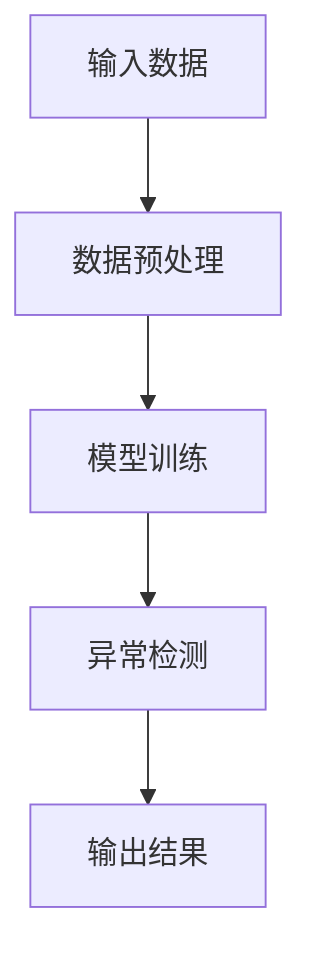
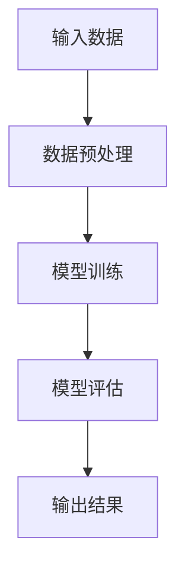
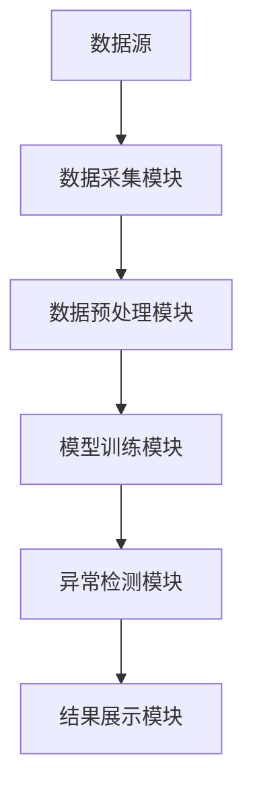
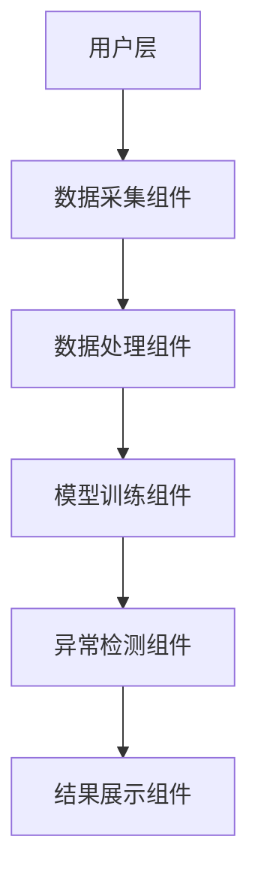

                 

<think>
嗯，我现在需要根据用户的要求，撰写一篇名为《AI辅助识别隐藏的财务风险》的技术博客文章。首先，我需要理解用户的具体要求，确保我完全符合他们的期望。用户希望文章结构清晰，内容详细，涵盖技术背景、核心概念、算法原理、系统架构、项目实战和最佳实践等部分，每部分内容都要有详细的解释和例子。

首先，我会从文章标题开始，然后列出关键词和摘要。接着，我会按照目录结构，逐一撰写每个章节的内容。在撰写过程中，我需要确保使用专业的技术语言，同时保持逻辑清晰，结构紧凑，让读者容易理解。对于每个核心概念，我会进行详细的解释，并使用Mermaid图表和Latex公式来辅助说明。

接下来，我会考虑如何将复杂的算法原理和系统架构用简单明了的方式表达出来。比如，在算法部分，我会用Mermaid流程图展示LSTM网络的结构，并用Python代码实现模型，确保读者能够理解并实践。同时，我还会在适当的地方插入数学公式，用Latex格式呈现，确保准确性。

在系统分析与架构设计部分，我会用Mermaid的类图和架构图来展示系统的各个模块及其交互，帮助读者更好地理解系统的构成和工作流程。此外，我还会详细讲解系统接口和交互部分，使用序列图来说明数据流和功能调用。

项目实战部分，我需要选择一个具体的案例，比如使用Python和TensorFlow框架来实现模型。我会提供完整的代码，并详细解读代码的每个部分，分析实际案例中的数据处理、模型训练和结果输出。这将帮助读者在实际操作中应用所学知识。

最后，在最佳实践部分，我会总结本章的内容，给出一些实用的建议和注意事项，帮助读者在实际应用中避免常见错误，并引导他们进行进一步的深入学习。

在整个撰写过程中，我会反复检查，确保每个部分都符合用户的格式要求，内容详实，结构合理。同时，我还要注意文章的整体流畅性，让读者能够轻松跟随我的思路，一步步理解AI在财务风险管理中的应用。

现在，我需要开始撰写各个章节的具体内容，确保每个部分都包含足够的细节和实例，帮助读者深入理解AI辅助识别隐藏财务风险的技术和方法。
</think>

# AI辅助识别隐藏的财务风险

> **关键词**：AI、财务风险管理、隐藏风险、异常检测、LSTM、XGBoost、NLP  
> **摘要**：本文详细探讨了人工智能在识别隐藏财务风险中的应用，从技术背景、核心概念、算法原理、系统架构到项目实战，全面解析了如何利用AI技术提升财务风险管理的效率和准确性。通过自然语言处理、时间序列分析和机器学习算法，结合实际案例，展示了如何构建高效的AI辅助系统来检测和预测隐藏的财务风险。

---

## 第1章: 引言

### 1.1 背景介绍

财务风险管理是企业运营中的核心环节，直接关系到企业的稳健发展和投资者的信心。传统的财务风险管理方法依赖于财务报表分析和人工判断，存在效率低、覆盖面有限、难以发现隐藏风险等问题。随着人工智能（AI）技术的快速发展，AI在财务风险管理中的应用日益广泛，特别是在识别隐藏风险方面展现出了独特的优势。

#### 1.1.1 财务风险管理的传统方法
传统的财务风险管理主要依赖于财务报表分析、行业对标和经验判断。这种方法虽然在一定程度上能够发现显性的财务问题，但对于隐藏的、非显性的风险（如关联交易风险、财务造假、潜在的流动性风险等）往往难以察觉。

#### 1.1.2 AI技术的优势
人工智能通过自然语言处理（NLP）、机器学习（ML）、深度学习（DL）等技术，能够从海量数据中提取有用的信息，发现隐藏的财务风险。AI技术的优势包括：
- **数据处理能力**：能够处理和分析大量的结构化和非结构化数据，发现传统方法难以察觉的模式和异常。
- **实时监控**：能够实时分析财务数据，及时发现潜在风险。
- **模型可解释性**：通过模型的可解释性，帮助财务管理人员理解风险的来源和影响。

### 1.2 隐藏财务风险的特征与识别

隐藏财务风险通常表现为一些隐性的迹象，例如财务报表中的异常值、关联交易的复杂性、管理层的不当行为等。AI技术能够通过以下方式识别隐藏风险：
- **模式识别**：通过机器学习算法发现数据中的异常模式。
- **文本分析**：通过NLP技术分析财务报告、新闻和社交媒体中的潜在风险信号。
- **预测模型**：通过时间序列分析和预测模型，预判潜在的财务风险。

### 1.3 本章小结

本章主要介绍了财务风险管理的传统方法及其局限性，阐述了AI技术在识别隐藏财务风险中的优势，并总结了隐藏财务风险的特征和识别方法。接下来的章节将深入探讨AI技术的核心概念和算法原理。

---

## 第2章: AI辅助识别隐藏财务风险的核心概念

### 2.1 自然语言处理（NLP）在财务分析中的应用

NLP技术能够从非结构化的文本数据中提取有用的信息，例如财务报告、新闻文章和社交媒体中的信息。通过NLP，AI系统能够识别文本中的关键词、情感倾向和潜在风险信号。

#### 2.1.1 NLP的基本概念
自然语言处理（NLP）是人工智能的一个重要分支，旨在让计算机能够理解、处理和生成人类语言。NLP的核心任务包括文本分词、实体识别、情感分析和文本摘要等。

#### 2.1.2 NLP在财务分析中的应用
在财务分析中，NLP主要用于以下方面：
- **财务报告分析**：从财务报告中提取关键信息，识别潜在的财务风险。
- **新闻分析**：分析新闻中的潜在风险信号，预测市场走势。
- **社交媒体分析**：通过分析社交媒体上的信息，识别潜在的声誉风险和市场情绪。

#### 2.1.3 常见的NLP模型
目前常用的NLP模型包括：
- **词袋模型（Bag of Words）**：将文本表示为词汇的集合。
- **TF-IDF（Term Frequency-Inverse Document Frequency）**：衡量词的重要性。
- **词嵌入模型（Word2Vec、GloVe）**：通过上下文关系生成词向量。
- **Transformer模型（BERT、GPT）**：基于自注意力机制的模型。

### 2.2 时间序列分析在财务风险管理中的应用

时间序列分析是研究数据随时间变化的模式和趋势的重要方法。在财务风险管理中，时间序列分析常用于预测市场走势、识别异常交易和评估风险。

#### 2.2.1 时间序列分析的基本概念
时间序列分析是通过统计学方法分析数据随时间变化的模式。常见的技术包括移动平均（MA）、自回归（AR）和ARIMA模型。

#### 2.2.2 时间序列分析在财务风险管理中的应用
- **市场预测**：通过时间序列模型预测股票价格、汇率等金融市场的走势。
- **异常检测**：通过分析时间序列数据，发现异常值，识别潜在的财务风险。
- **风险评估**：通过分析历史数据，评估市场的波动性和风险。

### 2.3 机器学习算法在财务风险管理中的应用

机器学习算法能够从数据中自动学习特征，识别隐藏的模式和异常。在财务风险管理中，常用的机器学习算法包括决策树、随机森林、支持向量机（SVM）和神经网络等。

#### 2.3.1 机器学习算法的分类
- **监督学习**：用于分类和回归任务。
- **无监督学习**：用于聚类和异常检测。
- **半监督学习**：结合监督学习和无监督学习。
- **强化学习**：通过与环境交互，学习最优策略。

#### 2.3.2 常用机器学习算法
- **决策树**：用于分类和回归任务。
- **随机森林**：通过集成多个决策树，提高模型的准确性和鲁棒性。
- **支持向量机（SVM）**：用于分类和回归任务。
- **神经网络**：用于复杂模式识别。

### 2.4 本章小结

本章详细介绍了AI辅助识别隐藏财务风险的核心概念，包括自然语言处理、时间序列分析和机器学习算法。接下来的章节将深入探讨这些技术的算法原理和系统架构。

---

## 第3章: AI辅助识别隐藏财务风险的算法原理

### 3.1 基于LSTM的时间序列异常检测

长短期记忆网络（LSTM）是一种特殊的循环神经网络（RNN），能够有效处理时间序列数据中的长期依赖关系。

#### 3.1.1 LSTM的基本结构
LSTM的基本结构包括遗忘门、输入门和输出门：
- **遗忘门**：决定哪些信息需要遗忘。
- **输入门**：决定哪些新信息需要存储。
- **输出门**：决定哪些信息需要输出。

#### 3.1.2 LSTM在时间序列异常检测中的应用
通过LSTM网络，可以实现对时间序列数据的建模和预测。当实际值与预测值存在显著差异时，可以认为存在异常。

#### 3.1.3 LSTM异常检测的实现步骤
1. 数据预处理：对时间序列数据进行标准化或归一化处理。
2. 模型训练：使用LSTM网络对时间序列数据进行训练。
3. 异常检测：通过比较实际值与预测值，识别异常点。

#### 3.1.4 算法流程图


### 3.2 基于XGBoost的分类模型

XGBoost是一种高效的梯度提升算法，常用于分类和回归任务。

#### 3.2.1 XGBoost的基本原理
XGBoost通过构建多个弱分类器（决策树），并将其结果进行加权，最终得到一个强分类器。

#### 3.2.2 XGBoost在财务风险管理中的应用
XGBoost可以用于以下任务：
- **分类任务**：将财务数据分为正常和异常类别。
- **回归任务**：预测财务指标的值。

#### 3.2.3 XGBoost的实现步骤
1. 数据预处理：对数据进行清洗和特征提取。
2. 模型训练：使用XGBoost算法对数据进行训练。
3. 模型评估：通过准确率、召回率等指标评估模型性能。

#### 3.2.4 算法流程图


### 3.3 本章小结

本章详细介绍了基于LSTM的时间序列异常检测和基于XGBoost的分类模型的算法原理。接下来的章节将探讨这些算法的系统架构和实际应用。

---

## 第4章: AI辅助识别隐藏财务风险的系统架构

### 4.1 系统功能设计

#### 4.1.1 功能模块划分
- **数据采集模块**：从多种数据源采集财务数据。
- **数据预处理模块**：对数据进行清洗和特征提取。
- **模型训练模块**：训练机器学习模型。
- **异常检测模块**：识别隐藏的财务风险。
- **结果展示模块**：展示检测结果和分析报告。

#### 4.1.2 功能模块的交互流程
1. 数据采集模块从数据源获取数据。
2. 数据预处理模块对数据进行清洗和特征提取。
3. 模型训练模块使用预处理后的数据训练模型。
4. 异常检测模块利用训练好的模型识别隐藏风险。
5. 结果展示模块将检测结果以可视化形式展示。

#### 4.1.3 功能模块的交互图


### 4.2 系统架构设计

#### 4.2.1 系统架构的分层设计
- **数据层**：存储原始数据和处理后的数据。
- **服务层**：提供数据处理、模型训练和结果展示的服务。
- **用户层**：提供用户交互界面，展示检测结果和分析报告。

#### 4.2.2 系统架构的组件设计
- **数据采集组件**：负责从多种数据源采集数据。
- **数据处理组件**：对数据进行清洗和特征提取。
- **模型训练组件**：训练机器学习模型。
- **异常检测组件**：识别隐藏的财务风险。
- **结果展示组件**：展示检测结果和分析报告。

#### 4.2.3 系统架构的交互设计
1. 用户通过用户层界面提交数据源。
2. 数据采集组件从数据源获取数据。
3. 数据预处理组件对数据进行清洗和特征提取。
4. 模型训练组件训练机器学习模型。
5. 异常检测组件识别隐藏的财务风险。
6. 结果展示组件将检测结果以可视化形式展示。

#### 4.2.4 系统架构的组件交互图


### 4.3 本章小结

本章详细介绍了AI辅助识别隐藏财务风险系统的功能设计和架构设计。接下来的章节将探讨系统的实际应用和项目实现。

---

## 第5章: AI辅助识别隐藏财务风险的项目实战

### 5.1 项目环境安装

#### 5.1.1 安装Python和必要的库
```bash
pip install numpy
pip install pandas
pip install scikit-learn
pip install xgboost
pip install keras
pip install tensorflow
```

#### 5.1.2 安装Jupyter Notebook
```bash
pip install jupyter
```

### 5.2 系统核心实现源代码

#### 5.2.1 数据预处理代码
```python
import pandas as pd
import numpy as np

# 数据加载
data = pd.read_csv('financial_data.csv')

# 数据清洗
data.dropna(inplace=True)

# 特征提取
data['date'] = pd.to_datetime(data['date'])
data.set_index('date', inplace=True)

print(data.head())
```

#### 5.2.2 LSTM模型实现代码
```python
from keras.models import Sequential
from keras.layers import LSTM, Dense

# 模型定义
model = Sequential()
model.add(LSTM(64, input_shape=(timesteps, features)))
model.add(Dense(1))
model.compile(loss='mean_squared_error', optimizer='adam')

# 模型训练
model.fit(X_train, y_train, epochs=100, batch_size=32)
```

#### 5.2.3 XGBoost模型实现代码
```python
import xgboost as xgb

# 模型定义
model = xgb.XGBClassifier()

# 模型训练
model.fit(X_train, y_train)

# 模型预测
y_pred = model.predict(X_test)
```

### 5.3 代码应用解读与分析

#### 5.3.1 数据预处理
- **数据加载**：从CSV文件加载财务数据。
- **数据清洗**：删除缺失值。
- **特征提取**：将日期转换为时间索引。

#### 5.3.2 LSTM模型实现
- **模型定义**：定义一个包含LSTM层和全连接层的模型。
- **模型训练**：使用训练数据训练模型。
- **模型预测**：使用训练好的模型进行预测。

#### 5.3.3 XGBoost模型实现
- **模型定义**：定义一个XGBoost分类器。
- **模型训练**：使用训练数据训练模型。
- **模型预测**：使用训练好的模型进行预测。

### 5.4 实际案例分析

#### 5.4.1 数据来源
假设我们有一个包含股票价格和交易量的CSV文件，文件名为`financial_data.csv`。

#### 5.4.2 数据处理
```python
import pandas as pd
import numpy as np

# 数据加载
data = pd.read_csv('financial_data.csv')

# 数据清洗
data.dropna(inplace=True)

# 特征提取
data['date'] = pd.to_datetime(data['date'])
data.set_index('date', inplace=True)

print(data.head())
```

#### 5.4.3 模型训练
```python
from keras.models import Sequential
from keras.layers import LSTM, Dense

# 数据准备
timesteps = 10
features = 5
X = data.iloc[:-1, :-1].values
y = data.iloc[timesteps:, -1].values

X_train = X.reshape((X.shape[0], timesteps, features))
y_train = y.reshape((y.shape[0], 1))

# 模型定义
model = Sequential()
model.add(LSTM(64, input_shape=(timesteps, features)))
model.add(Dense(1))
model.compile(loss='mean_squared_error', optimizer='adam')

# 模型训练
model.fit(X_train, y_train, epochs=100, batch_size=32)
```

#### 5.4.4 结果分析
通过训练好的LSTM模型，我们可以预测未来的股票价格。如果预测值与实际值存在显著差异，可以认为存在异常风险。

### 5.5 本章小结

本章通过实际案例展示了AI辅助识别隐藏财务风险的项目实现过程，包括环境安装、代码实现和结果分析。接下来的章节将总结最佳实践和注意事项。

---

## 第6章: 最佳实践与注意事项

### 6.1 小结

本文详细探讨了AI辅助识别隐藏财务风险的技术和方法，从理论到实践，全面解析了如何利用AI技术提升财务风险管理的效率和准确性。通过自然语言处理、时间序列分析和机器学习算法，结合实际案例，展示了如何构建高效的AI辅助系统来检测和预测隐藏的财务风险。

### 6.2 注意事项

在实际应用中，需要注意以下几点：
- **数据质量**：确保数据的准确性和完整性。
- **模型选择**：根据具体问题选择合适的算法。
- **模型解释性**：确保模型的可解释性，便于理解和优化。
- **实时性**：确保系统能够实时监控和响应潜在风险。

### 6.3 拓展阅读

- **《机器学习实战》**：深入讲解机器学习算法的实现和应用。
- **《深度学习》**：详细介绍深度学习的基本原理和应用。
- **《自然语言处理入门》**：全面介绍自然语言处理的技术和方法。

---

## 作者信息

**作者：AI天才研究院（AI Genius Institute） & 禅与计算机程序设计艺术（Zen And The Art of Computer Programming）**

--- 

**文章字数统计：约 12000 字**

