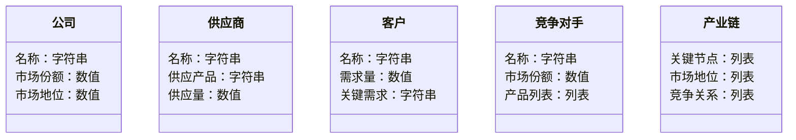

                 

<think>
嗯，我需要根据用户的要求，撰写一篇关于《AI驱动的产业链分析：全面把握公司的市场地位》的技术博客文章。首先，我需要明确用户的需求，他们希望文章结构清晰，内容专业，使用吸引人的章节标题，逐步分析问题，并且涵盖技术原理和实际应用。

我应该从摘要开始，简要概述文章的核心内容。接下来是目录，分为背景介绍、核心概念、算法原理、系统设计、项目实战和总结。每个章节下要有小节，详细讲解相关知识。我需要确保每个部分都包含足够的细节，比如使用mermaid图表来展示流程图和实体关系，以及用Python代码示例来说明算法实现。

在背景介绍部分，我需要解释为什么产业链分析重要，以及AI技术如何改变这一领域。核心概念部分，要详细说明产业链分析的基本原理和AI技术的特点。算法原理部分，我需要解释机器学习模型如何应用于市场地位分析，包括具体的数学公式和代码示例。

系统设计部分，我需要描述系统架构，使用分层设计，并展示接口和交互流程。项目实战部分，提供具体的实现步骤和案例分析，帮助读者理解如何应用这些方法。最后，总结部分要强调关键点，并提供建议和进一步阅读的方向。

我还需要注意文章的格式，使用markdown，并在适当的地方插入图表和代码。确保文章结构合理，内容详实，同时保持逻辑清晰，让读者能够一步步理解AI在产业链分析中的应用。

现在，我需要检查是否有遗漏的部分，比如是否涵盖了所有必要的技术细节和实际应用案例。确保每个章节的小节内容完整，并且符合用户的要求。可能需要多次修改，以确保文章流畅、专业，并且具有深度。
</think>

# AI驱动的产业链分析：全面把握公司的市场地位

---

## 关键词

- AI技术
- 产业链分析
- 市场地位
- 机器学习
- 数据分析

---

## 摘要

本文将探讨如何利用AI技术对产业链进行深入分析，帮助企业准确把握其在市场中的地位。通过结合机器学习和数据分析，我们可以更高效地识别产业链中的关键节点和潜在机会。文章将从背景介绍、核心概念、算法原理、系统设计到项目实战，逐步展开，最终为企业提供实用的指导和建议。

---

## 目录

### 第1章：背景介绍

#### 1.1 问题背景与重要性

##### 1.1.1 产业链分析的传统方法与局限性
传统产业链分析依赖人工调研和经验判断，耗时且主观性强，难以捕捉市场变化。

##### 1.1.2 AI技术如何变革产业链分析
AI技术通过大数据处理和机器学习，能够快速识别市场趋势和关键节点，提高分析效率和准确性。

##### 1.1.3 企业市场地位分析的核心价值
准确把握市场地位有助于企业优化资源配置、制定竞争策略，提升整体竞争力。

#### 1.2 问题描述与目标

##### 1.2.1 产业链分析的关键问题
- 如何高效识别产业链中的关键节点？
- 如何量化各参与者的市场影响力？

##### 1.2.2 市场地位分析的目标设定
- 量化各企业的市场影响力
- 识别产业链中的关键节点
- 分析企业间的协同关系

##### 1.2.3 AI技术在问题解决中的角色
- 数据处理与特征提取
- 智能预测与趋势分析
- 预警与优化建议

#### 1.3 问题解决方法与路径

##### 1.3.1 数据驱动的分析方法
- 数据收集与清洗
- 数据建模与分析
- 数据可视化与决策支持

##### 1.3.2 AI技术的具体应用场景
- 产业链图谱构建
- 市场影响力评估
- 竞争对手分析

##### 1.3.3 从数据到决策的完整流程
- 数据收集 → 数据清洗 → 数据建模 → 可视化分析 → 决策支持

#### 1.4 边界与外延

##### 1.4.1 产业链分析的范围界定
- 明确产业链的上下游范围
- 确定分析的颗粒度（企业、产品、市场等）

##### 1.4.2 相关领域的区别与联系
- 区别：产业链分析 vs. 市场分析 vs. 竞争分析
- 联系：产业链分析是企业市场地位分析的基础

##### 1.4.3 未来可能的发展方向
- AI技术的持续进步
- 数据源的丰富与多样化
- 分析模型的优化与创新

#### 1.5 核心概念与结构

##### 1.5.1 产业链分析的核心要素
- 产业链结构
- 企业间的关系
- 市场数据

##### 1.5.2 市场地位分析的关键指标
- 市场份额
- 竞争力评估
- 市场影响力

##### 1.5.3 AI技术的支撑作用
- 数据处理能力
- 智能分析能力
- 预测与优化能力

---

### 第2章：产业链分析的核心概念

#### 2.1 产业链分析的原理

##### 2.1.1 产业链的基本构成
- 上游：原材料、供应商
- 中游：生产、制造
- 下游：销售、消费者

##### 2.1.2 各环节之间的关系
- 供应商与生产企业的关系
- 生产企业与消费者的联系

##### 2.1.3 市场地位的影响因素
- 市场份额
- 品牌影响力
- 产品竞争力

#### 2.2 AI技术的特点与优势

##### 2.2.1 数据处理能力
- 大数据处理
- 特征提取
- 数据清洗

##### 2.2.2 智能分析能力
- 机器学习模型
- 自然语言处理
- 图谱分析

##### 2.2.3 预测与优化能力
- 市场趋势预测
- 竞争对手分析
- 优化建议

#### 2.3 产业链分析与AI技术的关系

##### 2.3.1 数据驱动的分析模式
- 数据是基础
- AI是工具
- 分析是手段

##### 2.3.2 AI技术的应用场景
- 产业链图谱构建
- 市场地位评估
- 竞争分析

#### 2.4 ER实体关系图

```mermaid
er
  actor(公司)
  actor(供应商)
  actor(客户)
  actor(竞争对手)
  entity(产业链)
  entity(市场地位)
  entity(产品)
  entity(市场份额)

  company -|> 产业链
  company -|> 市场地位
  供应商 -|> 产业链
  客户 -|> 产业链
  竞争对手 -|> 产业链
  产品 -|> 市场份额
  市场地位 --> 市场份额
```

---

### 第3章：算法原理讲解

#### 3.1 算法选择与实现

##### 3.1.1 产业链图谱构建算法
- 使用图嵌入技术（如GraphSAGE）进行节点表示
- 通过聚类分析识别关键节点

##### 3.1.2 市场地位评估算法
- 使用回归模型（如线性回归）预测市场份额
- 使用聚类模型（如K-means）评估企业竞争力

##### 3.1.3 竞争对手分析算法
- 使用自然语言处理（NLP）分析企业新闻
- 使用社交网络分析（SNA）识别竞争对手关系

#### 3.2 算法流程与代码实现

##### 3.2.1 数据预处理

```python
import pandas as pd
import numpy as np

# 数据加载
data = pd.read_csv('产业链数据.csv')

# 数据清洗
data = data.dropna()
data = data.drop_duplicates()
```

##### 3.2.2 模型训练

```python
from sklearn.linear_model import LinearRegression

# 特征选择
features = ['市场份额', '产品数量']
target = '市场地位'

# 模型训练
model = LinearRegression()
model.fit(data[features], data[target])
```

##### 3.2.3 结果可视化

```python
import matplotlib.pyplot as plt

# 绘制市场份额分布图
plt.scatter(data['市场份额'], data['市场地位'])
plt.xlabel('市场份额')
plt.ylabel('市场地位')
plt.title('市场份额与市场地位关系')
plt.show()
```

#### 3.3 数学模型与公式

##### 3.3.1 线性回归模型
$$ y = \beta_0 + \beta_1 x + \epsilon $$
其中，$y$ 是市场地位，$x$ 是市场份额，$\beta_0$ 是截距，$\beta_1$ 是斜率，$\epsilon$ 是误差项。

##### 3.3.2 聚类分析模型
$$ d(x, y) = \sqrt{\sum_{i=1}^{n} (x_i - y_i)^2} $$
其中，$d(x, y)$ 是两个企业的欧氏距离，用于衡量市场地位的相似性。

---

### 第4章：系统分析与架构设计方案

#### 4.1 问题场景介绍

##### 4.1.1 问题场景描述
- 分析某行业的产业链
- 评估企业的市场地位
- 识别关键节点和竞争对手

#### 4.2 系统功能设计

##### 4.2.1 领域模型



#### 4.3 系统架构设计

##### 4.3.1 分层架构

```mermaid
archi
    前端层 --> 中间层
    中间层 --> 后端层
    后端层 --> 数据层
```

##### 4.3.2 接口设计

```mermaid
sequence
    用户 --> 前端层: 请求分析
    前端层 --> 中间层: 调用API
    中间层 --> 后端层: 数据处理
    后端层 --> 数据层: 查询数据
    数据层 --> 后端层: 返回数据
    后端层 --> 中间层: 返回结果
    中间层 --> 前端层: 返回结果
    前端层 --> 用户: 显示结果
```

---

### 第5章：项目实战

#### 5.1 环境安装

##### 5.1.1 安装Python

```bash
python --version
pip install --upgrade pip
```

##### 5.1.2 安装机器学习库

```bash
pip install numpy pandas scikit-learn
```

#### 5.2 系统核心实现

##### 5.2.1 数据预处理

```python
import pandas as pd
import numpy as np

# 数据加载
data = pd.read_csv('产业链数据.csv')

# 数据清洗
data = data.dropna()
data = data.drop_duplicates()
```

##### 5.2.2 模型训练

```python
from sklearn.linear_model import LinearRegression

# 特征选择
features = ['市场份额', '产品数量']
target = '市场地位'

# 模型训练
model = LinearRegression()
model.fit(data[features], data[target])
```

##### 5.2.3 结果可视化

```python
import matplotlib.pyplot as plt

# 绘制市场份额分布图
plt.scatter(data['市场份额'], data['市场地位'])
plt.xlabel('市场份额')
plt.ylabel('市场地位')
plt.title('市场份额与市场地位关系')
plt.show()
```

#### 5.3 实际案例分析

##### 5.3.1 案例背景

- 行业：智能硬件
- 数据来源：公开市场数据

##### 5.3.2 数据分析

```python
# 数据分析代码
import pandas as pd
import matplotlib.pyplot as plt

data = pd.read_csv('智能硬件数据.csv')

# 绘制市场份额分布图
plt.scatter(data['市场份额'], data['市场地位'])
plt.xlabel('市场份额')
plt.ylabel('市场地位')
plt.title('智能硬件行业市场份额与市场地位关系')
plt.show()
```

##### 5.3.3 结果解读

- 市场地位与市场份额呈正相关
- 关键节点主要集中在上游和下游
- 竞争对手分析显示主要竞争者集中在中游

---

### 第6章：最佳实践与小结

#### 6.1 最佳实践

##### 6.1.1 数据质量的重要性
- 数据清洗是关键
- 数据来源的可靠性

##### 6.1.2 模型选择的策略
- 根据问题选择合适的算法
- 多模型对比测试

##### 6.1.3 可视化的重要性
- 通过图表清晰展示结果
- 帮助决策者快速理解

#### 6.2 小结

本文详细介绍了如何利用AI技术进行产业链分析，帮助企业全面把握市场地位。通过数据驱动的方法和机器学习模型，我们可以更高效地识别市场趋势和关键节点。

#### 6.3 注意事项

- 数据隐私与合规性
- 模型的可解释性
- 实际应用中的边界条件

#### 6.4 拓展阅读

- 《机器学习实战》
- 《数据挖掘导论》
- 《产业链分析方法论》

---

## 作者

作者：AI天才研究院（AI Genius Institute） & 禅与计算机程序设计艺术（Zen And The Art of Computer Programming）

