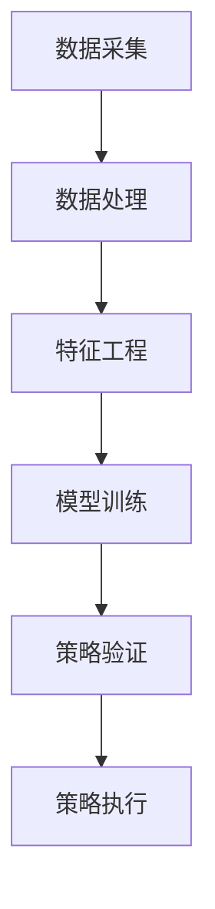
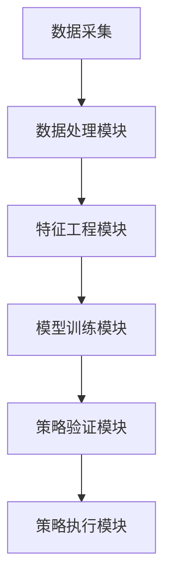
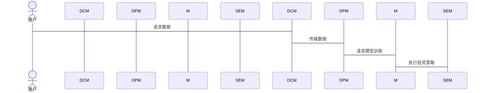

                 

<think>
嗯，用户让我写一篇关于《AI驱动的价值投资策略交叉验证》的技术博客文章，他们需要一个详细的目录结构，并且内容要非常专业，涉及很多技术细节。看起来他们需要一个结构清晰、内容详实的文章，适合技术读者阅读。

首先，我得分析用户的需求。他们可能是一位技术专家，或者是对AI在金融领域应用感兴趣的人。用户希望文章有深度，涵盖从理论到实践的各个方面，所以目录必须全面，包含背景、算法、系统架构、项目实战等部分。

接下来，我需要确保每一章都详细讲解，比如在第二章中，数据预处理和特征工程是非常关键的步骤，得详细说明每个子部分。用户可能对如何选择特征或处理时间序列数据感兴趣，所以这部分内容要丰富。

然后是第三章，强化学习在投资中的应用，这部分可能比较复杂，得用mermaid图来展示算法流程，帮助读者理解。同时，数学模型部分要用latex公式，确保专业性。

在系统架构部分，用户可能需要了解整体系统的设计，所以用mermaid图展示系统架构和接口交互是必要的。项目实战部分，代码实现和案例分析是关键，读者可能想实际操作，所以代码和分析要详细。

最后，小结和最佳实践部分，总结前面的内容，并给出实际应用的建议，这样读者能更好地应用所学知识。整个思考过程需要逻辑清晰，一步步推进，确保内容全面且有深度。
</think>

```markdown
# AI驱动的价值投资策略交叉验证

> 关键词：价值投资，人工智能，交叉验证，投资策略，金融分析

> 摘要：本文探讨了AI技术在价值投资策略中的应用，重点分析了如何通过交叉验证技术来优化投资决策。文章从价值投资的定义与核心要素出发，结合AI算法原理，详细阐述了AI驱动的价值投资策略的实现方法，包括数据预处理、特征工程、模型训练与优化、强化学习在投资策略中的应用等。同时，本文还通过具体案例展示了AI驱动的价值投资策略交叉验证的实际应用效果，并对相关技术的未来发展进行了展望。

---

## 第一部分: AI驱动的价值投资策略概述

### 第1章: 价值投资与AI的结合

#### 1.1 价值投资的核心理念

##### 1.1.1 价值投资的定义与特点
- **定义**：价值投资是一种以低于公平市场价值的价格买入优质股票的投资策略。
- **特点**：
  - 长期投资视角
  - 重视基本面分析
  - 寻找市场低估的股票
  - 风险控制优先

##### 1.1.2 价值投资的核心要素
- **基本面分析**：包括财务报表分析、行业地位、管理团队等。
- **市场估值**：通过市盈率、市净率等指标判断股票是否被低估。
- **安全边际**：买入价格与内在价值的差距。

##### 1.1.3 价值投资与传统投资的区别
- **传统投资**：基于技术分析、短期价格波动。
- **价值投资**：基于基本面分析、长期价格趋势。
- **AI驱动的价值投资**：结合量化分析与基本面分析。

#### 1.2 AI在金融领域的应用

##### 1.2.1 AI在金融分析中的作用
- **数据处理**：快速处理海量金融数据。
- **模式识别**：通过AI算法发现数据中的隐藏模式。
- **预测模型**：基于历史数据预测未来价格走势。

##### 1.2.2 AI在投资决策中的优势
- **高效性**：AI可以快速分析大量数据。
- **准确性**：通过交叉验证优化模型预测能力。
- **可扩展性**：适用于多个市场和资产类别。

##### 1.2.3 AI驱动的价值投资的潜力
- **提升决策效率**：通过AI快速筛选潜在投资标的。
- **优化投资组合**：基于AI算法优化资产配置。
- **降低风险**：通过交叉验证减少模型过拟合风险。

#### 1.3 价值投资策略的交叉验证

##### 1.3.1 交叉验证的定义与作用
- **定义**：通过多次训练与测试，评估模型的泛化能力。
- **作用**：减少过拟合风险，提高模型稳定性。

##### 1.3.2 交叉验证在价值投资中的应用
- **模型评估**：通过交叉验证优化投资策略模型。
- **风险控制**：通过交叉验证评估投资策略的稳定性。
- **策略优化**：通过交叉验证优化投资策略参数。

##### 1.3.3 AI驱动交叉验证的优势
- **高效性**：AI可以快速完成多次交叉验证。
- **准确性**：通过多次验证提高模型预测能力。
- **可扩展性**：适用于多种投资策略和市场环境。

### 第2章: AI驱动的价值投资策略基础

#### 2.1 数据预处理与特征工程

##### 2.1.1 数据清洗与标准化
- **数据清洗**：去除无效数据、填补缺失值、处理异常值。
- **数据标准化**：通过标准化处理使数据具有可比性。

##### 2.1.2 特征选择与提取
- **特征选择**：通过统计方法或机器学习方法选择重要特征。
- **特征提取**：通过主成分分析（PCA）等方法提取特征。

##### 2.1.3 时间序列数据的处理
- **时间序列数据**：金融数据通常具有时间序列特征。
- **数据滑动窗口**：通过滑动窗口方法处理时间序列数据。

#### 2.2 价值投资策略的AI模型构建

##### 2.2.1 机器学习模型的选择
- **线性回归模型**：适用于简单的线性关系。
- **支持向量机（SVM）**：适用于非线性关系。
- **随机森林**：适用于高维数据。

##### 2.2.2 深度学习模型的应用
- **神经网络模型**：适用于复杂非线性关系。
- **长短期记忆网络（LSTM）**：适用于时间序列数据。

##### 2.2.3 模型训练与优化
- **训练策略**：通过交叉验证优化模型参数。
- **超参数调优**：通过网格搜索优化模型参数。
- **模型评估**：通过准确率、召回率等指标评估模型性能。

#### 2.3 交叉验证的实现

##### 2.3.1 K折交叉验证
- **K折交叉验证**：将数据集分成K个子集，轮流使用每个子集作为验证集。
- **实现步骤**：
  1. 将数据集分成K个子集。
  2. 依次使用每个子集作为验证集，其余子集作为训练集。
  3. 计算每个验证集的模型性能指标。
  4. 取平均性能指标作为模型的最终性能指标。

##### 2.3.2 交叉验证的指标与评估
- **准确率**：正确预测的比例。
- **召回率**：实际为正类且被正确预测的比例。
- **F1分数**：准确率和召回率的调和平均数。

##### 2.3.3 交叉验证在价值投资中的应用
- **模型评估**：通过交叉验证评估投资策略的预测能力。
- **风险控制**：通过交叉验证评估投资策略的稳定性。
- **策略优化**：通过交叉验证优化投资策略参数。

---

## 第二部分: AI驱动的价值投资策略算法原理

### 第3章: 强化学习在投资策略中的应用

#### 3.1 强化学习基础

##### 3.1.1 强化学习的定义与特点
- **定义**：强化学习是一种通过试错机制优化决策的过程。
- **特点**：
  - 基于奖励机制
  - 非监督式学习
  - 高度依赖环境反馈

##### 3.1.2 强化学习的核心算法
- **Q-learning**：通过状态-动作-奖励-状态（SARSA）循环更新Q值表。
- **Deep Q-Networks (DQN)**：通过深度神经网络近似Q值函数。

##### 3.1.3 强化学习在金融中的应用
- **股票交易**：通过强化学习优化交易策略。
- **资产配置**：通过强化学习优化资产配置。
- **风险管理**：通过强化学习优化风险管理策略。

#### 3.2 基于强化学习的投资策略

##### 3.2.1 状态空间与动作空间的定义
- **状态空间**：市场状态、资产价格、市场情绪等。
- **动作空间**：买入、卖出、持有等操作。

##### 3.2.2 奖励函数的设计
- **奖励函数**：根据投资策略的收益和风险设计奖励函数。
- **收益优先**：优先考虑投资收益。
- **风险优先**：优先考虑投资风险。

##### 3.2.3 策略网络的实现
- **策略网络**：通过深度神经网络实现策略函数。
- **动作选择**：通过策略网络输出概率分布选择动作。
- **策略优化**：通过策略梯度优化策略网络参数。

#### 3.3 强化学习在交叉验证中的应用

##### 3.3.1 强化学习与交叉验证的结合
- **交叉验证**：通过多次训练与验证优化策略网络。
- **策略评估**：通过交叉验证评估策略网络的性能。
- **策略优化**：通过交叉验证优化策略网络参数。

##### 3.3.2 基于强化学习的策略优化
- **策略优化**：通过强化学习优化投资策略。
- **参数优化**：通过强化学习优化策略网络参数。
- **性能提升**：通过强化学习提升投资策略的预测能力。

##### 3.3.3 强化学习的实验结果分析
- **实验设计**：设计实验验证强化学习在价值投资策略中的应用。
- **结果分析**：分析实验结果验证强化学习的有效性。
- **性能对比**：对比传统投资策略与AI驱动策略的性能。

---

### 第4章: 时间序列分析与AI模型

#### 4.1 时间序列分析基础

##### 4.1.1 时间序列的定义与特点
- **定义**：时间序列是一种按照时间顺序排列的数据。
- **特点**：具有趋势性、周期性、随机性。

##### 4.1.2 常见的时间序列模型
- **ARIMA**：自回归积分滑动平均模型。
- **GARCH**：广义自回归条件异方差模型。
- **LSTM**：长短期记忆网络。

##### 4.1.3 时间序列分析在金融中的应用
- **股票价格预测**：通过时间序列分析预测股票价格。
- **市场趋势预测**：通过时间序列分析预测市场趋势。
- **风险管理**：通过时间序列分析预测市场波动。

#### 4.2 时间序列的AI模型实现

##### 4.2.1 LSTM模型的实现
- **LSTM结构**：包括输入门、遗忘门、输出门。
- **LSTM训练**：通过反向传播训练LSTM模型。
- **LSTM预测**：通过LSTM模型预测未来价格。

##### 4.2.2 LSTM模型的优化
- **超参数调优**：通过网格搜索优化LSTM模型参数。
- **模型改进**：通过添加注意力机制优化LSTM模型。
- **性能评估**：通过准确率、召回率等指标评估LSTM模型性能。

##### 4.2.3 时间序列分析的实验结果
- **实验设计**：设计实验验证时间序列分析在价值投资策略中的应用。
- **结果分析**：分析实验结果验证时间序列分析的有效性。
- **性能对比**：对比传统时间序列模型与AI驱动模型的性能。

---

## 第三部分: AI驱动的价值投资策略系统架构设计

### 第5章: 系统功能设计与实现

#### 5.1 系统功能设计

##### 5.1.1 系统功能模块划分
- **数据采集模块**：采集股票价格、财务数据等。
- **数据处理模块**：清洗、标准化、特征工程。
- **模型训练模块**：训练价值投资策略模型。
- **策略验证模块**：通过交叉验证优化策略模型。
- **策略执行模块**：根据模型预测结果执行投资策略。

##### 5.1.2 系统功能流程图


#### 5.2 系统架构设计

##### 5.2.1 系统架构图


##### 5.2.2 接口设计
- **数据接口**：与数据源对接。
- **模型接口**：与AI模型对接。
- **策略接口**：与投资策略执行系统对接。

##### 5.2.3 交互设计


---

## 第四部分: 项目实战与案例分析

### 第6章: 项目实战

#### 6.1 环境安装与配置

##### 6.1.1 环境需求
- **Python**：3.8及以上版本。
- **库依赖**：Pandas、NumPy、Scikit-learn、Keras、TensorFlow、PyTorch。

##### 6.1.2 环境配置
- **安装依赖**：使用pip安装所需库。
- **配置文件**：设置数据源接口。
- **代码初始化**：初始化项目代码结构。

#### 6.2 核心代码实现

##### 6.2.1 数据预处理代码
```python
import pandas as pd
import numpy as np

# 数据加载
df = pd.read_csv('stock_data.csv')

# 数据清洗
df.dropna(inplace=True)

# 数据标准化
from sklearn.preprocessing import StandardScaler
scaler = StandardScaler()
scaled_data = scaler.fit_transform(df[['open', 'high', 'low', 'close']])
```

##### 6.2.2 模型训练代码
```python
from sklearn.model

